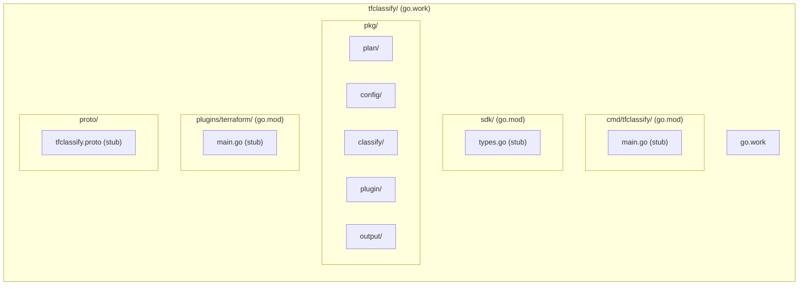
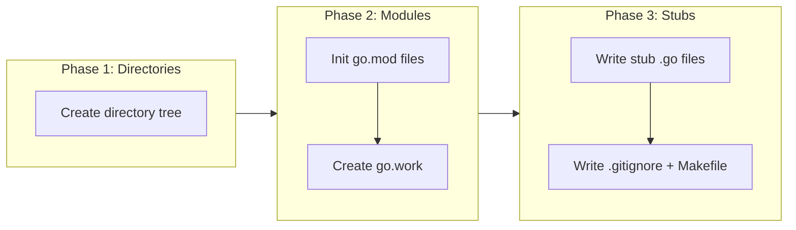

# Project Scaffolding with Go Workspaces

## Change Summary

Initialize the tfclassify repository with a Go workspace structure containing separate modules for the CLI, SDK, and bundled plugin. This establishes the directory layout, module boundaries, and build tooling that all subsequent CRs depend on.

## Motivation and Background

ADR-0001 mandates a monorepo using Go workspaces so that each component has its own `go.mod` with stable import paths matching future repository boundaries. This CR implements that scaffolding before any functional code is written, ensuring all subsequent work starts from a well-structured foundation.

## Change Drivers

* ADR-0001 (approved): Monorepo with Go Workspaces for Future Multi-Repo Extraction
* All subsequent CRs depend on this directory structure and module layout
* Import paths must be stable from the start to avoid breaking changes at extraction time

## Current State

The repository contains only governance documents (`TASK.md`, `docs/adr/`, `docs/cr/`). No Go modules, build tooling, or project structure exists.

## Proposed Change

Create the full directory structure, Go workspace configuration, and minimal Go module files for all components.

### Proposed State Diagram



## Requirements

### Functional Requirements

1. The repository **MUST** contain a `go.work` file at the root referencing all component modules
2. The CLI module **MUST** use the module path `github.com/jokarl/tfclassify`
3. The SDK module **MUST** use the module path `github.com/jokarl/tfclassify/sdk`
4. The bundled terraform plugin module **MUST** use the module path `github.com/jokarl/tfclassify/plugin-terraform`
5. Each module **MUST** have its own `go.mod` specifying Go 1.22 or later
6. The `pkg/` directory **MUST** contain subdirectories for `plan/`, `config/`, `classify/`, `plugin/`, and `output/`
7. The `proto/` directory **MUST** exist for future gRPC protocol definitions
8. Each Go module **MUST** contain at least a stub `.go` file with a valid package declaration so that `go build` succeeds
9. A `.gitignore` file **MUST** be present ignoring Go build artifacts, editor files, and plugin binaries

### Non-Functional Requirements

1. `go build ./...` from the workspace root **MUST** succeed with zero errors
2. `go vet ./...` from the workspace root **MUST** succeed with zero warnings
3. Each module **MUST** be buildable independently when the `go.work` file is absent (simulating post-extraction)

## Affected Components

* Repository root (go.work, .gitignore)
* `cmd/tfclassify/` module
* `sdk/` module
* `plugins/terraform/` module
* `pkg/` internal packages
* `proto/` protocol definitions directory

## Scope Boundaries

### In Scope

* Directory structure creation
* Go workspace and module initialization
* Stub files with valid package declarations
* `.gitignore` for Go projects
* Makefile with basic build/test/lint targets

### Out of Scope ("Here, But Not Further")

* Functional code in any package - deferred to CR-0002 through CR-0007
* CI/CD pipeline configuration - deferred to a future CR
* Dependency installation beyond Go stdlib - each CR adds its own dependencies
* Proto file content - deferred to CR-0006

## Implementation Approach

### Implementation Flow



### Directory Tree

```
tfclassify/
├── go.work
├── .gitignore
├── Makefile
├── cmd/
│   └── tfclassify/
│       ├── go.mod
│       └── main.go
├── sdk/
│   ├── go.mod
│   └── sdk.go
├── pkg/
│   ├── plan/
│   │   └── parser.go
│   ├── config/
│   │   └── config.go
│   ├── classify/
│   │   └── classifier.go
│   ├── plugin/
│   │   └── host.go
│   └── output/
│       └── formatter.go
├── plugins/
│   └── terraform/
│       ├── go.mod
│       └── main.go
├── proto/
│   └── .gitkeep
└── docs/
    ├── adr/
    └── cr/
```

### go.work Content

```go
go 1.22

use (
    ./cmd/tfclassify
    ./sdk
    ./plugins/terraform
)
```

### Makefile Targets

| Target | Command | Purpose |
|--------|---------|---------|
| `build` | `go build ./cmd/tfclassify` | Build the CLI binary |
| `test` | `go test ./...` | Run all tests across workspace |
| `vet` | `go vet ./...` | Static analysis |
| `lint` | `golangci-lint run ./...` | Lint all modules |
| `clean` | Remove build artifacts | Clean up |

## Test Strategy

### Tests to Add

| Test File | Test Name | Description | Inputs | Expected Output |
|-----------|-----------|-------------|--------|-----------------|
| Not applicable | Not applicable | No functional code in this CR | N/A | N/A |

This CR contains only scaffolding. Verification is via build and vet commands, not unit tests.

### Tests to Modify

Not applicable - no existing tests.

### Tests to Remove

Not applicable - no existing tests.

## Acceptance Criteria

### AC-1: Go workspace builds successfully

```gherkin
Given the repository contains go.work referencing all modules
When "go build ./..." is run from the repository root
Then the build completes with zero errors
```

### AC-2: Each module builds independently

```gherkin
Given the go.work file is temporarily removed
When "go build ./..." is run inside cmd/tfclassify/
  And "go build ./..." is run inside sdk/
  And "go build ./..." is run inside plugins/terraform/
Then each build completes with zero errors
```

### AC-3: Module paths match future repository boundaries

```gherkin
Given the go.mod files exist in each module directory
When the module paths are inspected
Then cmd/tfclassify/go.mod declares module "github.com/jokarl/tfclassify"
  And sdk/go.mod declares module "github.com/jokarl/tfclassify/sdk"
  And plugins/terraform/go.mod declares module "github.com/jokarl/tfclassify/plugin-terraform"
```

### AC-4: Package directories exist with valid Go files

```gherkin
Given the repository structure is created
When each pkg/ subdirectory is inspected
Then plan/, config/, classify/, plugin/, and output/ each contain at least one .go file
  And each .go file has a valid package declaration
  And "go vet ./..." passes with zero warnings
```

### AC-5: Makefile targets work

```gherkin
Given the Makefile exists at the repository root
When "make build" is run
Then the tfclassify binary is produced in the expected location
```

## Quality Standards Compliance

### Build & Compilation

- [ ] Code compiles/builds without errors
- [ ] No new compiler warnings introduced

### Linting & Code Style

- [ ] All linter checks pass with zero warnings/errors
- [ ] Code follows project coding conventions and style guides

### Test Execution

- [ ] `go vet ./...` passes (no unit tests in this CR)

### Documentation

- [ ] Inline code documentation not applicable (stubs only)

### Code Review

- [ ] Changes submitted via pull request
- [ ] PR title follows Conventional Commits format
- [ ] Code review completed and approved

### Verification Commands

```bash
# Build verification
go build ./...

# Vet verification
go vet ./...

# Individual module builds (remove go.work first)
cd cmd/tfclassify && go build ./... && cd ../..
cd sdk && go build ./... && cd ..
cd plugins/terraform && go build ./... && cd ../..

# Makefile verification
make build
```

## Risks and Mitigation

### Risk 1: Go version compatibility

**Likelihood:** low
**Impact:** medium
**Mitigation:** Specify `go 1.22` in all go.mod files. Go workspaces are supported since Go 1.18.

### Risk 2: Module path changes needed later

**Likelihood:** low
**Impact:** high
**Mitigation:** Module paths are chosen to match future repository names per ADR-0001. Changing them after publishing would be a breaking change.

## Dependencies

* None - this is the first CR

## Decision Outcome

Chosen approach: "Go workspace with three modules", because it directly implements ADR-0001 and establishes stable import paths that all subsequent CRs build upon.

## Related Items

* Architecture decision: [ADR-0001](../adr/ADR-0001-monorepo-with-go-workspaces.md)
* Blocked by: nothing
* Blocks: CR-0002, CR-0003, CR-0004, CR-0005, CR-0006, CR-0007
