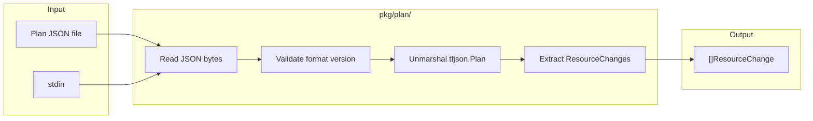
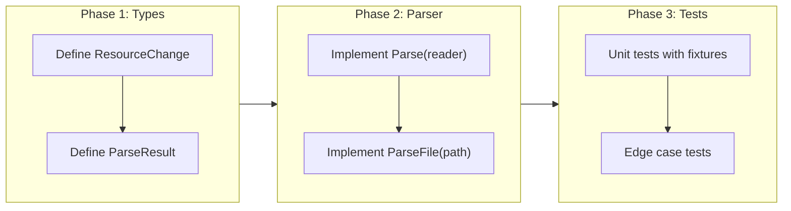

# Terraform Plan Parsing

## Change Summary

Implement the plan parser that reads `terraform show -json` output and extracts structured resource change data. This produces the `ResourceChange` representations used by both the core classification engine and plugins.

## Motivation and Background

The plan JSON is the primary input to tfclassify. Before any classification can happen, the tool must parse the JSON output of `terraform show -json` and extract resource changes with their before/after state, actions, provider information, and sensitivity markers. This parser feeds both the core engine (CR-0004) and the plugin Runner interface (CR-0006).

## Change Drivers

* ADR-0003 (approved): Core engine needs parsed plan data for pattern matching
* Foundation for CR-0004 (classification engine) and CR-0006 (plugin host Runner)
* The `hashicorp/terraform-json` library provides Go types matching Terraform's JSON output schema

## Current State

The `pkg/plan/` directory contains a stub `parser.go` file from CR-0001 with no functional code.

## Proposed Change

Implement a plan parser in `pkg/plan/` that:
1. Reads Terraform plan JSON from a file path or stdin
2. Deserializes into `tfjson.Plan` using `hashicorp/terraform-json`
3. Extracts resource changes into an internal `ResourceChange` type
4. Handles edge cases: empty plans, data sources, sensitive values

### Proposed State Diagram



## Requirements

### Functional Requirements

1. The parser **MUST** accept a plan JSON file path as input
2. The parser **MUST** accept plan JSON from an `io.Reader` (for stdin support)
3. The parser **MUST** use `hashicorp/terraform-json` to deserialize the plan
4. The parser **MUST** validate the `format_version` field and reject unsupported versions
5. The parser **MUST** extract each `resource_change` into a `ResourceChange` struct containing: address, resource type, provider name, mode (managed/data), actions, before state, after state, before_sensitive, and after_sensitive
6. The parser **MUST** return an empty slice (not nil) when the plan has no resource changes
7. The parser **MUST** return a descriptive error when the JSON is malformed or unreadable
8. The parser **MUST** preserve the original `map[string]interface{}` structure of before/after values without type conversion

### Non-Functional Requirements

1. The parser **MUST** handle plan files up to 100MB without excessive memory allocation
2. The parser **MUST** return errors within 5 seconds for any valid plan file under 100MB

## Affected Components

* `pkg/plan/parser.go` - Plan parsing logic
* `pkg/plan/types.go` - Internal ResourceChange type definition
* `cmd/tfclassify/go.mod` - Add `hashicorp/terraform-json` dependency

## Scope Boundaries

### In Scope

* Reading and deserializing plan JSON
* Extracting resource changes with full before/after state
* Format version validation
* Internal `ResourceChange` type definition in `pkg/plan/`

### Out of Scope ("Here, But Not Further")

* SDK `ResourceChange` type - defined separately in CR-0005 for the plugin SDK
* Output changes or module changes from the plan - only resource changes
* Classification logic - deferred to CR-0004
* CLI integration (reading from file/stdin) - deferred to CR-0004

## Implementation Approach

### Internal ResourceChange Type

```go
// pkg/plan/types.go
package plan

// ResourceChange represents a single resource change from a Terraform plan.
type ResourceChange struct {
    Address         string
    Type            string
    ProviderName    string
    Mode            string // "managed" or "data"
    Actions         []string
    Before          map[string]interface{}
    After           map[string]interface{}
    BeforeSensitive interface{}
    AfterSensitive  interface{}
}
```

### Parser Interface

```go
// pkg/plan/parser.go
package plan

// ParseResult contains the parsed plan data.
type ParseResult struct {
    FormatVersion string
    Changes       []ResourceChange
}

// ParseFile reads and parses a Terraform plan JSON file.
func ParseFile(path string) (*ParseResult, error)

// Parse reads and parses Terraform plan JSON from a reader.
func Parse(r io.Reader) (*ParseResult, error)
```

### Implementation Flow



## Test Strategy

### Tests to Add

| Test File | Test Name | Description | Inputs | Expected Output |
|-----------|-----------|-------------|--------|-----------------|
| `pkg/plan/parser_test.go` | `TestParse_ValidPlan` | Parse a valid plan with multiple resource changes | Fixture: valid plan JSON | ParseResult with correct ResourceChange count and fields |
| `pkg/plan/parser_test.go` | `TestParse_EmptyPlan` | Parse a plan with no resource changes | Fixture: plan with empty resource_changes | ParseResult with empty Changes slice (not nil) |
| `pkg/plan/parser_test.go` | `TestParse_MalformedJSON` | Handle invalid JSON input | Invalid JSON bytes | Descriptive error |
| `pkg/plan/parser_test.go` | `TestParse_UnsupportedVersion` | Reject unsupported format versions | Plan with format_version "0.1" | Error indicating unsupported version |
| `pkg/plan/parser_test.go` | `TestParse_SensitiveValues` | Preserve sensitive markers | Plan with before_sensitive/after_sensitive | ResourceChange with populated sensitive fields |
| `pkg/plan/parser_test.go` | `TestParse_DataSource` | Handle data source changes | Plan with data source change | ResourceChange with Mode="data" |
| `pkg/plan/parser_test.go` | `TestParse_Actions` | Map all action types correctly | Plan with create, update, delete, replace actions | ResourceChange with correct Actions slices |
| `pkg/plan/parser_test.go` | `TestParseFile_FileNotFound` | Handle missing file | Non-existent path | Descriptive error |
| `pkg/plan/parser_test.go` | `TestParse_PreservesBeforeAfter` | Before/after values are preserved as-is | Plan with nested attribute values | map[string]interface{} with original structure |

### Test Fixtures

Test fixtures **MUST** be stored in `pkg/plan/testdata/` as JSON files representing various Terraform plan outputs.

### Tests to Modify

Not applicable - no existing tests.

### Tests to Remove

Not applicable - no existing tests.

## Acceptance Criteria

### AC-1: Parse a valid Terraform plan

```gherkin
Given a valid Terraform plan JSON file produced by "terraform show -json"
When the parser reads the file
Then it returns a ParseResult with ResourceChange entries matching each resource_change in the plan
  And each ResourceChange contains the correct address, type, provider, mode, and actions
```

### AC-2: Preserve before/after state

```gherkin
Given a Terraform plan where a resource has before and after states
When the parser extracts the resource change
Then the Before field contains the original attribute values as map[string]interface{}
  And the After field contains the planned attribute values as map[string]interface{}
  And nested values are preserved without type coercion
```

### AC-3: Handle empty plans

```gherkin
Given a Terraform plan JSON with an empty resource_changes array
When the parser reads the plan
Then it returns a ParseResult with an empty Changes slice (not nil)
  And no error is returned
```

### AC-4: Reject malformed input

```gherkin
Given input that is not valid JSON
When the parser attempts to read it
Then it returns an error describing the parse failure
  And the error message includes context about what was expected
```

### AC-5: Validate format version

```gherkin
Given a Terraform plan JSON with an unsupported format_version
When the parser reads the plan
Then it returns an error indicating the format version is not supported
  And the error includes the actual version found
```

### AC-6: Read from io.Reader

```gherkin
Given Terraform plan JSON provided via an io.Reader (e.g., stdin pipe)
When Parse(reader) is called
Then it produces the same ParseResult as ParseFile for identical content
```

## Quality Standards Compliance

### Build & Compilation

- [ ] Code compiles/builds without errors
- [ ] No new compiler warnings introduced

### Linting & Code Style

- [ ] All linter checks pass with zero warnings/errors
- [ ] Code follows project coding conventions

### Test Execution

- [ ] All existing tests pass after implementation
- [ ] All new tests pass
- [ ] Test coverage meets project requirements for changed code

### Documentation

- [ ] Exported functions have GoDoc comments

### Code Review

- [ ] Changes submitted via pull request
- [ ] PR title follows Conventional Commits format
- [ ] Code review completed and approved

### Verification Commands

```bash
# Build verification
go build ./pkg/plan/...

# Test execution
go test ./pkg/plan/... -v

# Vet
go vet ./pkg/plan/...
```

## Risks and Mitigation

### Risk 1: terraform-json version compatibility

**Likelihood:** low
**Impact:** medium
**Mitigation:** Pin `hashicorp/terraform-json` to a specific version. The format_version validation provides a safety net against incompatible plan formats.

### Risk 2: Large plan files cause memory issues

**Likelihood:** low
**Impact:** medium
**Mitigation:** Standard JSON unmarshaling handles files up to 100MB efficiently. Streaming is not needed for initial implementation.

## Dependencies

* CR-0001 (project scaffolding) - provides the directory structure and go.mod files
* External: `github.com/hashicorp/terraform-json`

## Decision Outcome

Chosen approach: "Wrapper around hashicorp/terraform-json with internal types", because it leverages the maintained upstream library for deserialization while providing an internal type that decouples the rest of the codebase from the external dependency.

## Related Items

* Architecture decision: [ADR-0003](../adr/ADR-0003-provider-agnostic-core-with-deep-inspection-plugins.md)
* Depends on: [CR-0001](CR-0001-project-scaffolding.md)
* Blocks: [CR-0004](CR-0004-core-classification-engine-and-cli.md), [CR-0006](CR-0006-grpc-protocol-and-plugin-host.md)
