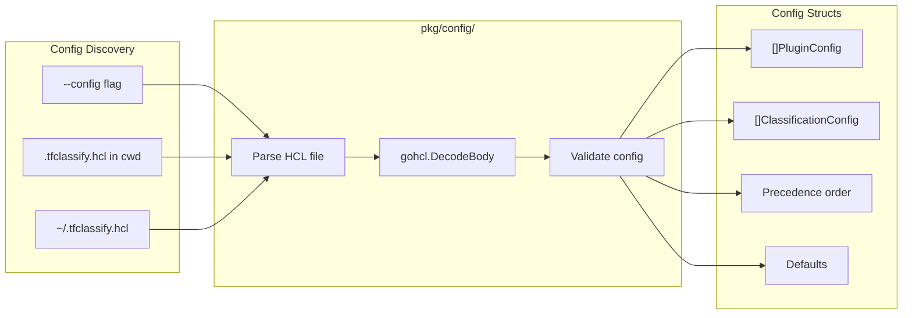
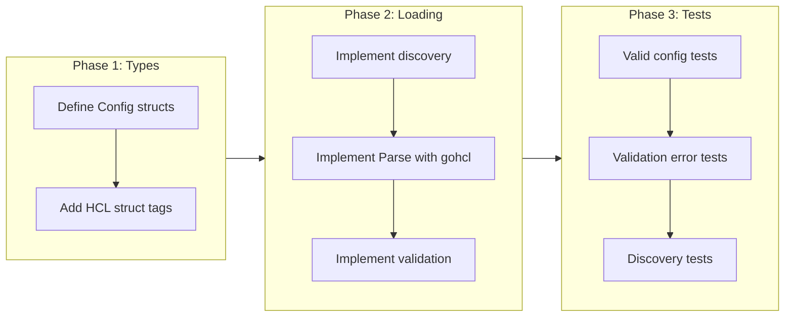

# HCL Configuration Loading

## Change Summary

Implement configuration loading from `.tfclassify.hcl` files using `hashicorp/hcl/v2` with `gohcl`. The config defines organization-specific classification levels, pattern-based rules, plugin declarations, precedence order, and operational defaults.

## Motivation and Background

ADR-0004 mandates HCL as the configuration format. The configuration is central to tfclassify because classification levels and rules are fully organization-defined. The config drives the core classification engine (CR-0004) and plugin loading (CR-0006). This CR implements the schema, loading, and validation of `.tfclassify.hcl` files.

## Change Drivers

* ADR-0004 (approved): HCL Configuration Format
* ADR-0003 (approved): Classification levels are org-defined, not hardcoded
* The core engine (CR-0004) requires configuration to classify anything
* Plugin loading (CR-0006) requires plugin declarations from config

## Current State

The `pkg/config/` directory contains a stub `config.go` file from CR-0001 with no functional code.

## Proposed Change

Implement configuration loading in `pkg/config/` that:
1. Discovers config files in standard locations
2. Parses HCL using `gohcl.DecodeBody` with Go struct tags
3. Validates the config (precedence references valid classifications, rules are well-formed)
4. Exposes typed config structs for consumption by the classification engine and plugin loader

### Configuration Schema

```hcl
# .tfclassify.hcl

plugin "terraform" {
  enabled = true
}

plugin "azurerm" {
  enabled = true
  source  = "github.com/jokarl/tfclassify-plugin-azurerm"
  version = "0.1.0"

  config {
    privileged_roles = ["Owner", "User Access Administrator"]
  }
}

classification "critical" {
  description = "Requires security team approval"

  rule {
    resource = ["*_role_*", "*_iam_*"]
    actions  = ["delete"]
  }

  rule {
    resource = ["*_key_vault*"]
    actions  = ["delete"]
  }
}

classification "standard" {
  description = "Standard change process"

  rule {
    not_resource = ["*_role_*", "*_iam_*"]
  }
}

precedence = ["critical", "standard", "auto"]

defaults {
  unclassified   = "standard"
  no_changes     = "auto"
  plugin_timeout = "30s"
}
```

### Proposed State Diagram



## Requirements

### Functional Requirements

1. The loader **MUST** accept a config file path from the `--config` CLI flag
2. The loader **MUST** discover `.tfclassify.hcl` in the current directory when no flag is provided
3. The loader **MUST** fall back to `~/.tfclassify.hcl` when no local config exists
4. The loader **MUST** parse `plugin` blocks with a single label (the plugin name)
5. Each `plugin` block **MUST** support `enabled` (bool), `source` (string), `version` (string), and a nested `config` block with arbitrary attributes
6. The loader **MUST** parse `classification` blocks with a single label (the classification name)
7. Each `classification` block **MUST** support `description` (string) and one or more `rule` sub-blocks
8. Each `rule` block **MUST** support `resource` (list of glob patterns), `not_resource` (list of glob patterns), and `actions` (list of strings)
9. The loader **MUST** parse a top-level `precedence` attribute as an ordered list of classification names
10. The loader **MUST** parse a `defaults` block with `unclassified` (string), `no_changes` (string), and `plugin_timeout` (string)
11. The loader **MUST** validate that every name in `precedence` matches a defined `classification` block
12. The loader **MUST** validate that `defaults.unclassified` references a classification defined in the config
13. The loader **MUST** return clear HCL diagnostic errors with file and line information
14. The loader **MUST** return a descriptive error when no config file is found

### Non-Functional Requirements

1. The loader **MUST** produce errors that include the source file path and line number for invalid HCL
2. The config struct types **MUST** be exported for use by other packages (`pkg/classify/`, `pkg/plugin/`)

## Affected Components

* `pkg/config/config.go` - Config types and loading logic
* `pkg/config/validation.go` - Config validation
* `pkg/config/discovery.go` - Config file discovery
* `cmd/tfclassify/go.mod` - Add `hashicorp/hcl/v2` dependency

## Scope Boundaries

### In Scope

* HCL file parsing with `gohcl`
* Config struct definitions with HCL struct tags
* Config file discovery (flag, cwd, home)
* Validation (precedence integrity, reference validity)
* Clear error messages with source locations

### Out of Scope ("Here, But Not Further")

* Plugin loading from config - deferred to CR-0006
* Classification rule evaluation - deferred to CR-0004
* Plugin auto-installation from `source` URLs - deferred to a future CR
* Config file generation or init command - deferred to a future CR

## Implementation Approach

### Go Struct Schema

```go
// pkg/config/config.go
package config

type Config struct {
    Plugins         []PluginConfig         `hcl:"plugin,block"`
    Classifications []ClassificationConfig `hcl:"classification,block"`
    Precedence      []string               `hcl:"precedence"`
    Defaults        *DefaultsConfig        `hcl:"defaults,block"`
}

type PluginConfig struct {
    Name    string         `hcl:"name,label"`
    Enabled bool           `hcl:"enabled"`
    Source  string         `hcl:"source,optional"`
    Version string         `hcl:"version,optional"`
    Config  hcl.Body       `hcl:"config,block"`  // Remain as raw body for plugin to decode
}

type ClassificationConfig struct {
    Name        string      `hcl:"name,label"`
    Description string      `hcl:"description"`
    Rules       []RuleConfig `hcl:"rule,block"`
}

type RuleConfig struct {
    Resource    []string `hcl:"resource,optional"`
    NotResource []string `hcl:"not_resource,optional"`
    Actions     []string `hcl:"actions,optional"`
}

type DefaultsConfig struct {
    Unclassified  string `hcl:"unclassified"`
    NoChanges     string `hcl:"no_changes"`
    PluginTimeout string `hcl:"plugin_timeout,optional"`
}
```

### Implementation Flow



### DeepWiki Validation: HCL Block Labels

Validated via DeepWiki for `hashicorp/hcl`: Block labels are mapped to struct fields using `hcl:"name,label"` tags. The `gohcl.DecodeBody` function uses reflection to analyze struct tags and generate an `hcl.BodySchema`. The `plugin` block with a single label maps to:

```go
type PluginConfig struct {
    Name string `hcl:"name,label"`
    // ... other fields
}
type Config struct {
    Plugins []PluginConfig `hcl:"plugin,block"`
}
```

This correctly handles HCL like `plugin "terraform" { ... }`.

## Test Strategy

### Tests to Add

| Test File | Test Name | Description | Inputs | Expected Output |
|-----------|-----------|-------------|--------|-----------------|
| `pkg/config/config_test.go` | `TestLoad_ValidConfig` | Load a complete valid config | Fixture: full .tfclassify.hcl | Config with all fields populated |
| `pkg/config/config_test.go` | `TestLoad_MinimalConfig` | Load config with only required fields | Fixture: minimal .tfclassify.hcl | Config with defaults |
| `pkg/config/config_test.go` | `TestLoad_MultiplePlugins` | Load config with multiple plugin blocks | Fixture: config with 3 plugins | Config.Plugins has 3 entries |
| `pkg/config/config_test.go` | `TestLoad_MultipleRules` | Load classification with multiple rule blocks | Fixture: classification with 2 rules | ClassificationConfig.Rules has 2 entries |
| `pkg/config/config_test.go` | `TestLoad_PluginConfigBody` | Plugin config block preserved as raw HCL body | Fixture: plugin with config block | PluginConfig.Config is non-nil |
| `pkg/config/validation_test.go` | `TestValidate_PrecedenceMismatch` | Precedence references undefined classification | Config with precedence ["missing"] | Error: classification "missing" not defined |
| `pkg/config/validation_test.go` | `TestValidate_UnclassifiedMismatch` | defaults.unclassified references undefined classification | Config with unclassified = "missing" | Error: unclassified default references undefined classification |
| `pkg/config/validation_test.go` | `TestValidate_EmptyPrecedence` | Precedence list is empty | Config with precedence = [] | Error: precedence must not be empty |
| `pkg/config/validation_test.go` | `TestValidate_DuplicateClassification` | Two classification blocks with same name | Config with duplicate names | Error: duplicate classification |
| `pkg/config/validation_test.go` | `TestValidate_RuleRequiresPattern` | Rule with neither resource nor not_resource | Rule block with only actions | Error: rule must specify resource or not_resource |
| `pkg/config/discovery_test.go` | `TestDiscover_ExplicitPath` | Explicit path takes priority | --config flag value | Returns that path |
| `pkg/config/discovery_test.go` | `TestDiscover_CurrentDir` | Finds config in current directory | .tfclassify.hcl in cwd | Returns cwd path |
| `pkg/config/discovery_test.go` | `TestDiscover_NotFound` | No config file found anywhere | Empty temp directories | Descriptive error |
| `pkg/config/config_test.go` | `TestLoad_InvalidHCL` | Malformed HCL produces diagnostic error | Invalid HCL content | Error with line number |

### Test Fixtures

Test fixtures **MUST** be stored in `pkg/config/testdata/` as `.hcl` files.

### Tests to Modify

Not applicable - no existing tests.

### Tests to Remove

Not applicable - no existing tests.

## Acceptance Criteria

### AC-1: Load a valid configuration file

```gherkin
Given a valid .tfclassify.hcl file with plugin and classification blocks
When the config loader parses the file
Then it returns a Config struct with all plugin and classification entries populated
  And classification names match the block labels
  And plugin names match the block labels
```

### AC-2: Validate precedence references

```gherkin
Given a config where precedence contains a name not matching any classification block
When the config is validated
Then an error is returned indicating which name is undefined
  And the error references the precedence attribute
```

### AC-3: Discover config file automatically

```gherkin
Given no --config flag is provided
  And a .tfclassify.hcl file exists in the current directory
When the config discovery runs
Then it finds and returns the path to the local .tfclassify.hcl
```

### AC-4: Report HCL syntax errors with location

```gherkin
Given a .tfclassify.hcl file with a syntax error on line 15
When the config loader attempts to parse the file
Then the error message includes the file path and line number 15
```

### AC-5: Plugin config body remains raw

```gherkin
Given a plugin block with a config sub-block containing arbitrary attributes
When the config is loaded
Then the plugin's Config field is a raw HCL body
  And the host can later pass this body to the plugin for decoding
```

### AC-6: Handle missing config gracefully

```gherkin
Given no config file exists at the explicit path, current directory, or home directory
When the config discovery runs
Then it returns a descriptive error indicating no config file was found
  And lists the paths that were searched
```

## Quality Standards Compliance

### Build & Compilation

- [ ] Code compiles/builds without errors
- [ ] No new compiler warnings introduced

### Linting & Code Style

- [ ] All linter checks pass with zero warnings/errors
- [ ] Code follows project coding conventions

### Test Execution

- [ ] All existing tests pass after implementation
- [ ] All new tests pass
- [ ] Test coverage adequate for config loading and validation

### Documentation

- [ ] Exported types and functions have GoDoc comments
- [ ] Example .tfclassify.hcl provided in testdata/

### Code Review

- [ ] Changes submitted via pull request
- [ ] PR title follows Conventional Commits format
- [ ] Code review completed and approved

### Verification Commands

```bash
# Build verification
go build ./pkg/config/...

# Test execution
go test ./pkg/config/... -v

# Vet
go vet ./pkg/config/...
```

## Risks and Mitigation

### Risk 1: HCL v2 API complexity

**Likelihood:** medium
**Impact:** low
**Mitigation:** Use `gohcl` (struct-tag based decoding) for the primary schema. Only use raw `hcl.Body` for plugin config blocks that need deferred decoding.

### Risk 2: Plugin config schema flexibility

**Likelihood:** low
**Impact:** medium
**Mitigation:** Plugin config blocks are stored as raw `hcl.Body` and passed to plugins for their own decoding. The host does not need to know the plugin's config schema at load time.

## Dependencies

* CR-0001 (project scaffolding) - provides directory structure
* External: `github.com/hashicorp/hcl/v2`

## Decision Outcome

Chosen approach: "gohcl with struct tags and raw body for plugin config", because struct tags provide a clean, type-safe mapping for the known schema, while `hcl.Body` defers plugin-specific config decoding to the plugins themselves.

## Related Items

* Architecture decision: [ADR-0004](../adr/ADR-0004-hcl-configuration-format.md)
* Architecture decision: [ADR-0003](../adr/ADR-0003-provider-agnostic-core-with-deep-inspection-plugins.md)
* Depends on: [CR-0001](CR-0001-project-scaffolding.md)
* Blocks: [CR-0004](CR-0004-core-classification-engine-and-cli.md), [CR-0006](CR-0006-grpc-protocol-and-plugin-host.md)
