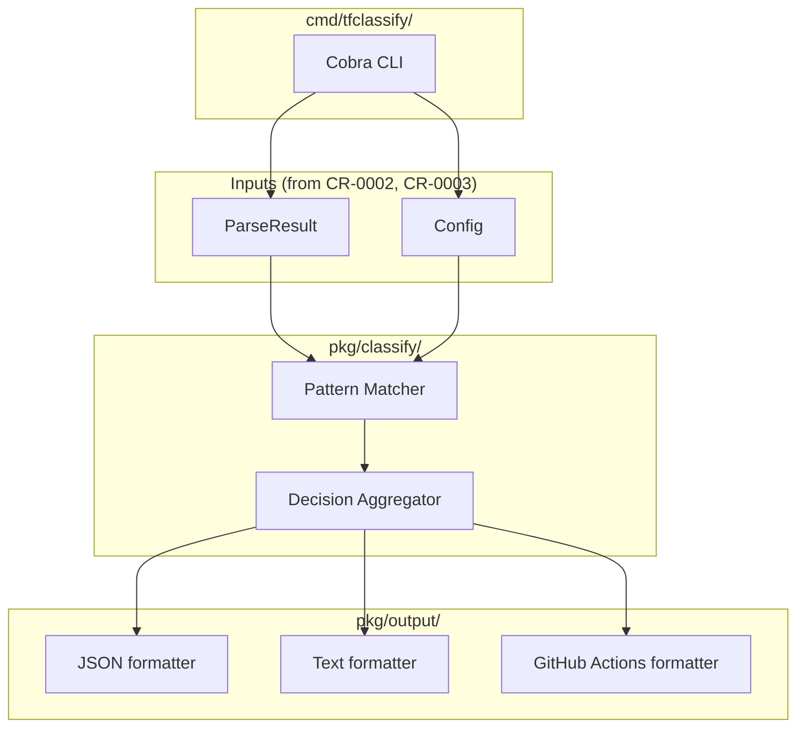
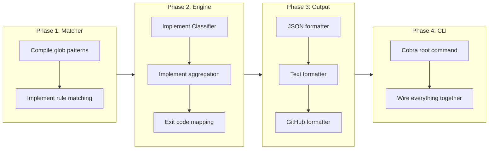

# Core Classification Engine and CLI

## Change Summary

Implement the core classification engine that matches parsed plan changes against config-driven rules, and the CLI that ties plan parsing, configuration, and output together. After this CR, tfclassify is minimally functional: it can read a plan, apply config rules, and output classification results — without any plugins.

## Motivation and Background

ADR-0003 defines a three-layer classification model. This CR implements Layer 1: the core engine that applies organization-defined pattern-based rules from the HCL config. It also implements the CLI (cobra) and output formatters, making the tool usable end-to-end. This is the first CR that produces a working binary.

## Change Drivers

* ADR-0003 (approved): Core engine handles config-driven pattern matching (Layer 1)
* The tool must be usable without plugins for basic pattern-based classification
* CR-0002 (plan parsing) and CR-0003 (config loading) provide the inputs
* TASK.md specifies CLI flags, exit codes, and output formats

## Current State

After CR-0002 and CR-0003, the plan parser and config loader are functional. The `pkg/classify/`, `pkg/output/`, and `cmd/tfclassify/` directories contain stubs.

## Proposed Change

Implement:
1. A classification engine in `pkg/classify/` that matches resource changes against config rules using glob patterns
2. A decision aggregator that determines the final classification per resource and overall
3. Output formatters for JSON, text, and GitHub Actions
4. A cobra-based CLI in `cmd/tfclassify/`

### Proposed State Diagram



## Requirements

### Functional Requirements

1. The classifier **MUST** match resource changes against classification rules using glob patterns on the resource type field
2. The classifier **MUST** support `resource` patterns (include) and `not_resource` patterns (exclude) in rules
3. The classifier **MUST** match `actions` in rules against the resource change's action list
4. A resource **MUST** match a classification rule if its type matches any `resource` glob AND (if specified) its actions include any listed action
5. A resource **MUST** match a `not_resource` rule if its type does NOT match any of the `not_resource` globs
6. When a resource matches multiple classifications, the one with highest precedence (earliest in the `precedence` list) **MUST** win
7. Resources that match no classification rule **MUST** be assigned the `defaults.unclassified` classification
8. When the plan has no resource changes, the overall classification **MUST** be `defaults.no_changes`
9. The overall classification **MUST** be the highest-precedence classification across all resources
10. The classifier **MUST** produce a `ClassificationResult` containing per-resource decisions and the overall classification
11. The CLI **MUST** accept `-p/--plan` for the plan file path (or stdin when not specified)
12. The CLI **MUST** accept `-c/--config` for the config file path
13. The CLI **MUST** accept `-o/--output` for the output format: `json`, `text`, `github` (default: `text`)
14. The CLI **MUST** accept `-v/--verbose` for detailed output
15. The CLI **MUST** accept `--no-plugins` to disable plugin loading (relevant for CR-0006+)
16. The CLI **MUST** accept `--version` to print the version
17. Exit codes **MUST** be configurable: each classification in the precedence list maps to an exit code based on its position, with the first (highest precedence) getting the highest code
18. The JSON output **MUST** include per-resource classifications with address, type, classification, and matched rule
19. The text output **MUST** show a human-readable summary with overall classification and per-resource details
20. The GitHub Actions output **MUST** set output variables using `::set-output` syntax

### Non-Functional Requirements

1. Glob pattern matching **MUST** use `github.com/gobwas/glob` for consistent cross-platform behavior
2. The classifier **MUST** handle plans with 1000+ resource changes without degradation

## Affected Components

* `pkg/classify/classifier.go` - Classification engine
* `pkg/classify/matcher.go` - Glob pattern matching
* `pkg/classify/result.go` - ClassificationResult type
* `pkg/output/formatter.go` - Output formatters (JSON, text, GitHub)
* `cmd/tfclassify/main.go` - Cobra CLI

## Scope Boundaries

### In Scope

* Glob-based pattern matching on resource type names
* Action-based rule matching
* Precedence-based decision aggregation (core rules only, no plugin decisions yet)
* JSON, text, and GitHub Actions output formatters
* Cobra CLI with all flags from TASK.md
* Exit code mapping

### Out of Scope ("Here, But Not Further")

* Plugin decision aggregation - deferred to CR-0006 (the aggregator will be extended)
* Plugin loading flags behavior - deferred to CR-0006
* Stdin reading - deferred to a future enhancement
* Config init command - deferred to a future CR

## Implementation Approach

### Classification Engine

```go
// pkg/classify/classifier.go
package classify

// Classifier applies config rules to plan changes.
type Classifier struct {
    config *config.Config
    matchers map[string][]compiledRule // classification name -> compiled rules
}

// Classify applies rules from config to the given resource changes.
func (c *Classifier) Classify(changes []plan.ResourceChange) (*Result, error)
```

### Pattern Matching

```go
// pkg/classify/matcher.go
package classify

// compiledRule is a pre-compiled classification rule.
type compiledRule struct {
    classification string
    resourceGlobs  []glob.Glob // compiled from rule.Resource
    notResourceGlobs []glob.Glob // compiled from rule.NotResource
    actions        []string
}

// matchesResource returns true if the resource type matches this rule's patterns.
func (r *compiledRule) matchesResource(resourceType string) bool

// matchesActions returns true if any of the change actions match this rule's actions.
func (r *compiledRule) matchesActions(changeActions []string) bool
```

### Result Type

```go
// pkg/classify/result.go
package classify

type Result struct {
    Overall           string            // highest-precedence classification
    OverallExitCode   int
    ResourceDecisions []ResourceDecision
    NoChanges         bool
}

type ResourceDecision struct {
    Address        string
    ResourceType   string
    Actions        []string
    Classification string
    MatchedRule    string // description of which rule matched
}
```

### Exit Code Mapping

Exit codes are derived from the classification's position in the precedence list. The config's `precedence` order determines exit code assignment. Example with `precedence = ["critical", "review", "standard", "auto"]`:

| Classification | Exit Code | Reasoning |
|---------------|-----------|-----------|
| `auto` | 0 | Lowest precedence = safe |
| `standard` | 1 | |
| `review` | 2 | |
| `critical` | 3 | Highest precedence = most severe |
| No changes | 0 | Maps to `defaults.no_changes` |
| Error | 10+ | System errors |

### Implementation Flow



## Test Strategy

### Tests to Add

| Test File | Test Name | Description | Inputs | Expected Output |
|-----------|-----------|-------------|--------|-----------------|
| `pkg/classify/matcher_test.go` | `TestMatchesResource_SimpleGlob` | Match resource type against glob | `*_role_*` vs `azurerm_role_assignment` | true |
| `pkg/classify/matcher_test.go` | `TestMatchesResource_NoMatch` | Resource type doesn't match glob | `*_role_*` vs `azurerm_virtual_network` | false |
| `pkg/classify/matcher_test.go` | `TestMatchesResource_NotResource` | not_resource excludes matched types | `not_resource: [*_role_*]` vs `azurerm_virtual_network` | true (matches exclusion) |
| `pkg/classify/matcher_test.go` | `TestMatchesActions_Match` | Action matches rule actions | rule actions: ["delete"], change: ["delete"] | true |
| `pkg/classify/matcher_test.go` | `TestMatchesActions_NoActionsInRule` | Rule with no actions matches any action | rule actions: nil, change: ["update"] | true |
| `pkg/classify/classifier_test.go` | `TestClassify_SingleResource` | Classify one resource against config | One resource matching "critical" rule | Result with overall="critical" |
| `pkg/classify/classifier_test.go` | `TestClassify_PrecedenceWins` | Higher precedence wins when multiple match | Resource matching both "critical" and "standard" | ResourceDecision.Classification="critical" |
| `pkg/classify/classifier_test.go` | `TestClassify_OverallIsHighest` | Overall is highest across all resources | Two resources: one "critical", one "standard" | Result.Overall="critical" |
| `pkg/classify/classifier_test.go` | `TestClassify_Unclassified` | Resource matching no rules gets default | Resource matching no classification | Uses defaults.unclassified |
| `pkg/classify/classifier_test.go` | `TestClassify_NoChanges` | Empty plan uses defaults.no_changes | Empty changes slice | Result.NoChanges=true, Overall=defaults.no_changes |
| `pkg/classify/classifier_test.go` | `TestClassify_ExitCodes` | Exit codes map from precedence position | Config with 4 classifications | Correct exit code per classification |
| `pkg/output/formatter_test.go` | `TestFormatJSON` | JSON output contains all fields | ClassificationResult | Valid JSON with overall and resources |
| `pkg/output/formatter_test.go` | `TestFormatText` | Text output is human-readable | ClassificationResult | Readable summary |
| `pkg/output/formatter_test.go` | `TestFormatGitHub` | GitHub output uses ::set-output | ClassificationResult | Lines with ::set-output |
| `cmd/tfclassify/main_test.go` | `TestCLI_EndToEnd` | Full CLI run with plan and config | Plan JSON file + config file | Expected exit code and output |

### Tests to Modify

Not applicable - no existing tests for these components.

### Tests to Remove

Not applicable - no existing tests.

## Acceptance Criteria

### AC-1: Classify resources by glob pattern

```gherkin
Given a config with classification "critical" having rule resource = ["*_role_*"]
  And a plan containing an azurerm_role_assignment change
When the classifier runs
Then the azurerm_role_assignment is classified as "critical"
```

### AC-2: Action filtering

```gherkin
Given a config with classification "critical" having rule resource = ["*_role_*"] and actions = ["delete"]
  And a plan containing an azurerm_role_assignment with action "update"
When the classifier runs
Then the azurerm_role_assignment does NOT match the "critical" classification
```

### AC-3: Precedence determines winner

```gherkin
Given a config with precedence = ["critical", "standard"]
  And a resource matching rules in both "critical" and "standard"
When the classifier resolves the resource's classification
Then the resource is classified as "critical"
```

### AC-4: Overall classification is highest precedence across all resources

```gherkin
Given a plan with three resources classified as "standard", "critical", "standard"
When the classifier computes the overall classification
Then the overall classification is "critical"
  And the exit code corresponds to "critical"
```

### AC-5: Unclassified resources use default

```gherkin
Given a config with defaults.unclassified = "standard"
  And a resource that matches no classification rule
When the classifier runs
Then the resource is classified as "standard"
```

### AC-6: Empty plan returns no_changes default

```gherkin
Given a config with defaults.no_changes = "auto"
  And a plan with no resource changes
When the classifier runs
Then the overall classification is "auto"
  And the exit code is 0
```

### AC-7: CLI produces JSON output

```gherkin
Given a valid plan file and config file
When tfclassify is run with --output json
Then the stdout contains valid JSON with "overall" and "resources" fields
```

### AC-8: CLI exit code reflects classification

```gherkin
Given a plan that classifies as the highest-precedence classification
When tfclassify exits
Then the exit code corresponds to the classification's position in precedence
```

## Quality Standards Compliance

### Build & Compilation

- [ ] Code compiles/builds without errors
- [ ] No new compiler warnings introduced

### Linting & Code Style

- [ ] All linter checks pass with zero warnings/errors
- [ ] Code follows project coding conventions

### Test Execution

- [ ] All existing tests pass after implementation
- [ ] All new tests pass
- [ ] Test coverage adequate for classification logic and edge cases

### Documentation

- [ ] Exported types and functions have GoDoc comments

### Code Review

- [ ] Changes submitted via pull request
- [ ] PR title follows Conventional Commits format
- [ ] Code review completed and approved

### Verification Commands

```bash
# Build the binary
go build -o tfclassify ./cmd/tfclassify

# Run all tests
go test ./pkg/classify/... ./pkg/output/... ./cmd/tfclassify/... -v

# End-to-end test
./tfclassify -p testdata/plan.json -c testdata/.tfclassify.hcl -o json

# Vet
go vet ./...
```

## Risks and Mitigation

### Risk 1: Glob pattern performance with many rules

**Likelihood:** low
**Impact:** low
**Mitigation:** Compile glob patterns once at startup using `gobwas/glob`. Compiled globs are fast to match.

### Risk 2: Exit code mapping confusion

**Likelihood:** medium
**Impact:** low
**Mitigation:** Document the exit code mapping clearly. Derive exit codes from precedence position so they are predictable and consistent.

## Dependencies

* CR-0001 (project scaffolding) - directory structure
* CR-0002 (plan parsing) - `pkg/plan` package
* CR-0003 (config loading) - `pkg/config` package
* External: `github.com/gobwas/glob`, `github.com/spf13/cobra`

## Decision Outcome

Chosen approach: "Config-driven pattern matching with glob and cobra CLI", because it implements the full Layer 1 from ADR-0003 and produces a working end-to-end binary that can be extended with plugin support in later CRs.

## Related Items

* Architecture decision: [ADR-0003](../adr/ADR-0003-provider-agnostic-core-with-deep-inspection-plugins.md)
* Depends on: [CR-0002](CR-0002-terraform-plan-parsing.md), [CR-0003](CR-0003-hcl-configuration-loading.md)
* Blocks: [CR-0006](CR-0006-grpc-protocol-and-plugin-host.md)
