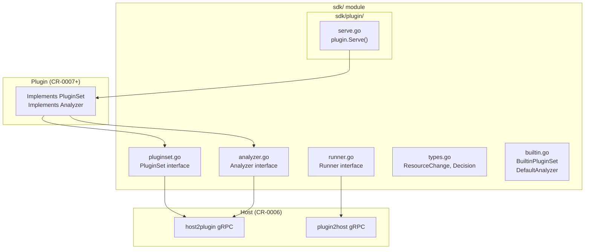
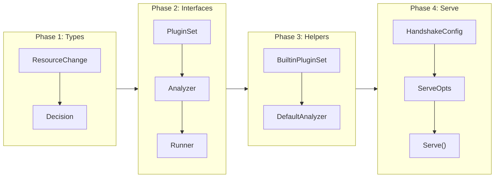

# Plugin SDK

## Change Summary

Implement the plugin SDK in the `sdk/` module that defines the public interfaces and types for plugin authors. This includes `PluginSet`, `Analyzer`, `Runner`, `ResourceChange`, `Decision`, and helper types (`BuiltinPluginSet`, `DefaultAnalyzer`), plus the `plugin.Serve()` entry point for plugin executables.

## Motivation and Background

ADR-0002 defines a gRPC-based plugin architecture where plugins are standalone executables. Plugin authors need a published SDK (`go get github.com/jokarl/tfclassify/sdk`) that provides the interfaces to implement and the `Serve()` function to start the plugin process. This SDK must be independent of the host's internal packages, living in its own Go module for independent versioning.

## Change Drivers

* ADR-0002 (approved): Plugin architecture requires a published SDK
* ADR-0003 (approved): Plugins emit decisions through Runner interface
* ADR-0001 (approved): SDK is its own Go module (`github.com/jokarl/tfclassify/sdk`)
* The bundled terraform plugin (CR-0007) and all future external plugins depend on this SDK
* CR-0006 (gRPC host) implements the wire protocol for these interfaces

## Current State

The `sdk/` module contains a stub `sdk.go` file and its own `go.mod` from CR-0001. No interfaces or types are defined.

## Proposed Change

Implement all SDK interfaces, types, and helper implementations in the `sdk/` module. The SDK is the public contract between the host and plugins.

### Proposed State Diagram



## Requirements

### Functional Requirements

1. The SDK **MUST** define a `PluginSet` interface with methods: `PluginSetName() string`, `PluginSetVersion() string`, `AnalyzerNames() []string`
2. The SDK **MUST** define an `Analyzer` interface with methods: `Name() string`, `Enabled() bool`, `ResourcePatterns() []string`, `Analyze(runner Runner) error`
3. The SDK **MUST** define a `Runner` interface with methods: `GetResourceChanges(patterns []string) ([]*ResourceChange, error)`, `GetResourceChange(address string) (*ResourceChange, error)`, `EmitDecision(analyzer Analyzer, change *ResourceChange, decision *Decision) error`
4. The SDK **MUST** define a `ResourceChange` struct with fields: `Address`, `Type`, `ProviderName`, `Mode`, `Actions`, `Before`, `After`, `BeforeSensitive`, `AfterSensitive`
5. The SDK **MUST** define a `Decision` struct with fields: `Classification` (string), `Reason` (string), `Severity` (int), `Metadata` (map[string]interface{})
6. The SDK **MUST** provide a `BuiltinPluginSet` struct that implements `PluginSet` with configurable `Name`, `Version`, and `Analyzers` fields
7. The SDK **MUST** provide a `DefaultAnalyzer` struct with default implementations: `Enabled() bool` returns `true`, `ResourcePatterns() []string` returns empty slice
8. The `sdk/plugin` subpackage **MUST** expose a `Serve(opts *ServeOpts)` function that starts the plugin gRPC server using `hashicorp/go-plugin`
9. The `ServeOpts` struct **MUST** contain a `PluginSet` field
10. The SDK **MUST** define a `HandshakeConfig` for protocol version negotiation between host and plugin
11. The `Before` and `After` fields on `ResourceChange` **MUST** be `map[string]interface{}` to preserve arbitrary Terraform attribute structures
12. The `Severity` field on `Decision` **MUST** accept values 0-100 for fine-grained ordering within a classification

### Non-Functional Requirements

1. The SDK module **MUST** have minimal dependencies — only `hashicorp/go-plugin`, `google.golang.org/grpc`, and `google.golang.org/protobuf`
2. All exported types and interfaces **MUST** have GoDoc documentation
3. The SDK **MUST** be importable independently: `go get github.com/jokarl/tfclassify/sdk`

## Affected Components

* `sdk/pluginset.go` - PluginSet interface
* `sdk/analyzer.go` - Analyzer interface
* `sdk/runner.go` - Runner interface
* `sdk/types.go` - ResourceChange, Decision types
* `sdk/builtin.go` - BuiltinPluginSet, DefaultAnalyzer
* `sdk/plugin/serve.go` - plugin.Serve() entry point
* `sdk/go.mod` - Dependencies

## Scope Boundaries

### In Scope

* Interface definitions (PluginSet, Analyzer, Runner)
* Data types (ResourceChange, Decision)
* Helper implementations (BuiltinPluginSet, DefaultAnalyzer)
* plugin.Serve() entry point with HandshakeConfig
* GoDoc documentation for all exported symbols

### Out of Scope ("Here, But Not Further")

* gRPC proto definitions - deferred to CR-0006
* gRPC server/client implementations - deferred to CR-0006
* PluginSet configuration via HCL (ApplyConfig) - deferred to CR-0006
* Actual plugin implementations - deferred to CR-0007

## Implementation Approach

### Interface Definitions

```go
// sdk/pluginset.go
package sdk

// PluginSet defines a collection of analyzers provided by a plugin.
type PluginSet interface {
    PluginSetName() string
    PluginSetVersion() string
    AnalyzerNames() []string
}

// sdk/analyzer.go
package sdk

// Analyzer inspects resource changes and emits classification decisions.
type Analyzer interface {
    Name() string
    Enabled() bool
    ResourcePatterns() []string
    Analyze(runner Runner) error
}

// sdk/runner.go
package sdk

// Runner provides access to plan data and emits decisions.
// Implemented by the host, called by plugins.
type Runner interface {
    GetResourceChanges(patterns []string) ([]*ResourceChange, error)
    GetResourceChange(address string) (*ResourceChange, error)
    EmitDecision(analyzer Analyzer, change *ResourceChange, decision *Decision) error
}
```

### Helper Types

```go
// sdk/builtin.go
package sdk

// BuiltinPluginSet provides a default PluginSet implementation.
type BuiltinPluginSet struct {
    Name      string
    Version   string
    Analyzers []Analyzer
}

func (s *BuiltinPluginSet) PluginSetName() string    { return s.Name }
func (s *BuiltinPluginSet) PluginSetVersion() string  { return s.Version }
func (s *BuiltinPluginSet) AnalyzerNames() []string   { /* iterate s.Analyzers */ }

// DefaultAnalyzer provides default implementations for optional Analyzer methods.
type DefaultAnalyzer struct{}

func (d DefaultAnalyzer) Enabled() bool             { return true }
func (d DefaultAnalyzer) ResourcePatterns() []string { return nil }
```

### Serve Entry Point

```go
// sdk/plugin/serve.go
package plugin

import (
    goplugin "github.com/hashicorp/go-plugin"
    "github.com/jokarl/tfclassify/sdk"
)

// HandshakeConfig is used for initial plugin-host verification.
var HandshakeConfig = goplugin.HandshakeConfig{
    ProtocolVersion:  1,
    MagicCookieKey:   "TFCLASSIFY_PLUGIN",
    MagicCookieValue: "tfclassify",
}

// ServeOpts configures the plugin server.
type ServeOpts struct {
    PluginSet sdk.PluginSet
}

// Serve starts the plugin gRPC server. Call this from the plugin's main().
func Serve(opts *ServeOpts)
```

### DeepWiki Validation: go-plugin HandshakeConfig

Validated via DeepWiki for `hashicorp/go-plugin`: The `HandshakeConfig` contains `ProtocolVersion`, `MagicCookieKey`, and `MagicCookieValue`. The `MagicCookieKey/Value` are set as environment variables by the host; the plugin checks them on startup. This is a UX feature (prevents accidental execution), not a security measure. The `Serve` function handles handshake, protocol negotiation, and gRPC serving.

### Implementation Flow



## Test Strategy

### Tests to Add

| Test File | Test Name | Description | Inputs | Expected Output |
|-----------|-----------|-------------|--------|-----------------|
| `sdk/builtin_test.go` | `TestBuiltinPluginSet_Name` | PluginSetName returns configured name | BuiltinPluginSet{Name: "test"} | "test" |
| `sdk/builtin_test.go` | `TestBuiltinPluginSet_Version` | PluginSetVersion returns configured version | BuiltinPluginSet{Version: "1.0"} | "1.0" |
| `sdk/builtin_test.go` | `TestBuiltinPluginSet_AnalyzerNames` | Returns names from all analyzers | Two analyzers: "a", "b" | ["a", "b"] |
| `sdk/builtin_test.go` | `TestDefaultAnalyzer_Enabled` | Default analyzer is enabled | DefaultAnalyzer{} | true |
| `sdk/builtin_test.go` | `TestDefaultAnalyzer_ResourcePatterns` | Default returns nil patterns | DefaultAnalyzer{} | nil |
| `sdk/types_test.go` | `TestDecision_SeverityRange` | Decision accepts 0-100 severity | Decision{Severity: 50} | Severity=50 |
| `sdk/types_test.go` | `TestResourceChange_BeforeAfterTypes` | Before/After are map[string]interface{} | ResourceChange with nested maps | Fields accessible |

### Tests to Modify

Not applicable - no existing tests.

### Tests to Remove

Not applicable - no existing tests.

## Acceptance Criteria

### AC-1: PluginSet interface is implementable

```gherkin
Given a struct that embeds BuiltinPluginSet
When the struct is used as a PluginSet interface
Then it satisfies the PluginSet interface at compile time
  And PluginSetName, PluginSetVersion, and AnalyzerNames return correct values
```

### AC-2: Analyzer interface is implementable with DefaultAnalyzer

```gherkin
Given a struct that embeds DefaultAnalyzer and implements Name, ResourcePatterns, and Analyze
When the struct is used as an Analyzer interface
Then it satisfies the Analyzer interface at compile time
  And Enabled returns true by default
```

### AC-3: Runner interface is defined for host implementation

```gherkin
Given the Runner interface definition in sdk/runner.go
When a mock implementation is created in tests
Then GetResourceChanges, GetResourceChange, and EmitDecision are callable
  And the interface is usable by both host and plugin code
```

### AC-4: SDK module is independently importable

```gherkin
Given the sdk/ module has its own go.mod with module path "github.com/jokarl/tfclassify/sdk"
When "go build ./..." is run inside the sdk/ directory without go.work
Then the build succeeds
  And no imports reference the host's internal packages
```

### AC-5: Serve function initializes go-plugin

```gherkin
Given a plugin main() that calls plugin.Serve with a PluginSet
When the plugin binary is executed directly (not by the host)
Then it exits with an error because the magic cookie is not set
  And the error indicates the binary is a plugin, not a standalone executable
```

## Quality Standards Compliance

### Build & Compilation

- [ ] Code compiles/builds without errors
- [ ] No new compiler warnings introduced

### Linting & Code Style

- [ ] All linter checks pass with zero warnings/errors
- [ ] Code follows project coding conventions

### Test Execution

- [ ] All existing tests pass after implementation
- [ ] All new tests pass

### Documentation

- [ ] All exported types, interfaces, and functions have GoDoc comments
- [ ] Package-level documentation describes the SDK's purpose

### Code Review

- [ ] Changes submitted via pull request
- [ ] PR title follows Conventional Commits format
- [ ] Code review completed and approved

### Verification Commands

```bash
# Build SDK module
cd sdk && go build ./...

# Test SDK module
cd sdk && go test ./... -v

# Verify independent build (no go.work)
cd sdk && GOWORK=off go build ./...

# Vet
cd sdk && go vet ./...
```

## Risks and Mitigation

### Risk 1: Interface stability

**Likelihood:** medium
**Impact:** high
**Mitigation:** The SDK interfaces are the public API for all plugins. Changes after initial release are breaking. Design interfaces carefully with only necessary methods. Keep the first version minimal.

### Risk 2: SDK dependency bloat

**Likelihood:** low
**Impact:** medium
**Mitigation:** Only depend on go-plugin, gRPC, and protobuf. Avoid pulling host-internal dependencies into the SDK module.

## Dependencies

* CR-0001 (project scaffolding) - provides sdk/ module structure
* External: `github.com/hashicorp/go-plugin`, `google.golang.org/grpc`, `google.golang.org/protobuf`

## Decision Outcome

Chosen approach: "Minimal interface-based SDK with helper types", because it provides plugin authors with the minimum contract needed while BuiltinPluginSet and DefaultAnalyzer reduce boilerplate for common cases.

## Related Items

* Architecture decision: [ADR-0002](../adr/ADR-0002-grpc-plugin-architecture.md)
* Architecture decision: [ADR-0003](../adr/ADR-0003-provider-agnostic-core-with-deep-inspection-plugins.md)
* Depends on: [CR-0001](CR-0001-project-scaffolding.md)
* Blocks: [CR-0006](CR-0006-grpc-protocol-and-plugin-host.md), [CR-0007](CR-0007-bundled-terraform-plugin.md)
