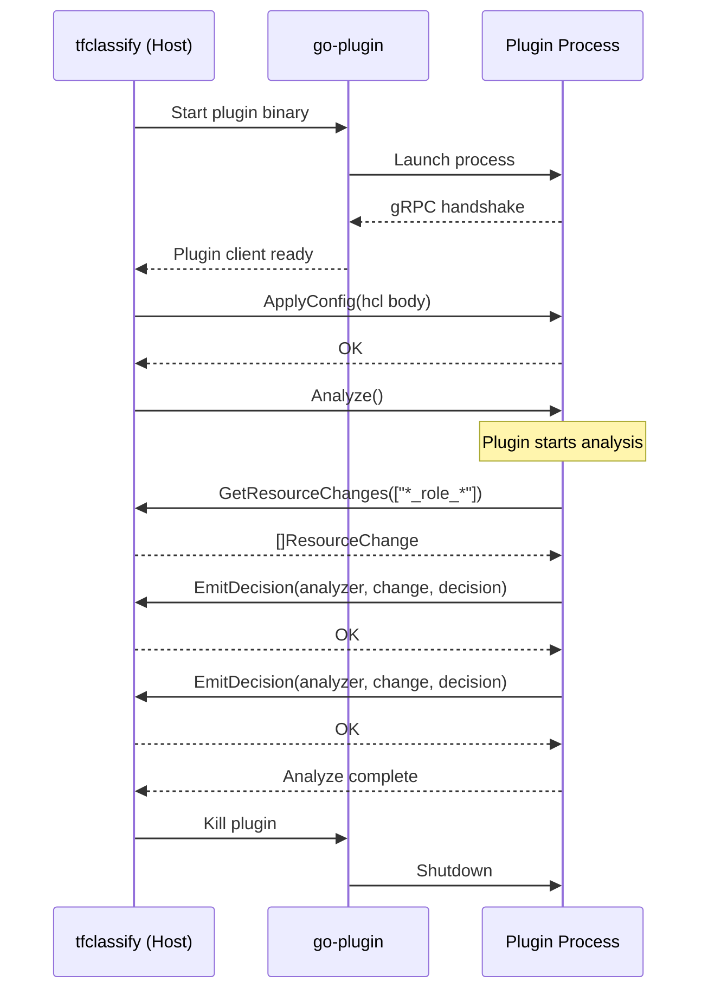
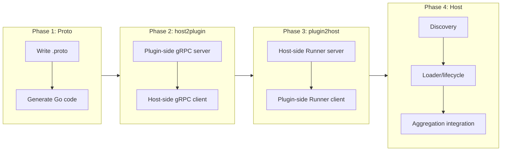

# gRPC Protocol and Plugin Host

## Change Summary

Implement the gRPC protocol definitions and the plugin host that manages plugin lifecycle, discovery, and bidirectional communication. This connects the SDK interfaces (CR-0005) to the classification engine (CR-0004) via hashicorp/go-plugin, enabling plugins to query plan data and emit classification decisions.

## Motivation and Background

ADR-0002 defines a bidirectional gRPC architecture where the host calls plugin methods (Analyze, ApplyConfig) and plugins call back to the host (GetResourceChanges, EmitDecision) via a Runner server. This CR implements both directions of communication, plugin discovery, lifecycle management, and the integration of plugin decisions into the classification aggregator from CR-0004.

## Change Drivers

* ADR-0002 (approved): gRPC-based plugin architecture using hashicorp/go-plugin
* ADR-0003 (approved): Plugin decisions must be aggregated with core classifications
* The bundled terraform plugin (CR-0007) requires this host infrastructure to run
* Plugin authors need the gRPC wire protocol to communicate with the host

## Current State

After CR-0004 and CR-0005:
- The classification engine produces results from config-driven rules
- The SDK defines PluginSet, Analyzer, Runner, and Decision interfaces/types
- The `pkg/plugin/` directory contains stubs
- The `proto/` directory is empty

## Proposed Change

Implement:
1. Protobuf definitions for host-plugin communication
2. host2plugin gRPC layer (host calls plugin: ApplyConfig, Analyze)
3. plugin2host gRPC layer (plugin calls host: GetResourceChanges, EmitDecision)
4. Plugin discovery (find plugin binaries)
5. Plugin lifecycle management (start, configure, run, shutdown)
6. Integration with the classification engine's decision aggregator

### Architecture Diagram



## Requirements

### Functional Requirements

1. The proto file **MUST** define services for host2plugin (`PluginService`) and plugin2host (`RunnerService`)
2. `PluginService` **MUST** define RPCs: `ApplyConfig(ConfigRequest) ConfigResponse` and `Analyze(AnalyzeRequest) AnalyzeResponse`
3. `RunnerService` **MUST** define RPCs: `GetResourceChanges(GetResourceChangesRequest) GetResourceChangesResponse`, `GetResourceChange(GetResourceChangeRequest) GetResourceChangeResponse`, and `EmitDecision(EmitDecisionRequest) EmitDecisionResponse`
4. The host **MUST** discover plugin binaries named `tfclassify-plugin-{name}` in these locations (in order): config `plugin_dir`, `TFCLASSIFY_PLUGIN_DIR` env var, `./.tfclassify/plugins/`, `~/.tfclassify/plugins/`
5. The bundled terraform plugin **MUST** be discovered by the host executing itself with `--act-as-bundled-plugin` (following TFLint's pattern)
6. The host **MUST** start each plugin as a subprocess via `hashicorp/go-plugin` with the shared `HandshakeConfig` from the SDK
7. The host **MUST** send plugin-specific HCL config via `ApplyConfig` before calling `Analyze`
8. The host **MUST** start a Runner gRPC server that plugins call back into during analysis
9. The Runner server **MUST** implement `GetResourceChanges` by matching plugin-provided glob patterns against the parsed plan's resource changes
10. The Runner server **MUST** implement `EmitDecision` by collecting decisions and associating them with the calling analyzer
11. The host **MUST** aggregate plugin decisions with core classification decisions using the config's precedence rules
12. When a plugin decision conflicts with a core decision for the same resource, the higher-precedence classification **MUST** win
13. The host **MUST** enforce a configurable timeout per plugin (from `defaults.plugin_timeout`)
14. The host **MUST** gracefully handle plugin crashes without crashing itself
15. The host **MUST** skip disabled plugins (where `enabled = false` in config)
16. The `--no-plugins` CLI flag **MUST** skip all plugin loading and use only core rules

### Non-Functional Requirements

1. Protobuf definitions **MUST** be compiled using `protoc` with Go and gRPC plugins
2. Generated protobuf Go code **MUST** be committed to the repository (no build-time code generation requirement)
3. Plugin processes **MUST** be run in parallel where possible
4. The GRPCBroker **MUST** be used for bidirectional communication following hashicorp/go-plugin conventions

## Affected Components

* `proto/tfclassify.proto` - Protocol buffer definitions
* `proto/gen/` - Generated Go code from protobuf
* `pkg/plugin/discovery.go` - Plugin binary discovery
* `pkg/plugin/loader.go` - Plugin lifecycle management
* `pkg/plugin/host2plugin/client.go` - Host-side client for calling plugins
* `pkg/plugin/host2plugin/server.go` - Plugin-side server (SDK counterpart)
* `pkg/plugin/plugin2host/client.go` - Plugin-side Runner client
* `pkg/plugin/plugin2host/server.go` - Host-side Runner server
* `pkg/classify/classifier.go` - Extended to aggregate plugin decisions
* `cmd/tfclassify/main.go` - Wire plugin loading into CLI flow

## Scope Boundaries

### In Scope

* Protobuf service definitions and Go code generation
* host2plugin gRPC client/server (ApplyConfig, Analyze)
* plugin2host gRPC client/server (GetResourceChanges, EmitDecision)
* Plugin discovery across configured paths
* Bundled plugin discovery via `--act-as-bundled-plugin`
* Plugin lifecycle: start, configure, analyze, shutdown
* Decision aggregation with core classifications
* Plugin timeout enforcement
* `--no-plugins` flag implementation

### Out of Scope ("Here, But Not Further")

* Plugin auto-installation from source URLs - deferred to a future CR
* Plugin version checking or compatibility verification - deferred to a future CR
* EvaluateExpr Runner method - deferred to a future CR
* Actual plugin implementations - deferred to CR-0007

## Implementation Approach

### Protobuf Definitions

```protobuf
// proto/tfclassify.proto
syntax = "proto3";
package tfclassify;
option go_package = "github.com/jokarl/tfclassify/proto/gen";

// Host calls Plugin
service PluginService {
    rpc ApplyConfig(ApplyConfigRequest) returns (ApplyConfigResponse);
    rpc Analyze(AnalyzeRequest) returns (AnalyzeResponse);
}

// Plugin calls Host (Runner)
service RunnerService {
    rpc GetResourceChanges(GetResourceChangesRequest) returns (GetResourceChangesResponse);
    rpc GetResourceChange(GetResourceChangeRequest) returns (GetResourceChangeResponse);
    rpc EmitDecision(EmitDecisionRequest) returns (EmitDecisionResponse);
}

message ResourceChange {
    string address = 1;
    string type = 2;
    string provider_name = 3;
    string mode = 4;
    repeated string actions = 5;
    bytes before = 6;    // JSON-encoded map
    bytes after = 7;     // JSON-encoded map
    bytes before_sensitive = 8;
    bytes after_sensitive = 9;
}

message Decision {
    string classification = 1;
    string reason = 2;
    int32 severity = 3;
    bytes metadata = 4;  // JSON-encoded map
}

message ApplyConfigRequest {
    bytes config = 1;  // Raw HCL bytes
}
message ApplyConfigResponse {}

message AnalyzeRequest {}
message AnalyzeResponse {}

message GetResourceChangesRequest {
    repeated string patterns = 1;
}
message GetResourceChangesResponse {
    repeated ResourceChange changes = 1;
}

message GetResourceChangeRequest {
    string address = 1;
}
message GetResourceChangeResponse {
    ResourceChange change = 1;
}

message EmitDecisionRequest {
    string analyzer_name = 1;
    ResourceChange change = 2;
    Decision decision = 3;
}
message EmitDecisionResponse {}
```

### Plugin Discovery

```go
// pkg/plugin/discovery.go
package plugin

// DiscoverPlugins finds plugin binaries for each enabled plugin in config.
func DiscoverPlugins(cfg *config.Config) (map[string]string, error)

// searchPaths returns ordered list of directories to search.
func searchPaths(cfg *config.Config) []string
```

### Bidirectional Communication

Following the GRPCBroker pattern validated via DeepWiki:

1. Host starts plugin process via `go-plugin.Client`
2. Host obtains the `PluginService` client via `GRPCClient`
3. Host starts a Runner gRPC server using `GRPCBroker.AcceptAndServe()`
4. Host calls `Analyze()` on the plugin, passing the broker ID
5. Plugin uses `GRPCBroker.Dial()` with the broker ID to connect to the Runner server
6. Plugin calls `GetResourceChanges()` and `EmitDecision()` on the Runner connection
7. Plugin returns from `Analyze()`

### Implementation Flow



## Test Strategy

### Tests to Add

| Test File | Test Name | Description | Inputs | Expected Output |
|-----------|-----------|-------------|--------|-----------------|
| `pkg/plugin/discovery_test.go` | `TestDiscoverPlugins_ConfigDir` | Find plugin in config plugin_dir | Binary in config dir | Path to binary |
| `pkg/plugin/discovery_test.go` | `TestDiscoverPlugins_EnvVar` | Find plugin via TFCLASSIFY_PLUGIN_DIR | Binary in env dir | Path to binary |
| `pkg/plugin/discovery_test.go` | `TestDiscoverPlugins_LocalDir` | Find plugin in .tfclassify/plugins/ | Binary in local dir | Path to binary |
| `pkg/plugin/discovery_test.go` | `TestDiscoverPlugins_NotFound` | Plugin binary not found | No binary anywhere | Descriptive error |
| `pkg/plugin/discovery_test.go` | `TestDiscoverPlugins_Precedence` | Config dir takes priority over env var | Binary in both | Config dir path returned |
| `pkg/plugin/host2plugin/client_test.go` | `TestApplyConfig` | Send config to plugin | HCL bytes | No error |
| `pkg/plugin/host2plugin/client_test.go` | `TestAnalyze` | Call Analyze on plugin | Running plugin | Plugin executes analysis |
| `pkg/plugin/plugin2host/server_test.go` | `TestGetResourceChanges_PatternMatch` | Runner returns matching changes | Pattern `*_role_*`, plan with mixed resources | Only role resources returned |
| `pkg/plugin/plugin2host/server_test.go` | `TestGetResourceChanges_NoMatch` | Runner returns empty for no matches | Pattern `*_nonexistent_*` | Empty slice |
| `pkg/plugin/plugin2host/server_test.go` | `TestEmitDecision` | Runner collects emitted decision | Decision from analyzer | Decision stored in collector |
| `pkg/plugin/plugin2host/server_test.go` | `TestGetResourceChange_ByAddress` | Runner returns specific change by address | Valid address | Matching ResourceChange |
| `pkg/plugin/plugin2host/server_test.go` | `TestGetResourceChange_NotFound` | Address not in plan | Unknown address | Error |
| `pkg/plugin/loader_test.go` | `TestPluginTimeout` | Plugin killed after timeout | Slow plugin, 1s timeout | Timeout error, host not affected |
| `pkg/plugin/loader_test.go` | `TestPluginCrash` | Host survives plugin crash | Plugin that panics | Error returned, host continues |
| `pkg/plugin/loader_test.go` | `TestNoPluginsFlag` | --no-plugins skips all loading | --no-plugins flag set | No plugins started |
| `pkg/classify/classifier_test.go` | `TestClassify_WithPluginDecisions` | Plugin decisions aggregated with core | Core: "standard", plugin: "critical" | Overall: "critical" |
| `pkg/classify/classifier_test.go` | `TestClassify_PluginDecisionPrecedence` | Higher precedence wins in aggregation | Plugin and core both classify same resource | Higher precedence classification wins |

### Tests to Modify

| Test File | Test Name | Current Behavior | New Behavior | Reason for Change |
|-----------|-----------|------------------|--------------|-------------------|
| `pkg/classify/classifier_test.go` | `TestClassify_*` | Core-only classification | Accepts optional plugin decisions | Classifier extended to aggregate plugin decisions |

### Tests to Remove

Not applicable.

## Acceptance Criteria

### AC-1: Host discovers plugin binaries

```gherkin
Given a plugin "example" is enabled in config
  And a binary named "tfclassify-plugin-example" exists in .tfclassify/plugins/
When the host runs plugin discovery
Then it finds and returns the path to the plugin binary
```

### AC-2: Bidirectional gRPC communication works

```gherkin
Given a plugin that calls GetResourceChanges with pattern ["*_role_*"]
  And the plan contains azurerm_role_assignment and azurerm_virtual_network changes
When the host starts the plugin and calls Analyze
Then the plugin receives only the azurerm_role_assignment change
  And the plugin can emit a Decision for that change
  And the host collects the emitted decision
```

### AC-3: Plugin decisions are aggregated with core decisions

```gherkin
Given a core classification of "standard" for a resource
  And a plugin emits a "critical" decision for the same resource
  And the config precedence has "critical" before "standard"
When decisions are aggregated
Then the resource's final classification is "critical"
```

### AC-4: Plugin timeout is enforced

```gherkin
Given a config with plugin_timeout = "2s"
  And a plugin that takes 10 seconds to analyze
When the host calls Analyze on the plugin
Then the host cancels the plugin after 2 seconds
  And returns a timeout error for that plugin
  And other plugins and core classification are not affected
```

### AC-5: Plugin crash does not crash host

```gherkin
Given a plugin that crashes (exits with panic) during Analyze
When the host detects the plugin crash
Then the host logs an error for that plugin
  And continues processing other plugins and core classification
  And the overall result excludes the crashed plugin's decisions
```

### AC-6: Bundled plugin uses act-as-bundled-plugin

```gherkin
Given the "terraform" plugin is enabled in config with no source or version
When the host discovers the terraform plugin
Then it resolves the plugin binary as the tfclassify binary itself
  And starts it with the --act-as-bundled-plugin flag
```

### AC-7: Disabled plugins are skipped

```gherkin
Given a plugin "example" with enabled = false in config
When the host runs plugin loading
Then the "example" plugin is not started
  And no discovery is attempted for it
```

### AC-8: No-plugins flag disables all plugins

```gherkin
Given the --no-plugins CLI flag is set
When tfclassify runs
Then no plugins are discovered or started
  And only core classification rules are applied
```

## Quality Standards Compliance

### Build & Compilation

- [ ] Code compiles/builds without errors
- [ ] Generated protobuf code compiles without errors
- [ ] No new compiler warnings introduced

### Linting & Code Style

- [ ] All linter checks pass with zero warnings/errors
- [ ] Code follows project coding conventions

### Test Execution

- [ ] All existing tests pass after implementation
- [ ] All new tests pass
- [ ] Integration tests verify full host-plugin lifecycle

### Documentation

- [ ] Exported types and functions have GoDoc comments
- [ ] Proto file has comments on all services and messages

### Code Review

- [ ] Changes submitted via pull request
- [ ] PR title follows Conventional Commits format
- [ ] Code review completed and approved

### Verification Commands

```bash
# Generate protobuf code
protoc --go_out=. --go-grpc_out=. proto/tfclassify.proto

# Build
go build ./...

# Test
go test ./pkg/plugin/... ./pkg/classify/... -v

# Vet
go vet ./...
```

## Risks and Mitigation

### Risk 1: GRPCBroker complexity

**Likelihood:** medium
**Impact:** medium
**Mitigation:** Follow TFLint's implementation closely. The DeepWiki validation confirms the pattern: use `broker.NextId()`, `broker.AcceptAndServe()`, and `broker.Dial()` for bidirectional communication.

### Risk 2: Protobuf schema evolution

**Likelihood:** medium
**Impact:** high
**Mitigation:** Use proto3 with explicit field numbers. Never reuse field numbers. Add new fields as optional. The `ProtocolVersion` in HandshakeConfig provides version negotiation.

### Risk 3: Plugin process leaks

**Likelihood:** low
**Impact:** medium
**Mitigation:** hashicorp/go-plugin handles automatic cleanup of plugin processes. Use `defer client.Kill()` and set appropriate timeouts.

## Dependencies

* CR-0004 (classification engine) - aggregator to extend
* CR-0005 (plugin SDK) - interfaces and HandshakeConfig
* External: `github.com/hashicorp/go-plugin`, `google.golang.org/grpc`, `google.golang.org/protobuf`, `github.com/gobwas/glob`
* Build tool: `protoc` with `protoc-gen-go` and `protoc-gen-go-grpc`

## Decision Outcome

Chosen approach: "Bidirectional gRPC with GRPCBroker and committed generated code", because it follows hashicorp/go-plugin's established patterns validated against TFLint's implementation, and committing generated code avoids build-time protoc dependency.

## Related Items

* Architecture decision: [ADR-0002](../adr/ADR-0002-grpc-plugin-architecture.md)
* Depends on: [CR-0004](CR-0004-core-classification-engine-and-cli.md), [CR-0005](CR-0005-plugin-sdk.md)
* Blocks: [CR-0007](CR-0007-bundled-terraform-plugin.md)
