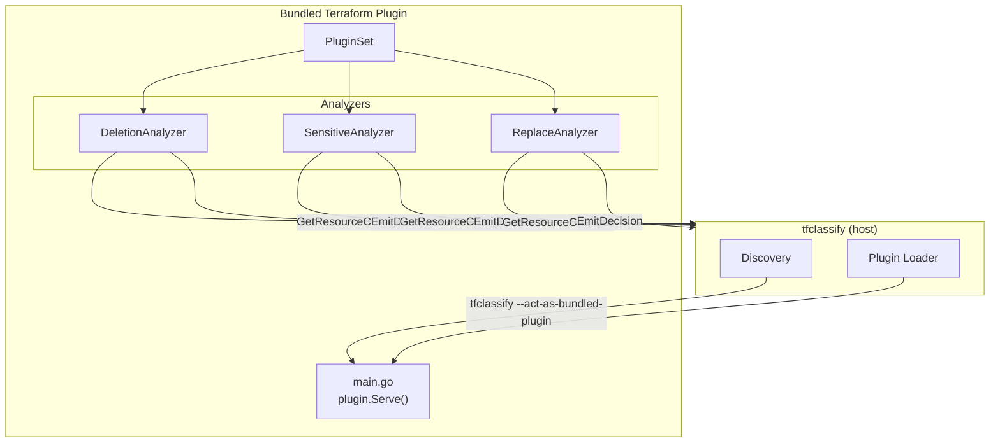
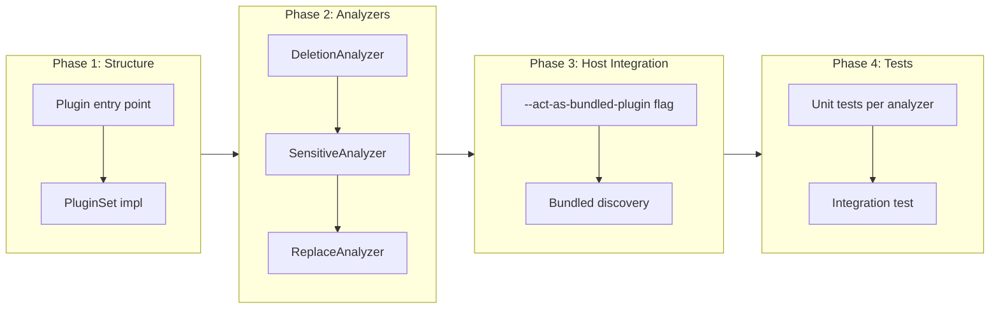

# Bundled Terraform Plugin

## Change Summary

Implement the bundled "terraform" plugin that ships with tfclassify and provides cross-provider analyzers for common change patterns: resource deletions, sensitive attribute changes, and resource replacements. This is Layer 2 from ADR-0003, adding analysis beyond the core's pattern matching without requiring provider-specific knowledge.

## Motivation and Background

ADR-0003 defines a three-layer classification model. Layer 2 is the bundled "terraform" plugin that provides useful classification capabilities out of the box. Following TFLint's approach, this plugin is auto-enabled and loaded by the host executing itself with `--act-as-bundled-plugin`. It bridges the gap between simple pattern matching (core) and deep provider-specific inspection (external plugins).

The bundled plugin uses the SDK from CR-0005 and communicates via the gRPC protocol from CR-0006. It serves as both a useful feature and a reference implementation for plugin authors.

## Change Drivers

* ADR-0003 (approved): Layer 2 - bundled cross-provider plugin
* ADR-0002 (approved): Plugin architecture with go-plugin
* TFLint pattern: bundled plugin auto-enabled by default
* The tool must provide value beyond pattern matching without requiring external plugins
* Plugin authors need a reference implementation

## Current State

After CR-0006, the plugin host can discover, start, and communicate with plugins. The `plugins/terraform/` module has a stub `main.go`. The SDK and gRPC infrastructure are in place.

## Proposed Change

Implement the bundled terraform plugin with three analyzers:

1. **Deletion Analyzer**: Classifies resource deletions, distinguishing standalone deletes from delete-and-recreate (replace) operations
2. **Sensitive Attribute Analyzer**: Detects changes to attributes marked as sensitive by Terraform
3. **Replace Analyzer**: Identifies resources being replaced (destroy + create) which may cause downtime

The plugin is compiled into the tfclassify binary and activated via `--act-as-bundled-plugin`.

### Architecture Diagram



## Requirements

### Functional Requirements

1. The plugin **MUST** be implemented in `plugins/terraform/` as a Go module using the SDK
2. The plugin **MUST** expose a `PluginSet` named "terraform" with version matching the tfclassify version
3. The plugin **MUST** be callable via `tfclassify --act-as-bundled-plugin`
4. The plugin **MUST** contain three analyzers: `deletion`, `sensitive`, and `replace`
5. All three analyzers **MUST** be enabled by default
6. Each analyzer **MUST** be individually disableable via plugin config in `.tfclassify.hcl`

#### Deletion Analyzer

7. The deletion analyzer **MUST** query for all resource changes (pattern `["*"]`)
8. The deletion analyzer **MUST** emit a decision for resources with action `["delete"]` (standalone delete)
9. The deletion analyzer **MUST** distinguish standalone deletes from replacements (delete + create actions)
10. The deletion analyzer **MUST** include the resource address and action in the decision reason
11. The deletion analyzer **MUST** use severity 80 for standalone deletes and severity 60 for delete-as-part-of-replace

#### Sensitive Attribute Analyzer

12. The sensitive analyzer **MUST** query for all resource changes
13. The sensitive analyzer **MUST** detect changes to attributes where `before_sensitive` or `after_sensitive` contains `true` values
14. The sensitive analyzer **MUST** emit a decision listing which sensitive attributes changed
15. The sensitive analyzer **MUST** NOT expose the actual sensitive values in the decision reason or metadata
16. The sensitive analyzer **MUST** use severity 70 for sensitive attribute changes

#### Replace Analyzer

17. The replace analyzer **MUST** query for all resource changes
18. The replace analyzer **MUST** emit a decision for resources with actions `["delete", "create"]` (replace)
19. The replace analyzer **MUST** include the resource address in the decision reason
20. The replace analyzer **MUST** use severity 75 for resource replacements

#### General

21. All analyzers **MUST** set the `Classification` field in decisions to an empty string, allowing the core engine's config rules to determine the final classification based on aggregation and precedence
22. The host **MUST** map plugin decisions with empty `Classification` to classifications based on severity thresholds defined in config (or use `defaults.unclassified` as fallback)

### Non-Functional Requirements

1. The plugin **MUST** use only SDK types and interfaces — no imports from `pkg/` host internals
2. The plugin **MUST** serve as a reference implementation with clear, well-documented code
3. The plugin **MUST** handle large plans (1000+ resources) without timing out under the default 30s timeout

## Affected Components

* `plugins/terraform/main.go` - Plugin entry point with Serve()
* `plugins/terraform/plugin.go` - PluginSet implementation
* `plugins/terraform/deletion.go` - Deletion analyzer
* `plugins/terraform/sensitive.go` - Sensitive attribute analyzer
* `plugins/terraform/replace.go` - Replace analyzer
* `cmd/tfclassify/main.go` - Add `--act-as-bundled-plugin` flag handling
* `pkg/plugin/discovery.go` - Bundled plugin discovery logic

## Scope Boundaries

### In Scope

* Three cross-provider analyzers (deletion, sensitive, replace)
* Plugin entry point using sdk/plugin.Serve()
* `--act-as-bundled-plugin` flag on the host binary
* Plugin configuration for enabling/disabling individual analyzers
* Reference implementation patterns

### Out of Scope ("Here, But Not Further")

* Provider-specific analysis (Azure role semantics, AWS IAM policies) - deferred to future external plugins
* Network/firewall analysis - deferred to a future external plugin
* Custom severity threshold configuration - deferred to a future CR
* Plugin auto-update or versioning - deferred to a future CR

## Implementation Approach

### Plugin Entry Point

```go
// plugins/terraform/main.go
package main

import (
    "github.com/jokarl/tfclassify/sdk"
    sdkplugin "github.com/jokarl/tfclassify/sdk/plugin"
)

func main() {
    sdkplugin.Serve(&sdkplugin.ServeOpts{
        PluginSet: &TerraformPluginSet{
            BuiltinPluginSet: sdk.BuiltinPluginSet{
                Name:    "terraform",
                Version: "0.1.0",
                Analyzers: []sdk.Analyzer{
                    &DeletionAnalyzer{},
                    &SensitiveAnalyzer{},
                    &ReplaceAnalyzer{},
                },
            },
        },
    })
}
```

### Deletion Analyzer

```go
// plugins/terraform/deletion.go
package main

type DeletionAnalyzer struct {
    sdk.DefaultAnalyzer
}

func (a *DeletionAnalyzer) Name() string             { return "deletion" }
func (a *DeletionAnalyzer) ResourcePatterns() []string { return []string{"*"} }

func (a *DeletionAnalyzer) Analyze(runner sdk.Runner) error {
    changes, err := runner.GetResourceChanges(a.ResourcePatterns())
    if err != nil {
        return err
    }
    for _, change := range changes {
        if isStandaloneDelete(change.Actions) {
            runner.EmitDecision(a, change, &sdk.Decision{
                Reason:   fmt.Sprintf("Resource %s is being deleted", change.Address),
                Severity: 80,
            })
        }
    }
    return nil
}
```

### Bundled Plugin Discovery

Following TFLint's pattern where the host binary doubles as the bundled plugin:

```go
// In host discovery logic
func discoverBundledPlugin() string {
    exe, _ := os.Executable()
    return exe // Host binary IS the bundled plugin
}

// In host main.go
if flagActAsBundledPlugin {
    // Run as plugin process
    plugins_terraform.ServeBundled()
    return
}
```

### Sensitive Attribute Detection

The sensitive analyzer walks the `before_sensitive` and `after_sensitive` fields to find attributes marked as sensitive. These fields mirror the structure of `before`/`after` with `true` values where attributes are sensitive.

```go
func findSensitiveChanges(change *sdk.ResourceChange) []string {
    var changed []string
    beforeSens := asBoolMap(change.BeforeSensitive)
    afterSens := asBoolMap(change.AfterSensitive)
    // Walk both maps, find keys where sensitivity status changed
    // or where sensitive attribute values changed
    return changed
}
```

### Implementation Flow



## Test Strategy

### Tests to Add

| Test File | Test Name | Description | Inputs | Expected Output |
|-----------|-----------|-------------|--------|-----------------|
| `plugins/terraform/deletion_test.go` | `TestDeletionAnalyzer_StandaloneDelete` | Detect standalone delete | Change with actions=["delete"] | Decision with severity 80 |
| `plugins/terraform/deletion_test.go` | `TestDeletionAnalyzer_ReplaceNotFlagged` | Skip delete part of replace | Change with actions=["delete","create"] | No decision from deletion analyzer |
| `plugins/terraform/deletion_test.go` | `TestDeletionAnalyzer_CreateIgnored` | Ignore create actions | Change with actions=["create"] | No decision |
| `plugins/terraform/deletion_test.go` | `TestDeletionAnalyzer_UpdateIgnored` | Ignore update actions | Change with actions=["update"] | No decision |
| `plugins/terraform/sensitive_test.go` | `TestSensitiveAnalyzer_DetectsChange` | Detect sensitive attribute change | Change with sensitive before/after | Decision listing changed sensitive attrs |
| `plugins/terraform/sensitive_test.go` | `TestSensitiveAnalyzer_NoSensitive` | No decision when no sensitive attrs | Change with no sensitive markers | No decision |
| `plugins/terraform/sensitive_test.go` | `TestSensitiveAnalyzer_NoValueExposed` | Decision doesn't expose sensitive values | Change with sensitive password | Reason mentions attr name, not value |
| `plugins/terraform/replace_test.go` | `TestReplaceAnalyzer_Detects` | Detect resource replacement | Change with actions=["delete","create"] | Decision with severity 75 |
| `plugins/terraform/replace_test.go` | `TestReplaceAnalyzer_CreateOnly` | Ignore pure creates | Change with actions=["create"] | No decision |
| `plugins/terraform/replace_test.go` | `TestReplaceAnalyzer_DeleteOnly` | Ignore pure deletes | Change with actions=["delete"] | No decision |
| `plugins/terraform/plugin_test.go` | `TestPluginSetName` | PluginSet returns correct name | TerraformPluginSet | "terraform" |
| `plugins/terraform/plugin_test.go` | `TestAnalyzerNames` | Lists all three analyzers | TerraformPluginSet | ["deletion", "sensitive", "replace"] |
| `plugins/terraform/integration_test.go` | `TestBundledPlugin_EndToEnd` | Full plugin lifecycle via gRPC | Host starts plugin, sends plan data | Plugin emits expected decisions |

### Tests to Modify

| Test File | Test Name | Current Behavior | New Behavior | Reason for Change |
|-----------|-----------|------------------|--------------|-------------------|
| `cmd/tfclassify/main_test.go` | `TestCLI_EndToEnd` | Tests core-only classification | Tests with bundled plugin enabled | Bundled plugin now runs by default |

### Tests to Remove

Not applicable.

## Acceptance Criteria

### AC-1: Bundled plugin loads automatically

```gherkin
Given a .tfclassify.hcl with plugin "terraform" { enabled = true }
When tfclassify runs with a plan file
Then the bundled terraform plugin is loaded and its analyzers execute
  And decisions from the plugin appear in the output
```

### AC-2: Deletion analyzer detects standalone deletes

```gherkin
Given a plan with a resource change having actions = ["delete"]
When the deletion analyzer runs
Then it emits a decision with severity 80
  And the reason includes the resource address
  And the reason indicates it is a standalone deletion
```

### AC-3: Deletion analyzer distinguishes replacements

```gherkin
Given a plan with a resource change having actions = ["delete", "create"]
When the deletion analyzer runs
Then it does NOT emit a decision for this change
  And the replace analyzer handles it instead
```

### AC-4: Sensitive analyzer detects sensitive changes

```gherkin
Given a plan where a resource has before_sensitive marking "password" as true
  And the after state changes the password value
When the sensitive analyzer runs
Then it emits a decision mentioning the "password" attribute
  And the decision does NOT include the actual password value
  And the severity is 70
```

### AC-5: Replace analyzer detects replacements

```gherkin
Given a plan with a resource change having actions = ["delete", "create"]
When the replace analyzer runs
Then it emits a decision with severity 75
  And the reason indicates the resource will be replaced
```

### AC-6: Individual analyzers can be disabled

```gherkin
Given a .tfclassify.hcl with:
  plugin "terraform" {
    enabled = true
    config {
      deletion  = true
      sensitive = false
      replace   = true
    }
  }
When the bundled plugin runs
Then only the deletion and replace analyzers execute
  And the sensitive analyzer is skipped
```

### AC-7: Plugin uses only SDK imports

```gherkin
Given the plugins/terraform/ module source code
When its imports are inspected
Then no import paths reference "github.com/jokarl/tfclassify/pkg"
  And all tfclassify imports are from "github.com/jokarl/tfclassify/sdk"
```

### AC-8: Plugin acts as reference implementation

```gherkin
Given the bundled plugin source code
When a developer reads it to understand how to write a plugin
Then the main.go shows how to call plugin.Serve()
  And each analyzer shows how to implement the Analyzer interface
  And each analyzer shows how to use Runner.GetResourceChanges and Runner.EmitDecision
```

## Quality Standards Compliance

### Build & Compilation

- [ ] Code compiles/builds without errors
- [ ] No new compiler warnings introduced

### Linting & Code Style

- [ ] All linter checks pass with zero warnings/errors
- [ ] Code follows project coding conventions

### Test Execution

- [ ] All existing tests pass after implementation
- [ ] All new tests pass
- [ ] Integration test covers full plugin lifecycle

### Documentation

- [ ] All exported types and functions have GoDoc comments
- [ ] Package documentation explains the plugin's purpose and analyzers
- [ ] Each analyzer has a doc comment explaining what it detects

### Code Review

- [ ] Changes submitted via pull request
- [ ] PR title follows Conventional Commits format
- [ ] Code review completed and approved

### Verification Commands

```bash
# Build bundled plugin module
cd plugins/terraform && go build ./...

# Test plugin
cd plugins/terraform && go test ./... -v

# Build full binary with bundled plugin
go build -o tfclassify ./cmd/tfclassify

# Integration test: run with a plan
./tfclassify -p testdata/plan-with-deletes.json -c testdata/.tfclassify.hcl -v

# Verify no pkg/ imports in plugin
cd plugins/terraform && grep -r '"github.com/jokarl/tfclassify/pkg' . && echo "FAIL: pkg import found" || echo "OK: no pkg imports"

# Vet
go vet ./...
```

## Risks and Mitigation

### Risk 1: Sensitive attribute detection edge cases

**Likelihood:** medium
**Impact:** low
**Mitigation:** The `before_sensitive`/`after_sensitive` structure mirrors `before`/`after`. Walk both trees recursively. Start with top-level attributes and iterate on nested support.

### Risk 2: Bundled plugin binary size

**Likelihood:** low
**Impact:** low
**Mitigation:** The bundled plugin runs as the same binary with a flag. No additional binary size since it shares the tfclassify executable.

### Risk 3: Decision classification semantics

**Likelihood:** medium
**Impact:** medium
**Mitigation:** Plugin decisions emit severity scores. The mapping from severity to org-defined classification levels is handled by the aggregator in the core engine. This keeps the plugin provider-agnostic and org-agnostic.

## Dependencies

* CR-0005 (plugin SDK) - interfaces and types the plugin implements
* CR-0006 (gRPC protocol and plugin host) - communication infrastructure
* External: `github.com/jokarl/tfclassify/sdk` (own SDK module)

## Decision Outcome

Chosen approach: "Three focused cross-provider analyzers in a bundled plugin", because each analyzer addresses a distinct Terraform-level concern (deletion, sensitivity, replacement) that is valuable regardless of provider, and the bundled approach ensures the tool is useful out of the box.

## Related Items

* Architecture decision: [ADR-0002](../adr/ADR-0002-grpc-plugin-architecture.md)
* Architecture decision: [ADR-0003](../adr/ADR-0003-provider-agnostic-core-with-deep-inspection-plugins.md)
* Depends on: [CR-0005](CR-0005-plugin-sdk.md), [CR-0006](CR-0006-grpc-protocol-and-plugin-host.md)
* Reference for: future external plugins (tfclassify-plugin-azurerm, tfclassify-plugin-aws)
