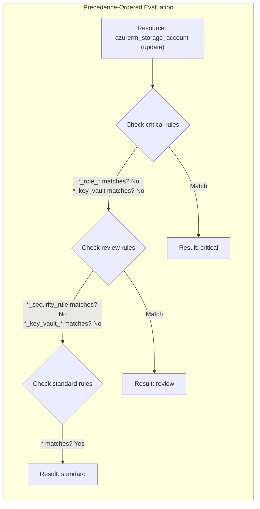
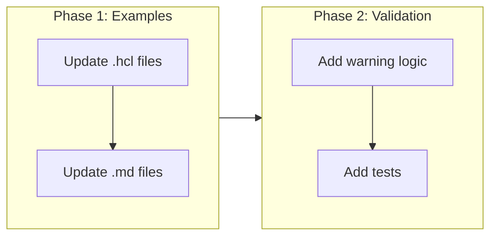

# Simplify Catch-All Classification Rules

## Change Summary

Replace the verbose `not_resource` catch-all pattern in examples and documentation with the simpler `resource = ["*"]` pattern that leverages precedence-ordered evaluation. Update example configs, documentation, and add a config validation warning for `not_resource` rules that duplicate all higher-precedence patterns.

## Motivation and Background

The current examples teach a fragile catch-all pattern using `not_resource` lists that must manually enumerate every pattern from higher-precedence classifications:

```hcl
# Current pattern — verbose and error-prone
classification "standard" {
  rule {
    not_resource = ["*_role_*", "*_iam_*", "*_key_vault*", "*_security_rule", "*_firewall_*"]
  }
}
```

This is problematic because:
1. Every new pattern added to a higher-precedence classification must also be added to the `not_resource` list
2. Forgetting to update the list produces silent misclassification — the catch-all swallows resources intended for higher levels
3. The pattern obscures intent — readers must mentally diff the `not_resource` list against higher-precedence rules to understand what "standard" actually catches

The classification engine already evaluates rules in precedence order (`classifier.go:76-87`) and returns on the first match. This means `resource = ["*"]` on a lower-precedence classification is inherently safe — higher-precedence rules always take priority. The `not_resource` catch-all adds no value over `resource = ["*"]` when precedence handles the hierarchy.

## Change Drivers

* User feedback: the `not_resource` catch-all is "very verbose and easy to misconfigure"
* The precedence-ordered evaluation already solves the hierarchy problem — the examples teach a pattern that works against the engine's design
* ADR-0003 defines precedence as the mechanism for resolving conflicts between classification layers — examples should demonstrate this

## Current State

The classifier in `pkg/classify/classifier.go:76-87` iterates classifications in precedence order and returns on the first match:

```go
for _, classificationName := range c.config.Precedence {
    rules := c.matchers[classificationName]
    for _, rule := range rules {
        if rule.matchesResource(change.Type) && rule.matchesActions(change.Actions) {
            decision.Classification = classificationName
            decision.MatchedRule = rule.ruleDescription
            return decision
        }
    }
}
```

This means a `resource = ["*"]` rule on the last classification in the precedence list will only be reached if no higher-precedence rule matched. The engine already implements hierarchical classification — but the examples don't use it.

### Current Example Pattern

```hcl
classification "critical" {
  rule {
    resource = ["*_role_*", "*_iam_*"]
    actions  = ["delete"]
  }
  rule {
    resource = ["*_key_vault"]
    actions  = ["delete"]
  }
}

classification "review" {
  rule {
    resource = ["*_security_rule", "*_firewall_*"]
  }
  rule {
    resource = ["*_key_vault_*"]
  }
}

# Fragile: must list every pattern from above
classification "standard" {
  rule {
    not_resource = ["*_role_*", "*_iam_*", "*_key_vault*", "*_security_rule", "*_firewall_*"]
  }
}

precedence = ["critical", "review", "standard", "auto"]
```

## Proposed Change

### Updated Example Pattern

```hcl
classification "critical" {
  rule {
    resource = ["*_role_*", "*_iam_*"]
    actions  = ["delete"]
  }
  rule {
    resource = ["*_key_vault"]
    actions  = ["delete"]
  }
}

classification "review" {
  rule {
    resource = ["*_security_rule", "*_firewall_*"]
  }
  rule {
    resource = ["*_key_vault_*"]
  }
}

# Simple: catches everything not matched above — precedence handles the rest
classification "standard" {
  rule {
    resource = ["*"]
  }
}

precedence = ["critical", "review", "standard", "auto"]
```

### Proposed State Diagram



### Config Validation Warning

Add an optional validation warning (not error) when a `not_resource` rule on a lower-precedence classification appears to duplicate all patterns from higher-precedence classifications. This nudges users toward the simpler `resource = ["*"]` pattern.

## Requirements

### Functional Requirements

1. All example configs under `docs/examples/` **MUST** use `resource = ["*"]` instead of `not_resource` for catch-all classification rules
2. Example `.tfclassify.hcl` comments **MUST** explain that precedence-ordered evaluation makes `resource = ["*"]` safe as a catch-all
3. The config validator **MUST** emit a warning (to stderr) when a `not_resource` rule contains only patterns that are already present in higher-precedence `resource` rules
4. The validation warning **MUST** suggest using `resource = ["*"]` instead
5. The validation warning **MUST NOT** be a fatal error — `not_resource` catch-all configs **MUST** continue to work
6. The `not_resource` rule attribute **MUST** remain fully supported for legitimate exclusion use cases (e.g., "match everything except data sources")

### Non-Functional Requirements

1. The validation warning **MUST** include the classification name and rule number for easy identification
2. The warning **MUST** only appear when `--verbose` is set or a future `--lint` flag is used, to avoid noise in CI pipelines

## Affected Components

* `docs/examples/basic-classification/.tfclassify.hcl` — replace `not_resource` catch-all with `resource = ["*"]`
* `docs/examples/action-filtering/.tfclassify.hcl` — replace `not_resource` catch-all with `resource = ["*"]`
* `docs/examples/mixed-changes/.tfclassify.hcl` — replace `not_resource` catch-all with `resource = ["*"]`
* `docs/examples/basic-classification.md` — update inline config and explanation
* `docs/examples/action-filtering.md` — update inline config and explanation
* `docs/examples/mixed-changes.md` — update inline config and explanation
* `testdata/.tfclassify.hcl` — update root-level test config
* `pkg/config/validation.go` — add optional `not_resource` redundancy warning

## Scope Boundaries

### In Scope

* Updating all example configs to use `resource = ["*"]` catch-all pattern
* Updating example markdown files with corrected inline configs and explanations
* Adding a non-fatal validation warning for redundant `not_resource` usage
* Updating comments explaining precedence-based hierarchy

### Out of Scope ("Here, But Not Further")

* Removing `not_resource` support — it remains valid for targeted exclusion use cases
* Adding a `default = true` rule attribute — the `resource = ["*"]` pattern is clear enough
* Changing the classifier evaluation logic — it already works correctly
* Adding a `--lint` CLI flag — deferred to a future CR

## Alternative Approaches Considered

* **Remove `not_resource` entirely**: Too aggressive — `not_resource` has legitimate uses for targeted exclusion (e.g., "match everything except `*_data_source*`"). The problem is only when it's used as a catch-all that duplicates higher-precedence patterns.
* **Add a `default = true` rule attribute**: Adds a new config concept when `resource = ["*"]` already communicates the same intent clearly. Extra complexity without proportional benefit.
* **Rely solely on `defaults.unclassified`**: Works but loses the ability to have the catch-all classification show a specific matched rule description in output. With `resource = ["*"]`, the output shows `standard rule 1 (resource: *)` instead of `default (no rule matched)`.

## Impact Assessment

### User Impact

Users with existing `not_resource` catch-all configs will see no breakage — their configs continue to work. The validation warning (visible only with `--verbose`) nudges them toward the simpler pattern.

### Technical Impact

Minimal. The example files are updated, and a small validation function is added. No changes to the classification engine or config schema.

### Business Impact

Reduces barrier to correct configuration, which is important for a tool where misconfiguration produces silent misclassification.

## Implementation Approach

### Implementation Flow



### Phase 1: Update Examples

Replace `not_resource` catch-all rules with `resource = ["*"]` in all three example configs and their corresponding markdown files. Update comments to explain why `resource = ["*"]` is safe.

### Phase 2: Add Validation Warning

Add a `warnRedundantNotResource` function to `pkg/config/validation.go` that:
1. Collects all `resource` patterns from each classification in precedence order
2. For each `not_resource` rule, checks if every pattern in its list appears in a higher-precedence classification's `resource` list
3. Emits a warning to stderr if the `not_resource` list is fully redundant

```go
// pkg/config/validation.go

func WarnRedundantNotResource(cfg *Config, w io.Writer) {
    // Collect resource patterns from each classification by precedence
    higherPatterns := make(map[string]bool)
    for _, name := range cfg.Precedence {
        for _, cls := range cfg.Classifications {
            if cls.Name != name { continue }
            for _, rule := range cls.Rules {
                // Check if this not_resource list is fully covered
                if len(rule.NotResource) > 0 && allPatternsKnown(rule.NotResource, higherPatterns) {
                    fmt.Fprintf(w, "Warning: classification %q rule uses not_resource "+
                        "with patterns already covered by higher-precedence rules. "+
                        "Consider using resource = [\"*\"] instead.\n", name)
                }
                // Accumulate resource patterns for lower-precedence checks
                for _, p := range rule.Resource {
                    higherPatterns[p] = true
                }
            }
        }
    }
}
```

## Test Strategy

### Tests to Add

| Test File | Test Name | Description | Inputs | Expected Output |
|-----------|-----------|-------------|--------|-----------------|
| `pkg/config/validation_test.go` | `TestWarnRedundantNotResource_FullyRedundant` | Warns when not_resource patterns are all in higher-precedence rules | Config with critical `*_role_*` and standard `not_resource: [*_role_*]` | Warning emitted |
| `pkg/config/validation_test.go` | `TestWarnRedundantNotResource_PartiallyNew` | No warning when not_resource has patterns not in higher rules | Config with standard `not_resource: [*_role_*, *_custom_*]` where `*_custom_*` is not in higher rules | No warning |
| `pkg/config/validation_test.go` | `TestWarnRedundantNotResource_NoNotResource` | No warning when no not_resource rules exist | Config with only resource rules | No warning |

### Tests to Modify

Not applicable — existing tests are unaffected. The `not_resource` functionality remains unchanged.

### Tests to Remove

Not applicable.

## Acceptance Criteria

### AC-1: Examples use resource wildcard catch-all

```gherkin
Given the example configs under docs/examples/
When the "standard" (or equivalent catch-all) classification is inspected
Then its rule uses resource = ["*"] instead of not_resource
  And the comments explain that precedence-ordered evaluation makes this safe
```

### AC-2: resource wildcard produces identical results

```gherkin
Given an example config using resource = ["*"] for the catch-all classification
  And the corresponding plan.json fixture
When tfclassify is run with --no-plugins
Then the output matches the expected output documented in the example markdown
  And the exit code matches the expected exit code
```

### AC-3: Existing not_resource configs continue to work

```gherkin
Given a config using not_resource for a catch-all classification
When tfclassify is run
Then the classification results are correct
  And no error is raised
```

### AC-4: Validation warning for redundant not_resource

```gherkin
Given a config where a not_resource rule lists only patterns present in higher-precedence resource rules
When the config is loaded with verbose mode
Then a warning is emitted suggesting resource = ["*"] instead
  And the warning includes the classification name
  And the tool continues to run normally
```

### AC-5: No warning for legitimate not_resource usage

```gherkin
Given a config where a not_resource rule contains patterns not present in any higher-precedence rule
When the config is loaded
Then no warning is emitted
  And the not_resource rule functions correctly
```

## Quality Standards Compliance

### Build & Compilation

- [ ] Code compiles/builds without errors
- [ ] No new compiler warnings introduced

### Linting & Code Style

- [ ] All linter checks pass with zero warnings/errors
- [ ] Code follows project coding conventions

### Test Execution

- [ ] All existing tests pass after implementation
- [ ] All new tests pass
- [ ] Example configs produce expected output when run

### Documentation

- [ ] Example configs have thorough comments
- [ ] Example markdown files have updated inline configs and explanations

### Code Review

- [ ] Changes submitted via pull request
- [ ] PR title follows Conventional Commits format
- [ ] Code review completed and approved

### Verification Commands

```bash
# Build
go build ./...

# Test
go test ./pkg/config/... -v

# Verify examples produce expected output
go build -o tfclassify ./cmd/tfclassify
./tfclassify -p docs/examples/basic-classification/plan.json \
  -c docs/examples/basic-classification/.tfclassify.hcl --no-plugins -v
./tfclassify -p docs/examples/action-filtering/plan.json \
  -c docs/examples/action-filtering/.tfclassify.hcl --no-plugins -v
./tfclassify -p docs/examples/mixed-changes/plan.json \
  -c docs/examples/mixed-changes/.tfclassify.hcl --no-plugins -v

# Vet
go vet ./...
```

## Risks and Mitigation

### Risk 1: Users confuse resource = ["*"] with "matches everything always"

**Likelihood:** low
**Impact:** low
**Mitigation:** Comments in example configs explicitly explain that precedence-ordered evaluation means higher-precedence rules are checked first. The `resource = ["*"]` rule is only reached for resources that didn't match anything above.

### Risk 2: Validation warning produces false positives

**Likelihood:** medium
**Impact:** low
**Mitigation:** The warning only fires when ALL patterns in a `not_resource` list are present in higher-precedence `resource` lists. Partial overlap (legitimate exclusion use case) does not trigger it. Warning is non-fatal and only shown in verbose mode.

## Dependencies

* None — this is a documentation/examples fix with a small validation enhancement

## Decision Outcome

Chosen approach: "Replace not_resource catch-alls with resource wildcard and add validation hint", because the precedence-ordered evaluation already implements hierarchical classification, the examples should teach the simplest correct pattern, and a non-fatal warning nudges existing users toward it without breaking their configs.

## Related Items

* Architecture decision: [ADR-0003](../adr/ADR-0003-provider-agnostic-core-with-deep-inspection-plugins.md) — defines precedence as the conflict resolution mechanism
* Related CR: [CR-0004](CR-0004-core-classification-engine-and-cli.md) — implemented the precedence-ordered evaluation
