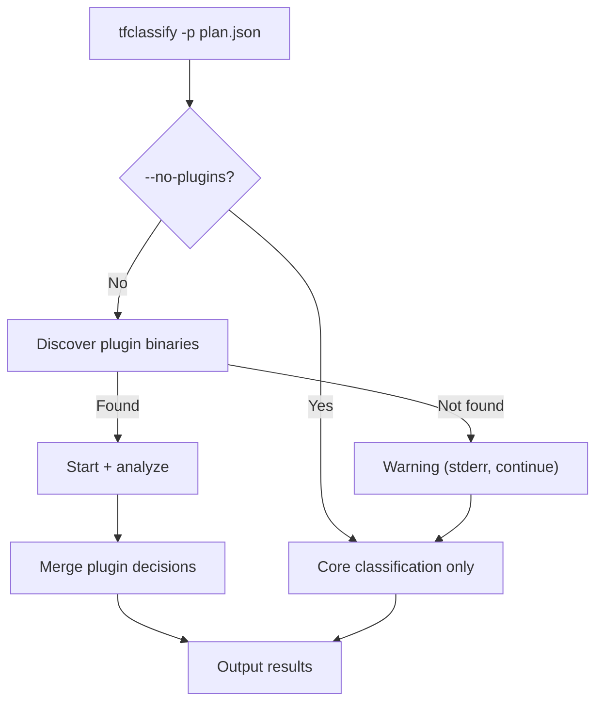
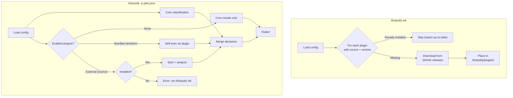
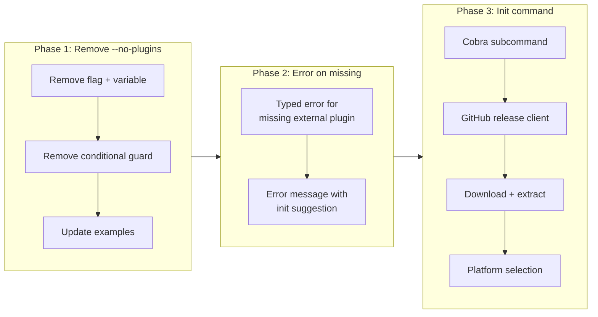

# Config-Driven Plugin Lifecycle and Init Command

## Change Summary

Remove the `--no-plugins` CLI flag and introduce a `tfclassify init` subcommand for plugin installation. Plugin enablement is controlled exclusively through `.tfclassify.hcl` (`enabled = true/false`). When an enabled external plugin is not installed, tfclassify errors with a message directing the user to run `tfclassify init`. This aligns with TFLint's proven model where config is the single source of truth for plugin lifecycle.

## Motivation and Background

The current `--no-plugins` flag creates two sources of truth for plugin behavior: the config file says `enabled = true`, but the CLI can silently override it. This is problematic because:

1. **Config is the contract.** If a `.tfclassify.hcl` declares a plugin as enabled, other team members and CI pipelines expect it to run. A CLI flag that silently disables all plugins breaks this expectation without leaving any trace in the config.

2. **It hides misconfiguration.** If a plugin binary is missing or gRPC communication fails, `--no-plugins` lets users work around the problem instead of fixing it. The current code (`main.go:97-101`) already swallows discovery errors as warnings — adding `--no-plugins` on top makes it even easier to run without plugins and never notice.

3. **TFLint doesn't need it.** TFLint has no `--no-plugins` flag (confirmed via DeepWiki). Plugin control is entirely config-driven: `enabled = true/false` per plugin block. Plugin installation is handled by `tflint --init`, which reads `source` and `version` from config and downloads binaries from GitHub releases.

Additionally, there is no mechanism to install external plugins from their `source` declarations. CR-0006 listed "plugin auto-installation from source URLs" as out of scope. Users must manually download plugin binaries and place them in the correct directory. A `tfclassify init` command fills this gap.

## Change Drivers

* The `--no-plugins` flag contradicts config-as-single-source-of-truth — two mechanisms control the same behavior
* No plugin installation mechanism exists — users must manually place binaries
* TFLint's proven model (config + init) validates this approach for the Terraform ecosystem
* CR-0006 deferred plugin auto-installation — this CR addresses it

## Current State

### CLI Flags

`cmd/tfclassify/main.go:58` registers `--no-plugins`:

```go
rootCmd.Flags().BoolVar(&noPlugins, "no-plugins", false, "Disable plugin loading")
```

`main.go:88-112` uses it to skip all plugin loading:

```go
if !noPlugins {
    // ... plugin discovery, start, analysis
}
```

### Plugin Discovery

`pkg/plugin/discovery.go:46-73` discovers plugins by searching for binaries in local directories. There is no download/install mechanism. External plugins with a `source` field in config are discovered by binary name only — the `source` and `version` fields are unused at runtime.

### Plugin Config Schema

`pkg/config/config.go:17-23` already has the fields needed for init:

```go
type PluginConfig struct {
    Name    string            `hcl:"name,label"`
    Enabled bool              `hcl:"enabled"`
    Source  string            `hcl:"source,optional"`
    Version string            `hcl:"version,optional"`
    Config  *PluginBodyConfig `hcl:"config,block"`
}
```

The `Source` and `Version` fields exist but are never read by any code path.

### Current Flow



## Proposed Change

### Remove `--no-plugins`

Delete the flag. Plugin enablement is controlled by `enabled = true/false` in `.tfclassify.hcl`. To disable all plugins, set each to `enabled = false`. To disable plugins temporarily for a single run, use a config file without plugin blocks or override with `--config` pointing to a minimal config.

### Add `tfclassify init`

A new cobra subcommand that installs external plugins declared in config:

1. Load config (from `--config` flag or standard discovery)
2. For each plugin block with `source` and `version`:
   - Parse the source as a GitHub repository path (`github.com/org/repo`)
   - Check if the plugin binary already exists locally at the correct version
   - If missing, download the binary from GitHub releases
   - Place it in the plugin directory (`.tfclassify/plugins/` by default)
3. The bundled `terraform` plugin (no `source`) is skipped — it needs no installation
4. Report what was installed or already present

### Error on Missing Enabled Plugin

When `tfclassify` runs (not `init`) and an enabled external plugin is not found locally, it **MUST** exit with a clear error instead of silently continuing:

```
Error: plugin "azurerm" is enabled but not installed.
Run "tfclassify init" to install plugins declared in your configuration.
```

### Proposed Flow



## Requirements

### Functional Requirements

1. The `--no-plugins` CLI flag **MUST** be removed from `cmd/tfclassify/main.go`
2. The `noPlugins` variable and the `if !noPlugins` guard **MUST** be removed from the run function
3. tfclassify **MUST** always load plugins according to the config — there is no runtime override
4. A `tfclassify init` subcommand **MUST** be added to cobra
5. `tfclassify init` **MUST** read plugin blocks from the loaded config
6. `tfclassify init` **MUST** parse the `source` field as a GitHub repository path in the format `github.com/{owner}/{repo}`
7. `tfclassify init` **MUST** download plugin release archives from the repository's GitHub releases matching the `version` field
8. `tfclassify init` **MUST** extract the plugin binary from the downloaded archive and place it in the plugin directory
9. The default plugin installation directory **MUST** be `.tfclassify/plugins/` in the current working directory
10. `tfclassify init` **MUST** support the `TFCLASSIFY_PLUGIN_DIR` environment variable as an override for the installation directory
11. `tfclassify init` **MUST** skip plugins that have no `source` field (bundled plugins)
12. `tfclassify init` **MUST** skip plugins that are already installed at the correct version
13. `tfclassify init` **MUST** report to stdout which plugins were installed, which were already up-to-date, and which failed
14. When an enabled external plugin (with `source`) is not found locally during a normal run, tfclassify **MUST** exit with an error message including the plugin name and suggesting `tfclassify init`
15. When an enabled plugin without `source` (bundled) is not found, the existing bundled plugin discovery via `--act-as-bundled-plugin` **MUST** continue to work unchanged
16. The `--config` flag **MUST** work with `tfclassify init` to specify which config file to read plugin declarations from

### Non-Functional Requirements

1. `tfclassify init` **MUST** make unauthenticated GitHub API requests by default
2. `tfclassify init` **MUST** support the `GITHUB_TOKEN` environment variable for authenticated requests (to avoid rate limits)
3. Plugin downloads **MUST** use HTTPS
4. `tfclassify init` **MUST** select the correct binary for the current OS and architecture from the release assets

## Affected Components

* `cmd/tfclassify/main.go` — remove `--no-plugins` flag, remove `noPlugins` variable, remove conditional guard; add `init` subcommand
* `cmd/tfclassify/init.go` — new file implementing the `init` subcommand
* `pkg/plugin/discovery.go` — change missing-plugin behavior from returning error (caught as warning) to returning a typed error distinguishing "not installed" from "not found"
* `pkg/plugin/install.go` — new file implementing GitHub release download and extraction
* `pkg/plugin/loader.go` — remove the swallowed-warning pattern; propagate missing-plugin errors

## Scope Boundaries

### In Scope

* Removing `--no-plugins` CLI flag
* Adding `tfclassify init` subcommand
* Downloading plugin binaries from GitHub releases
* Platform-aware binary selection (OS + arch)
* Clear error messages for missing plugins
* `GITHUB_TOKEN` support for authenticated downloads

### Out of Scope ("Here, But Not Further")

* Plugin signature verification (PGP or keyless) — deferred to a future CR. TFLint supports this but it is not required for MVP.
* Plugin version constraint solving (e.g., `>= 0.1.0`) — only exact version matching for now
* Plugin lock file — deferred to a future CR
* Plugin auto-update or upgrade command — deferred to a future CR
* Private registry support (non-GitHub sources) — deferred to a future CR

## Alternative Approaches Considered

* **Keep `--no-plugins` alongside `init`**: Maintains backwards compatibility but preserves the two-source-of-truth problem. Users who pass `--no-plugins` in CI pipelines would never discover that their plugins are misconfigured.
* **Auto-install on first run (no separate `init`)**: Simpler UX but makes regular runs non-deterministic — the first run downloads from the internet, subsequent runs don't. CI pipelines need explicit control over when downloads happen. TFLint explicitly chose a separate `--init` step for this reason.
* **Replace `--no-plugins` with `--enable-plugin` / `--disable-plugin` per-plugin CLI flags**: More granular but still creates CLI-vs-config divergence. TFLint has `--enable-plugin` but not `--no-plugins`, and plugin enablement via CLI is meant for one-off use, not as a primary mechanism.

## Impact Assessment

### User Impact

* Users passing `--no-plugins` will need to remove the flag. If they were using it because a plugin was broken, the real fix is to set `enabled = false` in config or fix the plugin.
* Users with external plugins in config will need to run `tfclassify init` before their first run. This is a one-time step (or part of CI setup).
* The examples and documentation no longer need `--no-plugins` in run commands.

### Technical Impact

* Breaking change: `--no-plugins` flag is removed. Any CI pipeline or script using it will fail with "unknown flag". This is intentional — the flag should not have been needed.
* New dependency: HTTP client for GitHub API. Standard library `net/http` is sufficient.
* New subcommand: `init` is added to cobra. Does not affect the root command's behavior.

### Business Impact

Aligns with TFLint's UX conventions, reducing friction for users already familiar with the Terraform linting ecosystem.

## Implementation Approach

### Implementation Flow



### GitHub Release Asset Naming Convention

Following TFLint's convention, plugin release assets are expected to follow this naming pattern:

```
tfclassify-plugin-{name}_{version}_{os}_{arch}.zip
```

For example:
```
tfclassify-plugin-azurerm_0.1.0_linux_amd64.zip
tfclassify-plugin-azurerm_0.1.0_darwin_arm64.zip
```

The init command uses `runtime.GOOS` and `runtime.GOARCH` to select the correct asset.

### Init Subcommand Structure

```go
// cmd/tfclassify/init.go

var initCmd = &cobra.Command{
    Use:   "init",
    Short: "Install plugins declared in configuration",
    Long:  `Downloads and installs plugin binaries from their declared sources.`,
    RunE:  runInit,
}

func runInit(cmd *cobra.Command, args []string) error {
    cfg, err := config.Load(configPath)
    if err != nil {
        return err
    }
    return plugin.InstallPlugins(cfg, os.Stdout)
}
```

### Install Logic

```go
// pkg/plugin/install.go

func InstallPlugins(cfg *config.Config, w io.Writer) error {
    for _, p := range cfg.Plugins {
        if p.Source == "" {
            fmt.Fprintf(w, "  %s: bundled (skip)\n", p.Name)
            continue
        }
        if !p.Enabled {
            fmt.Fprintf(w, "  %s: disabled (skip)\n", p.Name)
            continue
        }
        if isInstalled(p.Name, p.Version) {
            fmt.Fprintf(w, "  %s: already installed (v%s)\n", p.Name, p.Version)
            continue
        }
        fmt.Fprintf(w, "  %s: installing v%s from %s...\n", p.Name, p.Version, p.Source)
        if err := downloadAndInstall(p); err != nil {
            return fmt.Errorf("failed to install plugin %q: %w", p.Name, err)
        }
        fmt.Fprintf(w, "  %s: installed\n", p.Name)
    }
    return nil
}
```

## Test Strategy

### Tests to Add

| Test File | Test Name | Description | Inputs | Expected Output |
|-----------|-----------|-------------|--------|-----------------|
| `pkg/plugin/discovery_test.go` | `TestDiscoverPlugins_MissingExternalErrors` | Missing external plugin returns typed error | Config with enabled external plugin, no binary present | `ErrPluginNotInstalled` with plugin name |
| `pkg/plugin/discovery_test.go` | `TestDiscoverPlugins_BundledAlwaysSucceeds` | Bundled plugin discovery unchanged | Config with `terraform` plugin, no source | Success with `IsBundled = true` |
| `pkg/plugin/discovery_test.go` | `TestDiscoverPlugins_DisabledSkipped` | Disabled plugins are not discovered | Config with `enabled = false` | Empty result, no error |
| `pkg/plugin/install_test.go` | `TestInstallPlugins_SkipsBundled` | Init skips plugins without source | Config with bundled terraform plugin | "bundled (skip)" message |
| `pkg/plugin/install_test.go` | `TestInstallPlugins_SkipsDisabled` | Init skips disabled plugins | Config with disabled external plugin | "disabled (skip)" message |
| `pkg/plugin/install_test.go` | `TestInstallPlugins_SkipsAlreadyInstalled` | Init skips plugins already present | Existing binary at correct version | "already installed" message |
| `pkg/plugin/install_test.go` | `TestInstallPlugins_DownloadsFromGitHub` | Init downloads and extracts plugin | Mock GitHub release server | Binary placed in plugin dir |
| `pkg/plugin/install_test.go` | `TestInstallPlugins_SelectsPlatform` | Correct OS/arch asset selected | Mock release with multiple assets | Correct asset URL requested |
| `cmd/tfclassify/init_test.go` | `TestInitCommand_LoadsConfig` | Init subcommand loads config | `--config` flag with valid config | Plugins processed from config |

### Tests to Modify

| Test File | Test Name | Current Behavior | New Behavior | Reason for Change |
|-----------|-----------|------------------|--------------|-------------------|
| `pkg/plugin/loader_test.go` | `TestNoPluginsFlag` | Tests that `--no-plugins` skips loading | Remove this test | Flag no longer exists |
| `pkg/plugin/discovery_test.go` | `TestDiscoverPlugins_NotFound` | Returns generic error | Returns `ErrPluginNotInstalled` | Error type distinguishes "not installed" from other failures |

### Tests to Remove

| Test File | Test Name | Reason for Removal |
|-----------|-----------|-------------------|
| `pkg/plugin/loader_test.go` | `TestNoPluginsFlag` | Tests removed `--no-plugins` functionality |

## Acceptance Criteria

### AC-1: --no-plugins flag is removed

```gherkin
Given a user runs tfclassify with the --no-plugins flag
When cobra parses the command line
Then it exits with an "unknown flag" error
```

### AC-2: Config controls plugin enablement

```gherkin
Given a .tfclassify.hcl with plugin "terraform" { enabled = false }
When tfclassify runs
Then the bundled terraform plugin is not loaded
  And no plugin decisions appear in the output
```

### AC-3: Missing external plugin produces clear error

```gherkin
Given a .tfclassify.hcl with plugin "azurerm" { enabled = true, source = "github.com/jokarl/tfclassify-plugin-azurerm", version = "0.1.0" }
  And no azurerm plugin binary is installed locally
When tfclassify runs
Then it exits with an error message containing "plugin \"azurerm\" is enabled but not installed"
  And the error message contains "tfclassify init"
```

### AC-4: Init installs external plugins

```gherkin
Given a .tfclassify.hcl with plugin "azurerm" { enabled = true, source = "github.com/jokarl/tfclassify-plugin-azurerm", version = "0.1.0" }
  And no azurerm plugin binary is installed locally
When tfclassify init is run
Then the plugin binary is downloaded from the GitHub release for version 0.1.0
  And the binary is placed in .tfclassify/plugins/tfclassify-plugin-azurerm
  And stdout reports the plugin was installed
```

### AC-5: Init skips bundled plugins

```gherkin
Given a .tfclassify.hcl with plugin "terraform" { enabled = true } (no source field)
When tfclassify init is run
Then the terraform plugin is skipped with a "bundled" message
  And no download is attempted
```

### AC-6: Init skips already-installed plugins

```gherkin
Given a .tfclassify.hcl with plugin "azurerm" { version = "0.1.0" }
  And the azurerm plugin binary is already installed at version 0.1.0
When tfclassify init is run
Then the azurerm plugin is skipped with an "already installed" message
  And no download is attempted
```

### AC-7: Init respects GITHUB_TOKEN

```gherkin
Given the GITHUB_TOKEN environment variable is set
When tfclassify init downloads a plugin from GitHub releases
Then the HTTP request includes an Authorization header with the token
```

### AC-8: Init selects correct platform binary

```gherkin
Given a GitHub release with assets for linux_amd64, linux_arm64, darwin_amd64, and darwin_arm64
When tfclassify init runs on darwin/arm64
Then it downloads the darwin_arm64 asset
```

## Quality Standards Compliance

### Build & Compilation

- [ ] Code compiles/builds without errors
- [ ] No new compiler warnings introduced

### Linting & Code Style

- [ ] All linter checks pass with zero warnings/errors
- [ ] Code follows project coding conventions

### Test Execution

- [ ] All existing tests pass after implementation (except removed `TestNoPluginsFlag`)
- [ ] All new tests pass
- [ ] Integration test covers init + run cycle

### Documentation

- [ ] Example run commands no longer include `--no-plugins`
- [ ] Init subcommand has `--help` documentation

### Code Review

- [ ] Changes submitted via pull request
- [ ] PR title follows Conventional Commits format
- [ ] Code review completed and approved

### Verification Commands

```bash
# Build
go build ./...

# Test
go test ./... -v

# Verify --no-plugins is rejected
./tfclassify --no-plugins -p plan.json 2>&1 | grep "unknown flag"

# Verify init subcommand exists
./tfclassify init --help

# Vet
go vet ./...
```

## Risks and Mitigation

### Risk 1: Breaking existing CI pipelines using --no-plugins

**Likelihood:** medium
**Impact:** low
**Mitigation:** This is a pre-1.0 project with no published releases. The flag was always a development convenience, not a stable API. The error message from cobra ("unknown flag") is clear and actionable.

### Risk 2: GitHub API rate limiting during init

**Likelihood:** medium
**Impact:** medium
**Mitigation:** Support `GITHUB_TOKEN` environment variable for authenticated requests (5000 req/hour vs 60 for unauthenticated). Document this in the init command help text.

### Risk 3: Plugin release asset naming varies across plugin authors

**Likelihood:** medium
**Impact:** medium
**Mitigation:** Define a strict naming convention (`tfclassify-plugin-{name}_{version}_{os}_{arch}.zip`) and document it in the plugin author guide. The init command validates the asset name pattern before downloading.

## Dependencies

* CR-0006 (gRPC protocol and plugin host) — plugin discovery and lifecycle infrastructure
* CR-0008 (simplify catch-all rules) — examples currently use `--no-plugins` which must be updated

## Decision Outcome

Chosen approach: "Remove --no-plugins, add init subcommand, error on missing plugins", because it follows TFLint's proven model, makes config the single source of truth, and provides a clear installation workflow instead of silently degrading when plugins are missing.

## Related Items

* Architecture decision: [ADR-0002](../adr/ADR-0002-grpc-plugin-architecture.md) — plugin architecture
* Related CR: [CR-0006](CR-0006-grpc-protocol-and-plugin-host.md) — plugin host infrastructure
* Related CR: [CR-0007](CR-0007-bundled-terraform-plugin.md) — bundled plugin (unaffected, needs no installation)
* Related CR: [CR-0008](CR-0008-simplify-catch-all-classification-rules.md) — examples that currently use `--no-plugins`

## More Information

### DeepWiki Validation: TFLint Plugin Installation

Validated via DeepWiki for `terraform-linters/tflint`:

* TFLint has no `--no-plugins` flag. Plugin enablement is entirely config-driven (`enabled = true/false`).
* `tflint --init` reads plugin blocks from `.tflint.hcl`, downloads binaries from GitHub releases, and stores them in `~/.tflint.d/plugins/` (or `TFLINT_PLUGIN_DIR`).
* The bundled `terraform` plugin is built into the TFLint binary and requires no installation.
* Plugin release assets follow the pattern `tflint-ruleset-{name}_{version}_{os}_{arch}.zip`.
* `GITHUB_TOKEN` is supported for authenticated API requests.
