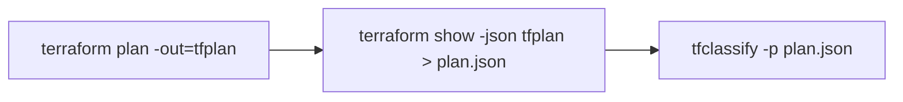
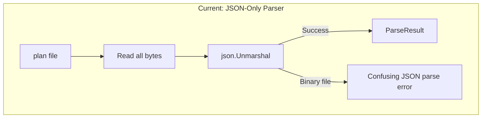
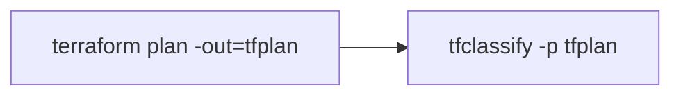
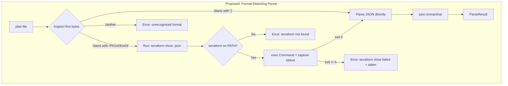
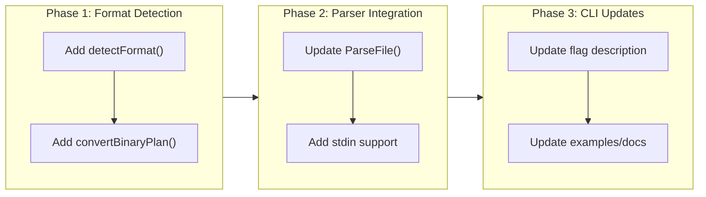

# Support Binary Terraform Plan Files

## Change Summary

Add automatic format detection to the plan parser so that tfclassify accepts both JSON (`terraform show -json` output) and binary Terraform plan files (`terraform plan -out=<file>` output). When a binary plan file is detected, tfclassify automatically invokes `terraform show -json` to convert it, removing the manual conversion step from the user's workflow.

## Motivation and Background

Today, tfclassify only accepts the JSON representation of a Terraform plan. Users must explicitly run `terraform show -json <planfile> > plan.json` before they can classify changes. This is an unnecessary friction point — every user already has the `terraform` binary available (they just ran `terraform plan`), and the conversion step is pure boilerplate.

Terraform's native output from `terraform plan -out=<file>` is a binary format (a zip archive containing Protocol Buffer-encoded data). This is the format most CI/CD pipelines produce and most users have on hand. Requiring JSON conversion means either:

1. An extra pipeline step that produces a temporary file, or
2. A shell pipe like `terraform show -json tfplan | tfclassify -p /dev/stdin`

Both add complexity that tfclassify should handle transparently.

## Change Drivers

* User experience: the most natural workflow is `terraform plan -out=tfplan && tfclassify -p tfplan` — one output, one input
* CI/CD simplicity: binary plan files are the standard artifact in pipelines; requiring JSON conversion adds a step
* Consistency with ecosystem: tools like Checkov, OPA/Conftest, and Infracost accept binary plan files and handle conversion internally
* The detection logic is trivial — binary plans are zip archives with a well-known `PK\x03\x04` header, while JSON starts with `{`

## Current State

The plan parser in `pkg/plan/parser.go` accepts only JSON input:

```go
func ParseFile(path string) (*ParseResult, error) {
    f, err := os.Open(path)
    if err != nil {
        return nil, fmt.Errorf("failed to open plan file: %w", err)
    }
    defer f.Close()
    return Parse(f)
}

func Parse(r io.Reader) (*ParseResult, error) {
    data, err := io.ReadAll(r)
    if err != nil {
        return nil, fmt.Errorf("failed to read plan data: %w", err)
    }

    var plan tfjson.Plan
    if err := json.Unmarshal(data, &plan); err != nil {
        return nil, fmt.Errorf("failed to parse plan JSON: %w", err)
    }
    // ...
}
```

When a user passes a binary plan file, the error is:

```
failed to parse plan: failed to parse plan JSON: invalid character 'P' looking for beginning of value
```

This is confusing — the user doesn't know they need to convert the file first.

### Current Workflow



### Current State Diagram



## Proposed Change

Add a format detection layer in `ParseFile` that inspects the first bytes of the input file:

1. **JSON detected** (first non-whitespace byte is `{`): parse directly, as today
2. **Binary plan detected** (zip header `PK\x03\x04`): invoke `terraform show -json <path>`, capture stdout, and parse the resulting JSON
3. **Neither**: return a descriptive error explaining the expected formats

### Proposed Workflow



### Proposed State Diagram



### Stdin Support

The `-p -` convention reads from stdin. Stdin input is always expected to be JSON (the output of `terraform show -json` piped in). Binary detection on stdin is not supported because:

1. Stdin is a stream — we can't pass a file path to `terraform show -json`
2. The natural stdin workflow is already `terraform show -json tfplan | tfclassify -p -`

### Terraform Binary Resolution

The `terraform` binary is resolved in this order:

1. `TERRAFORM_PATH` environment variable (if set)
2. `terraform` on `PATH` (via `exec.LookPath`)

This allows users with non-standard Terraform installations (e.g., `tofu`, renamed binaries, or vendored paths) to specify the exact binary.

## Requirements

### Functional Requirements

1. `ParseFile` **MUST** detect the input format by inspecting the first 4 bytes of the file
2. When the file starts with the zip magic number (`PK\x03\x04`), `ParseFile` **MUST** invoke `terraform show -json <path>` and parse the resulting JSON
3. When the file starts with `{` (ignoring leading whitespace and UTF-8 BOM), `ParseFile` **MUST** parse directly as JSON, identical to today's behavior
4. When the file matches neither format, `ParseFile` **MUST** return an error stating the file is not a recognized Terraform plan format
5. When `terraform` is not found on `PATH` (and `TERRAFORM_PATH` is not set), `ParseFile` **MUST** return an error message that includes: the fact that a binary plan was detected, that `terraform` is required to convert it, and a suggestion to either install Terraform or convert manually with `terraform show -json`
6. When `terraform show -json` exits with a non-zero code, `ParseFile` **MUST** return an error that includes the stderr output from the command
7. The `TERRAFORM_PATH` environment variable **MUST** override the default `terraform` binary lookup when set
8. When `-p -` is used (stdin), the parser **MUST** treat the input as JSON without format detection
9. The `--plan` flag description **MUST** be updated to indicate both JSON and binary formats are accepted

### Non-Functional Requirements

1. The format detection **MUST** read at most 4 bytes for the initial check — no buffering the entire file for detection
2. The `terraform show -json` invocation **MUST** have a configurable timeout (default: 30 seconds) to prevent hanging on malformed files
3. The error messages for binary plan detection **MUST** be actionable — they **MUST** tell the user exactly what to do next

## Affected Components

* `pkg/plan/parser.go` — add format detection to `ParseFile`, update `Parse` to accept stdin mode
* `pkg/plan/binary.go` (new) — binary plan detection logic and `terraform show -json` execution
* `pkg/plan/binary_test.go` (new) — tests for format detection and binary conversion
* `cmd/tfclassify/main.go` — update `--plan` flag description, add `-p -` stdin support

## Scope Boundaries

### In Scope

* Format detection based on file header bytes
* Automatic conversion of binary plans via `terraform show -json`
* `TERRAFORM_PATH` environment variable for custom terraform binary location
* Stdin support via `-p -` (JSON only)
* Clear error messages for all failure modes

### Out of Scope ("Here, But Not Further")

* Parsing the binary plan format directly (private, unstable, version-coupled) — we always delegate to `terraform show -json`
* OpenTofu compatibility — while `tofu show -json` produces the same output, explicit `tofu` support is deferred (users can set `TERRAFORM_PATH=tofu` as a workaround)
* Caching converted JSON — the conversion is fast enough that caching adds complexity without benefit
* Reading plan files from remote URLs or cloud storage — file path and stdin are the only input methods

## Alternative Approaches Considered

* **Parse the binary format directly using `hashicorp/terraform/internal/planfile`**: Not viable — the `internal/planfile` package is internal to the Terraform module and not importable. The binary format is private, version-coupled, and uses Protocol Buffers with no stability guarantee.
* **Require JSON only and document the conversion step**: This is the current state. It works but adds friction to every workflow. Since the detection and conversion logic is minimal (~50 lines), the UX improvement justifies the change.
* **Accept only stdin (piped JSON)**: Forces users into a pipe workflow (`terraform show -json | tfclassify -p -`). This is less ergonomic than accepting the binary file directly, especially in CI/CD where plan files are stored as artifacts between pipeline stages.
* **Use `go-terraform` or similar wrapper library**: Adds a dependency for something achievable with `exec.Command` and 4 bytes of header inspection. Over-engineering for this use case.

## Impact Assessment

### User Impact

Positive. Users can pass binary plan files directly without manual conversion. The JSON workflow continues to work identically. The only new requirement is that `terraform` must be on `PATH` when using binary plans — which is always true in practice (the user just ran `terraform plan`).

### Technical Impact

Minimal. The change adds a format detection layer before the existing JSON parser. The parser's `Parse(io.Reader)` function is unchanged. A new `binary.go` file (~80 lines) handles detection and conversion. No dependencies added — `os/exec` is in the standard library.

### Business Impact

Reduces onboarding friction. New users can point tfclassify at their existing plan files without learning about the JSON conversion step first.

## Implementation Approach

### Implementation Flow



### Phase 1: Format Detection (`pkg/plan/binary.go`)

```go
package plan

import (
    "bytes"
    "context"
    "fmt"
    "os"
    "os/exec"
    "time"
)

// planFormat represents the detected format of a plan file.
type planFormat int

const (
    formatJSON   planFormat = iota
    formatBinary
    formatUnknown
)

// zipMagic is the first 4 bytes of a zip archive (which is what Terraform binary plans are).
var zipMagic = []byte{0x50, 0x4B, 0x03, 0x04} // "PK\x03\x04"

// detectFormat inspects the first bytes of a file to determine its format.
func detectFormat(path string) (planFormat, error) {
    f, err := os.Open(path)
    if err != nil {
        return formatUnknown, err
    }
    defer f.Close()

    header := make([]byte, 4)
    n, err := f.Read(header)
    if err != nil || n < 1 {
        return formatUnknown, fmt.Errorf("failed to read plan file header: %w", err)
    }

    // Skip BOM and whitespace for JSON detection
    trimmed := bytes.TrimLeft(header[:n], "\xef\xbb\xbf \t\n\r")
    if len(trimmed) > 0 && trimmed[0] == '{' {
        return formatJSON, nil
    }

    if n >= 4 && bytes.Equal(header[:4], zipMagic) {
        return formatBinary, nil
    }

    return formatUnknown, nil
}

// convertBinaryPlan runs `terraform show -json <path>` and returns the JSON bytes.
func convertBinaryPlan(path string) ([]byte, error) {
    terraformBin := os.Getenv("TERRAFORM_PATH")
    if terraformBin == "" {
        var err error
        terraformBin, err = exec.LookPath("terraform")
        if err != nil {
            return nil, fmt.Errorf(
                "binary Terraform plan detected but 'terraform' is not on PATH; "+
                "install Terraform or set TERRAFORM_PATH, "+
                "or convert manually: terraform show -json %s", path)
        }
    }

    ctx, cancel := context.WithTimeout(context.Background(), 30*time.Second)
    defer cancel()

    cmd := exec.CommandContext(ctx, terraformBin, "show", "-json", path)
    var stdout, stderr bytes.Buffer
    cmd.Stdout = &stdout
    cmd.Stderr = &stderr

    if err := cmd.Run(); err != nil {
        return nil, fmt.Errorf("terraform show -json failed: %w\nstderr: %s", err, stderr.String())
    }

    return stdout.Bytes(), nil
}
```

### Phase 2: Parser Integration

Update `ParseFile` to use format detection:

```go
func ParseFile(path string) (*ParseResult, error) {
    if path == "-" {
        return Parse(os.Stdin)
    }

    format, err := detectFormat(path)
    if err != nil {
        return nil, fmt.Errorf("failed to open plan file: %w", err)
    }

    switch format {
    case formatJSON:
        f, err := os.Open(path)
        if err != nil {
            return nil, fmt.Errorf("failed to open plan file: %w", err)
        }
        defer f.Close()
        return Parse(f)

    case formatBinary:
        data, err := convertBinaryPlan(path)
        if err != nil {
            return nil, err
        }
        return Parse(bytes.NewReader(data))

    default:
        return nil, fmt.Errorf(
            "unrecognized plan file format; expected JSON (from 'terraform show -json') "+
            "or binary plan (from 'terraform plan -out=')")
    }
}
```

### Phase 3: CLI Updates

Update the flag description in `cmd/tfclassify/main.go`:

```go
rootCmd.Flags().StringVarP(&planPath, "plan", "p", "",
    "Path to Terraform plan file (JSON or binary); use '-' for stdin")
```

## Test Strategy

### Tests to Add

| Test File | Test Name | Description | Inputs | Expected Output |
|-----------|-----------|-------------|--------|-----------------|
| `pkg/plan/binary_test.go` | `TestDetectFormat_JSON` | Detects JSON format from file starting with `{` | Temp file with `{"format_version":"1.2"}` | `formatJSON` |
| `pkg/plan/binary_test.go` | `TestDetectFormat_JSONWithBOM` | Detects JSON with UTF-8 BOM prefix | Temp file with BOM + `{...}` | `formatJSON` |
| `pkg/plan/binary_test.go` | `TestDetectFormat_JSONWithWhitespace` | Detects JSON with leading whitespace | Temp file with `  \n{...}` | `formatJSON` |
| `pkg/plan/binary_test.go` | `TestDetectFormat_Binary` | Detects binary format from zip header | Temp file with `PK\x03\x04` prefix | `formatBinary` |
| `pkg/plan/binary_test.go` | `TestDetectFormat_Unknown` | Returns unknown for unrecognized format | Temp file with `XXXX` content | `formatUnknown` |
| `pkg/plan/binary_test.go` | `TestDetectFormat_EmptyFile` | Handles empty file gracefully | Empty temp file | Error |
| `pkg/plan/binary_test.go` | `TestConvertBinaryPlan_TerraformNotFound` | Error when terraform is not on PATH | Non-existent `TERRAFORM_PATH` | Error mentioning `terraform` not found |
| `pkg/plan/binary_test.go` | `TestConvertBinaryPlan_TerraformPathOverride` | Uses `TERRAFORM_PATH` env var | `TERRAFORM_PATH` set to mock | Mock binary invoked |
| `pkg/plan/parser_test.go` | `TestParseFile_Stdin` | Parses JSON from stdin via `-` path | `-` with JSON on stdin | Valid `ParseResult` |

### Tests to Modify

| Test File | Test Name | Current Behavior | New Behavior | Reason for Change |
|-----------|-----------|------------------|--------------|-------------------|
| `pkg/plan/parser_test.go` | `TestParseFile` | Tests JSON file parsing | Same behavior, but now goes through format detection | `ParseFile` internals changed; verify JSON path still works |

### Tests to Remove

Not applicable — no tests become obsolete.

## Acceptance Criteria

### AC-1: JSON plan files continue to work identically

```gherkin
Given a JSON plan file produced by `terraform show -json`
When tfclassify is run with `-p plan.json`
Then the classification results are identical to the current behavior
  And no `terraform` binary invocation occurs
```

### AC-2: Binary plan files are automatically converted

```gherkin
Given a binary plan file produced by `terraform plan -out=tfplan`
  And `terraform` is available on PATH
When tfclassify is run with `-p tfplan`
Then tfclassify detects the binary format from the zip header
  And invokes `terraform show -json tfplan`
  And parses the resulting JSON
  And produces correct classification results
```

### AC-3: Clear error when terraform is not available

```gherkin
Given a binary plan file
  And `terraform` is NOT on PATH
  And `TERRAFORM_PATH` is not set
When tfclassify is run with `-p tfplan`
Then the error message states that a binary plan was detected
  And the error message suggests installing Terraform or setting TERRAFORM_PATH
  And the error message includes the manual conversion command
```

### AC-4: TERRAFORM_PATH override

```gherkin
Given a binary plan file
  And TERRAFORM_PATH is set to `/usr/local/bin/tofu`
When tfclassify is run with `-p tfplan`
Then `/usr/local/bin/tofu show -json tfplan` is invoked instead of `terraform`
```

### AC-5: Stdin reads JSON without format detection

```gherkin
Given JSON plan data piped to stdin
When tfclassify is run with `-p -`
Then the JSON is parsed directly
  And no format detection occurs
  And no `terraform` binary invocation occurs
```

### AC-6: Unrecognized format produces helpful error

```gherkin
Given a file that is neither JSON nor a zip archive
When tfclassify is run with `-p <file>`
Then the error message explains the expected formats
  And mentions both `terraform show -json` (JSON) and `terraform plan -out=` (binary)
```

### AC-7: terraform show failure is reported clearly

```gherkin
Given a binary plan file that is corrupt or version-incompatible
  And `terraform` is on PATH
When tfclassify is run with `-p tfplan`
  And `terraform show -json` exits with a non-zero code
Then the error includes the stderr output from `terraform show`
  And the error provides enough context to diagnose the issue
```

## Quality Standards Compliance

### Build & Compilation

- [ ] Code compiles/builds without errors
- [ ] No new compiler warnings introduced

### Linting & Code Style

- [ ] All linter checks pass with zero warnings/errors
- [ ] Code follows project coding conventions

### Test Execution

- [ ] All existing tests pass after implementation
- [ ] All new tests pass
- [ ] Format detection tests cover JSON, binary, BOM, whitespace, unknown, and empty file cases

### Documentation

- [ ] `--plan` flag help text updated to mention both formats
- [ ] Example README files updated if they reference the JSON conversion step

### Code Review

- [ ] Changes submitted via pull request
- [ ] PR title follows Conventional Commits format
- [ ] Code review completed and approved

### Verification Commands

```bash
# Build
go build ./...

# Test
go test ./pkg/plan/... -v

# Vet
go vet ./...

# Manual verification with JSON (existing behavior)
go build -o tfclassify ./cmd/tfclassify
./tfclassify -p docs/examples/basic-classification/plan.json \
  -c docs/examples/basic-classification/.tfclassify.hcl --no-plugins -v

# Manual verification with binary plan (requires terraform + real infrastructure)
# terraform plan -out=tfplan
# ./tfclassify -p tfplan -c .tfclassify.hcl -v
```

## Risks and Mitigation

### Risk 1: `terraform show -json` output format differs across Terraform versions

**Likelihood:** low
**Impact:** medium
**Mitigation:** The JSON output format is already handled by version-aware parsing (`supportedFormatVersions` in `parser.go`). The `hashicorp/terraform-json` library provides stable types for the JSON schema. The binary-to-JSON conversion delegates format handling entirely to the user's installed Terraform version, which always produces a compatible JSON representation of its own plan.

### Risk 2: `terraform show -json` hangs on malformed input

**Likelihood:** low
**Impact:** medium
**Mitigation:** The `exec.CommandContext` invocation uses a 30-second timeout. If `terraform show` does not complete within this window, the context is cancelled and an error is returned.

### Risk 3: Security concern — executing `terraform` binary from user input

**Likelihood:** low
**Impact:** low
**Mitigation:** The `terraform` binary is resolved via `exec.LookPath` (same as any CLI tool invocation) or the explicit `TERRAFORM_PATH` env var. The plan file path is passed as a command argument, not interpolated into a shell string — no command injection risk. This is the same trust model as `terraform` itself.

## Dependencies

* None — `os/exec` is in Go's standard library; no new module dependencies required

## Decision Outcome

Chosen approach: "Auto-detect format and delegate binary conversion to `terraform show -json`", because the binary plan format is private and version-coupled (cannot parse directly), the detection logic is trivial (4-byte header check), and the user already has `terraform` installed in every scenario where they have a binary plan file.

## Related Items

* Change request: [CR-0002](CR-0002-terraform-plan-parsing.md) — established the JSON parsing approach that this CR extends
* Change request: [CR-0004](CR-0004-core-classification-engine-and-cli.md) — CLI entry point that will be updated
* Architecture decision: [ADR-0003](../adr/ADR-0003-provider-agnostic-core-with-deep-inspection-plugins.md) — defines the plan as the primary input
