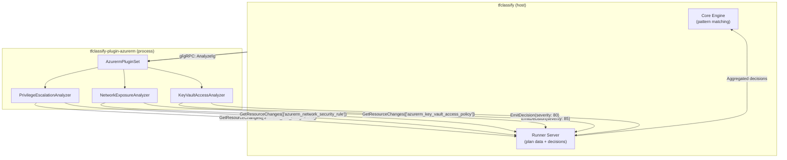
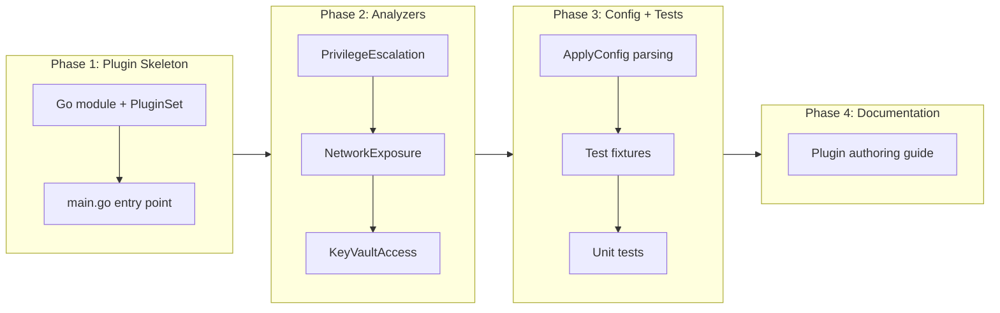

# Deep Inspection Plugin Example and Authoring Guide

## Change Summary

Create an example deep inspection plugin (`tfclassify-plugin-azurerm`) that demonstrates Layer 3 of the classification model from ADR-0003. This plugin inspects Azure resource field values — not just type patterns — to detect privilege escalation, overly permissive network rules, and key vault access changes. It serves as both a working reference implementation and a template for third-party plugin authors.

## Motivation and Background

ADR-0003 defines a three-layer classification model:

1. **Layer 1 (Core):** Config-driven pattern matching on resource types and actions
2. **Layer 2 (Bundled plugin):** Cross-provider analysis of Terraform-level concepts (deletions, sensitive attributes, replacements)
3. **Layer 3 (Deep inspection plugins):** Provider-specific analysis of resource field semantics

Layers 1 and 2 are implemented (CR-0004, CR-0007). Layer 3 has no implementation, no example, and no plugin authoring documentation. Without a concrete example, the plugin architecture remains theoretical — potential contributors have no template to follow and no way to validate that the SDK interfaces are sufficient for real-world deep inspection.

The `azurerm` plugin is a natural first example because the existing examples and test fixtures all use Azure resource types.

## Change Drivers

* ADR-0003 explicitly describes `tfclassify-plugin-azurerm` as a Layer 3 plugin with concrete analysis scenarios (privilege escalation via role changes, CIDR analysis in security rules)
* No plugin authoring guide or template exists — the SDK interfaces are the only documentation
* Validating the SDK/gRPC protocol with a real deep inspection plugin will surface API gaps before the protocol is finalized (CR-0006)
* The project's examples use Azure resource types exclusively, making `azurerm` the natural first deep plugin

## Current State

The SDK (`sdk/`) defines the interfaces a plugin must implement:

```go
// Analyzer inspects resource changes and emits classification decisions.
type Analyzer interface {
    Name() string
    Enabled() bool
    ResourcePatterns() []string
    Analyze(runner Runner) error
}

// Runner provides access to plan data and emits decisions.
type Runner interface {
    GetResourceChanges(patterns []string) ([]*ResourceChange, error)
    GetResourceChange(address string) (*ResourceChange, error)
    EmitDecision(analyzer Analyzer, change *ResourceChange, decision *Decision) error
}

// PluginSet defines a collection of analyzers provided by a plugin.
type PluginSet interface {
    PluginSetName() string
    PluginSetVersion() string
    AnalyzerNames() []string
}
```

The bundled terraform plugin (`plugins/terraform/`) demonstrates the patterns but only operates on Terraform-level concepts (actions, sensitive markers). It never inspects resource field values like `role_definition_name` or `source_address_prefix`.

### What's Missing

* No plugin reads `Before`/`After` field values from `ResourceChange`
* No plugin demonstrates provider-specific logic (e.g., "if role changes from Reader to Owner, escalate")
* No plugin authoring guide describes the development workflow
* No example shows how `config {}` blocks pass plugin-specific settings (e.g., privileged role names)

## Proposed Change

### Example Plugin: `tfclassify-plugin-azurerm`

A new Go module at `plugins/azurerm/` implementing three analyzers that inspect Azure resource field values:

| Analyzer | Resource Patterns | Logic | Example Trigger |
|----------|------------------|-------|----------------|
| `privilege-escalation` | `azurerm_role_assignment` | Compares `Before.role_definition_name` and `After.role_definition_name` against a configurable list of privileged roles | Role updated from "Reader" to "Owner" |
| `network-exposure` | `azurerm_network_security_rule` | Checks `source_address_prefix` for overly permissive values (`*`, `0.0.0.0/0`) on inbound allow rules | New rule allowing inbound from `*` |
| `key-vault-access` | `azurerm_key_vault_access_policy` | Detects additions or changes to key vault access policies granting destructive permissions (`delete`, `purge`) | Access policy granting purge on secrets |

### Plugin Configuration

Users configure the plugin in `.tfclassify.hcl`:

```hcl
plugin "azurerm" {
  enabled = true
  source  = "github.com/jokarl/tfclassify-plugin-azurerm"
  version = "0.1.0"

  config {
    # Roles considered privileged — escalation to/from these triggers a decision
    privileged_roles = ["Owner", "User Access Administrator", "Contributor"]

    # Source prefixes considered overly permissive in security rules
    permissive_sources = ["*", "0.0.0.0/0", "Internet"]

    # Key vault permissions considered destructive
    destructive_kv_permissions = ["delete", "purge"]
  }
}
```

The `config {}` block is sent to the plugin via `ApplyConfig` (CR-0006 req 7). The plugin parses it using HCL and populates its internal config struct.

### Proposed Architecture



### Plugin Authoring Guide

A new documentation page at `docs/plugin-authoring.md` covering:

1. Project structure (Go module, SDK dependency, `main.go` entry point)
2. Implementing `PluginSet`, `Analyzer` interfaces
3. Using `Runner` to query plan data and emit decisions
4. Parsing plugin `config {}` blocks via `ApplyConfig`
5. Testing analyzers with the SDK's `BuiltinPluginSet` test helper
6. Building and distributing the plugin binary
7. Release asset naming convention (from CR-0009)

## Requirements

### Functional Requirements

1. The `plugins/azurerm/` directory **MUST** contain a Go module (`go.mod`) that depends only on `github.com/jokarl/tfclassify/sdk`
2. The plugin **MUST** implement `PluginSet` with three analyzers: `privilege-escalation`, `network-exposure`, and `key-vault-access`
3. The `privilege-escalation` analyzer **MUST** compare `Before` and `After` values of `role_definition_name` on `azurerm_role_assignment` resources and emit a decision when a role changes to or from a privileged role
4. The `network-exposure` analyzer **MUST** inspect `source_address_prefix` on `azurerm_network_security_rule` resources and emit a decision when an inbound allow rule uses a permissive source
5. The `key-vault-access` analyzer **MUST** inspect permission fields on `azurerm_key_vault_access_policy` resources and emit a decision when destructive permissions are granted
6. All configurable values (privileged roles, permissive sources, destructive permissions) **MUST** be read from the plugin's `config {}` block via `ApplyConfig`, with sensible defaults when config is absent
7. Each analyzer **MUST** set a `Severity` value in its Decision: `privilege-escalation` = 90, `network-exposure` = 85, `key-vault-access` = 80
8. Each analyzer **MUST** set a descriptive `Reason` in its Decision explaining the specific finding (e.g., "role changed from Reader to Owner (privilege escalation)")
9. The plugin **MUST** include test fixtures (plan JSON snippets) for each analyzer
10. A plugin authoring guide **MUST** be created at `docs/plugin-authoring.md`

### Non-Functional Requirements

1. The plugin module **MUST** compile independently (without `go.work`) to validate the SDK's public API surface
2. The plugin **MUST** have unit tests for each analyzer with >80% coverage
3. The authoring guide **MUST** be self-contained — a reader with Go knowledge can build a plugin from scratch using only the guide

## Affected Components

* `plugins/azurerm/` (new) — plugin Go module
* `plugins/azurerm/main.go` (new) — plugin entry point using `sdk/plugin.Serve`
* `plugins/azurerm/plugin.go` (new) — `AzurermPluginSet` definition
* `plugins/azurerm/privilege.go` (new) — `PrivilegeEscalationAnalyzer`
* `plugins/azurerm/network.go` (new) — `NetworkExposureAnalyzer`
* `plugins/azurerm/keyvault.go` (new) — `KeyVaultAccessAnalyzer`
* `plugins/azurerm/go.mod` (new) — module definition
* `go.work` — add `./plugins/azurerm` to workspace
* `docs/plugin-authoring.md` (new) — plugin authoring guide
* `docs/examples/mixed-changes/plan.json` — extend with fields the azurerm plugin inspects (e.g., `role_definition_name`, `source_address_prefix`)

## Scope Boundaries

### In Scope

* Example azurerm plugin with three analyzers
* Plugin authoring documentation
* Test fixtures for each analyzer
* Go workspace integration

### Out of Scope ("Here, But Not Further")

* Publishing the azurerm plugin as a separate repository — it lives in the monorepo for now (per ADR-0001)
* AWS or GCP deep inspection plugins — deferred to community or future CRs
* Plugin SDK test helpers beyond what `BuiltinPluginSet` already provides
* CI/CD integration for building and releasing the plugin — deferred to when the plugin is extracted to its own repo

## Alternative Approaches Considered

* **Document-only approach (no working plugin):** A guide without working code is hard to validate. Plugin authors need to see patterns, not just descriptions. The working plugin also validates the SDK interfaces.
* **Minimal single-analyzer plugin:** A single analyzer would be simpler but wouldn't demonstrate how multiple analyzers coexist in a `PluginSet`, share config, and emit decisions independently.
* **AWS plugin instead of Azure:** The existing examples and test fixtures use Azure resource types. Using AWS would require new fixtures and parallel terminology. Azure keeps everything consistent.

## Impact Assessment

### User Impact

The azurerm plugin provides immediate value for Azure users who want field-level inspection beyond pattern matching. The authoring guide enables third-party plugin development.

### Technical Impact

Adds a new Go module to the workspace. Validates the SDK interfaces with a real consumer — if the interfaces are insufficient, the gaps are discovered here before external authors encounter them.

### Business Impact

Demonstrates the full three-layer classification model described in ADR-0003. Without this, Layer 3 is marketing — with it, the architecture is proven.

## Implementation Approach

### Implementation Flow



### Privilege Escalation Analyzer

```go
// plugins/azurerm/privilege.go

type PrivilegeEscalationAnalyzer struct {
    config *PluginConfig
}

func (a *PrivilegeEscalationAnalyzer) Name() string             { return "privilege-escalation" }
func (a *PrivilegeEscalationAnalyzer) Enabled() bool            { return a.config.PrivilegeEnabled }
func (a *PrivilegeEscalationAnalyzer) ResourcePatterns() []string {
    return []string{"azurerm_role_assignment"}
}

func (a *PrivilegeEscalationAnalyzer) Analyze(runner sdk.Runner) error {
    changes, err := runner.GetResourceChanges(a.ResourcePatterns())
    if err != nil {
        return err
    }

    privileged := toSet(a.config.PrivilegedRoles)

    for _, change := range changes {
        beforeRole := stringField(change.Before, "role_definition_name")
        afterRole := stringField(change.After, "role_definition_name")

        if beforeRole == afterRole {
            continue // No role change
        }

        escalation := !privileged[beforeRole] && privileged[afterRole]
        deescalation := privileged[beforeRole] && !privileged[afterRole]

        if escalation {
            runner.EmitDecision(a, change, &sdk.Decision{
                Reason:   fmt.Sprintf("role escalated from %q to %q", beforeRole, afterRole),
                Severity: 90,
                Metadata: map[string]interface{}{
                    "before_role": beforeRole,
                    "after_role":  afterRole,
                    "direction":   "escalation",
                },
            })
        } else if deescalation {
            runner.EmitDecision(a, change, &sdk.Decision{
                Reason:   fmt.Sprintf("role de-escalated from %q to %q", beforeRole, afterRole),
                Severity: 40,
                Metadata: map[string]interface{}{
                    "before_role": beforeRole,
                    "after_role":  afterRole,
                    "direction":   "de-escalation",
                },
            })
        }
    }
    return nil
}
```

Note: the `Decision.Classification` is left empty — this is a metadata-only augmentation (per CR-0006 req 13). The core engine's pattern-based classification decides the level; the plugin adds context about why the change is significant.

## Test Strategy

### Tests to Add

| Test File | Test Name | Description | Inputs | Expected Output |
|-----------|-----------|-------------|--------|-----------------|
| `plugins/azurerm/privilege_test.go` | `TestPrivilegeEscalation_ReaderToOwner` | Detects escalation to privileged role | Role change: Reader → Owner | Decision with severity 90, reason mentions escalation |
| `plugins/azurerm/privilege_test.go` | `TestPrivilegeEscalation_OwnerToReader` | Detects de-escalation from privileged role | Role change: Owner → Reader | Decision with severity 40, reason mentions de-escalation |
| `plugins/azurerm/privilege_test.go` | `TestPrivilegeEscalation_NoChange` | No decision when role unchanged | Role: Owner → Owner | No decision emitted |
| `plugins/azurerm/privilege_test.go` | `TestPrivilegeEscalation_NonPrivilegedChange` | No decision for non-privileged role changes | Role: Reader → Contributor (neither privileged) | No decision emitted |
| `plugins/azurerm/privilege_test.go` | `TestPrivilegeEscalation_CustomRoles` | Config overrides default privileged roles | Config: `privileged_roles = ["Custom Admin"]` | Only "Custom Admin" triggers |
| `plugins/azurerm/network_test.go` | `TestNetworkExposure_WildcardSource` | Detects `*` source prefix | Rule: inbound, allow, source `*` | Decision with severity 85 |
| `plugins/azurerm/network_test.go` | `TestNetworkExposure_CIDRSource` | No decision for specific CIDR | Rule: inbound, allow, source `10.0.0.0/8` | No decision emitted |
| `plugins/azurerm/network_test.go` | `TestNetworkExposure_OutboundIgnored` | Ignores outbound rules | Rule: outbound, allow, source `*` | No decision emitted |
| `plugins/azurerm/keyvault_test.go` | `TestKeyVaultAccess_PurgePermission` | Detects destructive permission grant | Policy with `purge` on secrets | Decision with severity 80 |
| `plugins/azurerm/keyvault_test.go` | `TestKeyVaultAccess_ReadOnly` | No decision for read-only access | Policy with `get`, `list` on secrets | No decision emitted |
| `plugins/azurerm/plugin_test.go` | `TestApplyConfig_ParsesHCL` | Plugin config parsed from HCL bytes | HCL with `privileged_roles = [...]` | Config struct populated |
| `plugins/azurerm/plugin_test.go` | `TestApplyConfig_Defaults` | Sensible defaults when config absent | Empty config | Default privileged roles, permissive sources |

### Tests to Modify

Not applicable — this is a new module.

### Tests to Remove

Not applicable.

## Acceptance Criteria

### AC-1: Plugin compiles independently

```gherkin
Given the plugins/azurerm/ directory with its own go.mod
When `go build ./...` is run from plugins/azurerm/ (without go.work)
Then the plugin binary compiles successfully
  And the only external dependency is github.com/jokarl/tfclassify/sdk
```

### AC-2: Privilege escalation detected

```gherkin
Given a plan with an azurerm_role_assignment changing role_definition_name from "Reader" to "Owner"
  And the plugin config includes "Owner" in privileged_roles
When the privilege-escalation analyzer runs
Then it emits a Decision with Severity 90
  And the Reason mentions "escalated from Reader to Owner"
```

### AC-3: Network exposure detected

```gherkin
Given a plan with an azurerm_network_security_rule
  And direction is "Inbound", access is "Allow", source_address_prefix is "*"
When the network-exposure analyzer runs
Then it emits a Decision with Severity 85
  And the Reason mentions overly permissive source
```

### AC-4: Key vault destructive access detected

```gherkin
Given a plan with an azurerm_key_vault_access_policy granting "purge" on secret_permissions
When the key-vault-access analyzer runs
Then it emits a Decision with Severity 80
  And the Reason mentions destructive key vault permission
```

### AC-5: Config customizes behavior

```gherkin
Given a plugin config with privileged_roles = ["Custom Admin"]
When the privilege-escalation analyzer evaluates a role change to "Owner"
Then no decision is emitted (Owner is not in the custom privileged list)
  And a role change to "Custom Admin" does emit a decision
```

### AC-6: Plugin authoring guide is complete

```gherkin
Given the docs/plugin-authoring.md file
When a developer with Go knowledge reads it
Then it describes the full workflow: project setup, SDK dependency, PluginSet implementation, Analyzer implementation, Runner usage, config parsing, testing, building, and distribution
  And it references the azurerm plugin as a working example
```

## Quality Standards Compliance

### Build & Compilation

- [ ] Plugin compiles without errors (both with and without go.work)
- [ ] No new compiler warnings introduced

### Linting & Code Style

- [ ] All linter checks pass with zero warnings/errors
- [ ] Code follows project coding conventions

### Test Execution

- [ ] All plugin tests pass
- [ ] Each analyzer has tests covering positive, negative, and config-override cases

### Documentation

- [ ] Plugin authoring guide created at `docs/plugin-authoring.md`
- [ ] Plugin code has GoDoc comments on exported types and methods

### Code Review

- [ ] Changes submitted via pull request
- [ ] PR title follows Conventional Commits format
- [ ] Code review completed and approved

### Verification Commands

```bash
# Build from workspace root
go build ./...

# Build plugin independently (without go.work)
cd plugins/azurerm && go build ./...

# Test plugin
go test ./plugins/azurerm/... -v

# Vet
go vet ./...
```

## Risks and Mitigation

### Risk 1: SDK interfaces insufficient for deep inspection

**Likelihood:** medium
**Impact:** high
**Mitigation:** This is precisely why the example plugin is valuable — it surfaces SDK gaps before external authors encounter them. If the `ResourceChange` type lacks needed fields (e.g., nested block structure), the SDK can be updated before the gRPC protocol is finalized in CR-0006.

### Risk 2: Azure resource schema changes between Terraform provider versions

**Likelihood:** medium
**Impact:** low
**Mitigation:** The analyzers inspect well-established fields (`role_definition_name`, `source_address_prefix`) that are stable across provider versions. The plugin does not hard-code provider version assumptions.

### Risk 3: Authoring guide becomes outdated as SDK evolves

**Likelihood:** medium
**Impact:** medium
**Mitigation:** The guide references the working azurerm plugin as the canonical example. As the SDK evolves, the plugin is updated alongside it (both live in the monorepo), keeping the guide's examples valid.

## Dependencies

* CR-0005 (plugin SDK) — provides the interfaces the plugin implements
* CR-0006 (gRPC protocol) — provides the `ApplyConfig` mechanism for plugin configuration; must be at least partially implemented for the plugin to receive config
* CR-0007 (bundled plugin) — provides the pattern this plugin follows

## Decision Outcome

Chosen approach: "Working azurerm example plugin with authoring guide", because a running example validates the SDK interfaces, demonstrates the full three-layer model, and gives plugin authors a concrete template to follow. Documentation without working code is insufficient for an interface-heavy architecture.

## Related Items

* Architecture decision: [ADR-0002](../adr/ADR-0002-grpc-plugin-architecture.md) — plugin architecture
* Architecture decision: [ADR-0003](../adr/ADR-0003-provider-agnostic-core-with-deep-inspection-plugins.md) — three-layer classification model (Layer 3)
* Change request: [CR-0005](CR-0005-plugin-sdk.md) — SDK interfaces
* Change request: [CR-0006](CR-0006-grpc-protocol-and-plugin-host.md) — gRPC protocol and ApplyConfig
* Change request: [CR-0007](CR-0007-bundled-terraform-plugin.md) — bundled plugin pattern
* Change request: [CR-0009](CR-0009-config-driven-plugin-lifecycle.md) — plugin installation and distribution
