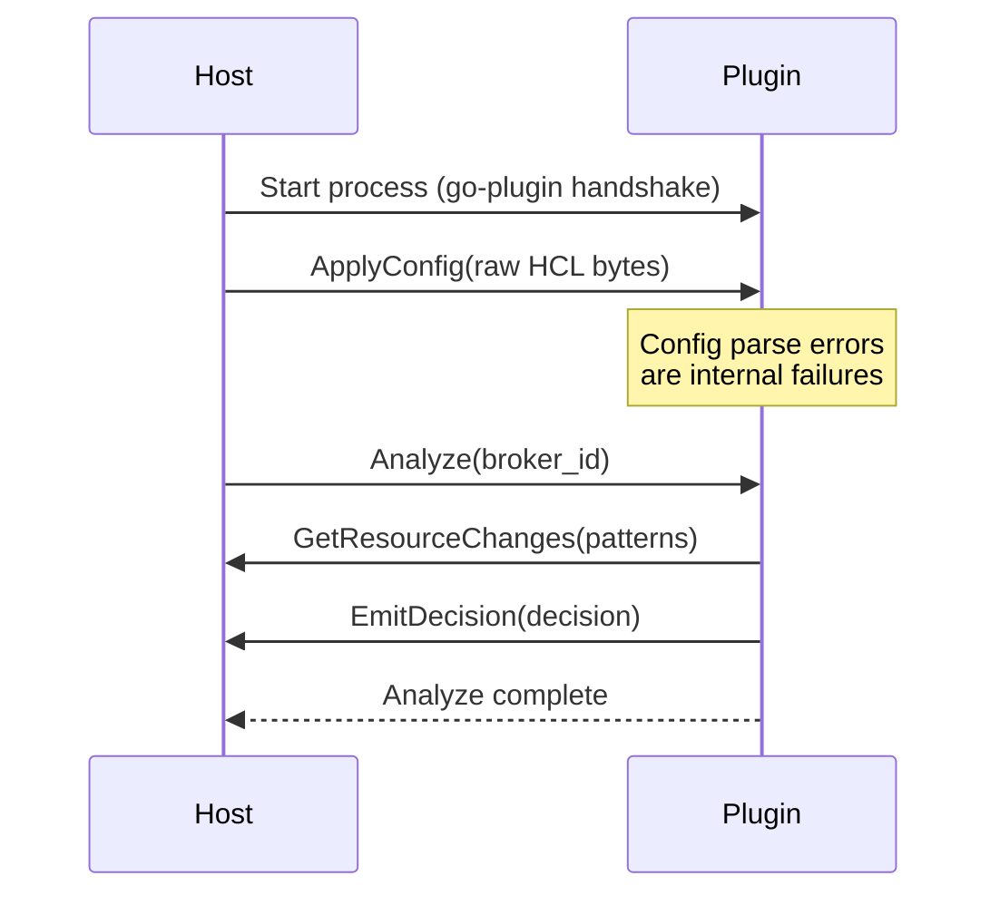
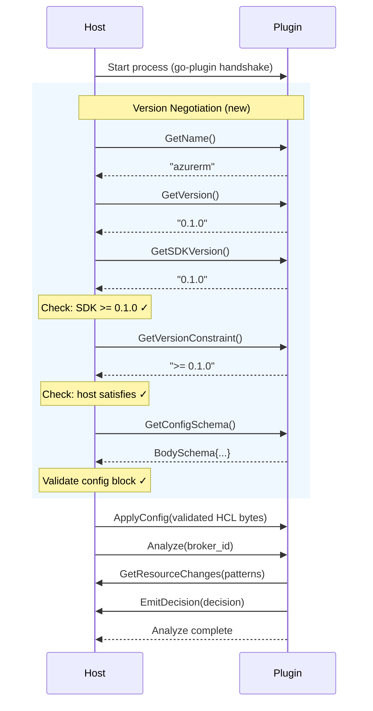
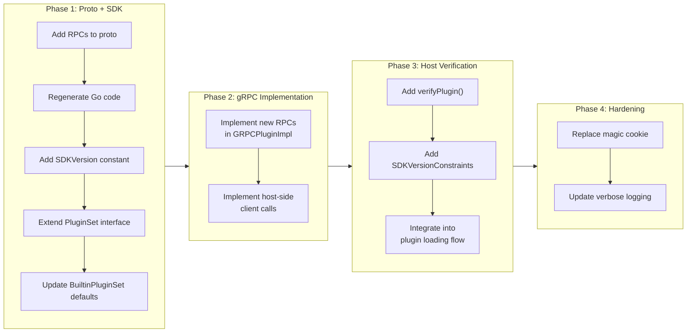

# Plugin Version Negotiation and Introspection

## Change Summary

Add SDK version negotiation, host version constraint checking, plugin identity verification, and config schema validation to the plugin protocol. This implements the bidirectional version constraints decided in ADR-0005, adding five new RPCs to `PluginService` and corresponding SDK interface methods. The host rejects incompatible plugins with clear error messages before any analysis runs.

## Motivation and Background

A thorough comparison of tfclassify's plugin architecture against TFLint's reveals that our protocol lacks version negotiation. TFLint has a mature system where:

1. The host queries the plugin's SDK version (`GetSDKVersion`) and rejects plugins built against incompatible SDK versions
2. Plugins declare which TFLint versions they support (`GetVersionConstraint`), and the host rejects itself if it's too old
3. The host queries the plugin's config schema (`GetConfigSchema`) and validates the user's config block before sending it
4. The host verifies plugin identity (`GetName`) and logs version (`GetVersion`) for debugging

Our current protocol has only `ProtocolVersion: 1` in the go-plugin `HandshakeConfig` and a guessable magic cookie value. When an incompatible plugin connects, the failure is an opaque gRPC error like "rpc error: code = Unimplemented" — not "plugin X requires SDK >= 0.2.0".

Additionally, our magic cookie value `"tfclassify"` is easily guessable. TFLint uses a 60-character random string to prevent accidental execution of non-plugin binaries.

## Change Drivers

* ADR-0005 (proposed): Decides on bidirectional version constraints as the versioning strategy
* Incompatible plugins produce confusing gRPC errors instead of clear version mismatch messages
* No way to validate plugin config before sending it — config errors surface as internal plugin failures
* No plugin identity or version in verbose output — hard to debug multi-plugin setups
* TFLint comparison: our PluginService has 2 RPCs vs TFLint's 9 — key introspection RPCs are missing

## Current State

### Proto Definition (`proto/tfclassify.proto`)

The `PluginService` has only two RPCs:

```protobuf
service PluginService {
    rpc ApplyConfig(ApplyConfigRequest) returns (ApplyConfigResponse);
    rpc Analyze(AnalyzeRequest) returns (AnalyzeResponse);
}
```

### SDK Interfaces (`sdk/`)

`PluginSet` has three methods, none related to versioning:

```go
type PluginSet interface {
    PluginSetName() string
    PluginSetVersion() string
    AnalyzerNames() []string
}
```

### HandshakeConfig (`sdk/plugin/serve.go`)

```go
var HandshakeConfig = goplugin.HandshakeConfig{
    ProtocolVersion:  1,
    MagicCookieKey:   "TFCLASSIFY_PLUGIN",
    MagicCookieValue: "tfclassify",  // Guessable
}
```

### Host Plugin Loading (`pkg/plugin/loader.go`)

The host starts plugins and immediately calls `RunAnalysis`. There is no version check, identity verification, or config validation step between startup and analysis.

### Current Flow



## Proposed Change

### New PluginService RPCs

Add five RPCs to `PluginService` that the host calls before `ApplyConfig`:

```protobuf
service PluginService {
    // Introspection — called before configuration
    rpc GetName(GetNameRequest) returns (GetNameResponse);
    rpc GetVersion(GetVersionRequest) returns (GetVersionResponse);
    rpc GetSDKVersion(GetSDKVersionRequest) returns (GetSDKVersionResponse);
    rpc GetVersionConstraint(GetVersionConstraintRequest) returns (GetVersionConstraintResponse);
    rpc GetConfigSchema(GetConfigSchemaRequest) returns (GetConfigSchemaResponse);

    // Configuration and analysis — existing RPCs
    rpc ApplyConfig(ApplyConfigRequest) returns (ApplyConfigResponse);
    rpc Analyze(AnalyzeRequest) returns (AnalyzeResponse);
}
```

### SDK Version Constant

```go
// sdk/version.go
package sdk

// SDKVersion is the version of the SDK embedded in every plugin binary.
// The host checks this against its SDKVersionConstraints.
const SDKVersion = "0.1.0"
```

### SDK Interface Additions

```go
// sdk/pluginset.go — extended interface
type PluginSet interface {
    PluginSetName() string
    PluginSetVersion() string
    AnalyzerNames() []string

    // New methods for version negotiation
    VersionConstraint() string           // Semver constraint on tfclassify version, e.g., ">= 0.1.0"
    ConfigSchema() *hcl.BodySchema       // Config schema for validation, or nil if no config
}
```

`BuiltinPluginSet` provides defaults: empty `VersionConstraint()` (any version) and nil `ConfigSchema()` (no validation).

### Host-Side Version Checking

```go
// pkg/plugin/loader.go — new host constant
const SDKVersionConstraints = ">= 0.1.0"

// Version checking during plugin startup:
func (h *Host) verifyPlugin(client PluginClient, pluginCfg *config.PluginConfig) error {
    // 1. Verify identity
    name, _ := client.GetName()
    if name != pluginCfg.Name {
        return fmt.Errorf("plugin binary reports name %q, expected %q", name, pluginCfg.Name)
    }

    // 2. Check SDK version
    sdkVersion, _ := client.GetSDKVersion()
    if !satisfies(sdkVersion, SDKVersionConstraints) {
        return fmt.Errorf("plugin %q uses SDK %s, but tfclassify requires SDK %s",
            name, sdkVersion, SDKVersionConstraints)
    }

    // 3. Check host version constraint
    constraint, _ := client.GetVersionConstraint()
    if constraint != "" && !satisfies(Version, constraint) {
        return fmt.Errorf("plugin %q requires tfclassify %s, but this is %s",
            name, constraint, Version)
    }

    // 4. Validate config schema
    schema, _ := client.GetConfigSchema()
    if schema != nil && pluginCfg.Config != nil {
        if diags := validateConfig(pluginCfg.Config.Remain, schema); diags.HasErrors() {
            return fmt.Errorf("invalid config for plugin %q: %s", name, diags.Error())
        }
    }

    return nil
}
```

### Hardened HandshakeConfig

```go
var HandshakeConfig = goplugin.HandshakeConfig{
    ProtocolVersion:  1,
    MagicCookieKey:   "TFCLASSIFY_PLUGIN",
    MagicCookieValue: "8kP2mXqR7vNwJ4tL9bYcF6gHsE3dA5uZoK1iWxCjT0lDfBnMrQpSaUhVeOyGI",
}
```

### Proposed Flow



## Requirements

### Functional Requirements

1. The proto file **MUST** define five new RPCs on `PluginService`: `GetName`, `GetVersion`, `GetSDKVersion`, `GetVersionConstraint`, `GetConfigSchema`
2. The SDK **MUST** export an `SDKVersion` constant (string, semver format) that is embedded in every plugin binary
3. The `PluginSet` interface **MUST** include `VersionConstraint() string` and `ConfigSchema() *hcl.BodySchema` methods
4. `BuiltinPluginSet` **MUST** provide default implementations: empty `VersionConstraint()` and nil `ConfigSchema()`
5. The host **MUST** call `GetName` after plugin startup and verify the returned name matches the config's plugin name
6. The host **MUST** call `GetSDKVersion` and reject the plugin if its SDK version does not satisfy `SDKVersionConstraints`
7. The host **MUST** define `SDKVersionConstraints` as a semver constraint string (e.g., `">= 0.1.0"`)
8. The host **MUST** call `GetVersionConstraint` and reject itself if the host version does not satisfy the plugin's constraint
9. The host **MUST** call `GetConfigSchema` and validate the user's `config {}` block against the returned schema before calling `ApplyConfig`
10. When config schema validation fails, the error **MUST** include the plugin name and the HCL diagnostic message (with file/line if available)
11. The host **MUST** call `GetVersion` and log the plugin name and version in verbose mode
12. All version comparisons **MUST** use `hashicorp/go-version` for semver constraint parsing
13. The `HandshakeConfig.MagicCookieValue` **MUST** be changed from `"tfclassify"` to a cryptographically random string of at least 60 characters
14. The `ProtocolVersion` **MUST** remain at `1` — the new RPCs are additive and do not break the existing wire format

### Non-Functional Requirements

1. Version negotiation **MUST** complete before `ApplyConfig` is called — no analysis runs if version checks fail
2. Error messages for version mismatches **MUST** include: the plugin name, the version found, the version required, and a suggestion for how to fix it
3. The five introspection RPCs **MUST** be lightweight (no disk I/O, no computation) — they return constants

## Affected Components

* `proto/tfclassify.proto` — add 5 RPCs and their message types to `PluginService`
* `proto/gen/` — regenerated Go code from protobuf
* `sdk/version.go` (new) — `SDKVersion` constant
* `sdk/pluginset.go` — add `VersionConstraint()` and `ConfigSchema()` to interface
* `sdk/builtin.go` — add default implementations to `BuiltinPluginSet`
* `sdk/plugin/serve.go` — update `HandshakeConfig.MagicCookieValue`; implement new RPCs on `GRPCPluginImpl`
* `pkg/plugin/loader.go` — add `SDKVersionConstraints` constant; add `verifyPlugin()` step before `ApplyConfig`
* `go.mod` — add `hashicorp/go-version` dependency

## Scope Boundaries

### In Scope

* Five new introspection RPCs on `PluginService`
* SDK `SDKVersion` constant and `PluginSet` interface additions
* Host-side version checking and config schema validation
* Hardened magic cookie value
* `hashicorp/go-version` dependency for semver constraint parsing

### Out of Scope ("Here, But Not Further")

* `ApplyGlobalConfig` RPC — TFLint uses this for `disabled_by_default` and fix mode, which don't apply to tfclassify's classification model. Deferred unless a concrete need arises.
* `GetAnalyzerNames` RPC — analyzer names are already available via `PluginSet.AnalyzerNames()` in-process. Exposing them over gRPC would only be needed for host-side analyzer filtering, which is not currently planned.
* Automatic protocol version bumping — `ProtocolVersion` stays at 1. The fine-grained version checks handle compatibility without needing coarse handshake breaks.
* Plugin SDK changelog or migration guide — deferred to when the first breaking SDK change occurs.

## Alternative Approaches Considered

See ADR-0005 for the full analysis of alternatives (protocol version only, capability-based negotiation).

## Impact Assessment

### User Impact

No impact for existing users — the new RPCs are added alongside existing ones. Plugins built against the current SDK will continue to work because:
- `BuiltinPluginSet` provides defaults for the new methods
- The `GRPCPluginImpl` in the SDK implements the new RPCs using the `PluginSet` interface

Users will benefit from clearer error messages when plugins are incompatible.

### Technical Impact

* Proto regeneration required — updated `PluginService` definition
* New `hashicorp/go-version` dependency in root module
* SDK interface gains two methods — existing plugins using `BuiltinPluginSet` are unaffected (defaults provided)
* Breaking change: `HandshakeConfig.MagicCookieValue` changes — but since the value is compiled into both host and SDK, updating the SDK version updates both simultaneously
* The bundled terraform plugin (`plugins/terraform/`) needs no changes — it embeds `BuiltinPluginSet` which gets defaults

### Business Impact

Reduces support burden from confusing version mismatch errors. Enables a growing plugin ecosystem by providing clear compatibility contracts.

## Implementation Approach

### Implementation Flow



### Proto Message Definitions

```protobuf
// Introspection messages
message GetNameRequest {}
message GetNameResponse { string name = 1; }

message GetVersionRequest {}
message GetVersionResponse { string version = 1; }

message GetSDKVersionRequest {}
message GetSDKVersionResponse { string version = 1; }

message GetVersionConstraintRequest {}
message GetVersionConstraintResponse { string constraint = 1; }

message GetConfigSchemaRequest {}
message GetConfigSchemaResponse {
    // Simplified schema representation — attributes and their types
    repeated SchemaAttribute attributes = 1;
}

message SchemaAttribute {
    string name = 1;
    string type = 2;       // HCL type: "string", "number", "bool", "list(string)", etc.
    bool required = 3;
}
```

## Test Strategy

### Tests to Add

| Test File | Test Name | Description | Inputs | Expected Output |
|-----------|-----------|-------------|--------|-----------------|
| `pkg/plugin/loader_test.go` | `TestVerifyPlugin_NameMismatch` | Rejects plugin with wrong name | Plugin reports "foo", config says "bar" | Error: name mismatch |
| `pkg/plugin/loader_test.go` | `TestVerifyPlugin_SDKTooOld` | Rejects plugin with old SDK | Plugin SDK 0.0.1, constraint >= 0.1.0 | Error: SDK version |
| `pkg/plugin/loader_test.go` | `TestVerifyPlugin_SDKCompatible` | Accepts plugin with compatible SDK | Plugin SDK 0.1.0, constraint >= 0.1.0 | No error |
| `pkg/plugin/loader_test.go` | `TestVerifyPlugin_HostTooOld` | Rejects when host doesn't satisfy plugin constraint | Host 0.1.0, plugin requires >= 0.2.0 | Error: host version |
| `pkg/plugin/loader_test.go` | `TestVerifyPlugin_NoConstraint` | Accepts plugin with no version constraint | Empty constraint string | No error |
| `pkg/plugin/loader_test.go` | `TestVerifyPlugin_ConfigSchemaValid` | Config passes schema validation | Valid config + matching schema | No error |
| `pkg/plugin/loader_test.go` | `TestVerifyPlugin_ConfigSchemaInvalid` | Config fails schema validation | Config with unknown attribute | Error with attribute name |
| `pkg/plugin/loader_test.go` | `TestVerifyPlugin_NoSchema` | Skips validation when no schema | Nil schema from plugin | No error |
| `sdk/builtin_test.go` | `TestBuiltinPluginSet_VersionConstraintDefault` | Default is empty string | `BuiltinPluginSet{}` | `""` |
| `sdk/builtin_test.go` | `TestBuiltinPluginSet_ConfigSchemaDefault` | Default is nil | `BuiltinPluginSet{}` | `nil` |

### Tests to Modify

| Test File | Test Name | Current Behavior | New Behavior | Reason for Change |
|-----------|-----------|------------------|--------------|-------------------|
| `pkg/plugin/loader_test.go` | `TestStartPlugin` | Plugin starts and immediately runs | Plugin starts, verifies, then runs | Version check inserted before analysis |
| `sdk/plugin/serve_test.go` | (any existing) | Tests current HandshakeConfig | Must use new MagicCookieValue | Cookie value changed |

### Tests to Remove

Not applicable.

## Acceptance Criteria

### AC-1: SDK version too old is rejected

```gherkin
Given a plugin built with SDK version 0.0.1
  And the host's SDKVersionConstraints is ">= 0.1.0"
When the host starts and verifies the plugin
Then the plugin is rejected with an error containing "SDK 0.0.1"
  And the error contains "requires SDK >= 0.1.0"
  And no analysis is attempted
```

### AC-2: Host version too old is rejected

```gherkin
Given a plugin that declares version constraint ">= 0.2.0"
  And the host version is 0.1.0
When the host starts and verifies the plugin
Then the plugin is rejected with an error containing "requires tfclassify >= 0.2.0"
  And the error contains "this is 0.1.0"
  And no analysis is attempted
```

### AC-3: Plugin name mismatch is rejected

```gherkin
Given a config with plugin "azurerm"
  And the plugin binary reports its name as "aws"
When the host verifies the plugin
Then the plugin is rejected with an error containing "expected \"azurerm\", got \"aws\""
```

### AC-4: Config schema validation catches invalid config

```gherkin
Given a plugin that declares a config schema with attribute "privileged_roles" (list of strings)
  And the user's config block contains "unknown_attr = true"
When the host validates the config against the schema
Then an error is returned mentioning "unknown_attr"
  And ApplyConfig is never called
```

### AC-5: Compatible plugin passes all checks

```gherkin
Given a plugin built with SDK 0.1.0
  And the host's SDKVersionConstraints is ">= 0.1.0"
  And the plugin declares no version constraint
  And the plugin reports name matching config
When the host verifies the plugin
Then all checks pass
  And ApplyConfig and Analyze proceed normally
```

### AC-6: Plugin version logged in verbose mode

```gherkin
Given a plugin "terraform" version "0.1.0"
  And verbose mode is enabled
When the host starts the plugin
Then stderr contains "plugin terraform v0.1.0 (SDK 0.1.0)"
```

### AC-7: Hardened magic cookie prevents accidental execution

```gherkin
Given a binary that is not a tfclassify plugin
When it is executed with the old magic cookie value "tfclassify"
Then the go-plugin handshake fails
  And the binary does not connect to the host
```

## Quality Standards Compliance

### Build & Compilation

- [ ] Code compiles/builds without errors
- [ ] Generated protobuf code compiles without errors
- [ ] No new compiler warnings introduced

### Linting & Code Style

- [ ] All linter checks pass with zero warnings/errors
- [ ] Code follows project coding conventions

### Test Execution

- [ ] All existing tests pass after implementation
- [ ] All new tests pass
- [ ] Version negotiation tests cover: compatible, SDK too old, host too old, name mismatch, schema valid/invalid

### Documentation

- [ ] Proto file has comments on all new RPCs and messages
- [ ] SDK version constant has GoDoc explaining its purpose
- [ ] New `PluginSet` methods have GoDoc comments

### Code Review

- [ ] Changes submitted via pull request
- [ ] PR title follows Conventional Commits format
- [ ] Code review completed and approved

### Verification Commands

```bash
# Regenerate protobuf
protoc --go_out=. --go-grpc_out=. proto/tfclassify.proto

# Build
go build ./...

# Test
go test ./pkg/plugin/... ./sdk/... -v

# Vet
go vet ./...
```

## Risks and Mitigation

### Risk 1: Magic cookie change breaks existing plugin binaries

**Likelihood:** low (pre-1.0, no published plugins)
**Impact:** high (plugins can't connect at all)
**Mitigation:** The magic cookie value is compiled into both the host and the SDK's `serve.go`. When a plugin is rebuilt against the updated SDK, it automatically gets the new cookie value. Since we're pre-1.0 with no published plugin binaries, this is the right time to make this change.

### Risk 2: Version constraint parsing differences between host and plugins

**Likelihood:** low
**Impact:** medium
**Mitigation:** Both host and SDK use the same `hashicorp/go-version` library. The constraint format is well-defined semver.

### Risk 3: GetConfigSchema representation limits

**Likelihood:** medium
**Impact:** low
**Mitigation:** The proto `SchemaAttribute` message is a simplified representation. For complex HCL schemas (nested blocks, dynamic types), the host falls back to sending config without validation. The schema is a best-effort check, not a guarantee.

## Dependencies

* ADR-0005 (proposed) — architectural decision for versioning strategy
* CR-0006 (approved, partially implemented) — gRPC protocol; this CR extends the proto definition
* External: `hashicorp/go-version` — semver constraint parsing

## Decision Outcome

Chosen approach: "Bidirectional version constraints with plugin introspection following TFLint's pattern", because it provides clear error messages for all compatibility failure modes, validates config before sending, and follows the proven approach from the Terraform ecosystem.

## Related Items

* Architecture decision: [ADR-0005](../adr/ADR-0005-plugin-sdk-versioning-and-protocol-compatibility.md) — versioning strategy
* Architecture decision: [ADR-0002](../adr/ADR-0002-grpc-plugin-architecture.md) — gRPC plugin architecture
* Change request: [CR-0006](CR-0006-grpc-protocol-and-plugin-host.md) — gRPC protocol (extended by this CR)
* Change request: [CR-0005](CR-0005-plugin-sdk.md) — plugin SDK (interface extended by this CR)
