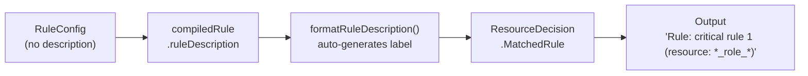
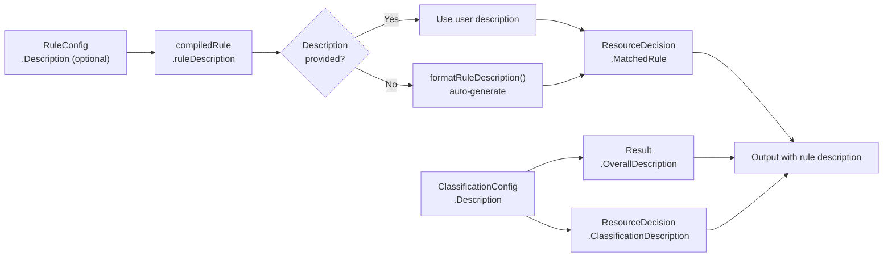
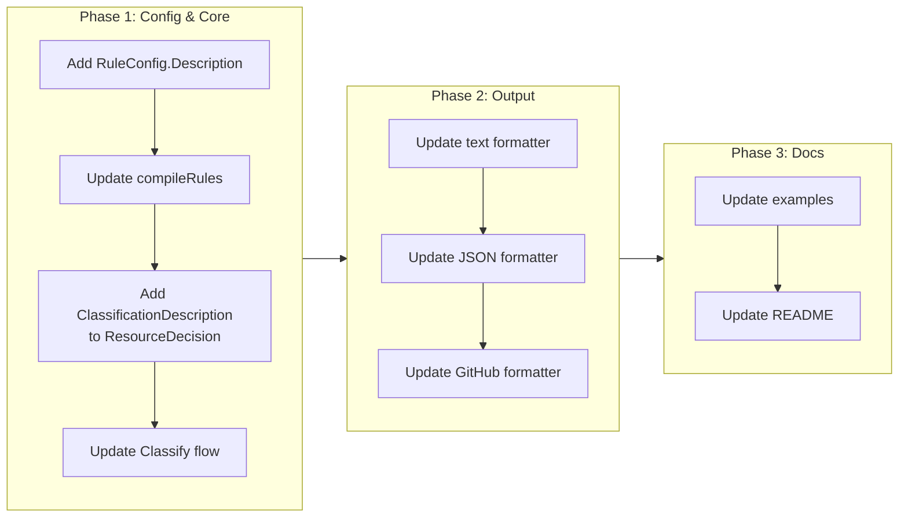

# Per-Rule Descriptions in Classification Output

## Change Summary

Currently, tfclassify auto-generates rule descriptions like `"critical rule 1 (resource: *_role_*, ...)"` which are mechanical and lack business context. This CR adds an optional `description` field to `rule` blocks so that users can provide human-readable explanations like `"Azure role assignments always require manual review"`. The description flows through classification, output, and JSON to give operators immediate context about *why* a resource was classified.

## Motivation and Background

When tfclassify runs in a CI/CD pipeline, the person reviewing the output is often not the person who wrote the classification rules. Auto-generated descriptions like `"critical rule 2 (resource: *_iam_*)"` tell the reviewer *what* matched but not *why* the rule exists or what action they should take. Adding per-rule descriptions lets rule authors embed organizational knowledge directly into the output, reducing the need to cross-reference separate documentation.

The classification-level `description` field exists today but serves a different purpose — it describes the classification level as a whole (e.g., `"Requires security team approval"`), not the specific reason a particular rule matched. A resource might match `critical` for IAM deletion vs. key vault modification, and the response required differs.

## Change Drivers

* Operators reviewing pipeline output need to understand *why* a resource was classified, not just *what* pattern matched
* Rule authors want to embed organizational policy rationale directly in the config file
* The existing classification-level `description` is too coarse — it describes the category, not the specific rule's intent
* JSON consumers (dashboards, Slack bots) benefit from structured description fields for routing and display

## Current State

### Config (`RuleConfig`)

```go
type RuleConfig struct {
    Resource    []string `hcl:"resource,optional"`
    NotResource []string `hcl:"not_resource,optional"`
    Actions     []string `hcl:"actions,optional"`
}
```

No `description` field. Rules are identified only by auto-generated descriptions.

### Auto-Generated Descriptions (`matcher.go`)

`formatRuleDescription` produces strings like:

```
critical rule 1 (resource: *_role_*, ...)
standard rule 2 (not_resource: *_role_*)
```

These are stored in `compiledRule.ruleDescription` and surfaced in `ResourceDecision.MatchedRule`.

### Output

Text (verbose):
```
[critical] (1 resources)
  - azurerm_role_assignment.admin (azurerm_role_assignment) [delete]
    Rule: critical rule 1 (resource: *_role_*, ...)
```

JSON:
```json
{
  "matched_rule": "critical rule 1 (resource: *_role_*, ...)"
}
```

Neither format shows classification-level descriptions, and there is no per-rule description capability.

### Current Flow Diagram



## Proposed Change

Add an optional `description` field to `rule` blocks and surface both rule descriptions and classification descriptions in output.

### HCL Config

```hcl
classification "critical" {
  description = "Requires security team approval"

  rule {
    description = "Azure role assignments always require manual review"
    resource    = ["*_role_*"]
    actions     = ["delete"]
  }

  rule {
    description = "IAM policy changes are high-risk"
    resource    = ["*_iam_*"]
  }
}

classification "standard" {
  description = "Standard change process"

  rule {
    resource = ["*"]
  }
}
```

Rules without a `description` field continue to use the auto-generated format.

### Text Output (Verbose)

```
Classification: critical
  Requires security team approval
Exit code: 2
Resources: 3

[critical] (1 resources)
  Requires security team approval
  - azurerm_role_assignment.admin (azurerm_role_assignment) [delete]
    Rule: Azure role assignments always require manual review

[standard] (2 resources)
  Standard change process
  - azurerm_virtual_network.main (azurerm_virtual_network) [create]
    Rule: standard rule 1 (resource: *)
  - azurerm_resource_group.prod (azurerm_resource_group) [create]
    Rule: standard rule 1 (resource: *)
```

### JSON Output

```json
{
  "overall": "critical",
  "overall_description": "Requires security team approval",
  "exit_code": 2,
  "no_changes": false,
  "resources": [
    {
      "address": "azurerm_role_assignment.admin",
      "type": "azurerm_role_assignment",
      "actions": ["delete"],
      "classification": "critical",
      "classification_description": "Requires security team approval",
      "matched_rule": "Azure role assignments always require manual review"
    }
  ]
}
```

### Proposed Flow Diagram



## Requirements

### Functional Requirements

1. The `rule` block **MUST** accept an optional `description` attribute of type string
2. When a rule has a `description` attribute, `compiledRule.ruleDescription` **MUST** use the user-provided value instead of auto-generating one
3. When a rule does not have a `description` attribute, the system **MUST** auto-generate a description using the existing `formatRuleDescription` logic
4. `ResourceDecision` **MUST** include a `ClassificationDescription` field populated from `ClassificationConfig.Description`
5. `Result` **MUST** include an `OverallDescription` field populated from the classification description of the overall classification
6. The verbose text format **MUST** display the classification-level description below each `[classification]` group header
7. The verbose text format **MUST** display the classification-level description below the overall `Classification:` line
8. The JSON format **MUST** include `overall_description` at the top level
9. The JSON format **MUST** include `classification_description` on each resource object
10. The `matched_rule` field in both text and JSON output **MUST** contain the user-provided rule description when present, or the auto-generated description when absent
11. The GitHub Actions output format **MUST** include a `classification_description` output variable

### Non-Functional Requirements

1. The `description` field **MUST NOT** affect rule matching behavior — it is purely informational
2. Existing config files without `description` fields on rules **MUST** continue to work without modification (backward compatible)

## Affected Components

* `pkg/config/config.go` — `RuleConfig` struct gains `Description` field
* `pkg/classify/matcher.go` — `compileRules` uses user description when present
* `pkg/classify/result.go` — `ResourceDecision` gains `ClassificationDescription`; `Result` gains `OverallDescription`
* `pkg/classify/classifier.go` — populate `ClassificationDescription` and `OverallDescription` during classification
* `pkg/output/formatter.go` — all three formats updated to render descriptions
* `docs/examples/**/.tfclassify.hcl` — updated to demonstrate `description` on rules
* `README.md` — updated rule fields table

## Scope Boundaries

### In Scope

* Optional `description` field on `rule` blocks
* Classification-level `description` surfaced in output (already exists in config, just not rendered)
* All three output formats (text, JSON, GitHub) updated
* Example configs updated with sample descriptions
* README rule fields table updated

### Out of Scope ("Here, But Not Further")

* Localization / i18n of descriptions — English only, deferred to future CR
* Plugin-emitted rule descriptions — plugins already set `MatchedRule` in `ResourceDecision`; plugin SDK changes are out of scope
* Markdown or rich text in descriptions — plain text only
* Description validation (length limits, character restrictions) — not needed for v0.2.0

## Alternative Approaches Considered

* **Classification-level description only (no per-rule)** — Simpler but insufficient. A single `critical` classification may cover IAM deletions, key vault modifications, and network security rules, each requiring different reviewer actions. Per-rule descriptions provide the necessary granularity.
* **Separate `label` field instead of overloading `description`** — Would keep auto-generated descriptions alongside user labels, but adds complexity. Using a single `description` field that overrides auto-generation is cleaner and matches HCL conventions in the Terraform ecosystem (e.g., variable descriptions).
* **Description as a comment in HCL** — HCL comments are not programmatically accessible, so they cannot be surfaced in JSON output or used by automation.

## Impact Assessment

### User Impact

Positive — operators get immediate context about classification decisions. No changes required for existing configs; the feature is additive and opt-in.

### Technical Impact

Minimal. Adds one optional field to `RuleConfig`, one field to `ResourceDecision`, one field to `Result`, and rendering logic in formatters. No breaking changes to any interface.

### Business Impact

Reduces mean time to understand classification decisions in CI/CD pipelines. Teams can self-document their classification policies without maintaining external documentation.

## Implementation Approach

### Phase 1: Config and Core

1. Add `Description string` field to `RuleConfig` with HCL tag `hcl:"description,optional"`
2. Update `compileRules` in `matcher.go`: if `rule.Description != ""`, use it as `ruleDescription`; otherwise call `formatRuleDescription`
3. Add `ClassificationDescription string` to `ResourceDecision`
4. Add `OverallDescription string` to `Result`
5. Update `classifyResource` to populate `ClassificationDescription` from `ClassificationConfig.Description`
6. Update `Classify` to populate `OverallDescription`

### Phase 2: Output Formatters

7. Update `formatText` (verbose) to show classification description under group headers and the overall line
8. Update `JSONResource` to include `ClassificationDescription` field with JSON tag `classification_description`
9. Update `JSONOutput` to include `OverallDescription` field with JSON tag `overall_description`
10. Update `formatGitHub` to include `classification_description` output variable

### Phase 3: Documentation

11. Update example `.tfclassify.hcl` files with sample `description` fields on rules
12. Update README rule fields table to include `description`

### Implementation Flow



## Test Strategy

### Tests to Add

| Test File | Test Name | Description | Inputs | Expected Output |
|-----------|-----------|-------------|--------|-----------------|
| `pkg/classify/matcher_test.go` | `TestCompileRules_UserDescription` | Rule with user-provided description uses it verbatim | `RuleConfig{Description: "custom desc", Resource: ["*"]}` | `compiledRule.ruleDescription == "custom desc"` |
| `pkg/classify/matcher_test.go` | `TestCompileRules_AutoDescription` | Rule without description auto-generates one | `RuleConfig{Resource: ["*_role_*"]}` | `compiledRule.ruleDescription == "critical rule 1 (resource: *_role_*)"` |
| `pkg/classify/classifier_test.go` | `TestClassify_ClassificationDescription` | Classification description flows to ResourceDecision | Config with `description = "High risk"` on critical | `decision.ClassificationDescription == "High risk"` |
| `pkg/classify/classifier_test.go` | `TestClassify_OverallDescription` | Overall description set from highest-precedence classification | Config with critical and standard descriptions | `result.OverallDescription == "Requires security team approval"` |
| `pkg/output/formatter_test.go` | `TestFormatJSON_WithDescriptions` | JSON includes `overall_description` and `classification_description` | Result with descriptions populated | JSON output contains both fields |
| `pkg/output/formatter_test.go` | `TestFormatText_Verbose_WithDescription` | Verbose text shows classification description under group header | Result with descriptions populated | Output contains description below `[critical]` header |
| `pkg/output/formatter_test.go` | `TestFormatText_Verbose_UserRuleDescription` | Verbose text shows user rule description instead of auto-generated | Decision with `MatchedRule = "IAM deletions are high-risk"` | Output shows `Rule: IAM deletions are high-risk` |
| `pkg/output/formatter_test.go` | `TestFormatGitHub_WithDescription` | GitHub format includes classification_description variable | Result with descriptions populated | Output contains `classification_description=` line |
| `pkg/config/config_test.go` | `TestLoadConfig_RuleDescription` | HCL parsing picks up optional description on rule blocks | HCL with `description = "test"` in rule block | `RuleConfig.Description == "test"` |
| `pkg/config/config_test.go` | `TestLoadConfig_RuleWithoutDescription` | HCL parsing works without description on rule blocks | HCL without description in rule block | `RuleConfig.Description == ""` |

### Tests to Modify

| Test File | Test Name | Current Behavior | New Behavior | Reason for Change |
|-----------|-----------|------------------|--------------|-------------------|
| `pkg/output/formatter_test.go` | `TestFormatJSON` | Asserts only `matched_rule` field | Assert `classification_description` and `overall_description` also present in output | New fields added to JSON output struct |

### Tests to Remove

None — no existing tests become redundant.

## Acceptance Criteria

### AC-1: Rule description in HCL config

```gherkin
Given a .tfclassify.hcl file with a rule block containing description = "IAM deletions require security review"
When tfclassify loads the config
Then the parsed RuleConfig.Description equals "IAM deletions require security review"
```

### AC-2: Rule description in verbose text output

```gherkin
Given a config where a critical rule has description = "Role assignments always require manual review"
  And a plan containing a resource matching that rule
When tfclassify runs with --verbose
Then the text output shows "Rule: Role assignments always require manual review" for that resource
```

### AC-3: Classification description in verbose text output

```gherkin
Given a config where the critical classification has description = "Requires security team approval"
  And a plan containing resources classified as critical
When tfclassify runs with --verbose
Then the text output shows "Requires security team approval" below the [critical] group header
  And the text output shows "Requires security team approval" below the overall Classification line
```

### AC-4: Auto-generated description fallback

```gherkin
Given a config where a rule has no description attribute
When tfclassify classifies a resource matching that rule
Then the matched_rule output uses the auto-generated format "classification rule N (resource: pattern, ...)"
```

### AC-5: JSON output includes descriptions

```gherkin
Given a config with classification and rule descriptions
  And a plan with matching resources
When tfclassify runs with --output json
Then the JSON output includes "overall_description" at the top level
  And each resource object includes "classification_description"
  And each resource object includes the rule description in "matched_rule"
```

### AC-6: GitHub Actions output includes description

```gherkin
Given a config with a classification description
  And a plan with matching resources
When tfclassify runs with --output github
Then the output includes a classification_description variable
```

### AC-7: Backward compatibility

```gherkin
Given an existing .tfclassify.hcl file with no description fields on any rule blocks
When tfclassify loads the config and classifies a plan
Then the system behaves identically to the current version
  And all auto-generated rule descriptions are preserved
```

## Quality Standards Compliance

### Build & Compilation

- [ ] Code compiles/builds without errors
- [ ] No new compiler warnings introduced

### Linting & Code Style

- [ ] All linter checks pass with zero warnings/errors
- [ ] Code follows project coding conventions and style guides
- [ ] Any linter exceptions are documented with justification

### Test Execution

- [ ] All existing tests pass after implementation
- [ ] All new tests pass
- [ ] Test coverage meets project requirements for changed code

### Documentation

- [ ] Inline code documentation updated where applicable
- [ ] API documentation updated for any API changes
- [ ] User-facing documentation updated if behavior changes

### Code Review

- [ ] Changes submitted via pull request
- [ ] PR title follows Conventional Commits format
- [ ] Code review completed and approved
- [ ] Changes squash-merged to maintain linear history

### Verification Commands

```bash
# Build verification
make build

# Lint verification
make lint

# Test execution
make test
```

## Risks and Mitigation

### Risk 1: Long descriptions break text output alignment

**Likelihood:** low
**Impact:** low
**Mitigation:** Descriptions are rendered on their own line (indented under group header or `Rule:` prefix), so length does not affect column alignment.

### Risk 2: JSON consumers break on new fields

**Likelihood:** low
**Impact:** low
**Mitigation:** New fields are additive. JSON parsers that ignore unknown fields (the standard behavior in Go's `encoding/json` and most JSON libraries) are unaffected.

## Dependencies

* None — this CR is self-contained and does not depend on other CRs.

## Estimated Effort

Small: ~2-3 hours. One field addition to `RuleConfig`, flow-through updates to 3-4 files, formatter adjustments, and tests.

## Decision Outcome

Chosen approach: "Optional per-rule description field with classification description in output", because it provides the most natural authoring experience (inline with the rule it describes), follows HCL ecosystem conventions, and is fully backward compatible.

## Related Items

* Related config: [CR-0004](CR-0004-core-classification-engine-and-cli.md) — original classification engine and CLI
* Related output: [CR-0008](CR-0008-simplify-catch-all-classification-rules.md) — catch-all rule simplification (rules are where descriptions attach)
* Related architecture: [ADR-0004](../adr/ADR-0004-hcl-configuration-format.md) — HCL configuration format decision

## More Information

### Design Rationale: Description Overrides vs. Appends

When a user provides a `description`, it fully replaces the auto-generated label rather than appending to it. This keeps the output clean:

```
# With user description:
Rule: Azure role assignments always require manual review

# NOT:
Rule: critical rule 1 (resource: *_role_*) — Azure role assignments always require manual review
```

The auto-generated format is an implementation detail for debugging; when the user provides intent, it should take precedence. The auto-generated format remains available when no description is specified, preserving the current behavior for users who don't opt in.

### Classification Description Rendering

The classification-level `description` (which already exists in config but is not currently rendered) is surfaced in two places in verbose text output:

1. **Below the overall classification line** — gives immediate context at the top of the output
2. **Below each classification group header** — gives context when scanning grouped resources

This is similar to how `terraform plan` shows resource-level context alongside each change.
