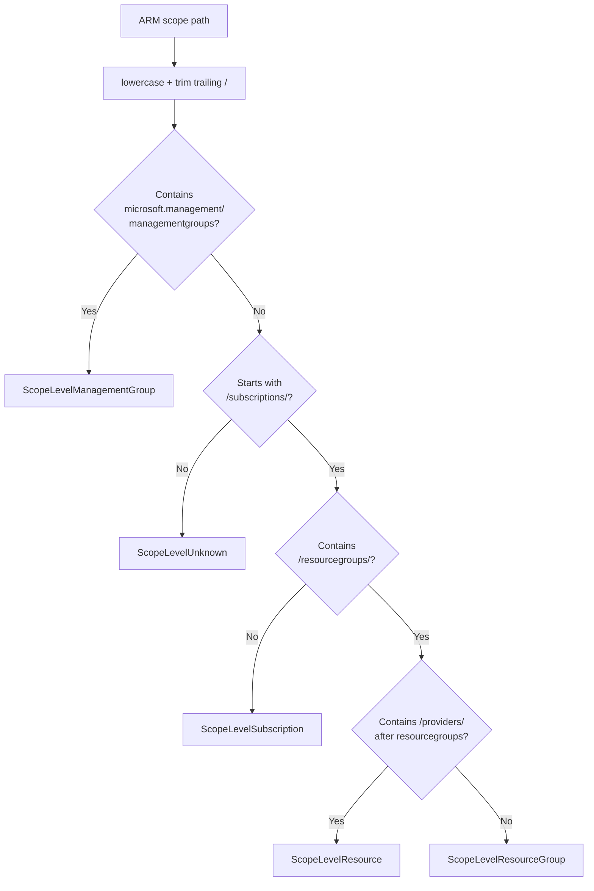
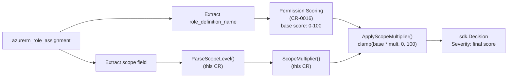
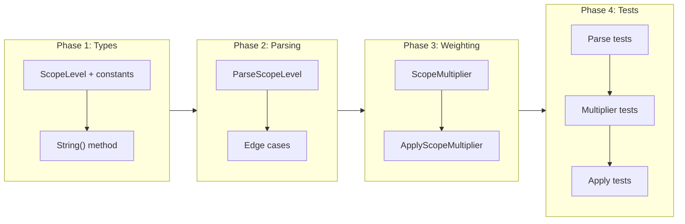

# ARM Scope Parsing and Weighting

## Change Summary

Add a self-contained scope parsing and weighting module to the azurerm plugin. The module parses Azure ARM scope paths from `azurerm_role_assignment` resources and computes a severity multiplier based on the scope level (management group, subscription, resource group, or individual resource). This provides the blast-radius dimension of the severity calculation defined in ADR-0006.

## Motivation and Background

ADR-0006 specifies that the privilege escalation analyzer must weight severity by scope — an Owner role at subscription scope is far more dangerous than Owner scoped to a single resource. The current analyzer ignores scope entirely, emitting the same severity regardless of blast radius.

The scope multiplier is one of three building blocks for the new severity formula: `severity = clamp(permissionScore * scopeMultiplier, 0, 100)`. This CR delivers the scope component independently so it can be developed and tested in isolation.

## Change Drivers

* ADR-0006 requires scope-weighted severity for privilege escalation decisions
* Subscription-level Owner and resource-level Owner have fundamentally different risk profiles that must be reflected in severity
* The scope parsing logic is a pure utility with no external dependencies, making it a natural first step

## Current State

The privilege escalation analyzer in `plugins/azurerm/privilege.go` does not inspect the `scope` field on role assignments. All escalations emit severity 90 regardless of whether the scope is a management group or a single resource.

## Proposed Change

A new file `plugins/azurerm/scope.go` providing:

```go
type ScopeLevel int

const (
    ScopeLevelUnknown ScopeLevel = iota
    ScopeLevelResource
    ScopeLevelResourceGroup
    ScopeLevelSubscription
    ScopeLevelManagementGroup
)
```

Functions:
- `ParseScopeLevel(scope string) ScopeLevel` — classifies ARM paths via case-insensitive string matching
- `ScopeMultiplier(level ScopeLevel) float64` — returns the multiplier for a scope level
- `ApplyScopeMultiplier(score int, scope string) int` — composes parsing, multiplication, rounding, and clamping

### Parsing Logic



### Multiplier Table

| Scope Level | Multiplier | Rationale |
|-------------|-----------|-----------|
| Management group | 1.1 | Broadest scope, affects multiple subscriptions |
| Subscription | 1.0 | Baseline — most common scope for role assignments |
| Resource group | 0.8 | Limited to one resource group |
| Resource | 0.6 | Tightly scoped to a single resource |
| Unknown | 0.9 | Conservative default for unrecognized paths |

### Data Flow Integration



## Requirements

### Functional Requirements

1. `ParseScopeLevel` **MUST** identify management group scope from paths matching `/providers/Microsoft.Management/managementGroups/{name}`
2. `ParseScopeLevel` **MUST** identify subscription scope from paths matching `/subscriptions/{id}` without `/resourceGroups/`
3. `ParseScopeLevel` **MUST** identify resource group scope from paths matching `/subscriptions/{id}/resourceGroups/{name}` without a subsequent `/providers/` segment
4. `ParseScopeLevel` **MUST** identify resource scope from paths with `/providers/` after the resource group segment
5. `ParseScopeLevel` **MUST** return `ScopeLevelUnknown` for empty strings, whitespace, and paths not matching any known pattern
6. `ParseScopeLevel` **MUST** perform case-insensitive matching, since ARM paths are case-insensitive in Azure
7. `ScopeMultiplier` **MUST** return 1.1, 1.0, 0.8, 0.6, 0.9 for management group, subscription, resource group, resource, and unknown respectively
8. `ApplyScopeMultiplier` **MUST** clamp results to [0, 100] — scores never exceed 100 or go below 0
9. `ApplyScopeMultiplier` **MUST** return 0 when the base score is 0 regardless of scope
10. `ScopeLevel` **MUST** implement `String()` returning human-readable labels (`"management-group"`, `"subscription"`, `"resource-group"`, `"resource"`, `"unknown"`)

### Non-Functional Requirements

1. The scope module **MUST** have no dependencies beyond the Go standard library
2. The scope module **MUST** be in `package main` matching the existing plugin code
3. All exported types and functions **MUST** have GoDoc comments
4. Test coverage for `scope.go` **MUST** exceed 90%

## Affected Components

* `plugins/azurerm/scope.go` (new) — implementation
* `plugins/azurerm/scope_test.go` (new) — tests

No existing files are modified.

## Scope Boundaries

### In Scope

* `ScopeLevel` type with constants for the four ARM scope levels plus unknown
* `ParseScopeLevel`, `ScopeMultiplier`, `ApplyScopeMultiplier` functions
* `String()` method on `ScopeLevel`
* Case-insensitive path matching
* Comprehensive tests including edge cases

### Out of Scope ("Here, But Not Further")

* Permission scoring algorithm — separate CR (CR-0016)
* Integration with `PrivilegeEscalationAnalyzer` — separate CR (CR-0017)
* Tenant root scope (`/`) — extremely rare in Terraform plans, falls into `ScopeLevelUnknown`
* Scope validation (GUID format, naming rules) — unnecessary since scopes come from Terraform plans
* Configurable multipliers — the fixed values from ADR-0006 are sufficient for v0.3.0

## Implementation Approach

### Implementation Flow



## Test Strategy

### Tests to Add

| Test File | Test Name | Description | Inputs | Expected Output |
|-----------|-----------|-------------|--------|-----------------|
| `scope_test.go` | `TestParseScopeLevel_ManagementGroup` | Parses management group path | `/providers/Microsoft.Management/managementGroups/my-mg` | `ScopeLevelManagementGroup` |
| `scope_test.go` | `TestParseScopeLevel_Subscription` | Parses subscription path | `/subscriptions/00000000-0000-0000-0000-000000000000` | `ScopeLevelSubscription` |
| `scope_test.go` | `TestParseScopeLevel_ResourceGroup` | Parses resource group path | `/subscriptions/{id}/resourceGroups/my-rg` | `ScopeLevelResourceGroup` |
| `scope_test.go` | `TestParseScopeLevel_Resource` | Parses resource path | `.../resourceGroups/rg/providers/Microsoft.Compute/virtualMachines/vm` | `ScopeLevelResource` |
| `scope_test.go` | `TestParseScopeLevel_NestedResource` | Handles nested resource paths | `.../providers/Microsoft.Network/virtualNetworks/vnet/subnets/sub` | `ScopeLevelResource` |
| `scope_test.go` | `TestParseScopeLevel_CaseInsensitive` | Case-insensitive matching | `/SUBSCRIPTIONS/abc/RESOURCEGROUPS/rg` | `ScopeLevelResourceGroup` |
| `scope_test.go` | `TestParseScopeLevel_EmptyString` | Empty input | `""` | `ScopeLevelUnknown` |
| `scope_test.go` | `TestParseScopeLevel_Malformed` | Garbage input | `"not-a-valid-path"` | `ScopeLevelUnknown` |
| `scope_test.go` | `TestScopeMultiplier_AllLevels` | All multiplier values | Each constant | 1.1, 1.0, 0.8, 0.6, 0.9 |
| `scope_test.go` | `TestApplyScopeMultiplier_Baseline` | Subscription = no change | score=90, subscription scope | 90 |
| `scope_test.go` | `TestApplyScopeMultiplier_MgIncrease` | Mgmt group increases | score=90, mgmt group scope | 99 |
| `scope_test.go` | `TestApplyScopeMultiplier_RgReduction` | RG reduces | score=90, RG scope | 72 |
| `scope_test.go` | `TestApplyScopeMultiplier_ResourceReduction` | Resource reduces | score=90, resource scope | 54 |
| `scope_test.go` | `TestApplyScopeMultiplier_ClampAt100` | Does not exceed 100 | score=95, mgmt group scope | 100 |
| `scope_test.go` | `TestApplyScopeMultiplier_ClampAtZero` | Does not go below 0 | score=0, any scope | 0 |
| `scope_test.go` | `TestScopeLevel_String` | String representations | All constants | Expected labels |

### Tests to Modify

Not applicable — no existing files modified.

### Tests to Remove

Not applicable.

## Acceptance Criteria

### AC-1: Scope levels parsed correctly

```gherkin
Given ARM scope paths for management group, subscription, resource group, and resource
When ParseScopeLevel is called with each path
Then it returns the correct ScopeLevel constant for each
```

### AC-2: Case-insensitive matching

```gherkin
Given an ARM scope path with mixed casing "/SUBSCRIPTIONS/abc/RESOURCEGROUPS/rg"
When ParseScopeLevel is called
Then it returns ScopeLevelResourceGroup
```

### AC-3: Unknown scope for invalid paths

```gherkin
Given an empty string or malformed path
When ParseScopeLevel is called
Then it returns ScopeLevelUnknown
```

### AC-4: Multiplier values match ADR-0006

```gherkin
Given each ScopeLevel constant
When ScopeMultiplier is called
Then management group returns 1.1, subscription returns 1.0, resource group returns 0.8, resource returns 0.6, unknown returns 0.9
```

### AC-5: Score clamped to [0, 100]

```gherkin
Given a base score of 95 and a management group scope
When ApplyScopeMultiplier is called
Then it returns 100 (clamped, not 105)
```

## Quality Standards Compliance

### Build & Compilation

- [ ] Code compiles without errors from plugin directory and workspace root
- [ ] No new compiler warnings

### Linting & Code Style

- [ ] All linter checks pass
- [ ] GoDoc comments on all exported symbols

### Test Execution

- [ ] All existing tests pass
- [ ] All new tests pass
- [ ] Coverage for `scope.go` exceeds 90%

### Verification Commands

```bash
go build ./plugins/azurerm/...
go test ./plugins/azurerm/... -v -run TestParseScopeLevel
go test ./plugins/azurerm/... -v -run TestScopeMultiplier
go test ./plugins/azurerm/... -v -run TestApplyScopeMultiplier
go test ./plugins/azurerm/... -coverprofile=coverage.out
go tool cover -func=coverage.out | grep scope.go
go vet ./plugins/azurerm/...
```

## Risks and Mitigation

### Risk 1: ARM scope path format changes

**Likelihood:** very low
**Impact:** low
**Mitigation:** ARM scope paths have been stable since Azure Resource Manager's initial release. The hierarchical structure is fundamental to Azure. `ScopeLevelUnknown` with 0.9 provides a safe fallback.

### Risk 2: Edge cases in real Terraform plans

**Likelihood:** low
**Impact:** low
**Mitigation:** Terraform's Azure provider generates standard ARM paths from API responses. Tests cover empty, whitespace, malformed, and nested resource paths.

## Dependencies

None. This CR is independent and can be implemented first.

Future CRs that depend on this: CR-0017 (privilege analyzer rewrite).

## Estimated Effort

Small: ~1-2 hours. Simple string matching, lookup table, arithmetic, and clamping.

## Decision Outcome

Chosen approach: "Self-contained scope parsing module with string-based matching and fixed multiplier table", because it is simple, dependency-free, and provides a clean interface for composition with the permission scoring component.

## Related Items

* Architecture decision: [ADR-0006](../adr/ADR-0006-permission-based-privilege-escalation-detection.md) — scope weighting specification
* Change request: [CR-0011](CR-0011-deep-inspection-plugin-example.md) — azurerm plugin creation
