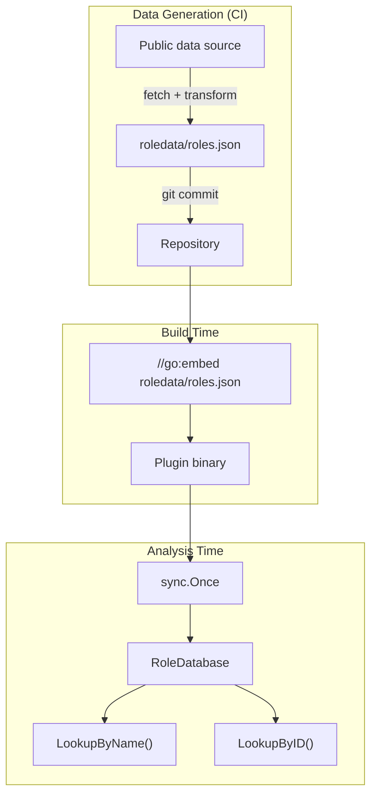
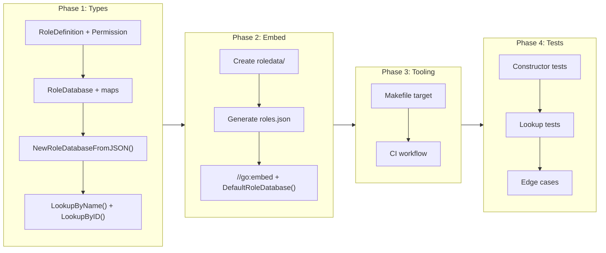

# Embedded Azure Built-in Role Database

## Change Summary

Add an embedded database of Azure built-in role definitions (with full permission sets) to the azurerm plugin. The database provides O(1) lookup by role name and role ID, enabling the permission scoring algorithm (CR-0016) to determine what a role can actually do rather than relying on name-based allowlists. A generation tool fetches the data from a public source, and a CI workflow refreshes it periodically.

## Motivation and Background

ADR-0006 requires permission-based analysis of Azure roles. The Terraform plan for `azurerm_role_assignment` only contains the role's display name (`role_definition_name`) and ID (`role_definition_id`) — not the role's actual permissions. To score a role, we need its permission set (actions, notActions, dataActions, notDataActions).

Azure has ~400 built-in roles. Their definitions are publicly available and change infrequently. Embedding this data in the plugin binary means analysis works offline and in air-gapped environments — no Azure API calls at runtime.

## Change Drivers

* The permission scoring algorithm (CR-0016) needs the actual permission sets of Azure built-in roles
* The current `PrivilegedRoles` name-based list has no permission data — it cannot distinguish Owner from Contributor
* Analysis must work offline and in CI pipelines without Azure credentials at runtime
* Following TFLint's pattern of embedding provider-specific reference data refreshed via CI

## Current State

The privilege escalation analyzer uses `config.PrivilegedRoles` — a flat list of role names `["Owner", "User Access Administrator", "Contributor"]`. There is no permission data available to the plugin.

## Proposed Change

### Data Types

New file `plugins/azurerm/roles.go`:

```go
type RoleDefinition struct {
    ID          string       `json:"id"`
    Name        string       `json:"roleName"`
    Description string       `json:"description"`
    RoleType    string       `json:"roleType"`
    Permissions []Permission `json:"permissions"`
}

type Permission struct {
    Actions        []string `json:"actions"`
    NotActions     []string `json:"notActions"`
    DataActions    []string `json:"dataActions"`
    NotDataActions []string `json:"notDataActions"`
}

type RoleDatabase struct {
    byName map[string]*RoleDefinition // keyed by lowercase roleName
    byID   map[string]*RoleDefinition // keyed by GUID
}
```

### Embedding

```go
//go:embed roledata/roles.json
var builtinRolesJSON []byte

func DefaultRoleDatabase() *RoleDatabase {
    // singleton via sync.Once, panics on malformed embedded data
}
```

### JSON Schema

Each entry in `roledata/roles.json`:

```json
{
  "id": "8e3af657-a8ff-443c-a75c-2fe8c4bcb635",
  "roleName": "Owner",
  "description": "Lets you manage everything, including access to resources.",
  "roleType": "BuiltInRole",
  "permissions": [{
    "actions": ["*"],
    "notActions": [],
    "dataActions": [],
    "notDataActions": []
  }]
}
```

### Data Source

The data **MUST** come from a publicly available source that does not require Azure authentication.

**Primary source: [AzAdvertizer](https://www.azadvertizer.net/azrolesadvertizer_all.html)**

AzAdvertizer publishes all Azure built-in role definitions with full permission sets (Actions, NotActions, DataActions, NotDataActions) as a downloadable CSV:

- **Full dataset:** https://www.azadvertizer.net/azrolesadvertizer-comma.csv
- **Change history:** https://www.azadvertizer.net/azrolesadvertizer_history.html

The CSV contains columns: `RoleId`, `RoleName`, `RoleDescription`, `RoleActions`, `RoleNotActions`, `RoleDataActions`, `RoleNotDataActions`, plus policy reference data. Permission strings within each field are comma-separated. The data is sourced from Azure APIs and updated regularly.

The generation tool fetches the CSV via `curl` (no authentication required) and transforms it to the target JSON schema using a small Go tool:

```makefile
generate-roles:
	curl -sL https://www.azadvertizer.net/azrolesadvertizer-comma.csv | \
		go run tools/csv2roles/main.go > plugins/azurerm/roledata/roles.json
```

The CI workflow is equally simple — no Azure credentials, no service principal, just an HTTP GET.

**Why not `az role definition list`?** It requires Azure CLI authentication (service principal or interactive login), which adds credential management overhead in CI and prevents contributors without Azure subscriptions from regenerating the data.

**Why not `microsoft/azure-roles`?** The [microsoft/azure-roles](https://github.com/microsoft/azure-roles) repository provides role name-to-GUID mappings but does **not** include permission sets — only the `azure_roles.json` mapping file with `{"Owner": "8e3af657-..."}`. Insufficient for permission-based scoring.

### Lookup Functions

- `LookupByName(name string) (*RoleDefinition, bool)` — case-insensitive display name lookup
- `LookupByID(id string) (*RoleDefinition, bool)` — accepts bare GUID or full ARM path (extracts GUID from last path segment)
- `NewRoleDatabaseFromJSON(data []byte) (*RoleDatabase, error)` — constructor for testing

### Architecture



## Requirements

### Functional Requirements

1. `RoleDefinition` **MUST** contain fields: ID (GUID), Name (display name), Description, RoleType, and Permissions (slice of Permission blocks)
2. `Permission` **MUST** contain Actions, NotActions, DataActions, and NotDataActions as string slices
3. `RoleDatabase` **MUST** provide `LookupByName` with case-insensitive matching
4. `RoleDatabase` **MUST** provide `LookupByID` that accepts both bare GUIDs and full ARM paths (`/providers/Microsoft.Authorization/roleDefinitions/{guid}`)
5. `DefaultRoleDatabase()` **MUST** return a singleton loaded from the embedded JSON via `sync.Once`
6. `DefaultRoleDatabase()` **MUST** be safe for concurrent access from multiple goroutines
7. `NewRoleDatabaseFromJSON` **MUST** return a clear error for malformed JSON
8. The embedded `roles.json` **MUST** contain well-known roles including Owner, Contributor, Reader, and User Access Administrator with their full permission sets
9. The generation tool **MUST** work without Azure CLI authentication — it **MUST** use a publicly available data source
10. The `roles.json` file **MUST** be sorted by `roleName` for stable diffs

### Non-Functional Requirements

1. The embedded JSON **MUST** not exceed 2MB uncompressed
2. The module **MUST** have no external dependencies beyond the Go standard library
3. Test coverage for `roles.go` **MUST** exceed 90%
4. `DefaultRoleDatabase()` initialization **MUST** complete in under 100ms

## Affected Components

* `plugins/azurerm/roles.go` (new) — types, embed, lookup functions
* `plugins/azurerm/roles_test.go` (new) — tests
* `plugins/azurerm/roledata/roles.json` (new) — embedded data
* `Makefile` (modified) — add `generate-roles` target
* `.github/workflows/refresh-role-data.yml` (new) — periodic refresh

## Scope Boundaries

### In Scope

* `RoleDefinition`, `Permission`, `RoleDatabase` types
* `DefaultRoleDatabase()` singleton with `sync.Once`
* `NewRoleDatabaseFromJSON()` for testability
* `LookupByName()` and `LookupByID()` with GUID extraction
* `roledata/roles.json` embedded data file
* Makefile target for regeneration
* CI workflow for periodic refresh using `gh` CLI for PR creation

### Out of Scope ("Here, But Not Further")

* **Permission scoring** — computing risk scores from permission sets is CR-0016
* **Custom role cross-reference** — resolving `azurerm_role_definition` from plans is CR-0017
* **Modifying the analyzer** — the existing name-based logic continues until CR-0017

## Implementation Approach

### Implementation Flow



## Test Strategy

### Tests to Add

| Test File | Test Name | Description | Inputs | Expected Output |
|-----------|-----------|-------------|--------|-----------------|
| `roles_test.go` | `TestNewRoleDatabaseFromJSON_ValidData` | Parses valid JSON array | 3-role JSON | Database with 3 roles |
| `roles_test.go` | `TestNewRoleDatabaseFromJSON_EmptyArray` | Handles empty array | `[]` | Empty database, no error |
| `roles_test.go` | `TestNewRoleDatabaseFromJSON_MalformedJSON` | Returns error for invalid JSON | `{bad}` | nil, non-nil error |
| `roles_test.go` | `TestLookupByName_ExactMatch` | Finds by exact name | `"Owner"` | Owner role |
| `roles_test.go` | `TestLookupByName_CaseInsensitive` | Case-insensitive | `"owner"`, `"OWNER"` | All return Owner |
| `roles_test.go` | `TestLookupByName_NotFound` | Unknown name | `"NonExistent"` | nil, false |
| `roles_test.go` | `TestLookupByID_BareGUID` | Finds by GUID | `"8e3af..."` | Owner role |
| `roles_test.go` | `TestLookupByID_FullARMPath` | Extracts GUID from ARM path | `/providers/.../roleDefinitions/8e3af...` | Owner role |
| `roles_test.go` | `TestLookupByID_NotFound` | Unknown GUID | `"00000..."` | nil, false |
| `roles_test.go` | `TestDefaultRoleDatabase_ContainsOwner` | Embedded data has Owner | (uses embed) | Owner found with `*` action |
| `roles_test.go` | `TestDefaultRoleDatabase_ContainsContributor` | Has Contributor with notActions | (uses embed) | Contributor found, notActions includes `Microsoft.Authorization/*` |
| `roles_test.go` | `TestDefaultRoleDatabase_ThreadSafe` | Concurrent access | 100 goroutines | Same instance, no races |
| `roles_test.go` | `TestPermissionsPopulated` | Permissions deserialized correctly | Owner from DB | `Actions` contains `"*"` |

### Tests to Modify

Not applicable — new module.

### Tests to Remove

Not applicable.

## Acceptance Criteria

### AC-1: Role database loads from JSON

```gherkin
Given a valid JSON array of Azure role definitions
When NewRoleDatabaseFromJSON is called
Then it returns a RoleDatabase with no error
  And the database contains one entry per role
```

### AC-2: Case-insensitive name lookup

```gherkin
Given a RoleDatabase containing "Owner"
When LookupByName is called with "owner", "OWNER", "Owner"
Then all three return the same RoleDefinition with second return value true
```

### AC-3: ID lookup supports bare GUID and ARM path

```gherkin
Given a RoleDatabase containing a role with ID "8e3af657-a8ff-443c-a75c-2fe8c4bcb635"
When LookupByID is called with the bare GUID
  And LookupByID is called with "/providers/Microsoft.Authorization/roleDefinitions/8e3af657-a8ff-443c-a75c-2fe8c4bcb635"
Then both return the same RoleDefinition
```

### AC-4: Embedded data contains well-known roles with permissions

```gherkin
Given the compiled plugin binary
When DefaultRoleDatabase is called
Then LookupByName("Owner") returns a role with Permissions[0].Actions containing "*"
  And LookupByName("Contributor") returns a role with Permissions[0].NotActions containing "Microsoft.Authorization/*"
  And LookupByName("Reader") returns a role with Permissions[0].Actions containing "*/read"
```

### AC-5: Thread-safe singleton

```gherkin
Given DefaultRoleDatabase called concurrently from 100 goroutines
Then all return the same instance with no data races (go test -race)
```

### AC-6: Generation tool works without Azure credentials

```gherkin
Given the generate-roles Makefile target
When it is run without Azure CLI authentication
Then roledata/roles.json is produced with valid JSON containing well-known roles
```

## Quality Standards Compliance

### Verification Commands

```bash
go build ./plugins/azurerm/...
go test ./plugins/azurerm/... -v -run TestLookup
go test ./plugins/azurerm/... -v -run TestNewRoleDatabase
go test ./plugins/azurerm/... -v -run TestDefaultRoleDatabase
go test ./plugins/azurerm/... -race
go test ./plugins/azurerm/... -coverprofile=cover.out
go tool cover -func=cover.out | grep roles.go
go vet ./plugins/azurerm/...
jq . plugins/azurerm/roledata/roles.json > /dev/null  # validate JSON
```

## Risks and Mitigation

### Risk 1: Public data source changes or disappears

**Likelihood:** low
**Impact:** medium
**Mitigation:** The embedded JSON is committed to the repository. If the source becomes unavailable, the existing data remains valid. The generation can be switched to a different source without changing any Go code.

### Risk 2: Embedded JSON inflates binary size

**Likelihood:** medium
**Impact:** low
**Mitigation:** ~400 roles at ~1.2KB each = ~480KB. Well within acceptable limits. If it grows beyond 2MB, strip the `description` field (unused for scoring).

### Risk 3: Role name collisions in case-insensitive map

**Likelihood:** very low
**Impact:** low
**Mitigation:** Azure enforces unique display names for built-in roles. If a collision occurs, last-wins is a safe degraded behavior.

## Dependencies

None. This CR is independent.

CR-0016 (permission scoring) depends on this CR for the `RoleDefinition` and `Permission` types.

## Estimated Effort

Medium: ~4-6 hours. Types + lookup (2h), data generation + embedding (2h), tests (2h).

## Decision Outcome

Chosen approach: "Embedded JSON file with Go types and map-based indexes", because it provides O(1) lookups, keeps data human-readable for auditing, requires zero external dependencies, and integrates cleanly with `//go:embed`.

## Related Items

* Architecture decision: [ADR-0006](../adr/ADR-0006-permission-based-privilege-escalation-detection.md) — embedded role database specification
* Change request: [CR-0011](CR-0011-deep-inspection-plugin-example.md) — azurerm plugin creation
* Change request: CR-0016 (planned) — permission scoring (consumes this CR's types)
