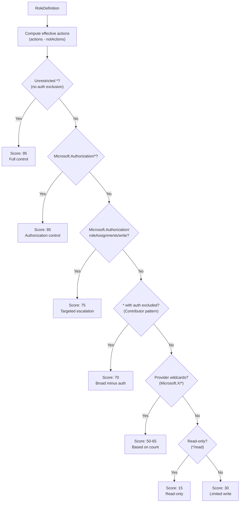
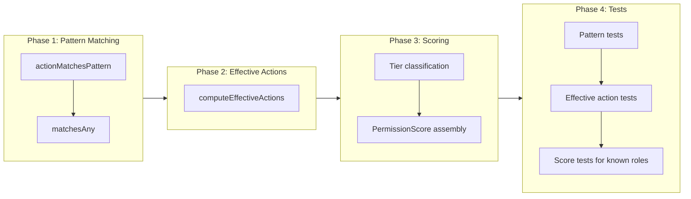

# Permission Scoring Algorithm

## Change Summary

Implement a scoring algorithm that computes a 0–100 risk score from an Azure role definition's permission set. The algorithm computes effective actions (actions minus notActions), classifies them into risk tiers, and returns a structured score. This replaces the flat severity 90 with graduated scoring that correctly distinguishes Owner (~95) from Contributor (~70) from Reader (~15).

## Motivation and Background

ADR-0006 requires that the privilege escalation analyzer score roles based on their actual permissions. The key insight is that Azure's `notActions` field makes roles with identical `actions` lists fundamentally different: both Owner and Contributor have `actions: ["*"]`, but Contributor excludes `Microsoft.Authorization/*` via `notActions`, meaning it cannot escalate privileges. The scoring algorithm must model this correctly.

## Change Drivers

* Owner and Contributor must have different severity scores — they represent fundamentally different risk levels
* `Microsoft.Authorization/*` actions (the privilege escalation vector) must be weighted highest
* Custom roles must be scorable using the same algorithm — no name-based special cases
* The algorithm must be deterministic and auditable for CI/CD trust

## Current State

All escalations emit severity 90 regardless of which role is involved. There is no permission analysis.

## Proposed Change

### PermissionScore Type

```go
type PermissionScore struct {
    Total        int      // 0-100 final score
    HasWildcard  bool     // effective actions include unrestricted "*"
    HasAuthWrite bool     // effective actions include Microsoft.Authorization write
    Factors      []string // human-readable reasons
}
```

### Scoring Tiers



### Expected Scores for Well-Known Roles

| Role | Actions | NotActions | Score | Key Factor |
|------|---------|-----------|-------|-----------|
| Owner | `["*"]` | `[]` | 95 | Unrestricted wildcard |
| User Access Administrator | `["Microsoft.Authorization/*", ...]` | `[]` | 85 | Authorization control |
| Contributor | `["*"]` | `["Microsoft.Authorization/*", ...]` | 70 | Wildcard minus auth |
| Reader | `["*/read"]` | `[]` | 15 | Read-only |

### Key Functions

- `ScorePermissions(role *RoleDefinition) PermissionScore` — main entry point
- `computeEffectiveActions(actions, notActions []string) []string` — subtraction logic
- `actionMatchesPattern(action, pattern string) bool` — Azure glob matching (case-insensitive)
- `matchesAny(action string, patterns []string) bool` — helper

### Pattern Matching

Azure RBAC uses glob-like matching:
- `*` matches everything
- `Microsoft.Compute/*` matches all actions under that provider
- `*/read` matches any read action
- Matching is case-insensitive

### Wildcard-with-Exclusions Special Case

When `actions = ["*"]` and `notActions` is non-empty, `computeEffectiveActions` cannot enumerate all Azure actions to subtract. The scoring logic handles this as a special case: it starts from the wildcard base score (95) and subtracts points based on what `notActions` covers. If `notActions` covers `Microsoft.Authorization/*`, 25 points are subtracted (→ 70, the Contributor pattern).

## Requirements

### Functional Requirements

1. `ScorePermissions` **MUST** return a `PermissionScore` with `Total` in range [0, 100]
2. A role with `actions: ["*"]` and empty `notActions` **MUST** score 95
3. A role with `actions: ["*"]` and `notActions` covering `Microsoft.Authorization/*` **MUST** score approximately 70
4. A role with `actions` including `Microsoft.Authorization/*` and no covering `notActions` **MUST** score approximately 85
5. A role with `actions` including only `Microsoft.Authorization/roleAssignments/write` **MUST** score approximately 75
6. A role with `actions: ["*/read"]` **MUST** score approximately 15
7. A role with empty actions and empty dataActions **MUST** score 0
8. `actionMatchesPattern` **MUST** be case-insensitive
9. `actionMatchesPattern` **MUST** handle `*`, `Provider/*`, and `*/verb` patterns
10. `computeEffectiveActions` **MUST** subtract notActions from actions using pattern matching
11. `PermissionScore.HasWildcard` **MUST** be true only when effective actions include unrestricted `*`
12. `PermissionScore.HasAuthWrite` **MUST** be true when effective actions include any `Microsoft.Authorization` write
13. Multiple permission blocks **MUST** be aggregated — use the highest score across blocks
14. `PermissionScore.Factors` **MUST** contain at least one human-readable explanation

### Non-Functional Requirements

1. The algorithm **MUST** be deterministic — same input always produces same output
2. No external dependencies beyond the Go standard library and types from CR-0015
3. All exported types and functions **MUST** have GoDoc comments

## Affected Components

* `plugins/azurerm/scoring.go` (new) — algorithm implementation
* `plugins/azurerm/scoring_test.go` (new) — comprehensive tests

No existing files modified.

## Scope Boundaries

### In Scope

* `PermissionScore` type, `ScorePermissions`, `computeEffectiveActions`, `actionMatchesPattern`, `matchesAny`
* Tests for all well-known roles, pattern matching edge cases, and scoring tiers

### Out of Scope ("Here, But Not Further")

* Scope weighting — handled by CR-0014
* Integration with analyzer — handled by CR-0017
* Role database types — provided by CR-0015
* Custom role cross-reference from plan — handled by CR-0017

## Implementation Approach



## Test Strategy

### Tests to Add

| Test File | Test Name | Description | Inputs | Expected Output |
|-----------|-----------|-------------|--------|-----------------|
| `scoring_test.go` | `TestActionMatchesPattern_Wildcard` | `*` matches anything | `Microsoft.Compute/...`, `*` | true |
| `scoring_test.go` | `TestActionMatchesPattern_NamespaceWildcard` | Provider wildcard | `Microsoft.Compute/vms/read`, `Microsoft.Compute/*` | true |
| `scoring_test.go` | `TestActionMatchesPattern_NamespaceNoMatch` | Different namespace | `Microsoft.Storage/...`, `Microsoft.Compute/*` | false |
| `scoring_test.go` | `TestActionMatchesPattern_SuffixWildcard` | `*/read` matches reads | `Microsoft.Compute/vms/read`, `*/read` | true |
| `scoring_test.go` | `TestActionMatchesPattern_ExactMatch` | Exact string | same action and pattern | true |
| `scoring_test.go` | `TestActionMatchesPattern_CaseInsensitive` | Mixed case | `MICROSOFT.COMPUTE/...`, `microsoft.compute/*` | true |
| `scoring_test.go` | `TestComputeEffective_NoExclusions` | Passthrough | `["*"]`, `[]` | `["*"]` |
| `scoring_test.go` | `TestComputeEffective_SubtractsMatching` | Filters matching | auth + compute, `[Microsoft.Auth/*]` | compute only |
| `scoring_test.go` | `TestScorePermissions_Owner` | Owner = 95 | `actions:["*"], notActions:[]` | Total: 95, HasWildcard: true |
| `scoring_test.go` | `TestScorePermissions_Contributor` | Contributor = ~70 | `actions:["*"], notActions:["Microsoft.Authorization/*"]` | Total: 70, HasAuthWrite: false |
| `scoring_test.go` | `TestScorePermissions_Reader` | Reader = ~15 | `actions:["*/read"]` | Total: 15 |
| `scoring_test.go` | `TestScorePermissions_UAA` | UAA = ~85 | `actions:["Microsoft.Authorization/*", ...]` | Total: 85, HasAuthWrite: true |
| `scoring_test.go` | `TestScorePermissions_TargetedAuthWrite` | roleAssignments/write = ~75 | `actions:["Microsoft.Authorization/roleAssignments/write"]` | Total: 75 |
| `scoring_test.go` | `TestScorePermissions_EmptyPermissions` | No actions = 0 | `actions:[], notActions:[]` | Total: 0 |
| `scoring_test.go` | `TestScorePermissions_MultipleBlocks` | Uses highest | Two blocks, one read, one auth | Higher score wins |
| `scoring_test.go` | `TestScorePermissions_Deterministic` | Same input = same output | Same role twice | Identical results |
| `scoring_test.go` | `TestScorePermissions_ProviderWildcards` | Multiple provider wildcards | 3x `Microsoft.X/*` | Score in 50-65 range |

### Tests to Modify

Not applicable — new module.

### Tests to Remove

Not applicable.

## Acceptance Criteria

### AC-1: Owner scored as unrestricted

```gherkin
Given a RoleDefinition with actions ["*"] and no notActions
When ScorePermissions is called
Then Total is 95, HasWildcard is true, HasAuthWrite is true
```

### AC-2: Contributor scored with authorization exclusion

```gherkin
Given a RoleDefinition with actions ["*"] and notActions ["Microsoft.Authorization/*"]
When ScorePermissions is called
Then Total is 70, HasWildcard is false, HasAuthWrite is false
```

### AC-3: Reader scored as read-only

```gherkin
Given a RoleDefinition with actions ["*/read"]
When ScorePermissions is called
Then Total is 15
```

### AC-4: User Access Administrator scored for authorization

```gherkin
Given a RoleDefinition with actions ["Microsoft.Authorization/*", "Microsoft.Support/*"]
When ScorePermissions is called
Then Total is 85, HasAuthWrite is true
```

### AC-5: Pattern matching case-insensitive

```gherkin
Given action "MICROSOFT.AUTHORIZATION/ROLEASSIGNMENTS/WRITE" and pattern "microsoft.authorization/*"
When actionMatchesPattern is called
Then it returns true
```

### AC-6: notActions correctly subtract

```gherkin
Given actions ["Microsoft.Authorization/roleAssignments/write", "Microsoft.Compute/virtualMachines/read"]
  And notActions ["Microsoft.Authorization/*"]
When computeEffectiveActions is called
Then result contains only "Microsoft.Compute/virtualMachines/read"
```

## Quality Standards Compliance

### Verification Commands

```bash
go build ./plugins/azurerm/...
go test ./plugins/azurerm/... -v -run TestScore
go test ./plugins/azurerm/... -v -run TestActionMatchesPattern
go test ./plugins/azurerm/... -v -run TestComputeEffective
go test ./plugins/azurerm/... -coverprofile=coverage.out
go tool cover -func=coverage.out | grep scoring.go
go vet ./plugins/azurerm/...
```

## Risks and Mitigation

### Risk 1: Wildcard-minus-exclusion scoring is approximate

**Likelihood:** medium
**Impact:** low
**Mitigation:** The tier-based approach (subtract 25 points for auth exclusion) is a deliberate simplification. Exact scoring would require enumerating all ~15,000 Azure actions. The approximation correctly separates Owner from Contributor, which is the primary goal.

### Risk 2: Azure pattern matching has undocumented edge cases

**Likelihood:** medium
**Impact:** medium
**Mitigation:** The implementation covers the three documented pattern forms plus `*/verb`. The `actionMatchesPattern` function is isolated and can be extended if new patterns are discovered.

## Dependencies

* **CR-0015** — provides `RoleDefinition` and `Permission` types

## Estimated Effort

Medium: ~4-6 hours. Pattern matching (1h), effective action computation (1h), tier classification (2h), tests (2h).

## Decision Outcome

Chosen approach: "Tier-based scoring from effective permissions", because it is deterministic, auditable, handles custom roles without configuration, and correctly models Azure's `notActions` semantics.

## Related Items

* Architecture decision: [ADR-0006](../adr/ADR-0006-permission-based-privilege-escalation-detection.md)
* Change request: [CR-0015](CR-0015-embedded-azure-role-database.md) — provides role types
* Change request: [CR-0011](CR-0011-deep-inspection-plugin-example.md) — azurerm plugin creation

## More Information

### Why notActions Is Not a Deny

Azure's `notActions` performs **exclusion** (subtraction), not **deny**. If Role A has `notActions: ["Microsoft.Authorization/*"]` and Role B has `actions: ["Microsoft.Authorization/*"]`, a principal assigned both roles **can** perform authorization operations. The scoring algorithm scores each role in isolation — it cannot account for cumulative effects of multiple assignments, which is beyond plan-level analysis.

### Azure Action String Format

Actions follow `{Company}.{Provider}/{resourceType}/{action}`. The `Microsoft.Authorization` namespace controls RBAC: `roleAssignments/write` creates assignments, `roleDefinitions/write` creates custom roles. These are the primary privilege escalation vectors because they allow a principal to grant itself additional permissions.
