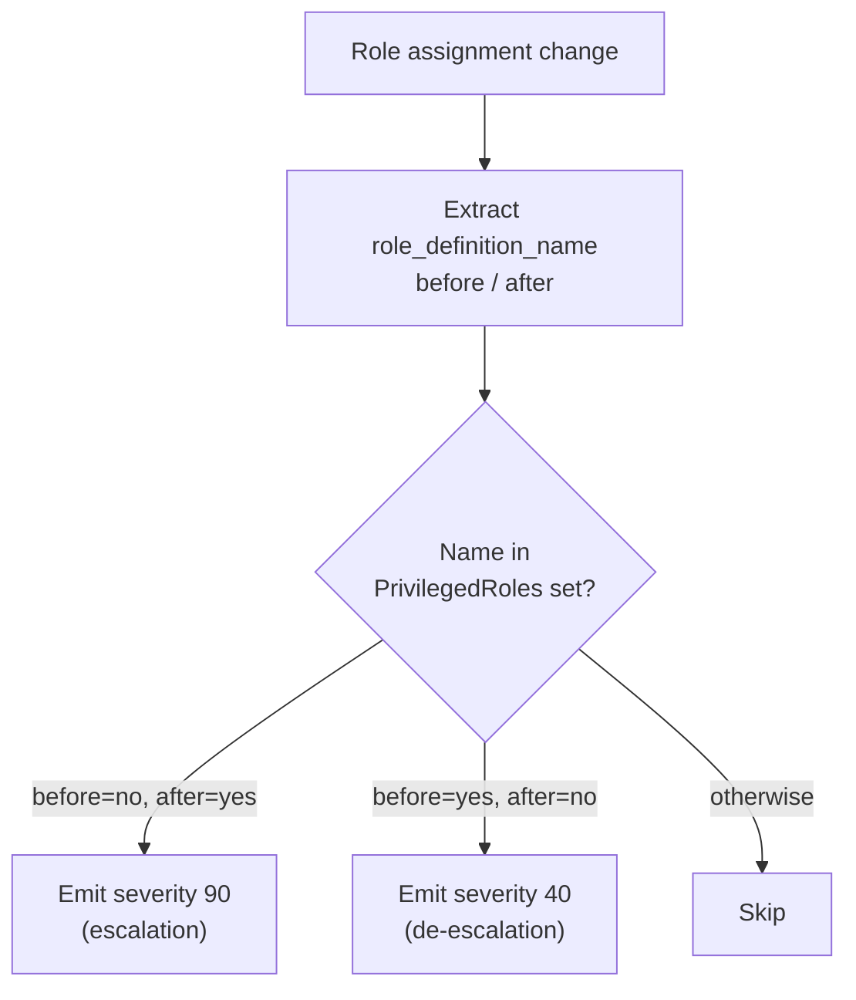
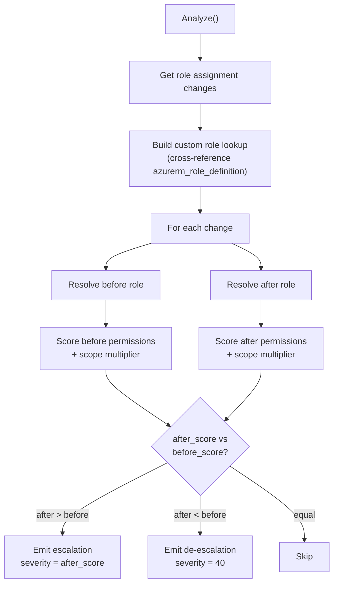
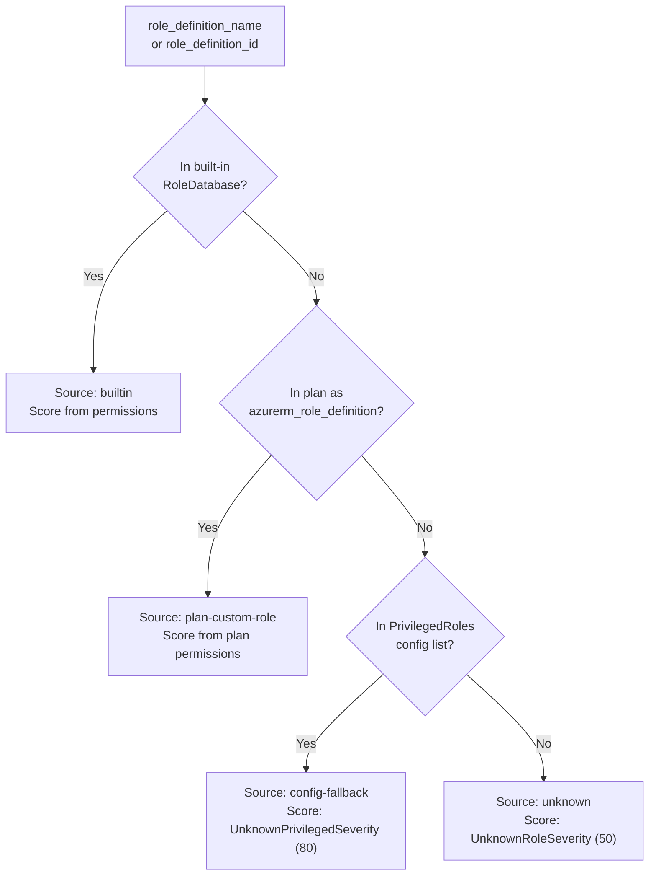
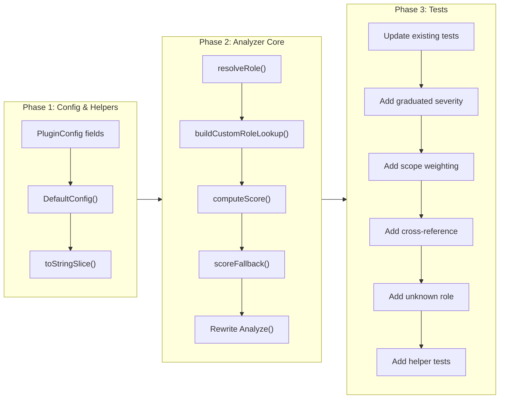

# Privilege Escalation Analyzer Rewrite

## Change Summary

Rewrite the privilege escalation analyzer to use permission-based scoring, scope weighting, and custom role cross-referencing. This is the integration CR that composes CR-0014 (scope), CR-0015 (role database), and CR-0016 (scoring) into a rewritten `Analyze()` method that replaces flat severity with graduated, context-aware scoring.

## Motivation and Background

ADR-0006 and the preceding CRs (CR-0014 through CR-0016) provide three independent building blocks: scope parsing, role data, and permission scoring. This CR wires them into the analyzer, replacing the naive name-based check with a four-level role resolution chain, graduated severity, and the first cross-resource analysis in the codebase.

## Change Drivers

* CR-0014, CR-0015, CR-0016 are ready to integrate — the building blocks are complete
* The current analyzer emits flat severity 90 for all escalations, making triage impossible
* Custom `azurerm_role_definition` resources in plans are invisible to the analyzer
* The `PrivilegedRoles` config must be preserved as a backward-compatible fallback

## Current State

The analyzer in `plugins/azurerm/privilege.go:39-109` checks `role_definition_name` against a flat set from `config.PrivilegedRoles`. All escalations get severity 90, all de-escalations get 40. No scope inspection. No permission analysis. No custom role detection.

### Current State Diagram



## Proposed Change

### New Analyzer Flow



### Role Resolution Chain



### Custom Role Cross-Reference

Within `Analyze()`, call `runner.GetResourceChanges(["azurerm_role_definition"])` to find custom roles in the same Terraform plan. Parse their `permissions` blocks (`actions`, `not_actions`, `data_actions`, `not_data_actions` in plan JSON). Build a lookup map by role name. This is the first cross-resource analysis in the codebase — the SDK supports it but no existing analyzer uses it.

### Config Changes

Add to `PluginConfig` in `plugins/azurerm/plugin.go`:

| Field | Type | Default | Purpose |
|-------|------|---------|---------|
| `RoleDatabase` | `*RoleDatabase` | `DefaultRoleDatabase()` | Built-in role lookup (injectable for testing) |
| `UnknownPrivilegedSeverity` | `int` | 80 | Severity for roles in PrivilegedRoles but not in DB |
| `UnknownRoleSeverity` | `int` | 50 | Severity for completely unknown roles |
| `CrossReferenceCustomRoles` | `bool` | true | Enable/disable azurerm_role_definition lookup |

Existing `PrivilegedRoles` is preserved as the third-level fallback.

### Helper Addition

Add `toStringSlice(v interface{}) []string` to `helpers.go` for parsing permission arrays from plan JSON.

### Rich Metadata

All decisions include:

| Field | Type | Description |
|-------|------|-------------|
| `before_score` | int | Permission score of the before-state role |
| `after_score` | int | Permission score of the after-state role |
| `scope` | string | ARM scope path |
| `scope_level` | string | Parsed scope level name |
| `score_factors` | []string | Human-readable reasons for the score |
| `role_source` | string | `"builtin"`, `"plan-custom-role"`, `"config-fallback"`, `"unknown"` |
| `analyzer` | string | `"privilege-escalation"` |
| `direction` | string | `"escalation"` or `"de-escalation"` |
| `before_role` | string | Role name before change |
| `after_role` | string | Role name after change |

### Severity Semantics

Severity represents the **absolute risk of the after-state role** (not the delta). Reader-to-Owner and Contributor-to-Owner both emit Owner's score because the end state is identical. Metadata includes both scores for delta-aware consumers. De-escalation always emits severity 40.

## Requirements

### Functional Requirements

1. The analyzer **MUST** resolve roles through the four-level fallback chain: built-in DB, plan custom role, config fallback, unknown
2. The analyzer **MUST** use `ScorePermissions()` from CR-0016 for roles resolved from the database or plan
3. The analyzer **MUST** apply scope weighting via `ApplyScopeMultiplier()` from CR-0014
4. The analyzer **MUST** cross-reference `azurerm_role_definition` resources in the plan when `CrossReferenceCustomRoles` is true
5. The analyzer **MUST** parse custom role `permissions` blocks from plan JSON using the `not_actions` field name (Terraform snake_case, not Azure camelCase)
6. The analyzer **MUST** emit severity equal to the after-role's scope-weighted permission score for escalations
7. The analyzer **MUST** emit severity 40 for de-escalations regardless of the from-role
8. The analyzer **MUST** include all metadata fields: `before_score`, `after_score`, `scope`, `scope_level`, `score_factors`, `role_source`, `analyzer`, `direction`, `before_role`, `after_role`
9. The analyzer **MUST** preserve backward compatibility — roles in `PrivilegedRoles` that are not in the database are detected with `UnknownPrivilegedSeverity`
10. Completely unknown roles **MUST** be flagged with `UnknownRoleSeverity` and `role_source: "unknown"`
11. The `DefaultConfig()` **MUST** set `RoleDatabase` to `DefaultRoleDatabase()`, `UnknownPrivilegedSeverity` to 80, `UnknownRoleSeverity` to 50, `CrossReferenceCustomRoles` to true
12. `toStringSlice` **MUST** handle nil, non-slice, and mixed-type inputs gracefully

### Non-Functional Requirements

1. Cross-resource lookup failure (error from `GetResourceChanges` for role definitions) **MUST** be handled gracefully — log and continue, do not fail the analysis
2. The analyzer **MUST** make exactly one `GetResourceChanges` call for role definitions per `Analyze()` invocation (not per role assignment)

## Affected Components

* `plugins/azurerm/privilege.go` (modified) — complete rewrite of `Analyze()`, add `resolveRole()`, `buildCustomRoleLookup()`, `computeScore()`, `scoreFallback()`
* `plugins/azurerm/privilege_test.go` (modified) — rewrite all tests
* `plugins/azurerm/plugin.go` (modified) — new config fields + defaults
* `plugins/azurerm/helpers.go` (modified) — add `toStringSlice()`

## Scope Boundaries

### In Scope

* Rewrite `Analyze()` with role resolution chain, permission scoring, scope weighting
* Custom role cross-reference from plan (`azurerm_role_definition`)
* Config additions for `RoleDatabase`, severity defaults, cross-reference toggle
* `toStringSlice()` helper for plan JSON parsing
* All test rewrites and additions
* Enhanced mock runner to support pattern-based change sets (needed for cross-reference tests)

### Out of Scope ("Here, But Not Further")

* Scope parsing implementation — provided by CR-0014
* Permission scoring implementation — provided by CR-0016
* Role database and types — provided by CR-0015
* Nightly CI refresh of role data — operational concern, separate workflow CR
* HCL config parsing for new fields — deferred to ApplyConfig integration
* Changes to `main.go` or the plugin entry point

## Implementation Approach

### Implementation Flow



## Test Strategy

### Tests to Add

| Test File | Test Name | Description | Inputs | Expected Output |
|-----------|-----------|-------------|--------|-----------------|
| `privilege_test.go` | `TestGraduatedSeverity_OwnerVsContributor` | Owner scores higher than Contributor | Reader->Owner vs Reader->Contributor | Owner ~95, Contributor ~70 |
| `privilege_test.go` | `TestScopeWeighting_SubVsRG` | Subscription > resource group | Same role, different scopes | Sub severity > RG severity |
| `privilege_test.go` | `TestScopeWeighting_ManagementGroup` | Mgmt group applies 1.1x | Owner at mgmt group | Severity > subscription |
| `privilege_test.go` | `TestScopeWeighting_Resource` | Resource applies 0.6x | Owner at resource scope | Severity ~57 |
| `privilege_test.go` | `TestCustomRoleCrossReference` | Custom role detected from plan | `azurerm_role_definition` with auth actions | Decision with `role_source: "plan-custom-role"` |
| `privilege_test.go` | `TestCustomRoleCrossReference_Disabled` | Config disables cross-ref | `CrossReferenceCustomRoles: false` | Falls through to fallback |
| `privilege_test.go` | `TestCustomRoleCrossReference_WildcardActions` | Custom role with `*` | Custom role `actions: ["*"]` | Score ~95 |
| `privilege_test.go` | `TestUnknownRole_NotInDB` | Unknown gets moderate severity | Role not in DB or config | Severity 50, `role_source: "unknown"` |
| `privilege_test.go` | `TestUnknownRole_ConfiguredSeverity` | Severity is configurable | `UnknownRoleSeverity: 60` | Severity 60 |
| `privilege_test.go` | `TestConfigFallback` | PrivilegedRoles as fallback | Role in config, not in DB | Severity 80, `role_source: "config-fallback"` |
| `privilege_test.go` | `TestRichMetadata` | All metadata fields present | Any escalation | All fields in metadata |
| `privilege_test.go` | `TestRoleResolvedByID` | Resolves via role_definition_id | Assignment with ID not name | Correct role from DB |
| `plugin_test.go` | `TestDefaultConfig_NewFields` | Defaults set correctly | `DefaultConfig()` | All new fields have expected defaults |
| `helpers_test.go` | `TestToStringSlice_Valid` | Converts interface slice | `[]interface{}{"a","b"}` | `[]string{"a","b"}` |
| `helpers_test.go` | `TestToStringSlice_Nil` | Handles nil | nil | nil |
| `helpers_test.go` | `TestToStringSlice_NonSlice` | Handles non-slice | `"string"` | nil |
| `helpers_test.go` | `TestToStringSlice_MixedTypes` | Skips non-strings | `[]interface{}{"a", 42}` | `[]string{"a"}` |

### Tests to Modify

| Test File | Test Name | Current Behavior | New Behavior | Reason |
|-----------|-----------|------------------|--------------|--------|
| `privilege_test.go` | `TestPrivilegeEscalation_ReaderToOwner` | Severity 90, basic metadata | Severity ~95, enriched metadata with scores, scope, factors | Graduated scoring |
| `privilege_test.go` | `TestPrivilegeEscalation_OwnerToReader` | Severity 40, basic metadata | Severity 40, enriched metadata | Metadata enrichment |
| `privilege_test.go` | `TestPrivilegeEscalation_NoChange` | 0 decisions | Same, but test uses injected RoleDatabase | Setup change |
| `privilege_test.go` | `TestPrivilegeEscalation_NonPrivilegedChange` | 0 decisions (Reader to "Custom Role") | 1 decision — "Custom Role" resolved as unknown (severity 50) > Reader (~15) | Analyzer now scores all role changes |
| `privilege_test.go` | `TestPrivilegeEscalation_CustomRoles` | Config overrides detection | Config serves as fallback; DB is primary | PrivilegedRoles is now fallback |
| `privilege_test.go` | `TestPrivilegeEscalation_NewAssignment` | Severity 90 | Severity ~95 with `before_score: 0` | Graduated scoring |
| `privilege_test.go` | `TestPrivilegeEscalation_GetResourceChangesError` | Error propagation | Same, but accounts for two GetResourceChanges calls | Cross-reference adds second call |
| `privilege_test.go` | `TestPrivilegeEscalation_EmitDecisionError` | Error propagation | Same with injected RoleDatabase | Setup change |
| `privilege_test.go` | `TestPrivilegeEscalation_Name` | Name = "privilege-escalation" | Unchanged | No modification needed |
| `privilege_test.go` | `TestPrivilegeEscalation_RoleRemoval` | Severity 40, de-escalation | Severity 40, enriched metadata | Metadata enrichment |

### Tests to Remove

None — all existing tests are modified, not removed.

### Mock Runner Enhancement

The existing `mockRunner` returns a single set of changes. For cross-reference tests, enhance to support pattern-based dispatch:

```go
type mockRunner struct {
    changesByPattern map[string][]*sdk.ResourceChange
    decisions        []*sdk.Decision
    err              error
    emitErr          error
}
```

## Acceptance Criteria

### AC-1: Graduated severity for built-in roles

```gherkin
Given a plan with Reader->Owner and Reader->Contributor escalations
When the analyzer runs with default RoleDatabase
Then Owner severity is approximately 95
  And Contributor severity is approximately 70
  And Owner severity > Contributor severity
```

### AC-2: Scope weighting

```gherkin
Given Owner at subscription scope and Owner at resource group scope
When the analyzer runs
Then subscription severity > resource group severity
  And subscription uses 1.0x multiplier
  And resource group uses 0.8x multiplier
```

### AC-3: Custom role cross-reference

```gherkin
Given a plan with azurerm_role_definition "Custom Deployer" with actions ["Microsoft.Authorization/roleAssignments/write"]
  And an azurerm_role_assignment changing to "Custom Deployer"
When the analyzer runs with CrossReferenceCustomRoles true
Then a decision is emitted with role_source "plan-custom-role" and severity ~75
```

### AC-4: Unknown role flagged

```gherkin
Given a role not in the database, not in the plan, and not in PrivilegedRoles
When the analyzer runs
Then a decision is emitted with severity 50 and role_source "unknown"
```

### AC-5: Config fallback backward compatibility

```gherkin
Given PrivilegedRoles = ["Custom Admin"] and "Custom Admin" not in the database
When the analyzer processes an escalation to "Custom Admin"
Then a decision is emitted with severity 80 and role_source "config-fallback"
```

### AC-6: De-escalation unchanged

```gherkin
Given Owner->Reader change
When the analyzer runs
Then de-escalation severity is 40 with metadata including before_score and after_score
```

### AC-7: Rich metadata on all decisions

```gherkin
Given any escalation decision
Then metadata includes: before_score, after_score, scope, scope_level, score_factors, role_source, analyzer, direction, before_role, after_role
```

## Quality Standards Compliance

### Verification Commands

```bash
go build ./plugins/azurerm/...
cd plugins/azurerm && go build ./...
go test ./plugins/azurerm/... -v
go test ./plugins/azurerm/... -v -run TestPrivilegeEscalation
go test ./plugins/azurerm/... -race
go vet ./plugins/azurerm/...
go test ./plugins/azurerm/... -coverprofile=coverage.out
go tool cover -func=coverage.out | grep privilege
```

## Risks and Mitigation

### Risk 1: Cross-resource query returns unexpected data

**Likelihood:** medium
**Impact:** medium
**Mitigation:** `buildCustomRoleLookup()` uses `toStringSlice()` which handles nil, non-slice, and mixed types. Malformed role definitions are skipped, not fatal. The `CrossReferenceCustomRoles` config flag provides an escape hatch.

### Risk 2: Behavioral change for PrivilegedRoles users

**Likelihood:** high
**Impact:** low
**Mitigation:** Existing configured roles now detected via config-fallback (severity 80 vs previous 90). The role is still flagged. `UnknownPrivilegedSeverity` is configurable to restore 90 if needed.

### Risk 3: TestPrivilegeEscalation_NonPrivilegedChange behavior change

**Likelihood:** certain
**Impact:** low
**Mitigation:** The test currently expects 0 decisions for Reader->"Custom Role". With the rewrite, "Custom Role" resolves as unknown (severity 50) and Reader is ~15, so this is an escalation. This is correct behavior — unknown roles should not be silently ignored. The test is updated accordingly.

### Risk 4: Mock runner enhancement breaks existing tests

**Likelihood:** medium
**Impact:** medium
**Mitigation:** The enhanced mock runner is backward-compatible. Tests that use the existing `changes` field continue to work. Pattern-based dispatch is additive. All tests are reviewed during the rewrite.

## Dependencies

| Dependency | Provides |
|-----------|----------|
| CR-0014 (scope parsing) | `ParseScopeLevel()`, `ScopeMultiplier()`, `ApplyScopeMultiplier()` |
| CR-0015 (role database) | `RoleDefinition`, `Permission`, `RoleDatabase`, `DefaultRoleDatabase()` |
| CR-0016 (permission scoring) | `ScorePermissions()`, `PermissionScore` |

All three **MUST** be implemented before this CR. They are independent of each other and can be implemented in parallel.

## Estimated Effort

Medium-Large: ~6-8 hours. Config changes (1h), resolution chain (2h), cross-reference (1h), Analyze() rewrite (2h), test rewrite (2h).

## Decision Outcome

Chosen approach: "Single integration CR composing CR-0014, CR-0015, CR-0016 into a rewritten analyzer", because the four capabilities are interdependent within `Analyze()`. The resolution chain requires all fallback levels to be present simultaneously.

## Related Items

* Architecture decision: [ADR-0006](../adr/ADR-0006-permission-based-privilege-escalation-detection.md)
* Change request: [CR-0014](CR-0014-arm-scope-parsing-and-weighting.md) — scope parsing (dependency)
* Change request: [CR-0015](CR-0015-embedded-azure-role-database.md) — role database (dependency)
* Change request: [CR-0016](CR-0016-permission-scoring-algorithm.md) — scoring algorithm (dependency)
* Change request: [CR-0011](CR-0011-deep-inspection-plugin-example.md) — original plugin implementation
