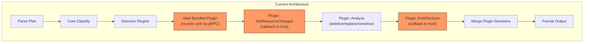
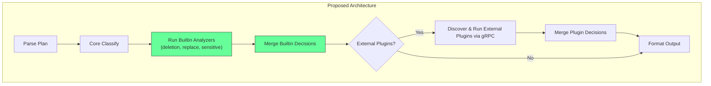
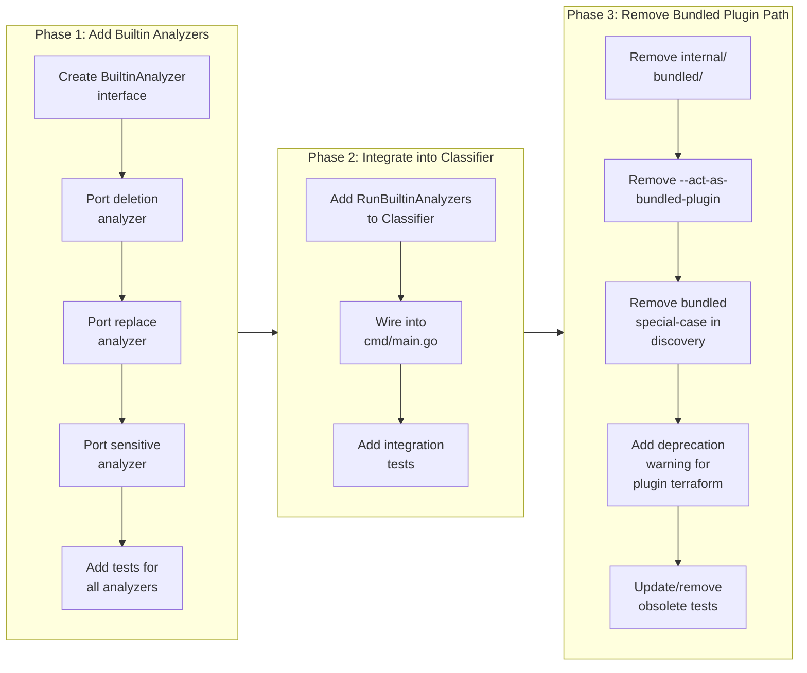

# Inline Builtin Analyzers into Core Classification Engine

## Change Summary

Move the bundled terraform plugin's three analyzers (deletion, replace, sensitive) from the plugin system into the core classification engine in `pkg/classify/`. These analyzers operate on universal Terraform plan concepts (action types and sensitive markers) and match all resources with `["*"]`, making them core classification logic rather than provider-specific plugin behavior. This eliminates the gRPC self-re-exec path for bundled functionality while preserving the plugin system for actual third-party use.

## Motivation and Background

The current architecture routes all three bundled analyzers through the full plugin system: the host binary re-executes itself with `--act-as-bundled-plugin`, establishes a gRPC connection via `hashicorp/go-plugin`, negotiates versions, and then the plugin calls back to the host through `RunnerService` to get the same resource changes the host already has in memory. This is architecturally heavyweight for what amounts to a few conditional checks on action arrays and sensitive markers.

The analyzers inspect universal Terraform plan fields (`Actions`, `BeforeSensitive`, `AfterSensitive`) available on every resource regardless of provider. They are functionally equivalent to the existing pattern-matching rules in `pkg/classify/classifier.go` — just slightly richer logic that can't be expressed as glob patterns alone.

## Change Drivers

* **Architectural simplicity** — The self-re-exec gRPC round-trip adds ~200ms latency and significant code complexity for logic that operates on data already in the host process's memory
* **Code duplication** — The analyzer logic is duplicated across `plugins/terraform/` and `internal/bundled/`, creating two copies that must stay in sync
* **Conceptual clarity** — Deletion detection, replacement detection, and sensitive change detection are fundamental Terraform plan analysis concerns, not provider-specific behaviors. They belong alongside the core rule engine
* **Plugin system integrity** — Keeping generic analysis in the plugin system dilutes the purpose of plugins, which is deep provider-specific inspection (e.g., IAM policy analysis, permission scoring)

## Current State

The classification pipeline has two phases:

1. **Core classification** — `Classifier.Classify()` applies HCL-configured glob rules to resource changes
2. **Plugin classification** — `Host.RunAnalysis()` spawns plugin processes via gRPC, collects their decisions, then `Classifier.AddPluginDecisions()` merges results by precedence

The bundled terraform plugin follows this execution path:

```
main.go:run()
  ├─ classifier.Classify(changes)           ← Core rules
  ├─ host.DiscoverAndStart(selfPath)        ← Finds plugins
  │    └─ discovery.go: selfPath used for bundled plugin
  ├─ host.startPlugin("terraform", plugin)  ← exec.Command(selfPath, "--act-as-bundled-plugin")
  │    └─ goplugin.NewClient(...)           ← gRPC handshake
  ├─ host.RunAnalysis(changes)
  │    └─ runPluginAnalysis()
  │         ├─ client.Client() → rpcClient.Dispense()
  │         ├─ PluginService.GetPluginInfo() ← Version check
  │         ├─ PluginService.ApplyConfig()
  │         └─ PluginService.Analyze(brokerID)
  │              └─ Plugin calls back:
  │                   ├─ RunnerService.GetResourceChanges(["*"])  ← Gets same data host already has
  │                   └─ RunnerService.EmitDecision(...)          ← Sends back to host
  └─ classifier.AddPluginDecisions(result, pluginDecisions)
```

### Current State Diagram



### Affected Files (Current)

| File | Role |
|------|------|
| `internal/bundled/terraform.go` | Duplicated analyzer code + `ServeTerraform()` entry point |
| `plugins/terraform/deletion.go` | Standalone deletion analyzer |
| `plugins/terraform/replace.go` | Standalone replace analyzer |
| `plugins/terraform/sensitive.go` | Standalone sensitive analyzer |
| `plugins/terraform/plugin.go` | Plugin set configuration |
| `plugins/terraform/main.go` | Plugin binary entry point |
| `cmd/tfclassify/main.go` | `--act-as-bundled-plugin` flag + `runBundledPlugin()` |
| `pkg/plugin/discovery.go` | Special-case bundled plugin discovery |
| `pkg/plugin/loader.go` | gRPC plugin lifecycle (used by bundled + external) |

## Proposed Change

Introduce a `BuiltinAnalyzer` interface and registry in `pkg/classify/` that runs analyzers directly in-process after core rule classification. The three analyzers (deletion, replace, sensitive) become builtin analyzers that operate on `plan.ResourceChange` directly, without the SDK/gRPC indirection.

### Proposed State Diagram



### New Component: `pkg/classify/analyzers.go`

A new file containing the `BuiltinAnalyzer` interface and registry:

```go
// BuiltinAnalyzer inspects plan changes and produces additional classification decisions.
type BuiltinAnalyzer interface {
    Name() string
    Analyze(changes []plan.ResourceChange) []ResourceDecision
}
```

The classifier gains a `RunBuiltinAnalyzers()` method that runs all registered analyzers and merges their decisions using the existing `AddPluginDecisions()` precedence logic (renamed to `MergeDecisions()`).

### New Component: `pkg/classify/builtin/`

Three files porting the analyzer logic to operate on `plan.ResourceChange` directly:

- `deletion.go` — Detects standalone deletes (delete without create)
- `replace.go` — Detects replacements (both delete and create)
- `sensitive.go` — Detects changes to sensitive-marked attributes

These use `plan.ResourceChange` fields directly instead of going through `sdk.ResourceChange` and `sdk.Runner`.

## Requirements

### Functional Requirements

1. The system **MUST** detect standalone resource deletions (actions containing "delete" without "create") and produce a `ResourceDecision` with `MatchedRule` indicating the builtin analyzer name and reason
2. The system **MUST** detect resource replacements (actions containing both "delete" and "create") and produce a `ResourceDecision` with `MatchedRule` indicating the builtin analyzer name and reason
3. The system **MUST** detect changes to sensitive attributes (walking `BeforeSensitive`/`AfterSensitive` markers) and produce a `ResourceDecision` listing affected attribute names without exposing their values
4. The system **MUST** merge builtin analyzer decisions with core rule decisions using the same precedence logic currently used by `AddPluginDecisions()`
5. The system **MUST** run builtin analyzers after core rule classification and before external plugin analysis
6. The system **MUST** preserve the existing behavior where builtin analyzer decisions use the `defaults.unclassified` classification (since the current plugin emits empty classification strings)
7. The system **MUST** remove the `--act-as-bundled-plugin` flag, `runBundledPlugin()` function, and `internal/bundled/` package
8. The system **MUST** remove the bundled plugin special-case from `pkg/plugin/discovery.go`
9. The system **MUST** keep the external plugin system (`pkg/plugin/`, `sdk/`, `proto/`) fully functional for third-party plugins
10. The system **MUST** keep the `plugin "terraform"` HCL config block operational as a no-op (accepted but ignored) to avoid breaking existing configuration files, logging a deprecation warning when encountered

### Non-Functional Requirements

1. The system **MUST** maintain all existing classification outcomes — no behavioral regression for any plan input
2. The system **MUST** compile and pass all tests with zero failures
3. The system **MUST** pass `go vet ./...` and any configured linters

## Affected Components

* `pkg/classify/` — New builtin analyzer interface, registry, and implementations
* `cmd/tfclassify/main.go` — Remove bundled plugin path, add builtin analyzer invocation
* `internal/bundled/` — Removed entirely
* `plugins/terraform/` — Standalone binary kept for reference but decoupled from core build
* `pkg/plugin/discovery.go` — Remove bundled plugin special-case
* `pkg/config/` — Deprecation warning for `plugin "terraform"` block

## Scope Boundaries

### In Scope

* Moving deletion, replace, and sensitive analyzer logic into `pkg/classify/`
* Creating the `BuiltinAnalyzer` interface and registration mechanism
* Removing the bundled plugin re-exec path (`--act-as-bundled-plugin`, `internal/bundled/`)
* Removing the bundled plugin special-case from discovery
* Updating `cmd/tfclassify/main.go` to run builtin analyzers directly
* Comprehensive tests for all moved analyzers in their new location
* Deprecation handling for `plugin "terraform"` in HCL config

### Out of Scope ("Here, But Not Further")

* Modifying the external plugin system (`pkg/plugin/loader.go`, `sdk/`, `proto/`) — remains unchanged for third-party plugins
* Adding configurability for builtin analyzers via HCL — deferred to a future CR
* Removing `plugins/terraform/` directory — kept as a reference implementation for plugin authors
* Changes to output formatting or exit code logic
* Changes to the `sdk/` module or gRPC protocol

## Alternative Approaches Considered

* **Keep bundled plugin, simplify to in-process** — Run the plugin analyzers in-process via the SDK interfaces without gRPC. This was rejected because it still requires the SDK dependency in the core binary and maintains the conceptual confusion of "plugin that isn't really a plugin."
* **Make analyzers HCL-configurable** — Allow users to enable/disable/configure builtin analyzers in HCL. Deferred to future work; the current behavior (always-on) is the correct default and matches existing behavior.
* **Keep `internal/bundled/` as the in-process runner** — Reuse the existing `internal/bundled/` code but bypass gRPC. Rejected because it preserves the duplicated types and SDK dependency; a clean rewrite against `plan.ResourceChange` is simpler.

## Impact Assessment

### User Impact

No user-facing behavioral changes. Classification results remain identical. The `--act-as-bundled-plugin` hidden flag is removed, but it was never part of the public interface. Existing HCL configs with `plugin "terraform"` will continue to work (with a deprecation notice in verbose mode).

### Technical Impact

* **Removed dependencies from main binary path**: The bundled plugin re-exec path is eliminated, reducing startup latency
* **Simplified debugging**: Analyzer logic runs in-process, making it easier to debug with standard Go tooling
* **Reduced code duplication**: Single source of truth for each analyzer instead of duplicated across `internal/bundled/` and `plugins/terraform/`
* **No breaking changes** to the external plugin API, SDK, or gRPC protocol

### Business Impact

Reduced maintenance burden and clearer architecture for contributors. The plugin system's purpose becomes unambiguous: it exists for third-party provider-specific analysis.

## Implementation Approach

The implementation follows three phases to ensure correctness at each step.

### Implementation Flow



### Phase 1: Create Builtin Analyzer Package

1. Create `pkg/classify/analyzer.go` — Define `BuiltinAnalyzer` interface
2. Create `pkg/classify/builtin/deletion.go` — Port `isStandaloneDelete()` logic
3. Create `pkg/classify/builtin/replace.go` — Port `isReplace()` logic
4. Create `pkg/classify/builtin/sensitive.go` — Port `findSensitiveChanges()`, `asBoolMap()`, `hasAttributeChanged()` logic
5. Create comprehensive tests for each analyzer

### Phase 2: Integrate into Classification Pipeline

1. Add `RunBuiltinAnalyzers(changes)` method to `Classifier`
2. Update `cmd/tfclassify/main.go` to call builtin analyzers between `Classify()` and plugin analysis
3. Add integration tests verifying end-to-end behavior matches current output

### Phase 3: Remove Bundled Plugin Infrastructure

1. Delete `internal/bundled/terraform.go` and `internal/bundled/` directory
2. Remove `--act-as-bundled-plugin` flag from `cmd/tfclassify/main.go`
3. Remove `runBundledPlugin()` function
4. Remove bundled plugin special-case from `pkg/plugin/discovery.go`
5. Add deprecation warning when `plugin "terraform"` with empty source is encountered
6. Remove/update tests that depended on bundled plugin behavior

## Test Strategy

### Tests to Add

| Test File | Test Name | Description | Inputs | Expected Output |
|-----------|-----------|-------------|--------|-----------------|
| `pkg/classify/builtin/deletion_test.go` | `TestDeletionAnalyzer_StandaloneDelete` | Detects standalone delete | `ResourceChange{Actions: ["delete"]}` | 1 decision with reason mentioning deletion |
| `pkg/classify/builtin/deletion_test.go` | `TestDeletionAnalyzer_ReplaceNotFlagged` | Does not flag replace operations | `ResourceChange{Actions: ["delete", "create"]}` | 0 decisions |
| `pkg/classify/builtin/deletion_test.go` | `TestDeletionAnalyzer_CreateIgnored` | Ignores creates | `ResourceChange{Actions: ["create"]}` | 0 decisions |
| `pkg/classify/builtin/deletion_test.go` | `TestDeletionAnalyzer_UpdateIgnored` | Ignores updates | `ResourceChange{Actions: ["update"]}` | 0 decisions |
| `pkg/classify/builtin/deletion_test.go` | `TestDeletionAnalyzer_EmptyActions` | Handles empty actions | `ResourceChange{Actions: []}` | 0 decisions |
| `pkg/classify/builtin/deletion_test.go` | `TestDeletionAnalyzer_MultipleResources` | Processes multiple changes | 3 changes: delete, create, update | 1 decision (only delete) |
| `pkg/classify/builtin/replace_test.go` | `TestReplaceAnalyzer_DetectsReplace` | Detects delete+create | `ResourceChange{Actions: ["delete", "create"]}` | 1 decision with replace reason |
| `pkg/classify/builtin/replace_test.go` | `TestReplaceAnalyzer_CreateDeleteOrder` | Detects create+delete order | `ResourceChange{Actions: ["create", "delete"]}` | 1 decision |
| `pkg/classify/builtin/replace_test.go` | `TestReplaceAnalyzer_DeleteOnly` | Does not flag delete-only | `ResourceChange{Actions: ["delete"]}` | 0 decisions |
| `pkg/classify/builtin/replace_test.go` | `TestReplaceAnalyzer_CreateOnly` | Does not flag create-only | `ResourceChange{Actions: ["create"]}` | 0 decisions |
| `pkg/classify/builtin/replace_test.go` | `TestReplaceAnalyzer_EmptyActions` | Handles empty actions | `ResourceChange{Actions: []}` | 0 decisions |
| `pkg/classify/builtin/sensitive_test.go` | `TestSensitiveAnalyzer_DetectsChange` | Detects sensitive attr change | Change with BeforeSensitive+AfterSensitive marking "value" | 1 decision mentioning "value" |
| `pkg/classify/builtin/sensitive_test.go` | `TestSensitiveAnalyzer_NoSensitive` | No sensitive markers | Change with nil sensitive fields | 0 decisions |
| `pkg/classify/builtin/sensitive_test.go` | `TestSensitiveAnalyzer_NoValueExposed` | Reason does not leak values | Change with sensitive value "super-secret" | Decision reason does not contain "super-secret" |
| `pkg/classify/builtin/sensitive_test.go` | `TestSensitiveAnalyzer_NewAttribute` | Newly sensitive attribute | Before: nil sensitive, After: sensitive | 1 decision |
| `pkg/classify/builtin/sensitive_test.go` | `TestSensitiveAnalyzer_RemovedAttribute` | Removed sensitive attribute | Before: sensitive, After: nil | 1 decision |
| `pkg/classify/builtin/sensitive_test.go` | `TestSensitiveAnalyzer_UnchangedValue` | Sensitive but unchanged value | Before and After same value | 0 decisions |
| `pkg/classify/builtin/sensitive_test.go` | `TestSensitiveAnalyzer_MultipleSensitive` | Multiple sensitive attrs | 2 changed sensitive attrs | 1 decision mentioning both |
| `pkg/classify/builtin/sensitive_test.go` | `TestAsBoolMap_Nil` | Nil input | `nil` | `nil` |
| `pkg/classify/builtin/sensitive_test.go` | `TestAsBoolMap_NotMap` | Non-map input | `"string"` | `nil` |
| `pkg/classify/builtin/sensitive_test.go` | `TestAsBoolMap_ValidMap` | Valid map input | `map[string]interface{}` | Same map |
| `pkg/classify/builtin/sensitive_test.go` | `TestHasAttributeChanged_BothNil` | Both nil | `nil, nil` | `false` |
| `pkg/classify/builtin/sensitive_test.go` | `TestHasAttributeChanged_Added` | Attribute added | Before: missing, After: present | `true` |
| `pkg/classify/builtin/sensitive_test.go` | `TestHasAttributeChanged_Removed` | Attribute removed | Before: present, After: missing | `true` |
| `pkg/classify/builtin/sensitive_test.go` | `TestHasAttributeChanged_Changed` | Value changed | Before: "old", After: "new" | `true` |
| `pkg/classify/builtin/sensitive_test.go` | `TestHasAttributeChanged_Unchanged` | Value unchanged | Before: "same", After: "same" | `false` |
| `pkg/classify/analyzer_test.go` | `TestRunBuiltinAnalyzers_Integration` | Full pipeline with all analyzers | Mix of delete, replace, sensitive, update | Correct decisions for each type |
| `pkg/classify/analyzer_test.go` | `TestRunBuiltinAnalyzers_MergePrecedence` | Builtin decisions merge correctly | Core=standard, builtin=critical for same resource | Result upgraded to critical |
| `pkg/classify/analyzer_test.go` | `TestRunBuiltinAnalyzers_NoChanges` | Empty changes | `[]plan.ResourceChange{}` | 0 decisions, no errors |
| `pkg/classify/analyzer_test.go` | `TestRunBuiltinAnalyzers_NoTriggers` | Changes with no analyzer triggers | `ResourceChange{Actions: ["update"]}` only | 0 builtin decisions |

### Tests to Modify

| Test File | Test Name | Current Behavior | New Behavior | Reason for Change |
|-----------|-----------|------------------|--------------|-------------------|
| `pkg/classify/classifier_test.go` | `TestClassify_WithPluginDecisions` | Tests AddPluginDecisions name | Rename method to `MergeDecisions` if applicable | Method renamed for clarity |
| `pkg/classify/classifier_test.go` | `TestClassify_PluginDecisionsWithEmptyClassification` | Tests empty classification from plugins | Same logic but also covers builtin | Builtin analyzers emit empty classification too |

### Tests to Remove

| Test File | Test Name | Reason for Removal |
|-----------|-----------|-------------------|
| `plugins/terraform/deletion_test.go` | All tests | Analyzer logic moved to `pkg/classify/builtin/deletion_test.go`; plugin binary retained only as reference |
| `plugins/terraform/replace_test.go` | All tests | Analyzer logic moved to `pkg/classify/builtin/replace_test.go` |
| `plugins/terraform/sensitive_test.go` | All tests | Analyzer logic moved to `pkg/classify/builtin/sensitive_test.go` |
| `plugins/terraform/plugin_test.go` | All tests | Plugin set no longer used in core; reference only |
| `pkg/plugin/runner_server_test.go` | `TestEmitDecisionWithMetadata` | Tests bundled plugin emission path that is being removed |

Note: Tests in `pkg/plugin/loader_grpc_test.go` and `pkg/plugin/runner_server_grpc_test.go` remain — they test the external plugin gRPC machinery which is preserved.

## Acceptance Criteria

### AC-1: Standalone deletion detection works as builtin analyzer

```gherkin
Given a Terraform plan with a resource having actions ["delete"]
When tfclassify classifies the plan
Then the resource receives a decision with MatchedRule containing "builtin: deletion"
  And the decision reason mentions the resource is being deleted
```

### AC-2: Replacement detection works as builtin analyzer

```gherkin
Given a Terraform plan with a resource having actions ["delete", "create"]
When tfclassify classifies the plan
Then the resource receives a decision with MatchedRule containing "builtin: replace"
  And the decision reason mentions the resource will be replaced
```

### AC-3: Sensitive attribute detection works as builtin analyzer

```gherkin
Given a Terraform plan with a resource having changed sensitive attributes
  And the BeforeSensitive field marks "password" as true
  And the Before and After values for "password" differ
When tfclassify classifies the plan
Then the resource receives a decision with MatchedRule containing "builtin: sensitive"
  And the decision reason mentions "password"
  And the decision reason does not contain the actual password values
```

### AC-4: Builtin analyzers merge with core rules by precedence

```gherkin
Given a configuration with precedence ["critical", "standard", "auto"]
  And a resource classified as "standard" by core rules
  And the same resource flagged by a builtin analyzer with empty classification (mapping to "standard")
When the decisions are merged
Then the resource retains the highest-precedence classification
```

### AC-5: External plugins continue to work

```gherkin
Given a configuration with an external plugin declared
  And the external plugin is installed
When tfclassify runs classification
Then the external plugin is discovered and started via gRPC
  And the external plugin's decisions are merged with core and builtin decisions
```

### AC-6: Bundled plugin path is removed

```gherkin
Given the tfclassify binary is built
When the binary is invoked with --act-as-bundled-plugin
Then the flag is not recognized
  And the binary exits with an error
```

### AC-7: Existing config files continue to work

```gherkin
Given an HCL configuration file containing plugin "terraform" { enabled = true }
When tfclassify loads the configuration
Then the configuration loads without error
  And in verbose mode a deprecation notice is logged
  And builtin analyzers run regardless of the plugin block presence
```

### AC-8: No behavioral regression in classification output

```gherkin
Given any Terraform plan JSON file
When classified by the current version (with bundled plugin)
  And classified by the new version (with builtin analyzers)
Then both versions produce identical classification results
  And both versions produce identical exit codes
```

### AC-9: Create-only and update-only resources are not flagged by deletion or replace analyzers

```gherkin
Given a Terraform plan with resources having only ["create"] or ["update"] actions
When tfclassify classifies the plan
Then no builtin deletion or replace decisions are emitted for those resources
```

### AC-10: Unchanged sensitive attributes are not flagged

```gherkin
Given a Terraform plan with a resource having sensitive attributes
  And the sensitive attribute values are identical in Before and After
When tfclassify classifies the plan
Then no builtin sensitive decision is emitted for that resource
```

## Quality Standards Compliance

### Build & Compilation

- [ ] Code compiles/builds without errors
- [ ] No new compiler warnings introduced

### Linting & Code Style

- [ ] All linter checks pass with zero warnings/errors
- [ ] Code follows project coding conventions and style guides
- [ ] Any linter exceptions are documented with justification

### Test Execution

- [ ] All existing tests pass after implementation
- [ ] All new tests pass
- [ ] Test coverage meets project requirements for changed code

### Documentation

- [ ] Inline code documentation updated where applicable
- [ ] API documentation updated for any API changes
- [ ] User-facing documentation updated if behavior changes

### Code Review

- [ ] Changes submitted via pull request
- [ ] PR title follows Conventional Commits format
- [ ] Code review completed and approved
- [ ] Changes squash-merged to maintain linear history

### Verification Commands

```bash
# Build verification
go build ./...

# Vet verification
go vet ./...

# Test execution
go test ./pkg/classify/... -v -count=1

# Full test suite
go test ./... -count=1

# Verify no bundled plugin references remain in main binary path
grep -r "act-as-bundled-plugin" cmd/ internal/ && echo "FAIL: bundled references remain" || echo "PASS"
```

## Risks and Mitigation

### Risk 1: Behavioral regression in classification outcomes

**Likelihood:** low
**Impact:** high
**Mitigation:** Port analyzer logic verbatim from `internal/bundled/terraform.go`, not rewriting. Add integration tests comparing old and new outputs on the same plan inputs. All existing tests must pass.

### Risk 2: Breaking existing HCL configs that declare `plugin "terraform"`

**Likelihood:** medium
**Impact:** medium
**Mitigation:** Keep the `plugin "terraform"` config block accepted (no parse error). When `source` is empty and `name` is `"terraform"`, treat it as a no-op with a deprecation notice in verbose mode.

### Risk 3: External plugin system accidentally broken during removal of bundled path

**Likelihood:** low
**Impact:** high
**Mitigation:** The bundled plugin code path is isolated: `internal/bundled/`, the `--act-as-bundled-plugin` flag, and the `IsBundled` special-case in discovery. None of these touch the external plugin's `exec.Command(plugin.Path)` path. Existing gRPC tests for external plugins are preserved.

## Dependencies

* None — this is a self-contained refactoring with no external dependencies

## Estimated Effort

Phase 1 (Builtin analyzers): ~2 hours
Phase 2 (Integration): ~1 hour
Phase 3 (Cleanup): ~1 hour
Testing & verification: ~1 hour

## Decision Outcome

Chosen approach: "Inline builtin analyzers into `pkg/classify/builtin/`", because it eliminates the gRPC self-re-exec overhead for generic plan analysis, removes duplicated code, and clarifies the plugin system's purpose as a third-party extension point.

## Related Items

* Related change request: CR-0007-bundled-terraform-plugin.md (original bundled plugin implementation — superseded by this CR)
* Related change request: CR-0005-plugin-sdk.md (plugin SDK remains unchanged)
* Related change request: CR-0006-grpc-protocol-and-plugin-host.md (gRPC host remains for external plugins)
