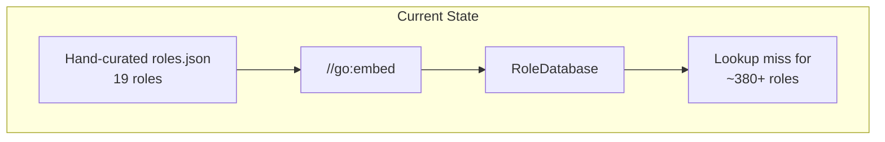
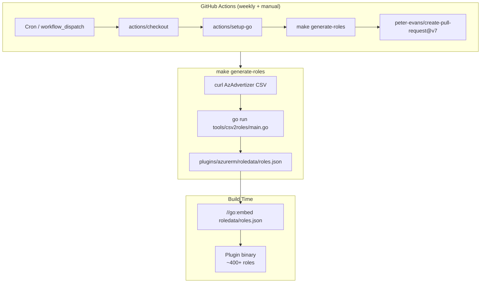
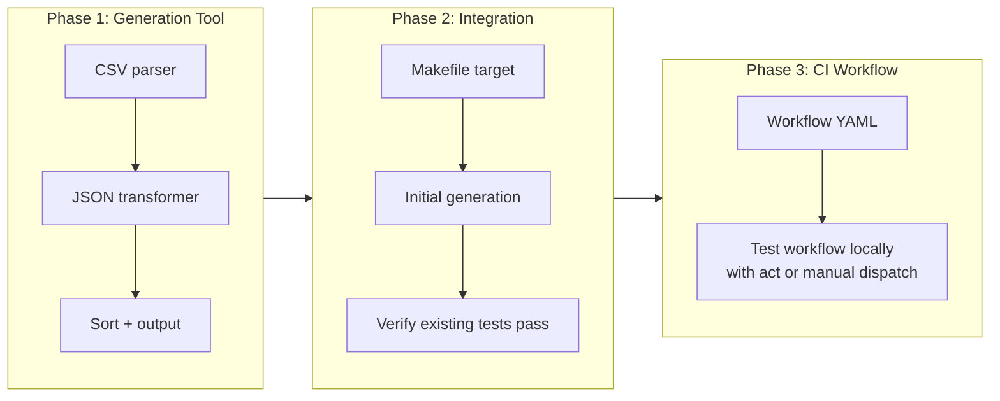

# Automate Azure Built-in Role Data Refresh

## Change Summary

The embedded `roledata/roles.json` contains only 19 Azure built-in roles, while Azure has ~400+. This CR adds a generation tool that fetches the complete role catalogue from AzAdvertizer's public CSV, transforms it to the existing JSON schema, and a GitHub Actions workflow that refreshes the data weekly via automated PR — following the same pattern as [tflint-ruleset-azurerm's maintenance workflow](https://github.com/terraform-linters/tflint-ruleset-azurerm/blob/master/.github/workflows/maintenance.yaml).

## Motivation and Background

CR-0015 implemented the `RoleDatabase` types, `//go:embed` integration, and lookup functions. It also documented the plan for a `tools/csv2roles/main.go` generation tool, a `generate-roles` Makefile target, and a `.github/workflows/refresh-role-data.yml` CI workflow — but none of these were built. The committed `roles.json` is a hand-crafted seed file with 19 roles.

The permission scoring algorithm (CR-0016) relies on the role database to determine what a role can actually do. With only 19 of ~400+ roles present, any `azurerm_role_assignment` referencing a missing role (e.g., "Security Reader", "Billing Reader", "DNS Zone Contributor") gets zero-scored instead of properly classified. This is a critical gap in classification accuracy.

## Change Drivers

* **Classification accuracy:** 95%+ of Azure built-in roles are missing from the database, causing false negatives in permission scoring
* **Data staleness:** Azure adds and modifies built-in roles regularly; manual updates are unsustainable
* **CR-0015 completion:** The generation tooling was part of the original design but was never implemented
* **Precedent:** tflint-ruleset-azurerm successfully uses the same automated refresh pattern

## Current State

The `plugins/azurerm/roledata/roles.json` file contains 19 hand-curated roles. There is no generation tool, no Makefile target for regeneration, and no CI workflow for periodic refresh. The `.github/workflows/` directory does not exist.



## Proposed Change

### 1. Generation Tool (`tools/csv2roles/main.go`)

A standalone Go program that:

1. Reads AzAdvertizer CSV from stdin
2. Parses the CSV (comma-delimited, quoted fields)
3. Transforms each row to the existing `roles.json` schema
4. Outputs sorted JSON to stdout

The AzAdvertizer CSV has these columns:

| Column | Description | Example |
|--------|-------------|---------|
| `RoleId` | Azure GUID | `acdd72a7-3385-48ef-bd42-f606fba81ae7` |
| `RoleName` | Display name | `Reader` |
| `RoleDescription` | Description text | `Lets you view everything...` |
| `RoleActions` | Comma-space separated actions | `*/read, Microsoft.Compute/*/read` |
| `RoleNotActions` | Comma-space separated not-actions | `Microsoft.Authorization/*/Delete` |
| `RoleDataActions` | Comma-space separated data actions | `Microsoft.Storage/storageAccounts/blobServices/containers/blobs/read` |
| `RoleNotDataActions` | Comma-space separated not-data-actions | (often `empty`) |
| `UsedInPolicyCount` | (ignored) | `0` |
| `UsedInPolicy` | (ignored) | (ignored) |

Empty permission fields in the CSV are represented as the literal string `"empty"` and **MUST** be mapped to empty arrays `[]` in JSON output.

Permission strings within each field are delimited by `", "` (comma-space).

### 2. Makefile Target

```makefile
generate-roles:
	curl -sL https://www.azadvertizer.net/azrolesadvertizer-comma.csv | \
		go run tools/csv2roles/main.go > plugins/azurerm/roledata/roles.json
```

### 3. GitHub Actions Workflow (`.github/workflows/refresh-role-data.yml`)

Following the tflint-ruleset-azurerm pattern:

- **Triggers:** Weekly schedule (Monday 00:00 UTC) + manual `workflow_dispatch`
- **Permissions:** `contents: write`, `pull-requests: write`
- **Steps:** Checkout, setup Go, run `make generate-roles`, create PR via `peter-evans/create-pull-request@v7`
- **No Azure credentials required** — data source is a public HTTP endpoint

### 4. Initial Data Population

Run the tool once locally to replace the 19-role seed with the full ~400+ role dataset before merging.

### Proposed Architecture



## Requirements

### Functional Requirements

1. The generation tool **MUST** read CSV data from stdin and write JSON to stdout (Unix pipeline pattern)
2. The generation tool **MUST** produce JSON conforming to the existing schema: `[{"id", "roleName", "description", "roleType", "permissions": [{"actions", "notActions", "dataActions", "notDataActions"}]}]`
3. The generation tool **MUST** filter to `roleType: "BuiltInRole"` only (ignore custom role entries if present)
4. The generation tool **MUST** map the CSV literal `"empty"` to empty JSON arrays `[]`
5. The generation tool **MUST** split permission strings on `", "` (comma-space) to produce string arrays
6. The generation tool **MUST** sort output by `roleName` for stable diffs
7. The generation tool **MUST** set `"roleType": "BuiltInRole"` for all entries
8. The Makefile **MUST** include a `generate-roles` target that pipes `curl` output through the tool
9. The GitHub Actions workflow **MUST** run on a weekly schedule and support manual `workflow_dispatch`
10. The workflow **MUST** create a PR (not push directly to main) when changes are detected
11. The workflow **MUST** work without Azure CLI credentials or service principals
12. The generated `roles.json` **MUST** contain all Azure built-in roles published by AzAdvertizer (currently ~400+)

### Non-Functional Requirements

1. The generation tool **MUST** have no dependencies beyond the Go standard library
2. The generated `roles.json` **MUST** not exceed 2 MB uncompressed (as per CR-0015)
3. The generation tool **MUST** complete within 30 seconds for the full dataset
4. The GitHub Actions workflow **MUST** complete within 5 minutes
5. The generation tool **MUST** exit non-zero and print a diagnostic to stderr if the CSV is malformed or has zero data rows

## Affected Components

* `tools/csv2roles/main.go` (new) — CSV-to-JSON generation tool
* `tools/csv2roles/main_test.go` (new) — tests for the generation tool
* `Makefile` (modified) — add `generate-roles` target and `.PHONY` entry
* `.github/workflows/refresh-role-data.yml` (new) — weekly refresh workflow
* `plugins/azurerm/roledata/roles.json` (regenerated) — full dataset replacing 19-role seed

## Scope Boundaries

### In Scope

* `tools/csv2roles/main.go` — generation tool reading CSV from stdin, writing JSON to stdout
* `tools/csv2roles/main_test.go` — unit tests for CSV parsing and transformation
* `Makefile` — `generate-roles` target
* `.github/workflows/refresh-role-data.yml` — weekly automated PR workflow
* Initial regeneration of `roles.json` with all ~400+ roles

### Out of Scope ("Here, But Not Further")

* **Modifying `roles.go` or `RoleDatabase` types** — existing code handles the schema correctly
* **Custom role resolution** — resolving `azurerm_role_definition` from Terraform plans is CR-0017
* **Permission scoring changes** — CR-0016 consumes the data; this CR only populates it
* **Fallback data sources** — if AzAdvertizer becomes unavailable, a future CR can add `az role definition list` support
* **Data validation against Azure API** — the tool trusts AzAdvertizer's data without cross-referencing

## Alternative Approaches Considered

* **`az role definition list --output json`** — Requires Azure CLI auth, service principal in CI, and Azure subscription. Rejected: adds credential management overhead and excludes contributors without Azure access.
* **`microsoft/azure-roles` GitHub repo** — Only maps role names to GUIDs; does not include permission sets. Rejected: insufficient for permission-based scoring.
* **Scraping Azure docs HTML** — Fragile, undocumented format, complex parsing. Rejected: AzAdvertizer CSV is structured and purpose-built for consumption.
* **Vendor the full Azure REST API spec** — Massive (100MB+), most data irrelevant. Rejected: disproportionate to need.

## Impact Assessment

### User Impact

No user-facing changes. The plugin binary will contain a larger embedded dataset (~480 KB vs ~17 KB), enabling accurate classification of all Azure built-in role assignments. Users who previously received inaccurate or zero-scored results for uncommon roles will now get correct classifications.

### Technical Impact

* Binary size increases by ~460 KB (within the 2 MB limit from CR-0015)
* No breaking changes to any API or behavior
* Existing tests continue to pass — the database schema is unchanged
* The `DefaultRoleDatabase()` singleton initialization takes slightly longer (~50ms vs ~5ms) due to larger dataset, well within the 100ms limit from CR-0015

### Business Impact

* Closes a significant classification accuracy gap affecting all Azure role assignments beyond the 19 seed roles
* Automated refresh ensures the database stays current without manual intervention
* Follows established industry patterns (tflint-ruleset-azurerm), reducing maintenance burden

## Implementation Approach

### Implementation Flow



### Phase 1: Generation Tool

Create `tools/csv2roles/main.go`:

1. Read CSV from stdin using `encoding/csv`
2. Map header row to field indices (resilient to column reordering)
3. For each data row: extract RoleId, RoleName, RoleDescription, parse permission fields
4. Split permission strings on `", "`, filter out `"empty"` sentinel
5. Build `[]RoleDefinition` slice, sort by `roleName`
6. Marshal to indented JSON, write to stdout

### Phase 2: Integration

1. Add `generate-roles` target to `Makefile`
2. Run `make generate-roles` to produce the full `roles.json`
3. Verify all existing tests in `plugins/azurerm/` still pass with the larger dataset

### Phase 3: CI Workflow

Create `.github/workflows/refresh-role-data.yml`:

```yaml
name: refresh-role-data

on:
  schedule:
    - cron: "0 0 * * 1"  # Weekly, Monday 00:00 UTC
  workflow_dispatch:

permissions:
  contents: write
  pull-requests: write

jobs:
  refresh:
    runs-on: ubuntu-latest
    steps:
      - uses: actions/checkout@v4
      - uses: actions/setup-go@v5
        with:
          go-version-file: go.mod
      - run: make generate-roles
      - uses: peter-evans/create-pull-request@v7
        with:
          commit-message: "chore: refresh Azure built-in role data"
          title: "chore: refresh Azure built-in role data"
          branch: auto/refresh-role-data
          delete-branch: true
          body: |
            Automated weekly refresh of Azure built-in role definitions from AzAdvertizer.

            If tests are stuck, manually close and reopen to trigger `on: pull_request` workflows.
```

## Test Strategy

### Tests to Add

| Test File | Test Name | Description | Inputs | Expected Output |
|-----------|-----------|-------------|--------|-----------------|
| `tools/csv2roles/main_test.go` | `TestParseCSV_ValidData` | Parses well-formed CSV with 3 roles | 3-row CSV with headers | 3 `RoleDefinition` structs with correct fields |
| `tools/csv2roles/main_test.go` | `TestParseCSV_EmptyPermissions` | Maps `"empty"` sentinel to `[]` | CSV row with `"empty"` in action fields | Empty slices for all permission fields |
| `tools/csv2roles/main_test.go` | `TestParseCSV_MultiplePermissions` | Splits `", "` delimited permissions | `"a/b/read, c/d/write"` | `["a/b/read", "c/d/write"]` |
| `tools/csv2roles/main_test.go` | `TestParseCSV_EmptyInput` | Rejects CSV with zero data rows | Headers only, no data | Non-nil error |
| `tools/csv2roles/main_test.go` | `TestParseCSV_MissingColumns` | Rejects CSV missing required columns | CSV missing `RoleId` | Non-nil error |
| `tools/csv2roles/main_test.go` | `TestOutputSortedByRoleName` | Output is alphabetically sorted | 3 roles in random order | JSON array sorted by `roleName` |
| `tools/csv2roles/main_test.go` | `TestOutputSchemaMatchesEmbed` | JSON matches `roles.go` struct schema | Generated JSON | Deserializes into `[]RoleDefinition` without error |
| `tools/csv2roles/main_test.go` | `TestIgnoreNonBuiltInColumns` | Extra CSV columns (UsedInPolicy) are ignored | Full CSV row including policy columns | Only role fields in output |

### Tests to Modify

Not applicable — existing `roles_test.go` tests are schema-level and will pass with the larger dataset.

### Tests to Remove

Not applicable.

## Acceptance Criteria

### AC-1: Generation tool produces valid JSON from CSV

```gherkin
Given a valid AzAdvertizer CSV piped to stdin
When tools/csv2roles/main.go is executed
Then it writes a JSON array to stdout
  And the JSON conforms to the existing roledata/roles.json schema
  And the array is sorted alphabetically by roleName
```

### AC-2: Empty permission fields mapped correctly

```gherkin
Given a CSV row where RoleDataActions is "empty"
When the generation tool processes it
Then the output JSON has "dataActions": [] (empty array, not the string "empty")
```

### AC-3: Permission strings split correctly

```gherkin
Given a CSV row where RoleActions is "Microsoft.Compute/*/read, Microsoft.Network/*/read"
When the generation tool processes it
Then the output JSON has "actions": ["Microsoft.Compute/*/read", "Microsoft.Network/*/read"]
```

### AC-4: Full dataset replaces seed data

```gherkin
Given the generation tool has been run with the live AzAdvertizer CSV
When the resulting roles.json is embedded and DefaultRoleDatabase() is called
Then LookupByName succeeds for "Owner", "Contributor", "Reader", "User Access Administrator"
  And LookupByName succeeds for "Security Reader", "DNS Zone Contributor", "Billing Reader"
  And the total number of roles is greater than 300
```

### AC-5: Makefile target works end-to-end

```gherkin
Given a development environment with Go and curl installed
When make generate-roles is executed
Then plugins/azurerm/roledata/roles.json is overwritten with the full dataset
  And go test ./plugins/azurerm/... passes with the new data
```

### AC-6: GitHub Actions workflow creates PR on change

```gherkin
Given the refresh-role-data workflow is triggered (schedule or manual)
When new or updated roles exist in the AzAdvertizer CSV
Then a pull request is created on branch auto/refresh-role-data
  And the PR title is "chore: refresh Azure built-in role data"
  And the PR contains only changes to plugins/azurerm/roledata/roles.json
```

### AC-7: Workflow is idempotent

```gherkin
Given the refresh-role-data workflow runs
When the AzAdvertizer CSV has not changed since the last run
Then no new pull request is created
  And the existing PR (if any) is not updated
```

### AC-8: Malformed input produces clear error

```gherkin
Given an empty file or malformed CSV piped to stdin
When tools/csv2roles/main.go is executed
Then it exits with a non-zero code
  And it prints a diagnostic message to stderr
  And it produces no output on stdout
```

## Quality Standards Compliance

### Build & Compilation

- [ ] Code compiles/builds without errors
- [ ] No new compiler warnings introduced

### Linting & Code Style

- [ ] All linter checks pass with zero warnings/errors
- [ ] Code follows project coding conventions and style guides

### Test Execution

- [ ] All existing tests pass after implementation
- [ ] All new tests pass
- [ ] Test coverage for `tools/csv2roles/main.go` exceeds 90%

### Documentation

- [ ] Inline code documentation updated where applicable
- [ ] Makefile target is self-documenting with comment

### Code Review

- [ ] Changes submitted via pull request
- [ ] PR title follows Conventional Commits format
- [ ] Code review completed and approved
- [ ] Changes squash-merged to maintain linear history

### Verification Commands

```bash
# Build generation tool
go build ./tools/csv2roles/...

# Run generation tool tests
go test ./tools/csv2roles/... -v -race

# Generate full roles.json
make generate-roles

# Verify generated JSON is valid
jq . plugins/azurerm/roledata/roles.json > /dev/null

# Count roles (expect 300+)
jq length plugins/azurerm/roledata/roles.json

# Verify existing azurerm tests still pass with new data
go test ./plugins/azurerm/... -v -race

# Full project build and test
go build ./...
go vet ./...
go test ./... -race
```

## Risks and Mitigation

### Risk 1: AzAdvertizer CSV format changes

**Likelihood:** low
**Impact:** high
**Mitigation:** The generation tool maps columns by header name, not position. If column names change, the tool fails fast with a clear error. The existing committed `roles.json` remains valid — the workflow simply won't produce a PR that week.

### Risk 2: AzAdvertizer becomes unavailable

**Likelihood:** low
**Impact:** medium
**Mitigation:** The embedded `roles.json` is committed to the repository and remains valid. A future CR can add `az role definition list` as a fallback data source.

### Risk 3: CSV contains malformed permission strings

**Likelihood:** low
**Impact:** low
**Mitigation:** The tool validates that permission strings do not contain unexpected characters. Any malformed rows produce a warning on stderr but do not abort the entire generation — the row is skipped.

### Risk 4: Binary size growth

**Likelihood:** certain (expected)
**Impact:** low
**Mitigation:** ~400 roles at ~1.2 KB each = ~480 KB. Well within the 2 MB limit. If Azure adds significantly more roles in the future, the `description` field (unused for scoring) can be stripped to reduce size.

## Dependencies

* CR-0015 (implemented) — provides the `RoleDatabase` types and `//go:embed` integration that this CR populates
* No external service dependencies beyond the public AzAdvertizer CSV endpoint

## Estimated Effort

Small-medium: ~3-4 hours.

* Phase 1 — Generation tool + tests: ~2 hours
* Phase 2 — Makefile target + initial generation: ~30 minutes
* Phase 3 — GitHub Actions workflow: ~30 minutes
* Validation and cleanup: ~30 minutes

## Decision Outcome

Chosen approach: "AzAdvertizer CSV with Go generation tool and weekly GitHub Actions workflow", because it requires zero Azure credentials, follows the proven tflint-ruleset-azurerm pattern, uses the data source already selected in CR-0015, and produces stable deterministic output suitable for automated PRs.

## Related Items

* Predecessor: [CR-0015](CR-0015-embedded-azure-role-database.md) — embedded role database (implemented types, documented but did not implement tooling)
* Consumer: [CR-0016](CR-0016-permission-scoring-algorithm.md) — permission scoring algorithm (benefits from complete role data)
* Reference: [tflint-ruleset-azurerm maintenance workflow](https://github.com/terraform-linters/tflint-ruleset-azurerm/blob/master/.github/workflows/maintenance.yaml)
* Data source: [AzAdvertizer built-in roles CSV](https://www.azadvertizer.net/azrolesadvertizer-comma.csv)

## More Information

### AzAdvertizer CSV Column Reference

Verified on 2026-02-14. The CSV is comma-delimited with all fields quoted. Permission strings within fields are delimited by `", "` (comma-space). Empty permission fields contain the literal string `"empty"` rather than being blank.

### tflint-ruleset-azurerm Pattern

The tflint project uses a near-identical pattern: weekly cron + `workflow_dispatch`, `peter-evans/create-pull-request@v7` for automated PRs, Go tools for data transformation. Their workflow has been running reliably for years, validating this approach.
