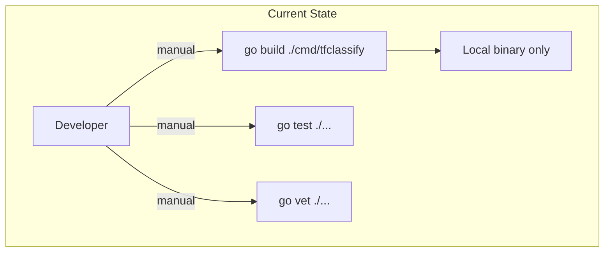
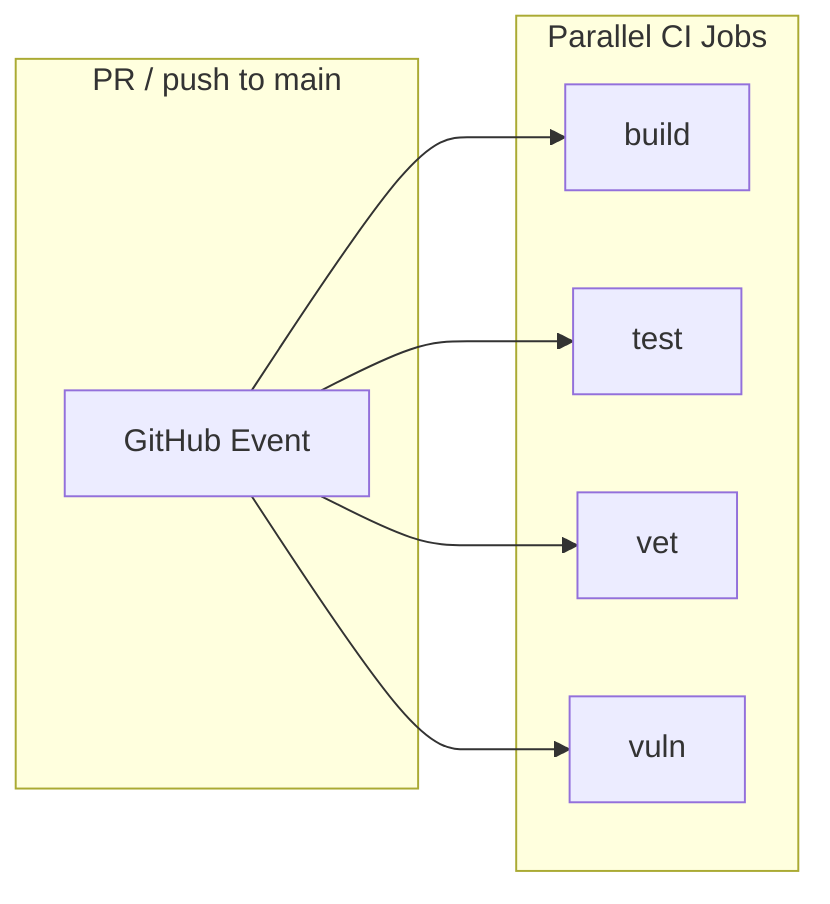
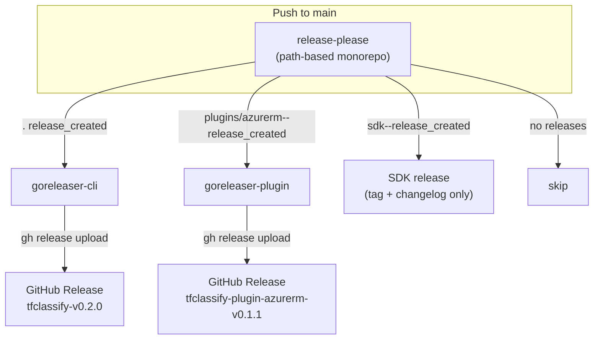
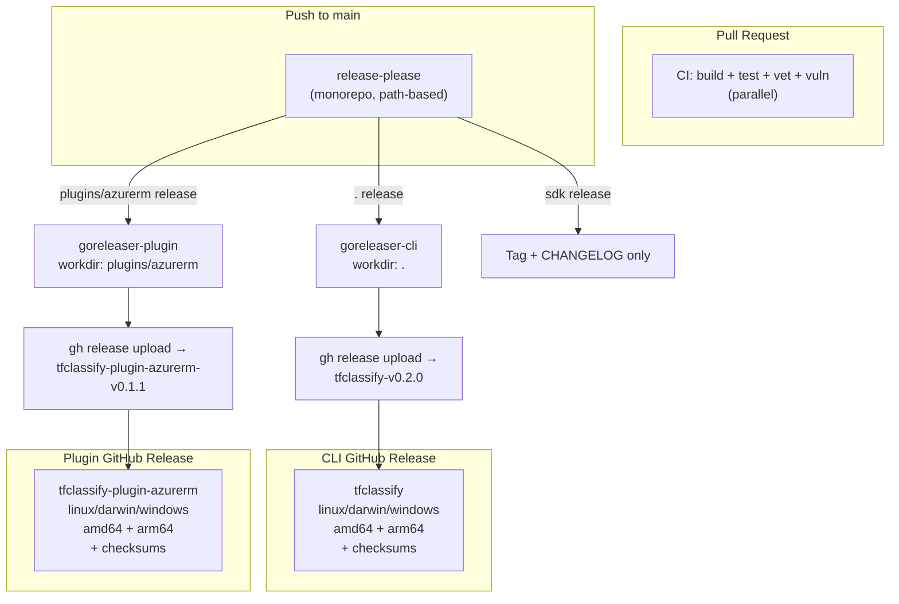
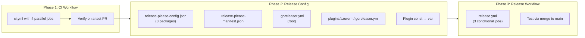

# GitHub Actions CI/CD Workflows

## Change Summary

Add GitHub Actions workflows for continuous integration and release automation. CI runs build, test, vet, and vulnerability checks in parallel on every PR and push to main. Releases are managed per-module: release-please tracks independent versions for each Go workspace module via path-based configuration, and goreleaser builds cross-platform binaries per module using `workdir` and per-module `.goreleaser.yml` configs. Each module with a `main` package gets its own GitHub Release with attached binaries.

## Motivation and Background

The project has no CI/CD infrastructure. All testing, building, and releasing is manual. The Makefile provides `build`, `test`, `vet`, `lint`, and `clean` targets but only builds the root CLI binary — the azurerm plugin has no build target at all. There are no GitHub workflows, no automated releases, and no vulnerability scanning.

The project uses Go workspaces (`go.work`) with three modules that version independently:

| Module | Path | Binary | Version |
|--------|------|--------|---------|
| CLI | `.` (`cmd/tfclassify`) | `tfclassify` | `var Version = "dev"` |
| Plugin | `plugins/azurerm` | `tfclassify-plugin-azurerm` | `const Version = "0.1.0"` |
| SDK | `sdk` | none (library) | `const SDKVersion = "0.1.0"` |

The CLI and plugin have different release cadences — the plugin may receive Azure-specific updates independently of the core CLI. The SDK is consumed by plugins and needs its own semantic version for compatibility tracking.

## Change Drivers

* No CI pipeline — regressions can reach main undetected
* No automated releases — manual binary builds are error-prone and platform-limited
* No vulnerability scanning — known CVEs in dependencies go unnoticed
* The Makefile only builds one of two binaries
* Modules need independent versioning — the plugin and CLI evolve at different rates
* Following industry-standard patterns: release-please for versioning, goreleaser for cross-platform builds

## Current State



* No `.github/workflows/` directory
* No `.goreleaser.yml` files
* No `release-please-config.json` or `.release-please-manifest.json`
* Makefile `build` target only compiles `tfclassify`, not the plugin
* Plugin version is a hardcoded `const` (cannot be set via ldflags)

## Proposed Change

### 1. CI Workflow (`.github/workflows/ci.yml`)

Runs on every pull request and push to main. Four jobs execute in parallel:



| Job | Command | Purpose |
|-----|---------|---------|
| **build** | `go build ./...` | Verify all workspace modules compile |
| **test** | `go test -race -coverprofile=coverage.out ./...` | Run all tests with race detector |
| **vet** | `go vet ./...` | Static analysis |
| **vuln** | `govulncheck ./...` | Known vulnerability detection |

All jobs use `go-version-file: go.mod` to pin the Go version (currently 1.24.0).

Go workspace mode ensures all commands run across all three modules (root, plugins/azurerm, sdk) from the repository root.

### 2. Release Workflow (`.github/workflows/release.yml`)

Runs on push to main. Three potential jobs:



**Job 1: release-please**

Uses `googleapis/release-please-action@v4` with path-based monorepo config. Each module is a separate package in `release-please-config.json` with `include-component-in-tag: true`. The action emits path-prefixed outputs:

| Output | Example |
|--------|---------|
| `release_created` | `true` (root `.` path) |
| `tag_name` | `tfclassify-v0.2.0` (root) |
| `version` | `0.2.0` (root) |
| `plugins/azurerm--release_created` | `true` |
| `plugins/azurerm--tag_name` | `tfclassify-plugin-azurerm-v0.1.1` |
| `plugins/azurerm--version` | `0.1.1` |
| `sdk--release_created` | `true` |
| `sdk--tag_name` | `tfclassify-plugin-tfclassify-plugin-sdk-v0.1.1` |
| `sdk--version` | `0.1.1` |

**Job 2: goreleaser-cli** (conditional on root release)

Runs goreleaser from the repo root using `.goreleaser.yml`. Builds `tfclassify` for all platforms. Uses `release.skip: true` in goreleaser config so goreleaser builds + archives + checksums without touching the GitHub Release. Then `gh release upload` attaches the artifacts to the release-please-created release.

**Job 3: goreleaser-plugin** (conditional on plugin release)

Runs goreleaser with `workdir: plugins/azurerm` using `plugins/azurerm/.goreleaser.yml`. Same pattern: goreleaser builds, `gh release upload` attaches to the plugin's GitHub Release.

**SDK releases** create a tag and changelog only — no binary to build.

### 3. GoReleaser Configurations

Each binary module gets its own `.goreleaser.yml` with `release.skip: true`. Goreleaser handles cross-compilation, archiving, and checksums. The release itself is managed by release-please; goreleaser only builds.

`GORELEASER_CURRENT_TAG` is set to `v<version>` (unprefixed semver) so goreleaser can parse the version correctly. The `{{.Version}}` template then resolves to the clean semver for ldflags injection.

**`.goreleaser.yml` (root — CLI):**

```yaml
version: 2
project_name: tfclassify

builds:
  - main: ./cmd/tfclassify
    binary: tfclassify
    ldflags:
      - -s -w -X main.Version={{.Version}}
    goos: [linux, darwin, windows]
    goarch: [amd64, arm64]

archives:
  - name_template: "{{ .ProjectName }}_{{ .Os }}_{{ .Arch }}"
    format_overrides:
      - goos: windows
        format: zip

checksum:
  name_template: "{{ .ProjectName }}_checksums.txt"

release:
  skip: true
```

**`plugins/azurerm/.goreleaser.yml` (plugin):**

```yaml
version: 2
project_name: tfclassify-plugin-azurerm

builds:
  - main: .
    binary: tfclassify-plugin-azurerm
    ldflags:
      - -s -w -X main.Version={{.Version}}
    goos: [linux, darwin, windows]
    goarch: [amd64, arm64]

archives:
  - name_template: "{{ .ProjectName }}_{{ .Os }}_{{ .Arch }}"
    format_overrides:
      - goos: windows
        format: zip

checksum:
  name_template: "{{ .ProjectName }}_checksums.txt"

release:
  skip: true
```

### 4. Release-Please Configuration (Monorepo)

**`release-please-config.json`:**

```json
{
  "$schema": "https://raw.githubusercontent.com/googleapis/release-please/main/schemas/config.json",
  "bump-minor-pre-major": true,
  "bump-patch-for-minor-pre-major": true,
  "include-component-in-tag": true,
  "packages": {
    ".": {
      "release-type": "go",
      "component": "tfclassify",
      "changelog-path": "CHANGELOG.md"
    },
    "plugins/azurerm": {
      "release-type": "go",
      "component": "tfclassify-plugin-azurerm",
      "changelog-path": "CHANGELOG.md"
    },
    "sdk": {
      "release-type": "go",
      "component": "tfclassify-plugin-sdk",
      "changelog-path": "CHANGELOG.md"
    }
  }
}
```

**`.release-please-manifest.json`:**

```json
{
  ".": "0.1.0",
  "plugins/azurerm": "0.1.0",
  "sdk": "0.1.0"
}
```

Each module gets:
- Its own version tracked in the manifest
- Its own `CHANGELOG.md` in its directory
- Its own GitHub Release with a component-prefixed tag
- Independent version bumps based on conventional commits scoped to its path

### 5. Version Management via ldflags

Both binaries use `var Version = "dev"` which goreleaser overrides at build time via `-X main.Version={{.Version}}`. This means:

* Development builds show `dev`
* Released builds show the semver (e.g., `0.2.0`)
* No source file updates needed at release time

**Required code change:** The plugin's `const Version = "0.1.0"` in `plugins/azurerm/plugin.go` **MUST** be changed to `var Version = "dev"` to support ldflags injection.

### Proposed Architecture



## Requirements

### Functional Requirements

1. The CI workflow **MUST** run on every pull request targeting main and every push to main
2. The CI workflow **MUST** execute build, test, vet, and vulnerability check jobs in parallel
3. The build job **MUST** compile all workspace modules (`go build ./...`)
4. The test job **MUST** run all tests with the race detector (`go test -race ./...`)
5. The vet job **MUST** run `go vet ./...` across all workspace modules
6. The vulnerability check job **MUST** run `govulncheck ./...` across all workspace modules
7. Release-please **MUST** be configured as a monorepo with independent packages for `.`, `plugins/azurerm`, and `sdk`
8. Release-please **MUST** use `include-component-in-tag: true` to create component-prefixed tags (e.g., `tfclassify-v0.2.0`, `tfclassify-plugin-azurerm-v0.1.1`, `tfclassify-plugin-sdk-v0.1.1`)
9. Each module **MUST** have its own `CHANGELOG.md` in its directory
10. The release workflow **MUST** use path-prefixed outputs from release-please to determine which modules were released (e.g., `plugins/azurerm--release_created`)
11. GoReleaser **MUST** be configured per binary module with separate `.goreleaser.yml` files (root and `plugins/azurerm`)
12. The goreleaser-plugin job **MUST** use `workdir: plugins/azurerm` to run from the plugin module directory
13. GoReleaser configs **MUST** set `release.skip: true` — release-please manages GitHub Releases, goreleaser only builds
14. `GORELEASER_CURRENT_TAG` **MUST** be set to `v<version>` (unprefixed semver from release-please output) so goreleaser can parse the version
15. After goreleaser builds, `gh release upload` **MUST** attach artifacts to the correct release-please-created GitHub Release using the component-prefixed tag name
16. GoReleaser **MUST** target linux, darwin, and windows on amd64 and arm64 architectures
17. GoReleaser **MUST** set the version in binaries via `-ldflags -X main.Version={{.Version}}`
18. GoReleaser **MUST** generate checksums for all archives
19. The plugin's version declaration **MUST** be changed from `const` to `var` to support ldflags injection
20. All workflows **MUST** pin the Go version using `go-version-file: go.mod`

### Non-Functional Requirements

1. CI jobs **MUST** complete within 10 minutes total
2. The release workflow **MUST** complete within 15 minutes total
3. Workflows **MUST** use pinned action versions (e.g., `@v4`, not `@main`)
4. GoReleaser configs **MUST** strip debug symbols (`-s -w` in ldflags) for smaller binaries

## Affected Components

* `.github/workflows/ci.yml` (new) — CI pipeline
* `.github/workflows/release.yml` (new) — release-please + per-module goreleaser pipeline
* `.goreleaser.yml` (new) — goreleaser config for root CLI
* `plugins/azurerm/.goreleaser.yml` (new) — goreleaser config for plugin
* `release-please-config.json` (new) — monorepo release-please configuration
* `.release-please-manifest.json` (new) — per-module version tracking
* `plugins/azurerm/plugin.go` (modified) — change `const Version` to `var Version`
* `Makefile` (modified) — add `build-all` target for both binaries

## Scope Boundaries

### In Scope

* CI workflow with parallel build, test, vet, and vuln jobs
* Release workflow with monorepo release-please and per-module goreleaser
* Per-module `.goreleaser.yml` configs for CLI and plugin
* release-please monorepo config with `include-component-in-tag`
* `gh release upload` to attach goreleaser artifacts to release-please releases
* Plugin version declaration change (`const` → `var`)
* Makefile `build-all` target

### Out of Scope ("Here, But Not Further")

* **Lint job in CI** — `golangci-lint` is in the Makefile but not required in CI for this CR; can be added later
* **Container image builds** — no Docker images for now
* **Code signing** — binary signing deferred to future CR
* **Release notes customization** — release-please defaults are sufficient
* **Branch protection rules** — configuring required status checks is a manual GitHub setting, not part of this CR
* **`separate-pull-requests`** — using the default combined release PR for now; can be split per-module later if needed

## Alternative Approaches Considered

* **Unified versioning (single version for all modules)** — Simpler goreleaser config, but forces lockstep releases. Rejected: CLI and plugin have different release cadences, and the SDK version is a compatibility contract.
* **goreleaser-pro with `monorepo.tag_prefix`** — Native monorepo support in goreleaser-pro handles prefixed tags directly. Rejected: requires paid license; the `release.skip` + `gh release upload` pattern achieves the same result with OSS.
* **Single `.goreleaser.yml` with multiple `builds` and `dir`** — One config at root defining both binaries. Rejected: doesn't work cleanly with independent releases since goreleaser expects one release per run. Per-module configs with `workdir` are cleaner.
* **Manual `go build` matrix + `gh release upload`** — Skip goreleaser entirely, use `GOOS`/`GOARCH` matrix in Actions. Rejected: goreleaser handles archive naming, checksums, and cross-compilation more reliably.
* **Tag-triggered workflows** — Separate workflow triggered by `push: tags`. Rejected: adds a race condition between release-please tag creation and checkout; the `needs` dependency chain in a single workflow is more reliable.
* **`separate-pull-requests: true`** — One release PR per module. Rejected for now: a combined PR is simpler to manage; can be changed via config flag later.

## Impact Assessment

### User Impact

* Pull requests get automatic CI feedback (build, test, vet, vuln)
* Each module produces independent releases downloadable from GitHub Releases
* Version output (`tfclassify --version`) shows the actual release version instead of `dev`
* Users can install CLI and plugin at different versions

### Technical Impact

* No breaking changes to existing code or behavior
* Single code change: `const Version` → `var Version` in plugin.go (functionally identical at runtime)
* Released binaries are stripped (`-s -w`), reducing size by ~30-40%
* Go workspace mode ensures all modules are tested and built together in CI
* Each module gets its own CHANGELOG.md tracking its specific changes

### Business Impact

* Automated release pipeline eliminates manual binary distribution
* Independent versioning allows hotfixing the plugin without releasing the CLI
* Vulnerability scanning provides early warning of dependency issues
* CI gates prevent broken code from reaching main

## Implementation Approach

### Implementation Flow



### Phase 1: CI Workflow

Create `.github/workflows/ci.yml`:

```yaml
name: ci

on:
  pull_request:
    branches: [main]
  push:
    branches: [main]

jobs:
  build:
    runs-on: ubuntu-latest
    steps:
      - uses: actions/checkout@v4
      - uses: actions/setup-go@v5
        with:
          go-version-file: go.mod
      - run: go build ./...

  test:
    runs-on: ubuntu-latest
    steps:
      - uses: actions/checkout@v4
      - uses: actions/setup-go@v5
        with:
          go-version-file: go.mod
      - run: go test -race -coverprofile=coverage.out ./...

  vet:
    runs-on: ubuntu-latest
    steps:
      - uses: actions/checkout@v4
      - uses: actions/setup-go@v5
        with:
          go-version-file: go.mod
      - run: go vet ./...

  vuln:
    runs-on: ubuntu-latest
    steps:
      - uses: actions/checkout@v4
      - uses: actions/setup-go@v5
        with:
          go-version-file: go.mod
      - run: go install golang.org/x/vuln/cmd/govulncheck@latest
      - run: govulncheck ./...
```

### Phase 2: Release Configuration

1. Create `release-please-config.json` with three packages and `include-component-in-tag: true`
2. Create `.release-please-manifest.json` with initial versions
3. Create `.goreleaser.yml` (root) with `release.skip: true`
4. Create `plugins/azurerm/.goreleaser.yml` with `release.skip: true`
5. Change `plugins/azurerm/plugin.go` line 9 from `const Version = "0.1.0"` to `var Version = "dev"`
6. Add `build-all` target to Makefile

### Phase 3: Release Workflow

Create `.github/workflows/release.yml`:

```yaml
name: release

on:
  push:
    branches: [main]

permissions:
  contents: write
  pull-requests: write

jobs:
  release-please:
    runs-on: ubuntu-latest
    outputs:
      cli_release_created: ${{ steps.release.outputs.release_created }}
      cli_tag_name: ${{ steps.release.outputs.tag_name }}
      cli_version: ${{ steps.release.outputs.version }}
      plugin_release_created: ${{ steps.release.outputs['plugins/azurerm--release_created'] }}
      plugin_tag_name: ${{ steps.release.outputs['plugins/azurerm--tag_name'] }}
      plugin_version: ${{ steps.release.outputs['plugins/azurerm--version'] }}
    steps:
      - uses: googleapis/release-please-action@v4
        id: release
        with:
          token: ${{ secrets.GITHUB_TOKEN }}

  goreleaser-cli:
    needs: release-please
    if: ${{ needs.release-please.outputs.cli_release_created == 'true' }}
    runs-on: ubuntu-latest
    permissions:
      contents: write
    steps:
      - uses: actions/checkout@v4
        with:
          fetch-depth: 0
      - uses: actions/setup-go@v5
        with:
          go-version-file: go.mod
      - uses: goreleaser/goreleaser-action@v6
        with:
          args: release --clean
        env:
          GORELEASER_CURRENT_TAG: v${{ needs.release-please.outputs.cli_version }}
      - name: Upload artifacts to GitHub Release
        env:
          GH_TOKEN: ${{ secrets.GITHUB_TOKEN }}
        run: |
          gh release upload "${{ needs.release-please.outputs.cli_tag_name }}" \
            dist/tfclassify_*.tar.gz \
            dist/tfclassify_*.zip \
            dist/tfclassify_checksums.txt \
            --clobber

  goreleaser-plugin:
    needs: release-please
    if: ${{ needs.release-please.outputs.plugin_release_created == 'true' }}
    runs-on: ubuntu-latest
    permissions:
      contents: write
    steps:
      - uses: actions/checkout@v4
        with:
          fetch-depth: 0
      - uses: actions/setup-go@v5
        with:
          go-version-file: go.mod
      - uses: goreleaser/goreleaser-action@v6
        with:
          workdir: plugins/azurerm
          args: release --clean
        env:
          GORELEASER_CURRENT_TAG: v${{ needs.release-please.outputs.plugin_version }}
      - name: Upload artifacts to GitHub Release
        env:
          GH_TOKEN: ${{ secrets.GITHUB_TOKEN }}
        run: |
          gh release upload "${{ needs.release-please.outputs.plugin_tag_name }}" \
            plugins/azurerm/dist/tfclassify-plugin-azurerm_*.tar.gz \
            plugins/azurerm/dist/tfclassify-plugin-azurerm_*.zip \
            plugins/azurerm/dist/tfclassify-plugin-azurerm_checksums.txt \
            --clobber
```

Key design points:
- `GORELEASER_CURRENT_TAG=v<version>` gives goreleaser an unprefixed semver tag it can parse, while `release.skip: true` in the goreleaser config prevents it from creating or modifying releases
- `gh release upload` uses the component-prefixed tag from release-please (e.g., `tfclassify-v0.2.0`) to attach artifacts to the correct release
- The plugin job uses `workdir: plugins/azurerm` so goreleaser reads `plugins/azurerm/.goreleaser.yml` and builds from that directory
- Both goreleaser jobs can run in parallel since they target independent releases

## Test Strategy

### Tests to Add

| Test File | Test Name | Description | Inputs | Expected Output |
|-----------|-----------|-------------|--------|-----------------|
| `plugins/azurerm/plugin_test.go` | `TestVersionIsVar` | Verify Version can be set (not const) | Set `Version = "test"` | `Version == "test"` |

### Tests to Modify

| Test File | Test Name | Current Behavior | New Behavior | Reason for Change |
|-----------|-----------|------------------|--------------|-------------------|
| `cmd/tfclassify/main_test.go` | `TestVersionOutput` | Checks for `"dev"` | Checks for `"dev"` (no change) | Verify ldflags-compatible var still works |

### Tests to Remove

Not applicable.

### Workflow Validation

Workflow correctness is validated by:
- CI workflow: open a test PR and verify all 4 jobs run and pass
- Release workflow: merge to main with a `feat:` commit and verify release-please creates a Release PR
- goreleaser: merge the Release PR and verify binaries appear on the correct GitHub Release for each module

## Acceptance Criteria

### AC-1: CI runs on pull requests

```gherkin
Given a pull request targeting main
When the PR is opened or updated
Then the ci workflow runs build, test, vet, and vuln jobs in parallel
  And all four jobs must pass for the PR to be mergeable
```

### AC-2: CI runs on push to main

```gherkin
Given a commit pushed to main
When the push event fires
Then the ci workflow runs all four jobs
  And results are visible in the commit status
```

### AC-3: Build job compiles all modules

```gherkin
Given the build job runs
When go build ./... executes from the workspace root
Then all three modules (root, plugins/azurerm, sdk) compile without errors
```

### AC-4: Vulnerability check detects known CVEs

```gherkin
Given a dependency with a known vulnerability
When the vuln job runs govulncheck ./...
Then the job fails with details about the vulnerability
```

### AC-5: Release-please creates per-module release PRs

```gherkin
Given conventional commits scoped to plugins/azurerm exist since the last plugin release
When code is pushed to main
Then release-please creates or updates a Release PR
  And the PR contains an update to plugins/azurerm/CHANGELOG.md with the new plugin version
  And the root CHANGELOG.md is not modified (no root-scoped commits)
```

### AC-6: Independent module releases

```gherkin
Given the Release PR is merged
When release-please detects changes only in plugins/azurerm
Then a GitHub Release is created with tag tfclassify-plugin-azurerm-v0.1.1
  And no release is created for tfclassify or sdk
```

### AC-7: Goreleaser builds CLI binaries on CLI release

```gherkin
Given release-please creates a release with tag tfclassify-v0.2.0
When the goreleaser-cli job runs
Then tfclassify is built for linux/darwin/windows on amd64/arm64
  And archives and checksums are uploaded to the tfclassify-v0.2.0 GitHub Release
```

### AC-8: Goreleaser builds plugin binaries on plugin release

```gherkin
Given release-please creates a release with tag tfclassify-plugin-azurerm-v0.1.1
When the goreleaser-plugin job runs with workdir plugins/azurerm
Then tfclassify-plugin-azurerm is built for linux/darwin/windows on amd64/arm64
  And archives and checksums are uploaded to the tfclassify-plugin-azurerm-v0.1.1 GitHub Release
```

### AC-9: Released binaries report correct version

```gherkin
Given a CLI release with version 0.2.0
When the user runs tfclassify --version
Then the output shows "tfclassify version 0.2.0"
```

### AC-10: Plugin version set via ldflags

```gherkin
Given the plugin's Version variable is "dev" in source
When goreleaser builds with -ldflags -X main.Version=0.1.1
Then the plugin binary reports version "0.1.1" to the host
```

## Quality Standards Compliance

### Build & Compilation

- [ ] Code compiles/builds without errors
- [ ] No new compiler warnings introduced

### Linting & Code Style

- [ ] All linter checks pass with zero warnings/errors
- [ ] Workflow YAML passes actionlint validation

### Test Execution

- [ ] All existing tests pass after `const` → `var` change
- [ ] CI workflow runs successfully on a test PR

### Documentation

- [ ] Workflow files are self-documenting with job/step names

### Code Review

- [ ] Changes submitted via pull request
- [ ] PR title follows Conventional Commits format
- [ ] Code review completed and approved
- [ ] Changes squash-merged to maintain linear history

### Verification Commands

```bash
# Verify plugin still compiles after const → var change
go build ./plugins/azurerm/...

# Verify all tests pass
go test -race ./...

# Verify go vet passes
go vet ./...

# Verify goreleaser configs are valid
goreleaser check
cd plugins/azurerm && goreleaser check && cd ../..

# Validate workflow YAML (if actionlint is installed)
actionlint .github/workflows/ci.yml .github/workflows/release.yml
```

## Risks and Mitigation

### Risk 1: `GORELEASER_CURRENT_TAG` with unprefixed semver vs prefixed git tag

**Likelihood:** low
**Impact:** high
**Mitigation:** `release.skip: true` prevents goreleaser from interacting with GitHub Releases at all — it only builds, archives, and checksums. The `GORELEASER_CURRENT_TAG=v<version>` is used solely for version parsing in ldflags and archive naming. `gh release upload` handles the actual release attachment using the correct prefixed tag. Test locally with `GORELEASER_CURRENT_TAG=v0.1.0 goreleaser release --clean --skip=publish` before merging.

### Risk 2: goreleaser `workdir` does not resolve Go workspace correctly for plugin

**Likelihood:** low
**Impact:** high
**Mitigation:** The plugin's `go.mod` has a `replace` directive (`github.com/jokarl/tfclassify/sdk => ../../sdk`) that resolves the SDK dependency independently of the workspace. Additionally, Go walks parent directories to find `go.work`. Test locally with `cd plugins/azurerm && goreleaser build --snapshot --clean`.

### Risk 3: release-please path-prefixed outputs with `/` in path names

**Likelihood:** low
**Impact:** medium
**Mitigation:** GitHub Actions outputs with `/` in names require bracket syntax: `steps.release.outputs['plugins/azurerm--release_created']`. The workflow uses this syntax. Documented in release-please-action README.

### Risk 4: govulncheck produces false positives

**Likelihood:** medium
**Impact:** low
**Mitigation:** govulncheck only reports vulnerabilities in code paths actually used by the project. If a false positive blocks CI, the job can be configured with `continue-on-error: true` temporarily while investigating.

### Risk 5: GitHub Actions minutes consumption

**Likelihood:** certain
**Impact:** low
**Mitigation:** Four parallel CI jobs each take ~1-2 minutes. Public repositories get unlimited Actions minutes. Private repositories on free tier get 2,000 minutes/month — sufficient for typical development cadence.

## Dependencies

* No blocking dependencies — this is foundational infrastructure
* CR-0019 (refresh-role-data workflow) will coexist alongside these workflows in `.github/workflows/`

## Estimated Effort

Small-medium: ~3-4 hours.

* Phase 1 — CI workflow: ~30 minutes
* Phase 2 — Release configs + goreleaser configs + code change: ~1.5 hours
* Phase 3 — Release workflow + validation: ~1.5 hours

## Decision Outcome

Chosen approach: "Independent per-module versioning with release-please monorepo config + per-module goreleaser with `release.skip` and `gh release upload`", because it enables independent release cadences for CLI, plugin, and SDK; uses release-please's native path-based monorepo support; avoids goreleaser-pro licensing by separating build (goreleaser) from release management (release-please + gh CLI); and follows goreleaser-action's documented `workdir` pattern for per-module builds.

## Related Items

* Makefile: existing `build`, `test`, `vet`, `lint`, `clean` targets
* Reference: [goreleaser-action](https://github.com/goreleaser/goreleaser-action) — v6, `workdir` input
* Reference: [release-please-action](https://github.com/googleapis/release-please-action) — v4, path-based outputs
* Reference: [release-please monorepo docs](https://github.com/googleapis/release-please/blob/main/docs/manifest-releaser.md)
* Reference: [govulncheck](https://pkg.go.dev/golang.org/x/vuln/cmd/govulncheck)
* Coexists with: CR-0019 (refresh-role-data workflow)
