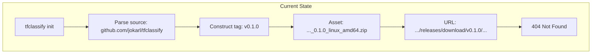
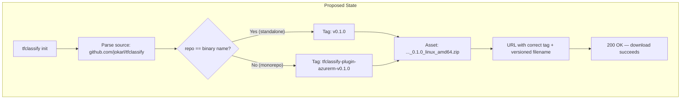
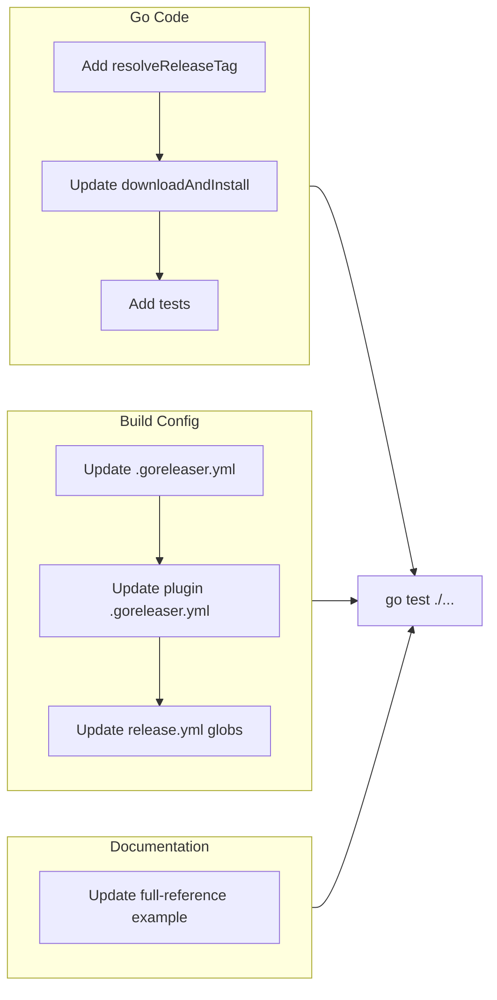

# Monorepo-Style Release Support in Plugin Installer

## Change Summary

Align the plugin installer's GitHub Release URL construction with the monorepo's actual release artifacts. Three mismatches exist between what the installer generates and what GoReleaser + release-please produce: tag format, asset naming (missing version), and archive format (tar.gz vs zip). This CR fixes all three so that `tfclassify init` can download plugins from the monorepo without manual intervention.

## Motivation and Background

CR-0009 introduced the plugin installer (`tfclassify init`) which downloads plugin binaries from GitHub Releases. CR-0020 introduced the CI/CD pipeline with release-please (monorepo mode) and GoReleaser. These two systems were designed independently and produce incompatible URLs:

| Component | Installer expects | CI/CD produces |
|-----------|------------------|----------------|
| Tag | `v{version}` | `tfclassify-plugin-{name}-v{version}` |
| Asset name | `..._0.1.0_linux_amd64.zip` | `..._linux_amd64.tar.gz` |
| Format | `.zip` | `.tar.gz` (Linux/macOS), `.zip` (Windows only) |

The full-reference example documentation (`docs/examples/full-reference/.tfclassify.hcl`) explicitly notes that monorepo sources are "not yet supported" and instructs users to install plugin binaries manually.

No releases have been published yet (all components at 0.0.1), so there is no backwards compatibility concern.

## Change Drivers

* `tfclassify init` cannot download plugins from the monorepo — the constructed URLs 404
* The full-reference docs warn users about this gap, directing them to manual installation
* GoReleaser configs omit version from asset filenames, breaking the installer's naming convention
* GoReleaser defaults to tar.gz on Linux/macOS, but the installer only handles zip extraction

## Current State

### Tag Resolution

`pkg/plugin/install.go:152` hardcodes the `v{version}` tag format:

```go
assetURL := fmt.Sprintf(
    "https://github.com/%s/%s/releases/download/v%s/%s",
    owner, repo, version, assetName,
)
```

This works for standalone repos (e.g., `github.com/jokarl/tfclassify-plugin-azurerm`) where release-please produces `v0.1.0` tags. It fails for the monorepo (`github.com/jokarl/tfclassify`) where release-please produces component-prefixed tags like `tfclassify-plugin-azurerm-v0.1.0`.

### Asset Naming

GoReleaser configs use `{{ .ProjectName }}_{{ .Os }}_{{ .Arch }}` without `{{ .Version }}`, producing filenames like `tfclassify-plugin-azurerm_linux_amd64.tar.gz`. The installer constructs filenames with version: `tfclassify-plugin-azurerm_0.1.0_linux_amd64.zip`.

### Archive Format

GoReleaser configs use `format_overrides` to produce zip only on Windows:

```yaml
archives:
  - name_template: "{{ .ProjectName }}_{{ .Os }}_{{ .Arch }}"
    format_overrides:
      - goos: windows
        format: zip
```

The installer's `extractBinaryFromZip` function only handles zip archives.

### Current Flow



## Proposed Change

Fix all three mismatches through a two-pronged approach:

1. **Installer side** — auto-detect tag format by comparing the repo name against the expected plugin binary name
2. **Build side** — update GoReleaser configs to include version in filenames and use zip format exclusively

### Tag Auto-Detection

A new `resolveReleaseTag(name, repo, version)` function compares the repo name from `source` against `PluginBinaryPrefix + name`:

- **Match** (e.g., repo = `tfclassify-plugin-azurerm`, binary = `tfclassify-plugin-azurerm`) — standalone repo, tag = `v{version}`
- **No match** (e.g., repo = `tfclassify`, binary = `tfclassify-plugin-azurerm`) — monorepo, tag = `tfclassify-plugin-{name}-v{version}`

This requires zero config changes — the source URL is sufficient to determine the tag format.

### GoReleaser Config Updates

Add `{{ .Version }}` to `name_template` and `checksum.name_template`. Switch from `format_overrides` to `format: zip` globally.

### Proposed Flow



## Requirements

### Functional Requirements

1. The installer **MUST** auto-detect the tag format based on the repo name from the `source` field
2. The installer **MUST** use `v{version}` tags for standalone repos where repo name matches the plugin binary name
3. The installer **MUST** use `{binaryName}-v{version}` tags for monorepo sources where repo name does not match the plugin binary name
4. GoReleaser **MUST** include the version in archive filenames: `{project}_{version}_{os}_{arch}.zip`
5. GoReleaser **MUST** produce zip archives on all platforms (not just Windows)
6. GoReleaser **MUST** include the version in checksum filenames: `{project}_{version}_checksums.txt`
7. The release workflow **MUST** upload only `.zip` and versioned checksums files (no `.tar.gz`)

### Non-Functional Requirements

1. The tag detection logic **MUST** not require any new configuration fields — it derives the answer from the existing `source` field
2. The installer **MUST** remain backwards-compatible with standalone plugin repos

## Affected Components

* `pkg/plugin/install.go` — tag resolution logic in `downloadAndInstall`
* `pkg/plugin/install_test.go` — new tests for tag resolution and URL construction
* `.goreleaser.yml` — root CLI GoReleaser config
* `plugins/azurerm/.goreleaser.yml` — plugin GoReleaser config
* `.github/workflows/release.yml` — upload globs in CLI and plugin release jobs
* `docs/examples/full-reference/.tfclassify.hcl` — source URL and documentation comments

## Scope Boundaries

### In Scope

* Tag format auto-detection in the installer based on repo name comparison
* GoReleaser archive naming and format changes (both root and plugin configs)
* Release workflow upload glob updates
* Documentation updates for the full-reference example

### Out of Scope ("Here, But Not Further")

* Supporting non-GitHub registries or custom download URLs — deferred to future CR
* Checksum verification during download — the installer does not yet verify checksums (separate concern)
* Supporting multiple plugins in the monorepo — only azurerm exists; the pattern generalizes naturally but no code changes needed for additional plugins
* Tar.gz extraction support — solved by switching GoReleaser to zip, not by adding tar.gz support to the installer

## Alternative Approaches Considered

* **Add a `tag_format` config field** — rejected because it adds configuration burden and the information is already derivable from the source URL
* **Always use monorepo-style tags** — rejected because standalone plugin repos should work with standard `v*` tags
* **Add tar.gz extraction to the installer** — rejected because zip is simpler (Go stdlib) and works cross-platform; easier to change GoReleaser than to add archive format detection

## Impact Assessment

### User Impact

Users can now set `source = "github.com/jokarl/tfclassify"` for monorepo plugins and `tfclassify init` will work without manual binary installation. The full-reference example is updated to reflect this.

### Technical Impact

* No breaking changes — standalone repo sources continue to work identically
* GoReleaser now produces zip on all platforms instead of tar.gz on Linux/macOS — this changes artifact format for first-time releases (no existing consumers)
* Release workflow upload globs simplified (fewer patterns to match)

### Business Impact

Removes a manual step from the plugin installation workflow, improving developer experience for monorepo consumers.

## Implementation Approach

Single-phase implementation touching six files:

1. Add `resolveReleaseTag` helper to `pkg/plugin/install.go`
2. Update `downloadAndInstall` to use the new helper instead of hardcoded `v%s`
3. Add unit tests for tag resolution and full URL construction
4. Update both GoReleaser configs for versioned zip archives
5. Update release workflow upload globs
6. Update full-reference example documentation

### Implementation Flow



## Test Strategy

### Tests to Add

| Test File | Test Name | Description | Inputs | Expected Output |
|-----------|-----------|-------------|--------|-----------------|
| `pkg/plugin/install_test.go` | `TestResolveReleaseTag` | Validates tag format for standalone and monorepo repos | (name, repo, version) tuples | Correct tag strings |
| `pkg/plugin/install_test.go` | `TestDownloadURL_Monorepo` | Verifies full URL construction for monorepo source | source=`github.com/jokarl/tfclassify` | URL with `tfclassify-plugin-azurerm-v0.1.0` tag |
| `pkg/plugin/install_test.go` | `TestDownloadURL_Standalone` | Verifies full URL construction for standalone source | source=`github.com/jokarl/tfclassify-plugin-azurerm` | URL with `v0.1.0` tag |

### Tests to Modify

Not applicable — no existing tests need modification. The existing `TestAssetNaming` test validates the asset name format which is unchanged (version was already in the filename in the installer; the mismatch was on the GoReleaser side).

### Tests to Remove

Not applicable — no tests become obsolete.

## Acceptance Criteria

### AC-1: Monorepo tag auto-detection

```gherkin
Given a plugin config with source "github.com/jokarl/tfclassify" and name "azurerm"
When the installer resolves the release tag for version "0.1.0"
Then the tag is "tfclassify-plugin-azurerm-v0.1.0"
```

### AC-2: Standalone repo tag format preserved

```gherkin
Given a plugin config with source "github.com/jokarl/tfclassify-plugin-azurerm" and name "azurerm"
When the installer resolves the release tag for version "0.1.0"
Then the tag is "v0.1.0"
```

### AC-3: GoReleaser produces versioned zip archives

```gherkin
Given the updated .goreleaser.yml configs
When GoReleaser runs for version "0.1.0"
Then archive filenames contain the version (e.g., "tfclassify-plugin-azurerm_0.1.0_linux_amd64.zip")
  And all archives use zip format regardless of OS
  And checksum filenames contain the version (e.g., "tfclassify-plugin-azurerm_0.1.0_checksums.txt")
```

### AC-4: Release workflow uploads correct artifacts

```gherkin
Given the updated release.yml workflow
When the plugin release job runs
Then only .zip and versioned checksums files are uploaded
  And no .tar.gz files are referenced in upload globs
```

## Quality Standards Compliance

### Build & Compilation

- [x] Code compiles/builds without errors
- [x] No new compiler warnings introduced

### Linting & Code Style

- [x] All linter checks pass with zero warnings/errors
- [x] Code follows project coding conventions and style guides

### Test Execution

- [x] All existing tests pass after implementation
- [x] All new tests pass
- [x] Test coverage meets project requirements for changed code

### Documentation

- [x] Inline code documentation updated where applicable
- [x] User-facing documentation updated (full-reference example)

### Verification Commands

```bash
# Build verification
go build ./...

# Test execution
go test ./pkg/plugin/... -v -run "TestResolveReleaseTag|TestDownloadURL"
go test ./pkg/plugin/... -v
go test ./...
```

## Dependencies

* CR-0009 — config-driven plugin lifecycle (implemented; provides the installer being modified)
* CR-0020 — GitHub Actions CI/CD workflows (implemented; provides the release pipeline being aligned)

## Decision Outcome

Chosen approach: "auto-detect tag format from source URL + update GoReleaser to match installer expectations", because it requires zero config changes, preserves standalone repo compatibility, and is simpler than adding tar.gz support or new config fields.

## Implementation Status

* **Started:** 2026-02-14
* **Completed:** 2026-02-14
* **Notes:** Retroactive CR — implementation completed before formal documentation. All tests pass.

## Related Items

* CR-0009: Config-driven plugin lifecycle (introduced the installer)
* CR-0020: GitHub Actions CI/CD workflows (introduced the release pipeline)
