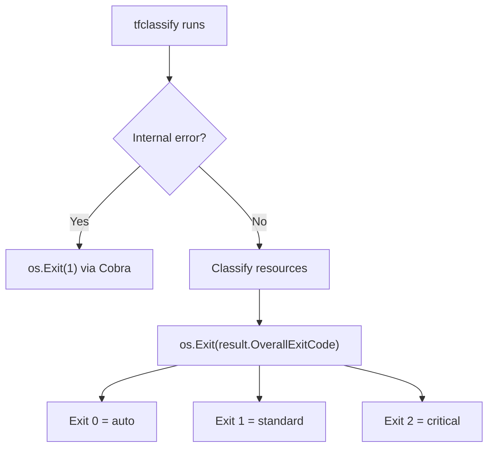
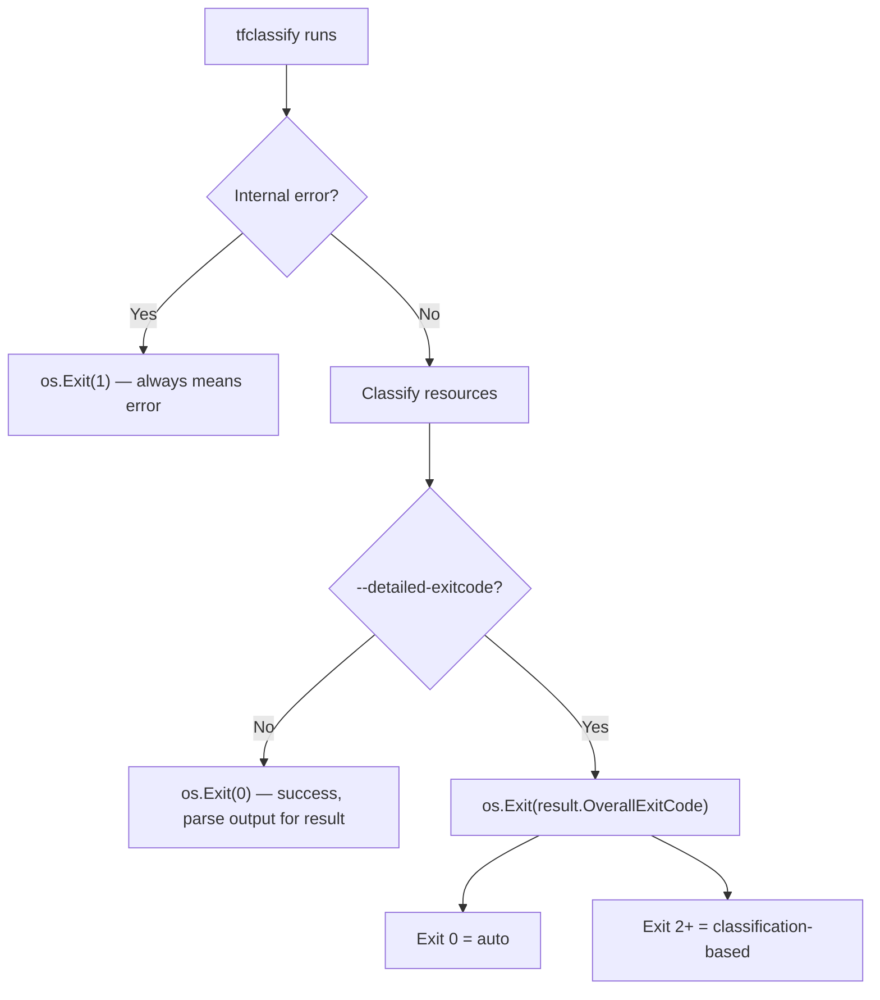
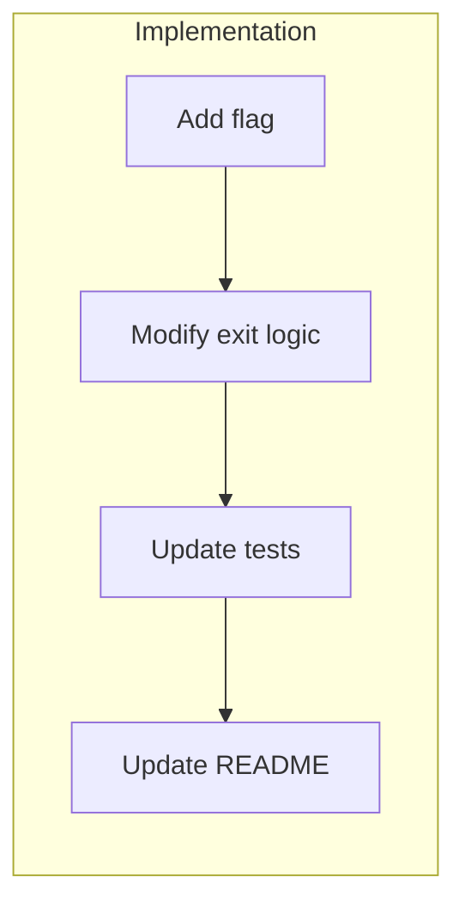

# Add `--detailed-exitcode` flag for CI-friendly exit codes

## Change Summary

Currently tfclassify always exits with classification-based exit codes (e.g. `critical=2`, `standard=1`, `auto=0`). This makes it difficult to distinguish between "the tool ran successfully and classified changes" and "the tool failed due to an internal error" in CI pipelines. This CR proposes a `--detailed-exitcode` flag that opts into the current precedence-based exit codes. Without the flag, tfclassify exits `0` for any successful classification, reserving non-zero for actual errors.

## Motivation and Background

In CI/CD pipelines, exit codes serve as the primary signaling mechanism. Many CI systems (GitHub Actions, Azure Pipelines, Jenkins) treat any non-zero exit code as a failure and halt the pipeline. The current behavior — where a successful classification of "critical" exits with code 2 — forces pipeline authors to work around this by wrapping tfclassify in `set +e` blocks or `|| true` suffixes, then parsing the output separately.

Terraform itself solved this exact problem with its `-detailed-exitcode` flag on `terraform plan`: without it, plan exits 0 on success regardless of whether changes exist; with it, exit code 2 signals "changes present". This is a well-understood pattern in the Terraform ecosystem.

## Change Drivers

* CI/CD ergonomics — pipeline authors need to distinguish "tool succeeded" from "tool failed" without shell workarounds
* Terraform ecosystem convention — `-detailed-exitcode` is an established pattern users already understand
* JSON/GitHub output formats already embed the classification result, making exit codes redundant when parsing structured output

## Current State

tfclassify always exits with precedence-derived exit codes:

```
os.Exit(result.OverallExitCode)
```

The exit code is calculated from the classification's position in the `precedence` list:

| Classification position | Exit code | Meaning |
|------------------------|-----------|---------|
| Last (lowest)          | 0         | Auto — proceed |
| Second-to-last         | 1         | Standard |
| ...                    | ...       | ... |
| First (highest)        | N-1       | Critical — block |

Internal errors (config load failure, plan parse failure, plugin errors) return exit code 1 via Cobra's error handling, which collides with classification exit codes when `N >= 3`.

### Current State Diagram



Note how exit code 1 is ambiguous — it could mean "internal error" or "standard classification".

## Proposed Change

Add a `--detailed-exitcode` flag (short: `-d`) to the root command. When absent, tfclassify exits `0` for any successful classification run. When present, the current precedence-based exit codes apply.

Additionally, reserve exit code `1` exclusively for internal errors to avoid ambiguity. Classification exit codes start from `0` (lowest precedence) and increase, but `1` is skipped — the lowest non-auto classification gets exit code `2`.

### Proposed State Diagram



## Requirements

### Functional Requirements

1. The CLI **MUST** accept a `--detailed-exitcode` flag (boolean, default `false`)
2. When `--detailed-exitcode` is not set, the CLI **MUST** exit `0` after any successful classification, regardless of the overall classification result
3. When `--detailed-exitcode` is set, the CLI **MUST** exit with the precedence-derived exit code (current behavior)
4. The CLI **MUST** exit `1` for internal errors (config failures, plan parse failures, plugin failures) regardless of the `--detailed-exitcode` flag
5. The `exit_code` field in JSON output **MUST** always contain the precedence-derived exit code, regardless of the `--detailed-exitcode` flag (output content is unaffected)
6. The `exit_code` in GitHub Actions output format **MUST** always contain the precedence-derived exit code, regardless of the `--detailed-exitcode` flag

### Non-Functional Requirements

1. The change **MUST** not affect classification logic, output formatting, or plugin execution
2. The change **MUST** be backward-compatible: users who add `--detailed-exitcode` get the exact same behavior as before

## Affected Components

* `cmd/tfclassify/main.go` — flag registration, exit code logic in `run()`
* `cmd/tfclassify/main_test.go` — CLI integration tests for exit code behavior
* `README.md` — CLI reference table, exit code documentation

## Scope Boundaries

### In Scope

* Adding `--detailed-exitcode` boolean flag to root command
* Changing default exit behavior to always return 0 on success
* Updating CLI reference documentation in README
* Updating exit code table in README
* Tests for both modes

### Out of Scope ("Here, But Not Further")

* Reserving exit code 1 for errors only (skipping 1 in classification codes) — this is a separate concern that may warrant its own CR
* Adding exit code control to the `github` output format beyond what already exists
* Configuration-file-based exit code control — CLI flag is sufficient
* Short flag `-d` — defer unless it does not conflict with existing flags

## Alternative Approaches Considered

* **Invert the default (opt-out with `--no-detailed-exitcode`):** Preserves backward compatibility but breaks the Terraform convention where the detailed behavior is opt-in. Also makes the common CI case require no extra flags.
* **`--exit-code=always|classification|never`:** More flexible but over-engineered for a boolean choice. Could be revisited if more exit code modes emerge.
* **Config-file setting (`defaults.detailed_exitcode = true`):** Mixes runtime behavior with classification config. The flag is a better fit since it's a pipeline concern, not a classification concern.

## Impact Assessment

### User Impact

This is a **breaking change** to default exit code behavior. Users who rely on non-zero exit codes from tfclassify without `--detailed-exitcode` will need to add the flag to their pipeline scripts.

Migration path: add `--detailed-exitcode` to any existing pipeline invocation that checks `$?` for classification results.

### Technical Impact

Minimal. The change is confined to the `run()` function in `main.go` — a single conditional around `os.Exit()`. No changes to classification logic, output formatting, or plugin system.

### Business Impact

Improves CI/CD adoption by making the default behavior pipeline-friendly. Reduces onboarding friction for new users integrating tfclassify into existing pipelines.

## Implementation Approach

Single-phase implementation — the change is small and self-contained.

1. Add `--detailed-exitcode` flag to root command in `init()`
2. Modify `run()` to conditionally use `os.Exit(0)` vs `os.Exit(result.OverallExitCode)`
3. Update tests to cover both modes
4. Update README CLI reference and exit code documentation

### Implementation Flow



## Test Strategy

### Tests to Add

| Test File | Test Name | Description | Inputs | Expected Output |
|-----------|-----------|-------------|--------|-----------------|
| `cmd/tfclassify/main_test.go` | `TestCLI_DefaultExitCodeZeroOnSuccess` | Without `--detailed-exitcode`, successful classification exits 0 | Plan with critical changes, no `--detailed-exitcode` | Exit code 0, output contains "critical" |
| `cmd/tfclassify/main_test.go` | `TestCLI_DetailedExitCodeFlag` | With `--detailed-exitcode`, classification exit codes apply | Plan with critical changes + `--detailed-exitcode` | Exit code matches precedence position |
| `cmd/tfclassify/main_test.go` | `TestCLI_ErrorExitCodeUnaffectedByFlag` | Internal errors always exit 1 regardless of flag | Invalid plan path, with and without `--detailed-exitcode` | Exit code 1 in both cases |

### Tests to Modify

| Test File | Test Name | Current Behavior | New Behavior | Reason for Change |
|-----------|-----------|------------------|--------------|-------------------|
| `cmd/tfclassify/main_test.go` | `TestCLI_ExitCodes` | Expects non-zero exit for classifications | Expects exit 0 without `--detailed-exitcode`, non-zero with it | Default behavior changes |

### Tests to Remove

Not applicable — no tests become obsolete.

## Acceptance Criteria

### AC-1: Default exit code is 0 on successful classification

```gherkin
Given a valid plan file with critical resource changes
  And a valid configuration file
When tfclassify runs without the --detailed-exitcode flag
Then the process exits with code 0
  And the output contains the correct classification result
```

### AC-2: Detailed exit codes with flag

```gherkin
Given a valid plan file with critical resource changes
  And a valid configuration with precedence ["critical", "standard", "auto"]
When tfclassify runs with the --detailed-exitcode flag
Then the process exits with code 2 (critical's precedence-derived code)
```

### AC-3: Internal errors always exit 1

```gherkin
Given an invalid or nonexistent plan file path
When tfclassify runs without the --detailed-exitcode flag
Then the process exits with code 1
  And stderr contains an error message
```

### AC-4: JSON output unaffected by flag

```gherkin
Given a valid plan file with critical resource changes
When tfclassify runs with --output json without --detailed-exitcode
Then the process exits with code 0
  And the JSON output contains "exit_code": 2
```

### AC-5: GitHub output unaffected by flag

```gherkin
Given a valid plan file with critical resource changes
When tfclassify runs with --output github without --detailed-exitcode
Then the process exits with code 0
  And the output contains "exit_code=2" for GitHub Actions
```

## Quality Standards Compliance

### Build & Compilation

- [ ] Code compiles/builds without errors
- [ ] No new compiler warnings introduced

### Linting & Code Style

- [ ] All linter checks pass with zero warnings/errors
- [ ] Code follows project coding conventions and style guides

### Test Execution

- [ ] All existing tests pass after implementation
- [ ] All new tests pass
- [ ] Test coverage meets project requirements for changed code

### Documentation

- [ ] README CLI reference table updated with `--detailed-exitcode` flag
- [ ] README exit code section updated to describe both modes
- [ ] Inline code comments updated in `main.go`

### Code Review

- [ ] Changes submitted via pull request
- [ ] PR title follows Conventional Commits format
- [ ] Code review completed and approved
- [ ] Changes squash-merged to maintain linear history

### Verification Commands

```bash
# Build verification
make build

# Lint verification
make lint

# Test execution
make test

# Vulnerability check
govulncheck ./...
```

## Risks and Mitigation

### Risk 1: Breaking existing CI pipelines that rely on non-zero exit codes

**Likelihood:** high
**Impact:** medium
**Mitigation:** Document the breaking change clearly in release notes. The migration is a one-line change (add `--detailed-exitcode` to the command). Consider a deprecation warning in the release prior to the change.

### Risk 2: Exit code 1 collision between errors and classifications

**Likelihood:** low (only with 3+ precedence levels)
**Impact:** low
**Mitigation:** This is a pre-existing issue not introduced by this CR. Document that exit code 1 without `--detailed-exitcode` always means error. With `--detailed-exitcode`, the existing precedence mapping applies unchanged.

## Dependencies

* No external dependencies

## Estimated Effort

Small — approximately 2-4 hours including tests and documentation.

## Decision Outcome

Chosen approach: "opt-in `--detailed-exitcode` flag", because it follows the Terraform convention (`terraform plan -detailed-exitcode`), makes the default CI-friendly (exit 0 on success), and is the simplest change with the clearest mental model.

## Related Items

* Terraform's `-detailed-exitcode` on `terraform plan` — prior art and naming convention
* Current exit code logic: `pkg/classify/classifier.go:108` (`getExitCode`)
* CLI entry point: `cmd/tfclassify/main.go:148` (`os.Exit(result.OverallExitCode)`)
