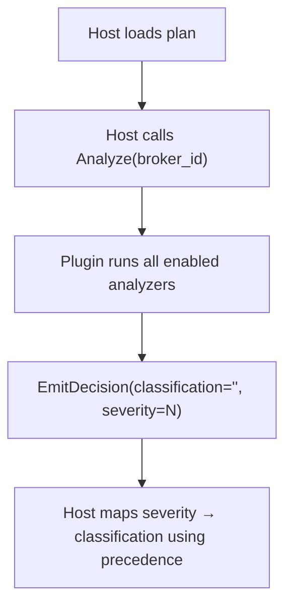
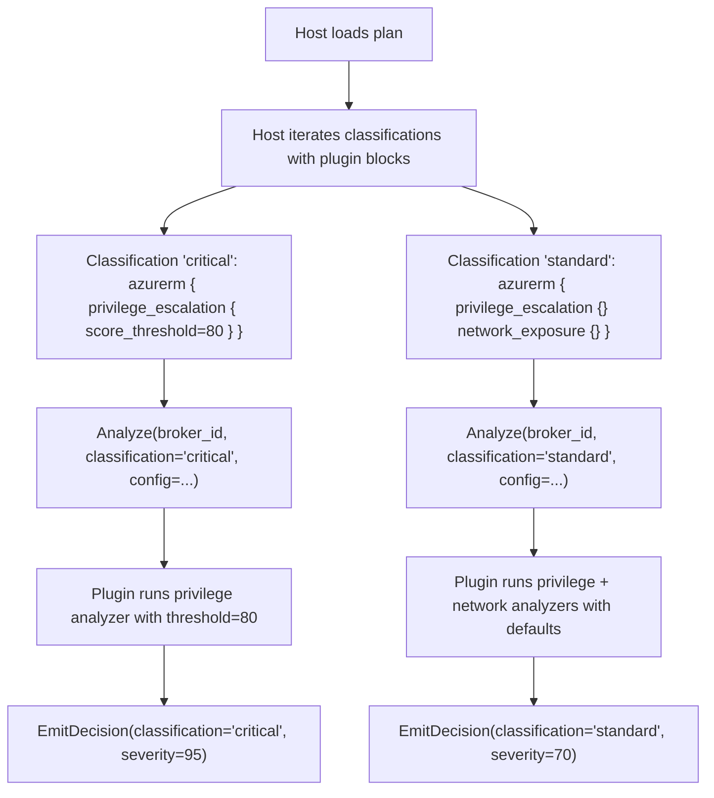
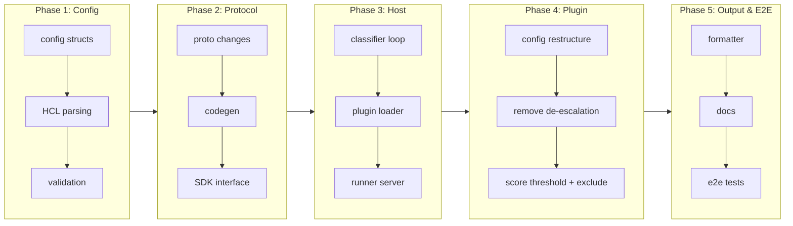

# Classification-Scoped Plugin Analyzer Rules

## Change Summary

Move plugin analyzer configuration from the top-level `plugin` block into per-`classification` blocks so that each classification level can define its own thresholds, role filters, and analyzer toggles. The plugin block remains top-level for binary metadata (source, version, enabled). This restructure enables graduated deep inspection — for example, triggering the privilege escalation analyzer at severity ≥80 for "critical" but at any score for "standard" — and makes plugin decisions emit a concrete classification name instead of relying on the host's severity-based mapping.

## Motivation and Background

Today, plugin analyzer configuration is global. The `plugin "azurerm"` block contains a flat `config {}` with boolean toggles (`privilege_enabled`, `network_enabled`, `keyvault_enabled`) and no threshold controls. The host calls `Analyze` once per plan, and plugins emit decisions with `Classification: ""` (empty), leaving the host to infer classification from severity alone.

This creates several problems:

1. **No per-classification thresholds**: A Reader→Contributor escalation (severity 70) and a None→Owner escalation (severity 95) both produce the same classification. Operators cannot say "escalation above 80 is critical, anything else is standard."

2. **No per-classification analyzer toggles**: The network exposure analyzer either runs for all classifications or none. You cannot say "check network exposure only for critical."

3. **Plugin-host coupling**: Plugins emit severity and the host maps it to classification using opaque rules. Moving the mapping into config makes it explicit and user-controllable.

4. **De-escalation noise**: The privilege analyzer currently detects both escalation and de-escalation. Operators report de-escalation detection as confusing since removing a privileged role is generally a positive change. There is no way to disable it per-classification.

## Change Drivers

* Users need different analyzer thresholds per classification level
* De-escalation detection creates false positives that cannot be suppressed
* Plugin decisions should emit explicit classification names for traceability
* Current global config prevents fine-grained control over which analyzers run where

## Current State

### Plugin Configuration (global)

```hcl
plugin "azurerm" {
  enabled = true
  source  = "github.com/jokarl/tfclassify"
  version = "0.1.0"

  config {
    privilege_enabled = true
    network_enabled   = true
    keyvault_enabled  = true
  }
}
```

### Plugin Analysis Flow



All analyzers share the same global config. The plugin has no knowledge of which classification a decision should map to.

### Privilege Analyzer Behavior

The privilege analyzer (privilege.go:57-149) currently:
- Detects escalation (after > before) and de-escalation (after < before)
- Emits `Classification: ""` for all decisions
- Uses a fixed severity of 40 for de-escalation
- Has no score threshold — any escalation emits a decision
- Has no role exclusion mechanism

## Proposed Change

### New HCL Configuration

```hcl
plugin "azurerm" {
  enabled = true
  source  = "github.com/jokarl/tfclassify"
  version = "0.1.0"
}

classification "critical" {
  description = "Requires security review"

  rule {
    resource = ["*_role_*"]
    actions  = ["delete"]
  }

  azurerm {
    privilege_escalation {
      score_threshold = 80
      roles           = ["Owner", "User Access Administrator"]
    }
    network_exposure {
      permissive_sources = ["*", "0.0.0.0/0"]
    }
  }
}

classification "standard" {
  description = "Standard change"

  rule { resource = ["*"] }

  azurerm {
    privilege_escalation {}  # empty = use defaults, any score triggers
    network_exposure {}
    keyvault_access {}
  }
}

classification "auto" {
  description = "No approval needed"

  rule {
    resource = ["*"]
    actions  = ["no-op"]
  }
}
```

### Key Design Decisions

1. **Plugin block stays top-level** — declares binary, source, version, and the enabled flag. The `config {}` sub-block is removed; all runtime configuration moves into classification blocks.

2. **Analyzer config moves into classification blocks** — a plugin-named block (`azurerm {}`) inside `classification {}` contains per-analyzer sub-blocks (`privilege_escalation {}`, `network_exposure {}`, `keyvault_access {}`). Only listed analyzers run for that classification.

3. **Plugins emit classification directly** — instead of `Classification: ""`, plugins receive the classification name from the block that matched and emit it on decisions. The host no longer infers classification from severity.

4. **`score_threshold`** — privilege escalation uses this to decide whether to trigger within a classification. A score below the threshold is silently ignored for that classification block. Omitting or setting to 0 means "any score triggers."

5. **Empty sub-blocks use defaults** — `privilege_escalation {}` means "run with default thresholds" (any score). `network_exposure {}` means "use default permissive sources (`*`, `0.0.0.0/0`, `Internet`)."

6. **De-escalation detection removed** — only escalation is detected (lines 117–145 in privilege.go are removed). De-escalation (removing or downgrading a privileged role) is a positive action and should not trigger classification. This simplifies the analyzer and eliminates a source of confusion.

7. **Role exclusion** — `exclude` list on `privilege_escalation` to skip specific roles from triggering. Useful for filtering known-safe assignments.

8. **Host calls Analyze per classification** — the host iterates classifications that have plugin blocks and calls `Analyze` once per classification with the classification name and analyzer config. The plugin runs only the analyzers listed in that block.

### Proposed Analysis Flow



### Privilege Escalation Scoring Reference

The scoring system (unchanged by this CR) computes severity from role permissions and ARM scope:

**Permission Tiers:**

| Tier | Score | Pattern | Example |
|------|-------|---------|---------|
| 1 | 95 | Unrestricted `*` without auth exclusion | Owner |
| 2 | 85 | `Microsoft.Authorization/*` control | User Access Administrator |
| 3 | 75 | Targeted `roleAssignments/write` | Custom roles with role assignment write |
| 4 | 70 | `*` with `Microsoft.Authorization` excluded | Contributor |
| 5 | 50–65 | Provider wildcards (`Microsoft.X/*`) | Broad provider access |
| 6 | 30 | Limited write access | Specific write actions |
| 7 | 15 | Read-only | Reader |
| 8 | 0 | No permissions | Empty |

**Scope Multipliers:** Management Group 1.1×, Subscription 1.0×, Resource Group 0.8×, Resource 0.6×, Unknown 0.9×. Final score clamped to [0, 100].

With `score_threshold`, operators can draw a line: "critical only for tier 1–2 roles at broad scope" (`score_threshold = 80`), while "standard catches everything else" (`score_threshold` omitted or 0).

## Requirements

### Functional Requirements

1. Classification blocks **MUST** support an optional plugin-named block (e.g., `azurerm {}`) containing per-analyzer sub-blocks
2. Per-analyzer sub-blocks **MUST** support analyzer-specific attributes (`score_threshold`, `roles`, `permissive_sources`, `exclude`)
3. Empty analyzer sub-blocks **MUST** use default values for all attributes
4. The host **MUST** call `Analyze` once per classification that contains a plugin block, passing the classification name and analyzer config
5. Plugins **MUST** emit `Decision.Classification` set to the classification name from the block being analyzed
6. The privilege escalation analyzer **MUST NOT** detect or emit de-escalation decisions
7. The privilege escalation analyzer **MUST** skip decisions where the weighted score is below `score_threshold`
8. The privilege escalation analyzer **MUST** skip roles listed in the `exclude` attribute
9. The `plugin` top-level block **MUST** retain `enabled`, `source`, and `version` attributes; the `config {}` sub-block **MUST** be removed
10. Plugin-named blocks inside classifications **MUST** reference an enabled plugin; validation **MUST** fail otherwise

### Non-Functional Requirements

1. The gRPC protocol change **MUST** be backward-compatible — older plugins receiving unknown fields ignore them per protobuf conventions
2. The config change **MUST** produce clear validation errors for common mistakes (plugin block references a disabled plugin, unknown analyzer name)
3. Performance **MUST NOT** degrade beyond proportional to the number of classification blocks with plugin config (one `Analyze` call per block vs one global call)

## Affected Components

| File | Change |
|------|--------|
| `pkg/config/config.go` | Add `PluginAnalyzerConfigs` field to `ClassificationConfig`, new structs for plugin-named blocks and per-analyzer sub-blocks |
| `pkg/config/loader.go` | HCL parsing updates for nested plugin blocks inside classification blocks; use `hcl.Body` remain to capture plugin-named blocks dynamically |
| `pkg/config/validation.go` | Validate that plugin blocks in classifications reference enabled plugins; validate analyzer names against plugin schema |
| `pkg/classify/classifier.go` | Pass classification-scoped plugin config to plugin host; update `AddPluginDecisions` to call Analyze per classification block |
| `pkg/classify/result.go` | Ensure `ResourceDecision` preserves `Severity` and `Metadata` from plugin decisions |
| `pkg/plugin/loader.go` | Accept per-classification analyzer config; pass to plugins via extended `Analyze` call |
| `pkg/plugin/runner_server.go` | Update `EmitDecision` to preserve severity and metadata fields |
| `pkg/output/formatter.go` | Surface severity and metadata in JSON output format |
| `proto/tfclassify.proto` | Add `classification` (string) and `analyzer_config` (bytes) fields to `AnalyzeRequest` |
| `sdk/pb/` | Regenerated from proto |
| `sdk/plugin/grpc.go` | Implement updated `Analyze` method, pass classification context to analyzers |
| `sdk/analyzer.go` | Add `ClassificationAwareAnalyzer` interface (optional; analyzers that implement it receive classification context) |
| `sdk/types.go` | No change — `Decision` already has `Classification`, `Severity`, `Metadata` |
| `plugins/azurerm/plugin.go` | Restructure `PluginConfig` to parse per-analyzer config from classification blocks; remove global `config {}` support |
| `plugins/azurerm/privilege.go` | Remove de-escalation code (lines 117–145); add `score_threshold` gating; add `exclude` role filter |
| `plugins/azurerm/network.go` | Accept classification-scoped `permissive_sources` override |
| `plugins/azurerm/keyvault.go` | Accept classification-scoped config (destructive permissions override) |
| `docs/examples/full-reference/.tfclassify.hcl` | Update to use new classification-scoped plugin syntax |
| `README.md` | Update plugin configuration and classification documentation |
| `plugins/azurerm/README.md` | Update configuration section for classification-scoped syntax; enhance scoring documentation with implementation details |
| `testdata/e2e/*/.tfclassify.hcl` | Update e2e configs to use new syntax |

### gRPC Protocol Changes

The `AnalyzeRequest` message gains two fields:

```protobuf
message AnalyzeRequest {
    uint32 broker_id = 1;
    string classification = 2;    // NEW: classification name (e.g., "critical")
    bytes analyzer_config = 3;    // NEW: JSON-encoded per-analyzer config for this classification
}
```

- The host calls `Analyze` once per classification that has plugin blocks (not once globally)
- The plugin receives the classification name and per-analyzer config, runs matching analyzers, and emits decisions with that classification
- Older plugins ignore the new fields per protobuf wire format rules (forward-compatible)

### Privilege Escalation Changes

1. **Remove de-escalation code** — delete privilege.go lines 117–145 (the `else if afterScoreWeighted < beforeScoreWeighted` branch)
2. **Add `exclude` roles list** — before scoring, skip roles that appear in the exclusion list (case-insensitive match on `role_definition_name`)
3. **Add `score_threshold` gating** — after computing the weighted score, only emit a decision if `afterScoreWeighted >= score_threshold` (0 means always emit)
4. **Emit `Classification`** — set `Decision.Classification` to the classification name received in `AnalyzeRequest`

## Scope Boundaries

### In Scope

* Classification-scoped plugin analyzer configuration syntax
* Per-analyzer sub-blocks (`privilege_escalation`, `network_exposure`, `keyvault_access`)
* `score_threshold`, `roles`, `permissive_sources`, `exclude` attributes
* De-escalation removal from the privilege analyzer
* gRPC `AnalyzeRequest` extension
* Config validation for plugin references in classification blocks
* E2E test scenarios for deep inspection capabilities
* Updates to example configs, README, and e2e test fixtures

### Out of Scope

* New analyzers (e.g., storage account exposure, managed identity federation)
* Plugin discovery or installation changes
* CLI flag changes
* Output format changes beyond surfacing severity/metadata
* Config-file migration tooling (users must update configs manually)

## Alternative Approaches Considered

### 1. Keep global config, add severity-to-classification mapping

```hcl
plugin "azurerm" {
  config {
    privilege_enabled = true
    severity_mapping {
      critical = ">= 80"
      standard = ">= 0"
    }
  }
}
```

Rejected because: mixes classification logic across two locations (precedence list + severity mapping). Users must mentally correlate thresholds with classifications defined elsewhere. The classification-scoped approach co-locates the intent: "for critical, trigger privilege escalation at score ≥80."

### 2. Per-analyzer top-level blocks

```hcl
analyzer "azurerm.privilege_escalation" {
  classification = "critical"
  score_threshold = 80
}
```

Rejected because: breaks the classification-centric mental model. Users think in terms of "what makes something critical?" not "where should this analyzer emit?" Also requires cross-referencing analyzer blocks with classification blocks.

### 3. Keep `config {}` on plugin, add classification overrides

```hcl
plugin "azurerm" {
  config {
    privilege_enabled = true
    # global defaults
  }
}

classification "critical" {
  azurerm {
    privilege_escalation { score_threshold = 80 }
  }
}
```

Partially accepted — the proposed design removes `config {}` entirely since all analyzer configuration is now classification-scoped. Global defaults live in the analyzer code itself (empty block = use defaults). This is simpler and avoids precedence confusion between global and per-classification config.

## Impact Assessment

### User Impact

**Breaking change** to plugin configuration syntax. Users must:
1. Remove `config {}` from the `plugin` block
2. Add analyzer sub-blocks inside classification blocks
3. Any pipeline that relied on de-escalation detection will no longer receive those decisions

Migration is manual but straightforward — the new syntax is more expressive and the mapping from old to new is 1:1 for existing use cases.

### Technical Impact

Moderate. Touches config parsing, classifier, plugin host, gRPC protocol, SDK, and the azurerm plugin. However, each change is localized:
- Config: additive structs + HCL parsing
- Classifier: loop change (per-classification instead of global)
- gRPC: two new fields on an existing message
- Plugin: config restructure, privilege analyzer simplification

### Business Impact

Enables fine-grained security policy enforcement — organizations can define different detection thresholds per classification level, which is a prerequisite for enterprise adoption.

## Implementation Approach

### Phase 1: Config and Validation

1. Add structs for classification-scoped plugin blocks in `pkg/config/config.go`
2. Update HCL parsing in `pkg/config/loader.go` to handle dynamic plugin-named blocks
3. Add validation rules in `pkg/config/validation.go`
4. Update example configs

### Phase 2: gRPC Protocol and SDK

1. Extend `AnalyzeRequest` in `proto/tfclassify.proto`
2. Regenerate Go code in `sdk/pb/`
3. Add `ClassificationAwareAnalyzer` interface in `sdk/analyzer.go`
4. Update `sdk/plugin/grpc.go` to pass classification context

### Phase 3: Host and Classifier

1. Update `pkg/classify/classifier.go` to iterate classifications with plugin blocks
2. Update `pkg/plugin/loader.go` to accept per-classification config
3. Update `pkg/plugin/runner_server.go` to preserve severity/metadata

### Phase 4: Azurerm Plugin

1. Restructure `plugins/azurerm/plugin.go` config parsing
2. Remove de-escalation from `plugins/azurerm/privilege.go`
3. Add `score_threshold` and `exclude` support
4. Update `plugins/azurerm/network.go` and `keyvault.go` for classification-scoped config

### Phase 5: Output, Docs, and E2E

1. Surface severity/metadata in `pkg/output/formatter.go`
2. Update README and example configs
3. Update e2e test fixtures and add new e2e scenarios

### Implementation Flow



## Test Strategy

### Unit Tests to Add

| Test File | Test Name | Description |
|-----------|-----------|-------------|
| `pkg/config/loader_test.go` | `TestLoadClassificationWithPluginBlocks` | Parse classification blocks containing azurerm analyzer sub-blocks |
| `pkg/config/loader_test.go` | `TestLoadEmptyAnalyzerSubBlock` | Empty `privilege_escalation {}` uses defaults |
| `pkg/config/validation_test.go` | `TestValidatePluginBlockReferencesEnabledPlugin` | Error when classification references disabled plugin |
| `pkg/config/validation_test.go` | `TestValidateUnknownAnalyzerName` | Error for unrecognized analyzer sub-block name |
| `pkg/classify/classifier_test.go` | `TestClassifier_PerClassificationPluginCalls` | Host calls Analyze once per classification with plugin blocks |
| `plugins/azurerm/privilege_test.go` | `TestPrivilege_ScoreThreshold` | Decisions suppressed below threshold |
| `plugins/azurerm/privilege_test.go` | `TestPrivilege_RoleExclusion` | Excluded roles do not trigger |
| `plugins/azurerm/privilege_test.go` | `TestPrivilege_NoDeEscalation` | Removing a privileged role produces no decision |
| `plugins/azurerm/privilege_test.go` | `TestPrivilege_EmitsClassificationName` | Decision.Classification matches the block name |
| `plugins/azurerm/network_test.go` | `TestNetwork_ClassificationScopedSources` | Per-classification permissive source override |

### Unit Tests to Modify

| Test File | Test Name | Reason |
|-----------|-----------|--------|
| `pkg/config/loader_test.go` | `TestLoad*` | Existing config loading tests need updated fixtures (no `config {}` in plugin block) |
| `plugins/azurerm/privilege_test.go` | `TestPrivilege_DeEscalation*` | Remove or convert — de-escalation is no longer detected |
| `pkg/classify/classifier_test.go` | `TestClassifier_AddPluginDecisions` | Update to verify per-classification invocation |

### E2E Tests

The nightly verification workflow (CR-0022) must be updated to exercise deep inspection with the new classification-scoped syntax. The following e2e scenarios validate the full stack — Terraform plan → plugin gRPC → classification-scoped analysis → output:

| E2E Scenario | Config | Expected Behavior |
|-------------|--------|-------------------|
| `role-assignment-privileged` | `critical { azurerm { privilege_escalation { score_threshold = 80 } } }` | Owner assignment (score 95) triggers critical; Contributor would not (score 70 < 80) |
| `role-assignment-reader` | `standard { azurerm { privilege_escalation {} } }` | Reader assignment (score 15) triggers standard (no threshold = any score) |
| `nsg-open-inbound` | `critical { azurerm { network_exposure { permissive_sources = ["*", "0.0.0.0/0"] } } }` | Open inbound NSG rule triggers critical via network exposure analyzer |
| `role-escalation-threshold` (new) | Two classifications with different `score_threshold` values | Owner → critical (≥80), Contributor → standard (≥0), Reader → standard (≥0). Validates graduated thresholds across classifications. |
| `role-exclusion` (new) | `critical { azurerm { privilege_escalation { exclude = ["AcrPush"] } } }` | AcrPush role assignment skipped despite score. Other privileged roles still trigger. |
| `keyvault-destructive` (new) | `critical { azurerm { keyvault_access {} } }` | Key vault access policy with `delete`/`purge` permissions triggers critical |

New e2e scenarios (`role-escalation-threshold`, `role-exclusion`, `keyvault-destructive`) **MUST** be added to `testdata/e2e/` and included in the nightly verification matrix. Each scenario needs `main.tf`, `.tfclassify.hcl`, and `expected.json` following the pattern established by CR-0022.

### E2E Deep Inspection Demonstration

The e2e tests serve as a living demonstration of deep inspection capabilities:

1. **Permission-based scoring**: `role-assignment-privileged` proves the plugin scores Owner (tier 1, score 95) differently from Contributor (tier 4, score 70) — not based on name matching but on actual permission analysis against the embedded 400+ role database.

2. **Scope-weighted severity**: Each role assignment e2e scenario operates at a known ARM scope (resource group or subscription), demonstrating that the same role at different scopes produces different weighted scores.

3. **Graduated thresholds**: `role-escalation-threshold` proves that two classifications with different `score_threshold` values correctly sort the same set of resources into different buckets.

4. **Network deep inspection**: `nsg-open-inbound` proves the plugin reads actual NSG rule attributes (`source_address_prefix`, `direction`, `access`) from the Terraform plan JSON — not just the resource type.

5. **Key vault deep inspection**: `keyvault-destructive` proves the plugin reads access policy permission arrays and identifies destructive operations.

## Acceptance Criteria

### AC-1: Classification-scoped plugin configuration

```gherkin
Given a .tfclassify.hcl with an azurerm {} block inside classification "critical"
  And the azurerm block contains privilege_escalation { score_threshold = 80 }
When the config is loaded
Then the critical classification has plugin analyzer config for azurerm
  And the privilege_escalation analyzer has score_threshold = 80
```

### AC-2: Empty analyzer sub-block uses defaults

```gherkin
Given a classification with azurerm { privilege_escalation {} }
When the config is loaded
Then the privilege_escalation analyzer uses default values
  And score_threshold defaults to 0 (any score triggers)
```

### AC-3: Plugin emits classification name

```gherkin
Given a plan with an Owner role assignment
  And classification "critical" has azurerm { privilege_escalation { score_threshold = 80 } }
When the plugin analyzes the resource
Then the emitted decision has Classification = "critical"
  And Severity = 95 (or scope-weighted equivalent)
```

### AC-4: Score threshold gating

```gherkin
Given classification "critical" with privilege_escalation { score_threshold = 80 }
  And a plan with a Contributor role assignment (score 70)
When the plugin analyzes the resource for "critical"
Then no decision is emitted for this classification
  And the resource may still be classified by a lower classification with a lower threshold
```

### AC-5: De-escalation not detected

```gherkin
Given a plan that removes an Owner role assignment (delete action)
When the plugin analyzes the resource
Then no de-escalation decision is emitted
  And core rules may still classify the deletion via pattern matching
```

### AC-6: Role exclusion

```gherkin
Given classification "critical" with privilege_escalation { exclude = ["AcrPush"] }
  And a plan that assigns the AcrPush role
When the plugin analyzes the resource
Then no decision is emitted for the excluded role
```

### AC-7: Validation rejects invalid plugin references

```gherkin
Given a classification with azurerm {} block
  And no plugin "azurerm" { enabled = true } block exists
When the config is validated
Then a validation error is returned indicating the plugin is not enabled
```

### AC-8: Per-classification Analyze calls

```gherkin
Given two classifications with azurerm {} blocks ("critical" and "standard")
When the host runs plugin analysis
Then Analyze is called twice: once with classification="critical" and once with classification="standard"
  And each call includes only the analyzer config for that classification
```

### AC-9: E2E graduated thresholds

```gherkin
Given a plan with both Owner (score 95) and Contributor (score 70) role assignments
  And critical has score_threshold = 80
  And standard has score_threshold = 0
When tfclassify classifies the plan
Then Owner is classified as "critical"
  And Contributor is classified as "standard"
  And the exit code reflects the highest classification
```

### AC-10: Backward-compatible gRPC

```gherkin
Given a plugin built with the current SDK (no classification awareness)
When the host sends an AnalyzeRequest with classification and analyzer_config fields
Then the plugin ignores the unknown fields and runs analysis as before
  And decisions are emitted with Classification = "" (host falls back to severity mapping)
```

## Quality Standards Compliance

### Build & Compilation

- [ ] Code compiles/builds without errors across all three modules
- [ ] No new compiler warnings introduced
- [ ] Protobuf regeneration produces clean output

### Linting & Code Style

- [ ] All linter checks pass with zero warnings/errors
- [ ] Code follows project coding conventions and style guides

### Test Execution

- [ ] All existing tests pass after implementation (or are intentionally modified)
- [ ] All new unit tests pass
- [ ] E2E verification workflow runs successfully with new fixtures

### Documentation

- [ ] README updated with new configuration syntax
- [ ] Plugin README updated with per-classification examples
- [ ] Example configs in `docs/examples/` reflect new syntax
- [ ] E2E fixture configs in `testdata/e2e/` reflect new syntax

### Code Review

- [ ] Changes submitted via pull request
- [ ] PR title follows Conventional Commits format
- [ ] Code review completed and approved
- [ ] Changes squash-merged to maintain linear history

### Verification Commands

```bash
# Build verification
make build-all

# Lint verification
make lint

# Test execution
make test

# Protobuf generation
protoc --go_out=. --go-grpc_out=. proto/tfclassify.proto

# Vulnerability check
govulncheck ./...
```

## Risks and Mitigation

### Risk 1: Breaking change to plugin configuration syntax

**Likelihood:** certain
**Impact:** medium
**Mitigation:** Clear documentation of migration path. The mapping from old to new is straightforward: move `config {}` contents into classification blocks as analyzer sub-blocks. Provide a migration example in the README.

### Risk 2: Increased Analyze call count degrades performance

**Likelihood:** low
**Impact:** low
**Mitigation:** Most configurations have 2–4 classifications with plugin blocks. The gRPC overhead per call is minimal compared to plan parsing. Profile if reports emerge.

### Risk 3: Older plugins ignore new AnalyzeRequest fields

**Likelihood:** medium (during upgrade window)
**Impact:** low
**Mitigation:** Protobuf forward compatibility ensures older plugins function correctly — they receive the fields but ignore them. Decisions fall back to `Classification: ""` and the host uses severity mapping. Document minimum plugin version for full support.

### Risk 4: Complex HCL parsing for dynamic plugin-named blocks

**Likelihood:** medium
**Impact:** medium
**Mitigation:** Use `hcl.Body` remain to capture plugin-named blocks generically, then decode against the plugin's schema. This is the same pattern used by Terraform for provider blocks inside resources.

## Dependencies

* Proto regeneration requires `protoc` and the Go gRPC plugin
* E2E tests depend on CR-0022 nightly verification infrastructure
* The azurerm plugin must be rebuilt and re-released after implementation

## Related Items

* CR-0006: gRPC Protocol and Plugin Host — established the protocol being extended
* CR-0017: Privilege Analyzer Rewrite — introduced the scoring system this CR adds thresholds to
* CR-0022: Nightly Verification Workflow — e2e infrastructure used for new test scenarios
* ADR-0006: Scope Weighting — defined the scope multipliers used by the scoring system
* Current privilege analyzer: `plugins/azurerm/privilege.go:57-149`
* Current config structs: `pkg/config/config.go:9-51`
* Current proto: `proto/tfclassify.proto:64-68` (AnalyzeRequest)
