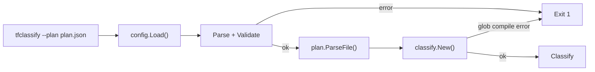
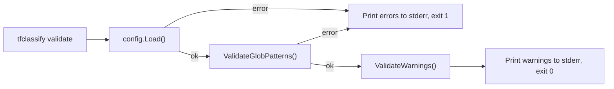
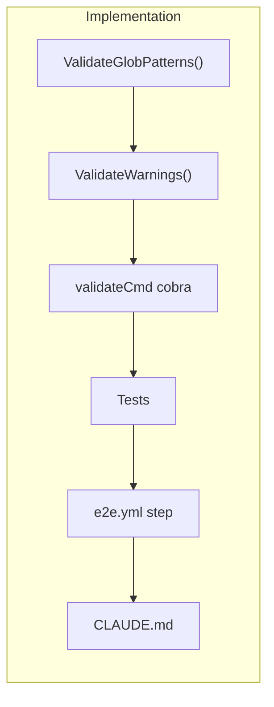

# `tfclassify validate` Command

## Change Summary

Add a `tfclassify validate` subcommand that checks `.tfclassify.hcl` for correctness without requiring a Terraform plan. The command surfaces all existing error-level validations (which today are only triggered when running classification with `--plan`) and adds new warning-level checks for unreachable rules, empty classifications, missing plugin binaries, and invalid glob patterns. This enables pre-commit hooks and CI linting of config files independently from plan classification.

## Motivation and Background

Configuration errors are only discovered at classification time when a plan is provided. Syntax errors, dangling references, invalid glob patterns, and unreachable rules go undetected until the tool is run against a real plan. A dedicated validation command enables:

- **Pre-commit hooks** that catch config errors before they reach CI
- **CI config linting** as a fast job that doesn't require Terraform or Azure credentials
- **Onboarding validation** for new users writing their first config

## Current State

Validation currently happens inside `config.Parse()` which is called by `config.Load()`. The root command requires `--plan`, so validation only runs as a side effect of classification. The following checks already exist in `internal/config/validation.go`:

| Check | Function | Behavior |
|-------|----------|----------|
| HCL syntax | `Parse()` in `loader.go` | Returns parse error with file location |
| Precedence references | `validatePrecedence()` | Error if precedence entry doesn't match a classification name |
| Default references | `validateDefaults()` | Error if `defaults.unclassified` or `defaults.no_changes` references undefined classification |
| Duplicate classifications | `validateClassifications()` | Error on duplicate classification names |
| Rule requires pattern | `validateRules()` | Error if rule has neither `resource` nor `not_resource` |
| Plugin references | `validatePluginReferences()` | Error if classification plugin block references non-enabled plugin |
| Unknown analyzer names | `parseClassificationPluginBlocks()` in `loader.go` | Error on unknown analyzer sub-block |
| Unknown attributes | `parsePrivilegeEscalationConfig()` etc. in `loader.go` | Error on unknown attribute within analyzer block |
| Deprecated attributes | `parsePrivilegeEscalationConfig()` in `loader.go` | Error on `score_threshold` with migration message |
| Redundant not_resource | `WarnRedundantNotResource()` | Warning (verbose-only) when not_resource is fully covered by higher-precedence patterns |

Glob pattern syntax is only validated at classification time when `classify.New()` calls `glob.Compile()` in `internal/classify/matcher.go`. A malformed pattern like `*_role_[*` passes config loading but fails when classifying a plan.

### Current State Diagram



## Proposed Change

Add a `validate` cobra subcommand that runs all existing validations plus new checks, without requiring a plan file. The command reuses `config.Load()` for error-level checks and adds a new `ValidateWarnings()` function for warning-level checks.

### Proposed State Diagram



## Requirements

### Functional Requirements

1. The `validate` subcommand **MUST** accept an optional `--config` / `-c` flag to specify the config file path, consistent with the root command
2. The `validate` subcommand **MUST** discover the config file using the existing `config.Discover()` logic when `--config` is not provided
3. The `validate` subcommand **MUST** surface all error-level validation failures from `config.Load()` (HCL syntax, precedence references, default references, duplicate classifications, rule patterns, plugin references, analyzer names, unknown attributes)
4. The `validate` subcommand **MUST** validate that all glob patterns in `resource` and `not_resource` fields compile successfully using `github.com/gobwas/glob`
5. The `validate` subcommand **MUST** warn when a lower-precedence classification's rules are fully shadowed by a higher-precedence classification that has a `resource = ["*"]` rule with no action constraint
6. The `validate` subcommand **MUST** warn when a classification block has no rules and no plugin analyzer blocks
7. The `validate` subcommand **MUST** warn when an enabled plugin's binary is not found in the discovery path
8. The `validate` subcommand **MUST** exit 0 when the configuration is valid (warnings are printed to stderr but do not affect exit code)
9. The `validate` subcommand **MUST** exit 1 when the configuration has errors (errors are printed to stderr)
10. Error and warning output **MUST** include file location context (filename, line, column) where available from HCL diagnostics

### Non-Functional Requirements

1. The `validate` subcommand **MUST** complete in under 1 second for typical configurations (no network calls, no plan parsing)
2. The `validate` subcommand **MUST** not require Terraform, Azure credentials, or any external dependencies beyond the plugin binaries (for the binary existence check)

## Affected Components

* `cmd/tfclassify/main.go` — new cobra subcommand registration
* `internal/config/validation.go` — new `ValidateWarnings()` function and `ValidateGlobPatterns()` function
* `internal/config/validation_test.go` — new tests for warning-level checks and glob validation
* `internal/plugin/discovery.go` — reuse `DiscoverPlugins()` for binary existence check
* `.github/workflows/e2e.yml` — add validate step to the e2e pipeline

## Scope Boundaries

### In Scope

* `validate` subcommand with `--config` flag
* All error-level validations (reusing existing `config.Load()` pipeline)
* Glob pattern syntax validation (new)
* Warning-level checks: unreachable rules, empty classifications, missing plugin binaries
* Human-readable error/warning output with file location context
* E2e pipeline integration: run `tfclassify validate` against each scenario's `.tfclassify.hcl` as a pre-flight check

### Out of Scope ("Here, But Not Further")

* JSON/machine-readable output format — defer to a future CR if needed
* Auto-fix suggestions — not planned
* Plugin schema validation beyond what the host already does (analyzer names, known attributes) — plugin-specific deep validation would require loading the plugin binary
* Integration with `tfclassify init` (e.g., auto-running validate after init) — keep commands independent
* `--syntax-only` or `--no-plugins` flags — all checks always run; plugin binary warnings are just warnings

## Implementation Approach

The implementation is a single phase since there are no external dependencies.

1. **Add `ValidateGlobPatterns()` to `internal/config/validation.go`** — iterates all rules, calls `glob.Compile()` on each `resource` and `not_resource` pattern, returns error on failure with classification name and pattern
2. **Add `ValidateWarnings()` to `internal/config/validation.go`** — returns a `[]Warning` slice containing unreachable rule warnings, empty classification warnings, and missing plugin binary warnings. Incorporate the existing `WarnRedundantNotResource()` logic into this unified function
3. **Add `validateCmd` to `cmd/tfclassify/main.go`** — cobra command that calls `config.Load()`, `ValidateGlobPatterns()`, `ValidateWarnings()`, formats output, and exits with the appropriate code
4. **Add validate step to `.github/workflows/e2e.yml`** — run `tfclassify validate -c testdata/e2e/${{ inputs.use-case }}/.tfclassify.hcl` after "Build from source" and before "Terraform init". This validates every scenario's config as a fast pre-flight check that requires no Azure credentials or Terraform state. The step **MUST** run for all scenarios and fail the job if validation returns exit 1
5. **Update CLAUDE.md** — document the new subcommand

### Implementation Flow



## Test Strategy

### Tests to Add

| Test File | Test Name | Description | Inputs | Expected Output |
|-----------|-----------|-------------|--------|-----------------|
| `internal/config/validation_test.go` | `TestValidateGlobPatterns_Valid` | Valid glob patterns pass | Config with `["*_role_*", "*"]` | No error |
| `internal/config/validation_test.go` | `TestValidateGlobPatterns_Invalid` | Malformed glob pattern fails | Config with `["*_role_[*"]` | Error mentioning pattern and classification |
| `internal/config/validation_test.go` | `TestValidateWarnings_UnreachableRule` | Catch-all shadows lower-precedence rules | Critical has `resource=["*"]` no actions, standard has rules | Warning about standard being unreachable |
| `internal/config/validation_test.go` | `TestValidateWarnings_UnreachableRule_WithActions` | Catch-all with action constraint does NOT shadow | Critical has `resource=["*"] actions=["delete"]`, standard has rules | No warning |
| `internal/config/validation_test.go` | `TestValidateWarnings_EmptyClassification` | Classification with no rules and no plugin blocks | Empty classification block | Warning about empty classification |
| `internal/config/validation_test.go` | `TestValidateWarnings_EmptyClassification_WithPlugin` | Classification with plugin block but no rules | Classification with `azurerm {}` only | No warning |
| `internal/config/validation_test.go` | `TestValidateWarnings_MissingPluginBinary` | Enabled plugin binary not found | Config with enabled plugin, no binary on disk | Warning about missing binary |
| `cmd/tfclassify/main_test.go` | `TestValidateCmd_ValidConfig` | Valid config exits 0 | Valid `.tfclassify.hcl` | Exit 0, no stderr |
| `cmd/tfclassify/main_test.go` | `TestValidateCmd_InvalidConfig` | Invalid config exits 1 | Config with precedence mismatch | Exit 1, error on stderr |
| `cmd/tfclassify/main_test.go` | `TestValidateCmd_WarningsExitZero` | Warnings still exit 0 | Config with empty classification | Exit 0, warnings on stderr |

### Tests to Modify

| Test File | Test Name | Current Behavior | New Behavior | Reason for Change |
|-----------|-----------|------------------|--------------|-------------------|
| `internal/config/validation_test.go` | `TestWarnRedundantNotResource_*` | Standalone warning function | Incorporated into `ValidateWarnings()` | Unified warning interface |

### Tests to Remove

Not applicable — no tests are removed.

## Acceptance Criteria

### AC-1: Valid config produces clean output

```gherkin
Given a syntactically correct .tfclassify.hcl with valid references and no warnings
When the user runs "tfclassify validate"
Then the command prints "Configuration valid." to stdout
  And the command exits with code 0
```

### AC-2: Syntax error produces error output

```gherkin
Given a .tfclassify.hcl with invalid HCL syntax
When the user runs "tfclassify validate"
Then the command prints the syntax error with file location to stderr
  And the command exits with code 1
```

### AC-3: Invalid glob pattern produces error output

```gherkin
Given a .tfclassify.hcl with resource = ["*_role_[*"] (unclosed bracket)
When the user runs "tfclassify validate"
Then the command prints an error identifying the malformed pattern and classification name to stderr
  And the command exits with code 1
```

### AC-4: Unreachable rule produces warning

```gherkin
Given a .tfclassify.hcl where classification "critical" has resource = ["*"] with no actions constraint
  And classification "standard" has rules that are fully shadowed
When the user runs "tfclassify validate"
Then the command prints a warning about unreachable rules in "standard" to stderr
  And the command exits with code 0
```

### AC-5: Empty classification produces warning

```gherkin
Given a .tfclassify.hcl where a classification block has no rules and no plugin analyzer blocks
When the user runs "tfclassify validate"
Then the command prints a warning about the empty classification to stderr
  And the command exits with code 0
```

### AC-6: Missing plugin binary produces warning

```gherkin
Given a .tfclassify.hcl with an enabled plugin "azurerm"
  And the plugin binary is not found in any discovery path
When the user runs "tfclassify validate"
Then the command prints a warning that the plugin binary was not found to stderr
  And the command suggests running "tfclassify init" to install it
  And the command exits with code 0
```

### AC-7: Custom config path

```gherkin
Given a config file at a non-default path "/tmp/my-config.hcl"
When the user runs "tfclassify validate --config /tmp/my-config.hcl"
Then the command validates that specific file
```

### AC-8: No config file found

```gherkin
Given no .tfclassify.hcl exists in the current directory or home directory
  And no --config flag is provided
When the user runs "tfclassify validate"
Then the command prints an error that no configuration file was found to stderr
  And the command exits with code 1
```

### AC-9: E2e pipeline validates configs before classification

```gherkin
Given the e2e workflow runs for any scenario
When the "Build from source" step completes
Then "tfclassify validate" runs against the scenario's .tfclassify.hcl before Terraform init
  And the job fails immediately if validation returns exit 1
```

## Quality Standards Compliance

### Build & Compilation

- [ ] Code compiles/builds without errors
- [ ] No new compiler warnings introduced

### Linting & Code Style

- [ ] All linter checks pass with zero warnings/errors (`make lint`)
- [ ] Code follows project coding conventions

### Test Execution

- [ ] All existing tests pass after implementation (`make test`)
- [ ] All new tests pass
- [ ] `make vet` passes

### Documentation

- [ ] `CLAUDE.md` updated with validate subcommand usage
- [ ] CLI `--help` text is clear and consistent with existing subcommands

### Code Review

- [ ] Changes submitted via pull request
- [ ] PR title follows Conventional Commits format
- [ ] CI passes (including e2e tests)

### Verification Commands

```bash
# Build verification
make build

# Lint verification
make vet

# Test execution
make test

# Vulnerability check
govulncheck ./...

# Manual smoke test
bin/tfclassify validate
bin/tfclassify validate --config testdata/e2e/route-table/.tfclassify.hcl
```

## Dependencies

* No external dependencies — all validation logic uses existing packages (`config`, `classify`, `plugin`)
* `github.com/gobwas/glob` is already a dependency (used in `internal/classify/matcher.go` and `internal/plugin/loader.go`)

## Related Items

* CR-0024: Classification-Scoped Plugin Analyzer Rules — introduced plugin blocks inside classifications that need validation
* CR-0028: Pattern-Based Control-Plane Detection — introduced `actions`/`data_actions` config attributes validated by the existing loader
* `internal/config/validation.go` — existing error-level validation logic to extend
* `internal/config/loader.go` — existing parse-time validation (analyzer names, attributes)
* `internal/classify/matcher.go` — glob compilation logic to reuse for pattern validation
