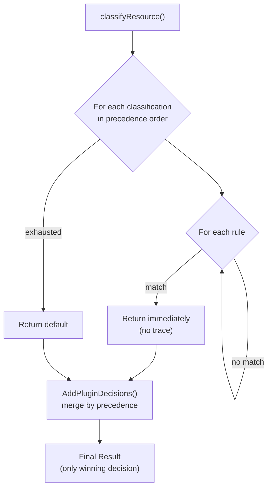
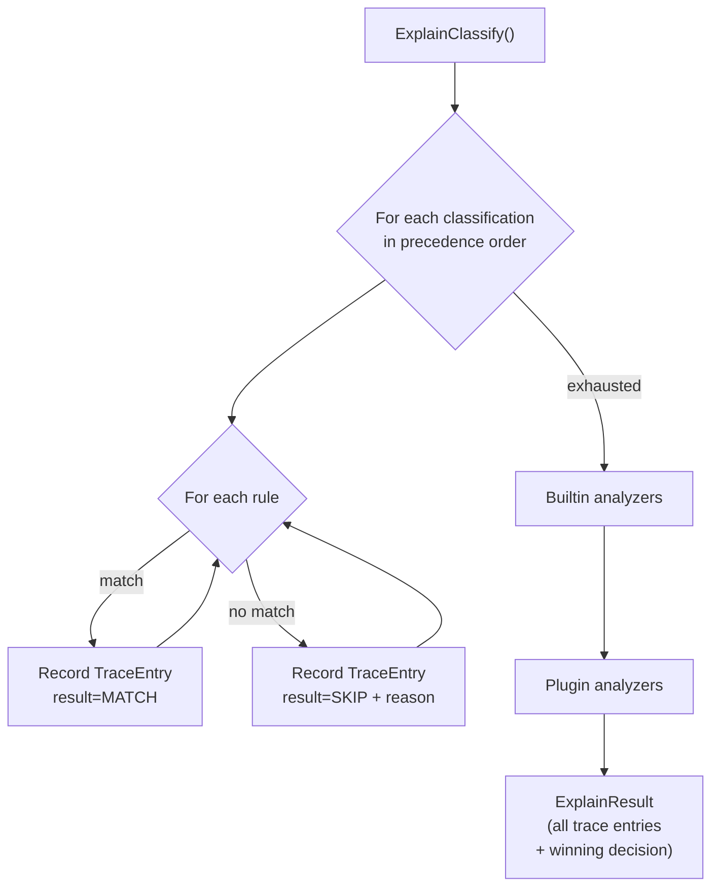
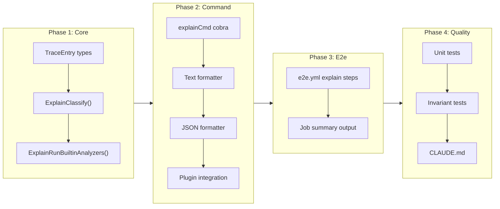

# `tfclassify explain` Command

## Change Summary

Add a `tfclassify explain` subcommand that shows why each resource was classified the way it was. Given a Terraform plan, the command traces through the full classification pipeline — core rule evaluation in precedence order, builtin analyzers (deletion, replace, sensitive), and external plugin analyzers — and produces a per-resource trace showing every rule evaluated, whether it matched or was skipped, and how the final classification was determined via precedence aggregation.

## Motivation and Background

When tfclassify classifies a resource as "critical", operators need to understand *why* — especially when the classification seems unexpected. Today, the only way to debug classification is to read the config, mentally simulate the precedence logic, and guess which analyzer produced the winning decision. An explain command provides a structured trace of the entire decision pipeline, making classification behavior transparent and debuggable.

The root command's `--verbose` flag prints extra information (e.g., redundant `not_resource` warnings), but it does not trace per-resource decision logic. The `explain` command provides a fundamentally different view: a per-resource pipeline trace showing *why* each decision was made, not just *what* the final result was.

## Current State

The classifier in `internal/classify/classifier.go` iterates classifications in precedence order and short-circuits on the first rule match per resource (`classifyResource()` returns immediately on match). Builtin analyzer decisions and plugin decisions are merged in afterwards via `AddPluginDecisions()`, which compares precedence and keeps the higher-precedence classification.

This means:
- No trace of which rules were evaluated and skipped
- No visibility into why a particular rule matched or didn't match (action mismatch? resource pattern mismatch?)
- No record of builtin analyzer or plugin analyzer evaluations
- The `ResourceDecision` struct only stores the final winning classification and matched rule, not the full evaluation history

### Current State Diagram



## Proposed Change

Add a separate `ExplainClassify()` method on `Classifier` that evaluates **all** rules for a resource (no short-circuit) and records each evaluation step in a `TraceEntry` struct. This keeps the normal classification hot path untouched. The explain command then runs the full pipeline (core rules, builtin analyzers, plugins) and collects all trace data.

### Proposed State Diagram



## Requirements

### Functional Requirements

1. The `explain` subcommand **MUST** accept `--plan` / `-p` (required), `--config` / `-c` (optional), and `--output` / `-o` (optional, default `text`) flags, consistent with the root command
2. The `explain` subcommand **MUST** accept a repeatable `--resource` / `-r` flag that filters output to specific resource addresses (full address match). When omitted, all resources are explained
3. The `explain` subcommand **MUST** support both JSON and binary `.tfplan` plan files, consistent with the root command
4. For each resource, the trace **MUST** show every core rule evaluated across all classifications in precedence order, with the evaluation result (MATCH or SKIP) and the reason for skipping (action mismatch, resource pattern mismatch)
5. For each resource, the trace **MUST** show builtin analyzer evaluations (deletion, replace, sensitive) and whether they produced a decision
6. For each resource, the trace **MUST** show plugin analyzer decisions including the classification, reason, and metadata (role source, trigger type, matched actions/patterns, scope level) as returned by the plugin
7. For each resource, the trace **MUST** show the final winning classification and explain why it won (precedence rank comparison)
8. The `ExplainClassify()` method **MUST** be a separate method on `Classifier`, not a modification to the existing `Classify()` method, to avoid performance impact on the normal classification path
9. The `explain` subcommand **MUST** run external plugins when they are configured and installed, to show plugin-originated decisions in the trace
10. The text output format **MUST** be human-readable with clear indentation showing the evaluation hierarchy
11. The JSON output format **MUST** be machine-parseable with a stable schema for programmatic consumption
12. The text output format **MUST** be suitable for embedding in GitHub Actions job summaries (plain text wrapped in a fenced code block renders well in markdown)

### Non-Functional Requirements

1. The `explain` subcommand **MUST** not modify the existing `Classify()` code path — the `ExplainClassify()` method is additive only
2. The `explain` subcommand **MUST** produce identical final classifications as the root command for the same plan and config (correctness invariant)

## Affected Components

* `cmd/tfclassify/main.go` — new cobra subcommand registration
* `internal/classify/classifier.go` — new `ExplainClassify()` method
* `internal/classify/result.go` — new `ExplainResult` and `TraceEntry` types
* `internal/classify/analyzer.go` — new `ExplainRunBuiltinAnalyzers()` method that collects trace entries
* `internal/plugin/loader.go` — plugin decisions already include metadata; no changes needed, but explain command needs to display plugin decision metadata
* `internal/output/` — new explain formatter (or extend existing formatter)
* `.github/workflows/e2e.yml` — add explain steps after each classify step, writing output to `$GITHUB_STEP_SUMMARY`

## Scope Boundaries

### In Scope

* `explain` subcommand with `--plan`, `--resource`, `--config`, and `--output` flags
* `ExplainClassify()` method with full trace collection (separate from `Classify()`)
* `ExplainResult`, `TraceEntry` types
* Text and JSON output formats
* Full pipeline tracing: core rules, builtin analyzers, external plugins
* Plugin metadata display (role source, trigger type, matched actions/patterns, scope level)
* E2e pipeline integration: run `tfclassify explain` after each classify step and write text output to the GitHub Actions job summary (`$GITHUB_STEP_SUMMARY`)

### Out of Scope ("Here, But Not Further")

* Interactive/TUI mode — not planned
* Diff-based explain (comparing two plans) — defer to future CR
* Explain for hypothetical resources (without a plan) — would require a different architecture
* Glob/pattern matching on `--resource` flag — use full address; repeat the flag for multiple resources
* Modifying `Classify()` or `classifyResource()` — explain uses its own code path

## Expected CLI Interface

```bash
# Explain all resources
tfclassify explain --plan plan.json

# Explain specific resources (repeatable flag)
tfclassify explain --plan plan.json -r "azurerm_role_assignment.example"
tfclassify explain --plan plan.json -r "azurerm_role_assignment.owner" -r "azurerm_role_assignment.reader"

# JSON output
tfclassify explain --plan plan.json --output json

# Custom config
tfclassify explain --plan plan.json --config path/to/.tfclassify.hcl
```

## Expected Output (human-readable)

```
Resource: azurerm_role_assignment.example
Actions:  [create]
Final:    critical (from plugin: azurerm/privilege-escalation)

  Evaluation trace:
  1. [critical] rule "*_role_*" actions=["delete"]        → SKIP (action mismatch: create ≠ delete)
  2. [critical] azurerm/privilege-escalation               → MATCH
     Role: Owner (source: builtin)
     Trigger: control-plane
     Matched actions: [*] via patterns: [Microsoft.Authorization/*]
  3. [standard] rule "*"                                   → MATCH (catch-all)

  Winner: critical (precedence rank 0 beats standard rank 1)

---

Resource: azurerm_user_assigned_identity.test
Actions:  [create]
Final:    standard (from core rule)

  Evaluation trace:
  1. [critical] rule "*_role_*" actions=["delete"]        → SKIP (resource mismatch)
  2. [standard] rule "*"                                   → MATCH (catch-all)

  Winner: standard (only match)
```

## Expected Output (JSON)

```json
{
  "resources": [
    {
      "address": "azurerm_role_assignment.example",
      "type": "azurerm_role_assignment",
      "actions": ["create"],
      "final_classification": "critical",
      "final_source": "plugin: azurerm/privilege-escalation",
      "trace": [
        {
          "classification": "critical",
          "source": "core-rule",
          "rule": "*_role_* actions=[delete]",
          "result": "skip",
          "reason": "action mismatch: create ≠ delete"
        },
        {
          "classification": "critical",
          "source": "plugin: azurerm/privilege-escalation",
          "result": "match",
          "reason": "role \"Owner\" grants control-plane access matching configured patterns",
          "metadata": {
            "role_name": "Owner",
            "role_source": "builtin",
            "trigger": "control-plane",
            "matched_actions": ["*"],
            "matched_patterns": ["Microsoft.Authorization/*"]
          }
        },
        {
          "classification": "standard",
          "source": "core-rule",
          "rule": "* (catch-all)",
          "result": "match"
        }
      ],
      "winner_reason": "precedence rank 0 beats standard rank 1"
    }
  ]
}
```

## Implementation Approach

### Phase 1: Trace types and ExplainClassify

1. **Add trace types to `internal/classify/result.go`** — `ExplainResult` (wraps `Result` + per-resource trace data), `TraceEntry` struct with fields: classification, source (core-rule/builtin/plugin), rule description, result (match/skip), reason, metadata
2. **Add `ExplainClassify()` to `internal/classify/classifier.go`** — evaluates all rules for each resource without short-circuiting, records each step as a `TraceEntry`. Returns `ExplainResult`
3. **Add `ExplainRunBuiltinAnalyzers()`** — runs builtin analyzers and records their evaluations as trace entries

### Phase 2: Explain command and output

4. **Add `explainCmd` to `cmd/tfclassify/main.go`** — cobra command that loads config, parses plan, runs `ExplainClassify()`, builtin analyzers, and plugins, then formats output
5. **Add explain formatter** — text and JSON formatters for `ExplainResult`
6. **Plugin integration** — collect plugin decisions (already have metadata in `ResourceDecision.MatchedRule`) and add them as trace entries

### Phase 3: E2e pipeline integration

7. **Add explain steps to `.github/workflows/e2e.yml`** — after each classify step (create JSON, create binary, destroy JSON, destroy binary), add a corresponding explain step that runs `tfclassify explain` against the same plan and config. Each explain step writes a markdown section header and fenced code block to `$GITHUB_STEP_SUMMARY`, so the full classification trace for every e2e scenario appears in the GitHub Actions job summary. Explain steps use `continue-on-error: true` so they do not block the pipeline — the explain command is informational, not an assertion. The explain step **MUST** only run when the corresponding classify step succeeded (use `if: steps.<classify-step>.outcome == 'success'`)

### Phase 4: Documentation and testing

8. **Unit tests** for `ExplainClassify()` — verify trace completeness, verify final classification matches `Classify()` for same input
9. **Update CLAUDE.md** — document the new subcommand

### Implementation Flow



## Test Strategy

### Tests to Add

| Test File | Test Name | Description | Inputs | Expected Output |
|-----------|-----------|-------------|--------|-----------------|
| `internal/classify/classifier_test.go` | `TestExplainClassify_AllRulesEvaluated` | All rules appear in trace, not just the match | Config with 3 classifications, 5 rules | Trace has entries for every rule |
| `internal/classify/classifier_test.go` | `TestExplainClassify_SkipReasons` | Skip reasons are accurate | Rule with action mismatch, rule with resource mismatch | Trace entries show correct skip reasons |
| `internal/classify/classifier_test.go` | `TestExplainClassify_MatchesClassify` | ExplainClassify final result equals Classify result | Same config and changes | Identical final classifications |
| `internal/classify/classifier_test.go` | `TestExplainClassify_NoChanges` | Empty plan produces no-changes result | Empty change list | ExplainResult with NoChanges=true |
| `internal/classify/classifier_test.go` | `TestExplainClassify_DefaultFallback` | Unmatched resource shows default trace | Resource that matches no rules | Trace shows all skips, final is defaults.unclassified |
| `internal/classify/classifier_test.go` | `TestExplainClassify_BuiltinAnalyzerTrace` | Builtin analyzer decisions appear in trace | Resource with delete action | Trace includes DeletionAnalyzer entry |
| `internal/classify/classifier_test.go` | `TestExplainClassify_PluginDecisionTrace` | Plugin decisions appear in trace with metadata | Mock plugin decision with metadata | Trace includes plugin entry with metadata fields |
| `cmd/tfclassify/main_test.go` | `TestExplainCmd_TextOutput` | Text format is readable and correct | Valid plan + config | Structured text output |
| `cmd/tfclassify/main_test.go` | `TestExplainCmd_JsonOutput` | JSON format is valid and complete | Valid plan + config | Valid JSON with trace array |
| `cmd/tfclassify/main_test.go` | `TestExplainCmd_ResourceFilter` | --resource flag filters output | Plan with 3 resources, filter to 1 | Only filtered resource in output |
| `cmd/tfclassify/main_test.go` | `TestExplainCmd_ResourceFilter_Repeatable` | Multiple --resource flags | Plan with 3 resources, filter to 2 | Only filtered resources in output |

### Tests to Modify

Not applicable — `ExplainClassify()` is a new method; existing `Classify()` tests remain unchanged.

### Tests to Remove

Not applicable — no tests are removed.

## Acceptance Criteria

### AC-1: Explain all resources with text output

```gherkin
Given a valid .tfclassify.hcl and a Terraform plan JSON with 3 resource changes
When the user runs "tfclassify explain --plan plan.json"
Then the command prints a trace for each resource showing all evaluated rules
  And each trace entry shows the classification, source, and result (MATCH or SKIP)
  And skip entries include the reason (action mismatch, resource mismatch)
  And the final classification and winner reason are shown for each resource
```

### AC-2: Explain specific resource with --resource filter

```gherkin
Given a Terraform plan with resources "azurerm_role_assignment.owner" and "azurerm_user_assigned_identity.test"
When the user runs "tfclassify explain --plan plan.json -r azurerm_role_assignment.owner"
Then the command prints a trace only for "azurerm_role_assignment.owner"
  And "azurerm_user_assigned_identity.test" does not appear in the output
```

### AC-3: Repeatable --resource flag

```gherkin
Given a Terraform plan with 5 resource changes
When the user runs "tfclassify explain --plan plan.json -r resource.a -r resource.b"
Then the command prints traces for "resource.a" and "resource.b" only
```

### AC-4: JSON output format

```gherkin
Given a valid plan and config
When the user runs "tfclassify explain --plan plan.json --output json"
Then the output is valid JSON with a "resources" array
  And each resource entry has "address", "final_classification", and "trace" fields
  And each trace entry has "classification", "source", "result" fields
  And plugin trace entries include a "metadata" object
```

### AC-5: Plugin decisions appear in trace

```gherkin
Given a config with the azurerm plugin enabled and privilege_escalation configured
  And a plan containing azurerm_role_assignment with the Owner role
When the user runs "tfclassify explain --plan plan.json"
Then the trace for the role assignment includes a plugin entry with result "MATCH"
  And the plugin entry metadata shows role_name, role_source, trigger, matched_actions, and matched_patterns
```

### AC-6: Builtin analyzer decisions appear in trace

```gherkin
Given a plan containing a resource with actions=["delete"]
When the user runs "tfclassify explain --plan plan.json"
Then the trace includes an entry from the deletion builtin analyzer
```

### AC-7: Final classification matches normal classification

```gherkin
Given any valid plan and config
When the user runs "tfclassify explain --plan plan.json --output json"
  And the user runs "tfclassify --plan plan.json --output json --detailed-exitcode"
Then the final_classification for each resource in explain output matches the classification in the normal output
```

### AC-8: Unknown resource address in --resource filter

```gherkin
Given a plan that does not contain "nonexistent.resource"
When the user runs "tfclassify explain --plan plan.json -r nonexistent.resource"
Then the command prints a message that no matching resource was found
  And the command exits with code 0
```

### AC-9: E2e pipeline shows explain output in job summary

```gherkin
Given the e2e workflow runs for any scenario
When a classify step completes successfully
Then a corresponding explain step runs against the same plan and config
  And the explain text output is written to the GitHub Actions job summary inside a fenced code block
  And the explain step uses continue-on-error so it does not fail the job
  And the job summary shows explain traces for both create and destroy phases
```

### AC-10: E2e explain covers all plan formats

```gherkin
Given the e2e workflow runs with plan-formats "both"
When the JSON classify step and binary classify step both succeed
Then explain runs for both the JSON and binary plans
  And both explain outputs appear as separate sections in the job summary
```

## Quality Standards Compliance

### Build & Compilation

- [ ] Code compiles/builds without errors
- [ ] No new compiler warnings introduced

### Linting & Code Style

- [ ] All linter checks pass with zero warnings/errors (`make lint`)
- [ ] Code follows project coding conventions

### Test Execution

- [ ] All existing tests pass after implementation (`make test`)
- [ ] All new tests pass
- [ ] `make vet` passes

### Documentation

- [ ] `CLAUDE.md` updated with explain subcommand usage
- [ ] CLI `--help` text is clear and consistent with existing subcommands

### Code Review

- [ ] Changes submitted via pull request
- [ ] PR title follows Conventional Commits format
- [ ] CI passes (including e2e tests)

### Verification Commands

```bash
# Build verification
make build

# Lint verification
make vet

# Test execution
make test

# Vulnerability check
govulncheck ./...

# Manual smoke test
bin/tfclassify explain --plan testdata/plan/valid_plan.json
bin/tfclassify explain --plan testdata/plan/valid_plan.json --output json
bin/tfclassify explain --plan testdata/plan/valid_plan.json -r "azurerm_resource_group.example"
```

## E2e Workflow Integration

After each classify step in `.github/workflows/e2e.yml`, add an explain step that writes to the job summary. Example for the create-phase JSON classify:

```yaml
- name: Explain create plan (JSON)
  if: steps.classify-create-json.outcome == 'success'
  continue-on-error: true
  run: |
    echo "### Explain: create (JSON)" >> "$GITHUB_STEP_SUMMARY"
    echo '```' >> "$GITHUB_STEP_SUMMARY"
    tfclassify explain \
      -p testdata/e2e/${{ inputs.use-case }}/create.json \
      -c testdata/e2e/${{ inputs.use-case }}/.tfclassify.hcl \
      >> "$GITHUB_STEP_SUMMARY" 2>&1
    echo '```' >> "$GITHUB_STEP_SUMMARY"
```

The same pattern applies to: create binary, destroy JSON, destroy binary. Each gets its own summary section header. The `continue-on-error: true` ensures explain failures (e.g., if the command is not yet implemented on the `release` binary source) do not block the pipeline.

## Dependencies

* CR-0025 (`validate` command) is not a hard dependency but both share the pattern of adding a new cobra subcommand. If implemented after CR-0025, follow the same registration pattern
* External plugins must be installed for full pipeline tracing. If plugins are configured but not installed, the command **MUST** print a warning and continue with core rules and builtin analyzers only (graceful degradation, not a hard failure)

## Related Items

* CR-0024: Classification-Scoped Plugin Analyzer Rules — the classification-scoped model this command traces through
* CR-0028: Pattern-Based Control-Plane Detection — the action/data-action pattern matching model displayed in plugin trace entries
* `internal/classify/classifier.go` — classification logic that `ExplainClassify()` extends
* `internal/classify/result.go` — types to extend with `ExplainResult` and `TraceEntry`
