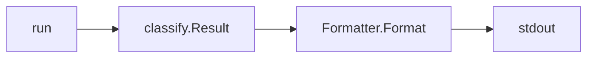
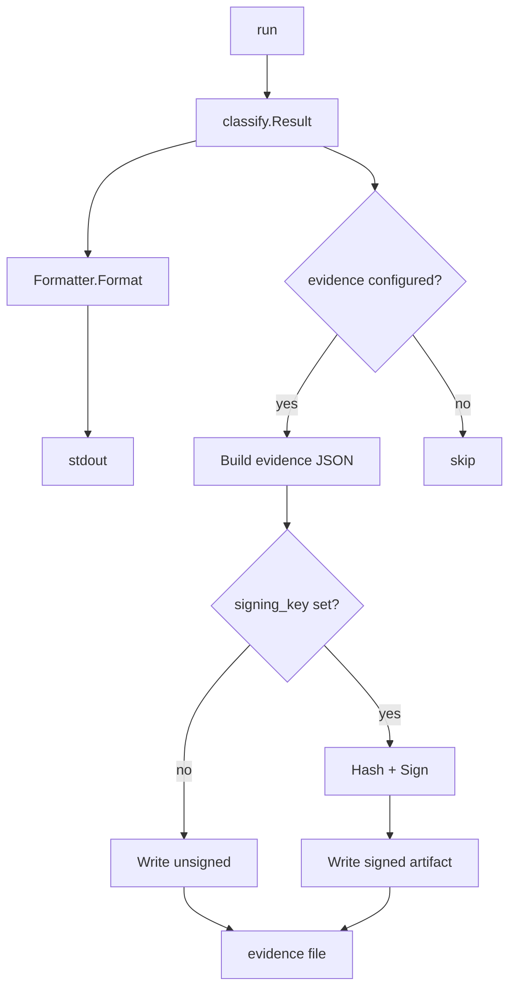
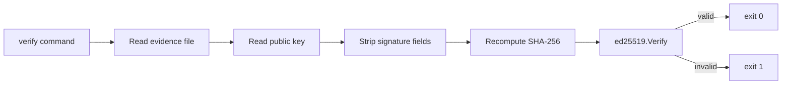
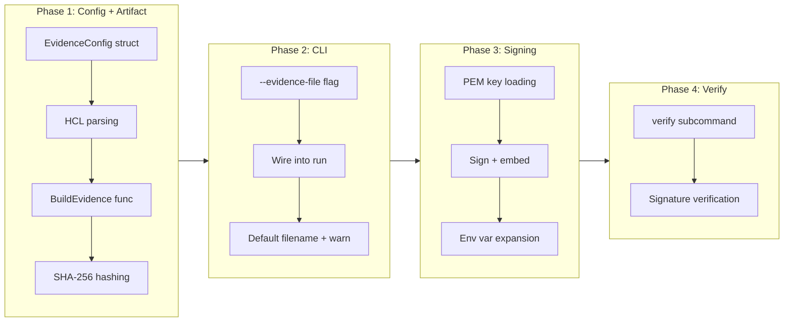

# Evidence Artifact Output

## Change Summary

Add a self-contained JSON evidence artifact that records classification results with cryptographic integrity. The artifact includes hashes, timestamps, and an optional Ed25519 signature so that regulated environments can prove classification happened and verify the result hasn't been tampered with. A new `evidence {}` config block controls content inclusion, a `--evidence-file` flag on the root command controls where it's written, and a new `tfclassify verify` subcommand validates signatures.

## Motivation and Background

Regulated environments (finance, healthcare, government) must demonstrate that infrastructure changes went through a defined review process. Today, tfclassify produces classification output to stdout — useful for CI gating but not for audit retention. Auditors want a timestamped, hashable artifact proving that classification happened, what the inputs were (by hash), and what the result was. Signing makes this tamper-evident: an operator cannot retroactively change a classification result.

This is distinct from approval workflows or compliance scanning (which are out of scope). The evidence artifact is a passive record — tfclassify produces it, the CI pipeline stores it, and auditors consume it.

## Change Drivers

* Regulated environments require audit evidence for infrastructure change approvals
* Classification results need to be verifiable after the fact (tamper evidence)
* CI pipelines need a single artifact to archive alongside Terraform plan files
* No existing output format captures input hashes, tool version, or timestamps

## Current State

The root command (`run()` in `cmd/tfclassify/main.go`) runs the classification pipeline and writes results to stdout via `output.Formatter.Format()`. Three output formats exist: `text`, `json`, `github`. None includes input hashes, timestamps, tool version, or signing.

The `classify.Result` struct contains all classification data. The `classify.ExplainResult` struct contains full pipeline traces. Both are already JSON-serializable via the output package.

There is no `evidence {}` block in the HCL config schema (`internal/config/config.go`). The `Formatter` writes to a single `io.Writer` and has no concept of a sidecar output file.



## Proposed Change

### 1. HCL Config Block

Add an `evidence {}` block to the config schema:

```hcl
evidence {
  include_trace     = true     # Include full explain trace (default: false)
  include_resources = true     # Include per-resource decisions (default: true)
  signing_key       = "$TFCLASSIFY_SIGNING_KEY"  # Path to Ed25519 PEM private key
}
```

The `signing_key` field supports environment variable expansion (prefix `$`). When set, the evidence artifact is signed. When omitted, the artifact is produced unsigned.

### 2. Evidence Artifact Schema

```json
{
  "schema_version": "1.0",
  "timestamp": "2026-02-18T19:30:00Z",
  "tfclassify_version": "0.3.0",
  "plan_file_hash": "sha256:abc123...",
  "config_file_hash": "sha256:def456...",
  "overall": "critical",
  "overall_description": "Requires security team approval",
  "exit_code": 2,
  "no_changes": false,
  "resources": [
    {
      "address": "azurerm_role_assignment.admin",
      "type": "azurerm_role_assignment",
      "actions": ["delete"],
      "classification": "critical",
      "classification_description": "Requires security team approval",
      "matched_rule": "Deleting IAM or role resources requires security review"
    }
  ],
  "trace": [
    {
      "address": "azurerm_role_assignment.admin",
      "classification": "critical",
      "source": "core-rule",
      "rule": "Deleting IAM or role resources requires security review",
      "result": "match",
      "reason": ""
    }
  ],
  "signature": "base64...",
  "signed_content_hash": "sha256:..."
}
```

The `resources` array is included when `include_resources = true` (default). The `trace` array is included when `include_trace = true`. The `signature` and `signed_content_hash` fields are present only when `signing_key` is configured.

### 3. Signing Process

1. Build the evidence JSON **without** `signature` and `signed_content_hash` fields
2. Compute SHA-256 of the canonical JSON bytes → `signed_content_hash`
3. Sign the hash with the Ed25519 private key → `signature` (base64-encoded)
4. Insert both fields into the final JSON output

This uses Go stdlib `crypto/ed25519` with zero external dependencies. Key generation is the user's responsibility (e.g., `openssl genpkey -algorithm Ed25519`).

### 4. CLI Changes

**Root command** — new flag:

```
--evidence-file <path>    Write evidence artifact to file (works alongside --output)
```

When `evidence {}` is configured in HCL but `--evidence-file` is not provided, tfclassify **MUST** warn to stderr and write to the current working directory with a default filename: `tfclassify-evidence-{timestamp}.json` (ISO 8601 compact: `20260218T193000Z`).

The `--evidence-file` flag and `--output` flag are independent — both can be used in the same invocation. Normal output goes to stdout, evidence goes to the file.

**New `verify` subcommand:**

```
tfclassify verify --evidence-file <path> --public-key <path>
```

| Flag | Short | Required | Description |
|------|-------|----------|-------------|
| `--evidence-file` | `-e` | yes | Path to evidence artifact JSON |
| `--public-key` | `-k` | yes | Path to Ed25519 PEM public key |

Exit codes:
- `0` — signature is valid
- `1` — signature is invalid, missing, or verification failed

The verify command **MUST** recompute `signed_content_hash` from the artifact content (excluding `signature` and `signed_content_hash` fields) and verify against the embedded signature using the provided public key.

### Proposed State Diagram





## Requirements

### Functional Requirements

1. The system **MUST** support an `evidence {}` block in `.tfclassify.hcl` with fields `include_trace` (bool), `include_resources` (bool), and `signing_key` (string)
2. The system **MUST** expand environment variable references (prefix `$`) in the `signing_key` field
3. The system **MUST** accept a `--evidence-file <path>` flag on the root command
4. The system **MUST** write an evidence artifact to the specified path when `--evidence-file` is provided, regardless of whether `evidence {}` is configured in HCL
5. The system **MUST** warn to stderr and write to a default filename in CWD when `evidence {}` is configured but `--evidence-file` is not provided
6. The default filename **MUST** follow the pattern `tfclassify-evidence-{timestamp}.json` using ISO 8601 compact format
7. The evidence artifact **MUST** include: `schema_version`, `timestamp` (RFC 3339), `tfclassify_version`, `plan_file_hash` (SHA-256 of input file bytes), `config_file_hash` (SHA-256 of config file bytes), `overall`, `overall_description`, `exit_code`, `no_changes`
8. The evidence artifact **MUST** include the `resources` array when `include_resources` is true or when `evidence {}` is not configured (flag-only mode defaults to true)
9. The evidence artifact **MUST** include the `trace` array when `include_trace` is true, running the explain pipeline to collect trace data
10. The `plan_file_hash` **MUST** be computed over the raw input file bytes as provided to `--plan`, not the parsed JSON representation
11. When `signing_key` is configured and points to a valid Ed25519 PEM private key, the system **MUST** sign the evidence artifact using Ed25519
12. The signing process **MUST** compute SHA-256 over the JSON content excluding `signature` and `signed_content_hash` fields, then sign that hash
13. The `signature` field **MUST** be base64-encoded (standard encoding, no padding)
14. The system **MUST** provide a `tfclassify verify` subcommand with `--evidence-file` and `--public-key` flags
15. The verify command **MUST** exit `0` when the signature is valid and `1` when invalid, missing, or verification fails
16. The verify command **MUST** recompute the content hash from the artifact and verify against the embedded signature
17. The `--evidence-file` flag and `--output` flag **MUST** be independent — both can be used in a single invocation
18. When `signing_key` is configured but the key file cannot be read or is not a valid Ed25519 key, the system **MUST** exit with an error (not silently skip signing)

### Non-Functional Requirements

1. The evidence artifact generation **MUST** use only Go standard library packages (`crypto/ed25519`, `crypto/sha256`, `encoding/pem`, `encoding/base64`)
2. The evidence artifact **MUST** be valid JSON parseable by any JSON library
3. The `validate` subcommand **MUST** validate the `evidence {}` block when present (key file existence check is a warning, not an error — the key may only exist in CI)

## Affected Components

* `internal/config/config.go` — new `EvidenceConfig` struct and `evidence {}` block parsing
* `internal/config/loader.go` — parse the new block
* `internal/config/validate.go` — validate evidence config fields
* `internal/output/evidence.go` — new file: evidence artifact builder, hashing, signing
* `cmd/tfclassify/main.go` — `--evidence-file` flag on root, `verify` subcommand, evidence generation in `run()`
* `cmd/tfclassify/verify.go` — new file: verify subcommand implementation

## Scope Boundaries

### In Scope

* `evidence {}` HCL config block with `include_trace`, `include_resources`, `signing_key`
* `--evidence-file` flag on root command
* Evidence JSON artifact with classification results, input hashes, timestamps, optional trace
* Ed25519 signing and signature embedding
* `tfclassify verify` subcommand
* Default file output with warning when evidence is configured but `--evidence-file` is omitted
* Documentation updates (README CLI reference, CLAUDE.md, full-reference example)

### Out of Scope ("Here, But Not Further")

* ECDSA, RSA, or other signing algorithms — Ed25519 only for now
* Key generation (`openssl` or similar is the user's responsibility)
* Key rotation or management workflows
* Cosign or Sigstore integration
* KMS integration (Azure Key Vault, AWS KMS)
* Evidence storage or archival (CI pipeline responsibility)
* Chaining evidence artifacts across multiple runs
* Attaching evidence to Git commits or PRs

## Alternative Approaches Considered

* **`--output evidence` format** — would replace normal stdout output, preventing concurrent JSON + evidence. The `--evidence-file` sidecar approach is more flexible.
* **Detached signature file** (`.sig` sidecar) — simpler but two files to manage. Embedding the signature in the JSON is self-contained.
* **HMAC with shared secret** — simpler crypto but shared secrets are harder to manage in multi-team environments. Ed25519 asymmetric signing is standard practice.
* **No signing, just hashing** — hashes prove integrity if you trust the hash source, but don't prove provenance. Signing adds provenance at minimal implementation cost.

## Impact Assessment

### User Impact

New optional feature — zero impact on existing workflows. Users opt in via `evidence {}` config or `--evidence-file` flag. The `verify` command is standalone and doesn't affect classification.

### Technical Impact

* New config block requires HCL schema extension (existing pattern from `defaults {}`)
* Evidence generation adds SHA-256 computation of plan and config files — negligible performance impact
* When `include_trace = true`, the evidence path runs both `Classify()` and `ExplainClassify()` — doubles classification work for that invocation. This is acceptable because evidence generation is not the hot path.
* Zero new external dependencies (Go stdlib only)

### Business Impact

Enables tfclassify adoption in regulated environments that require audit evidence. Differentiates from Trivy/Checkov which produce pass/fail results but not signed change-classification evidence.

## Implementation Approach

### Phase 1: Config and artifact structure

1. Add `EvidenceConfig` to `internal/config/config.go`
2. Parse `evidence {}` block in loader
3. Add validation for evidence fields
4. Create `internal/output/evidence.go` with `EvidenceArtifact` struct and `BuildEvidence()` function
5. Implement SHA-256 hashing for plan and config files

### Phase 2: CLI integration

1. Add `--evidence-file` flag to root command
2. Wire evidence generation into `run()` after classification completes
3. Handle default filename + warning when evidence is configured but flag is omitted
4. When `include_trace = true`, run `ExplainClassify()` alongside `Classify()` to collect trace data

### Phase 3: Signing

1. Implement Ed25519 PEM key loading in `internal/output/evidence.go`
2. Implement sign-then-embed flow (hash content → sign hash → insert fields)
3. Environment variable expansion for `signing_key`

### Phase 4: Verify command

1. Create `cmd/tfclassify/verify.go` with `verifyCmd`
2. Implement artifact loading, signature extraction, content hash recomputation, Ed25519 verification
3. Register subcommand in `init()`

### Implementation Flow



## Test Strategy

### Tests to Add

| Test File | Test Name | Description | Inputs | Expected Output |
|-----------|-----------|-------------|--------|-----------------|
| `internal/config/loader_test.go` | `TestLoadEvidenceConfig` | Parses evidence block from HCL | HCL with `evidence {}` | `EvidenceConfig` with correct fields |
| `internal/config/loader_test.go` | `TestLoadEvidenceConfig_Defaults` | Default values when fields omitted | HCL with empty `evidence {}` | `include_resources=true`, `include_trace=false` |
| `internal/config/loader_test.go` | `TestLoadEvidenceConfig_EnvVarExpansion` | Expands `$VAR` in signing_key | HCL with `signing_key = "$TEST_KEY"` | Expanded path |
| `internal/config/validate_test.go` | `TestValidateEvidenceConfig` | Validates evidence config fields | Various invalid configs | Appropriate errors |
| `internal/output/evidence_test.go` | `TestBuildEvidence_Basic` | Builds unsigned artifact with resources | `classify.Result` + file paths | Valid JSON with hashes, resources, no trace |
| `internal/output/evidence_test.go` | `TestBuildEvidence_WithTrace` | Builds artifact with trace data | `classify.Result` + `ExplainResult` | JSON includes trace array |
| `internal/output/evidence_test.go` | `TestBuildEvidence_WithoutResources` | Omits resources when configured | `include_resources=false` | JSON without resources array |
| `internal/output/evidence_test.go` | `TestBuildEvidence_PlanHash` | Hashes raw file bytes | Known file content | Known SHA-256 hash |
| `internal/output/evidence_test.go` | `TestSignEvidence` | Signs artifact with Ed25519 key | Generated key pair + artifact | Valid signature + content hash |
| `internal/output/evidence_test.go` | `TestSignEvidence_InvalidKey` | Rejects non-Ed25519 key | RSA PEM key | Error |
| `internal/output/evidence_test.go` | `TestVerifyEvidence_Valid` | Verifies valid signature | Signed artifact + public key | true |
| `internal/output/evidence_test.go` | `TestVerifyEvidence_Tampered` | Detects tampered artifact | Modified signed artifact + public key | false |
| `internal/output/evidence_test.go` | `TestVerifyEvidence_WrongKey` | Rejects wrong public key | Signed artifact + different key | false |
| `internal/output/evidence_test.go` | `TestVerifyEvidence_Unsigned` | Rejects unsigned artifact | Artifact without signature | false |
| `cmd/tfclassify/main_test.go` | `TestEvidenceFileFlag` | Writes evidence to specified path | `--evidence-file /tmp/test.json` | File created with valid JSON |
| `cmd/tfclassify/main_test.go` | `TestEvidenceDefaultFilename` | Writes to CWD with warning | Evidence configured, no flag | File in CWD, warning on stderr |

### Tests to Modify

Not applicable — this is new functionality that doesn't change existing behavior.

### Tests to Remove

Not applicable — no existing tests become redundant.

## Acceptance Criteria

### AC-1: Evidence artifact with classification results

```gherkin
Given a .tfclassify.hcl with an evidence {} block with include_resources = true
  And a valid Terraform plan file
When the user runs tfclassify --plan tfplan --evidence-file evidence.json
Then evidence.json contains schema_version, timestamp, tfclassify_version
  And evidence.json contains plan_file_hash as SHA-256 of the plan file bytes
  And evidence.json contains config_file_hash as SHA-256 of the config file bytes
  And evidence.json contains overall, overall_description, exit_code, no_changes
  And evidence.json contains a resources array with per-resource classifications
```

### AC-2: Evidence artifact with trace

```gherkin
Given a .tfclassify.hcl with evidence { include_trace = true }
  And a valid Terraform plan file
When the user runs tfclassify --plan tfplan --evidence-file evidence.json
Then evidence.json contains a trace array with per-resource pipeline traces
  And each trace entry contains classification, source, rule, result, and reason
```

### AC-3: Signed evidence artifact

```gherkin
Given a .tfclassify.hcl with evidence { signing_key = "/path/to/ed25519.pem" }
  And the signing key file contains a valid Ed25519 private key
  And a valid Terraform plan file
When the user runs tfclassify --plan tfplan --evidence-file evidence.json
Then evidence.json contains a signature field (base64-encoded)
  And evidence.json contains a signed_content_hash field (SHA-256)
  And the signature is valid for the content hash using the corresponding public key
```

### AC-4: Signature verification

```gherkin
Given a signed evidence artifact at evidence.json
  And the corresponding Ed25519 public key at public.pem
When the user runs tfclassify verify --evidence-file evidence.json --public-key public.pem
Then the command exits with code 0
  And prints "Signature valid." to stdout
```

### AC-5: Tampered artifact detection

```gherkin
Given a signed evidence artifact at evidence.json
  And the overall classification has been manually changed in the file
  And the corresponding Ed25519 public key at public.pem
When the user runs tfclassify verify --evidence-file evidence.json --public-key public.pem
Then the command exits with code 1
  And prints "Signature invalid." to stderr
```

### AC-6: Default filename with warning

```gherkin
Given a .tfclassify.hcl with an evidence {} block
  And no --evidence-file flag is provided
When the user runs tfclassify --plan tfplan
Then a warning is printed to stderr: "--evidence-file not provided, writing tfclassify-evidence-{timestamp}.json to current directory"
  And the evidence artifact is written to the current directory with the stated filename
```

### AC-7: Evidence alongside normal output

```gherkin
Given a .tfclassify.hcl with an evidence {} block
When the user runs tfclassify --plan tfplan --output json --evidence-file evidence.json
Then JSON classification output is written to stdout
  And the evidence artifact is written to evidence.json
  And both outputs are independent and complete
```

### AC-8: Invalid signing key

```gherkin
Given a .tfclassify.hcl with evidence { signing_key = "/path/to/invalid.pem" }
  And the key file is not a valid Ed25519 private key
When the user runs tfclassify --plan tfplan --evidence-file evidence.json
Then the command exits with a non-zero code
  And an error message indicates the signing key is invalid
```

### AC-9: Flag-only mode without evidence config

```gherkin
Given a .tfclassify.hcl without an evidence {} block
When the user runs tfclassify --plan tfplan --evidence-file evidence.json
Then an unsigned evidence artifact is written to evidence.json
  And the artifact includes resources (default: true) but no trace (default: false)
```

## Quality Standards Compliance

### Build & Compilation

- [ ] Code compiles/builds without errors
- [ ] No new compiler warnings introduced

### Linting & Code Style

- [ ] All linter checks pass with zero warnings/errors
- [ ] Code follows project coding conventions and style guides

### Test Execution

- [ ] All existing tests pass after implementation
- [ ] All new tests pass
- [ ] Test coverage meets project requirements for changed code

### Documentation

- [ ] README.md updated: verify command in CLI Reference, evidence in Configuration
- [ ] CLAUDE.md updated: verify subcommand in CLI Subcommands
- [ ] Full-reference example updated: evidence {} block with annotations
- [ ] sdk/README.md: no changes needed (evidence is host-side only)

### Code Review

- [ ] Changes submitted via pull request
- [ ] PR title follows Conventional Commits format
- [ ] Code review completed and approved

### Verification Commands

```bash
# Build verification
make build

# Lint verification
make lint

# Test execution
make test

# Vulnerability check
govulncheck ./...

# Validate reference config
bin/tfclassify validate -c docs/examples/full-reference/.tfclassify.hcl
```

## Risks and Mitigation

### Risk 1: Trace generation doubles classification work

**Likelihood:** high (by design when `include_trace = true`)
**Impact:** low (evidence generation is not latency-sensitive)
**Mitigation:** Only run `ExplainClassify()` when `include_trace = true`. Document the performance note.

### Risk 2: Large plan files produce large evidence artifacts

**Likelihood:** medium (plans with hundreds of resources)
**Impact:** low (JSON compresses well, storage is cheap)
**Mitigation:** `include_resources` and `include_trace` flags let users control artifact size. Default `include_trace = false` keeps artifacts compact.

### Risk 3: PEM key format variations

**Likelihood:** medium (different tools produce slightly different PEM formats)
**Impact:** medium (users can't sign if their key isn't accepted)
**Mitigation:** Support both PKCS8 (`BEGIN PRIVATE KEY`) and raw Ed25519 (`BEGIN ED25519 PRIVATE KEY`) PEM formats. Test with keys generated by OpenSSL and ssh-keygen.

## Dependencies

* No external dependencies — Go stdlib `crypto/ed25519`, `crypto/sha256`, `encoding/pem`, `encoding/base64`
* No dependency on other CRs

## Decision Outcome

Chosen approach: "sidecar evidence file with embedded Ed25519 signature", because it keeps normal output unaffected, produces a self-contained auditable artifact, and uses zero external dependencies. The `--evidence-file` flag gives CI pipelines explicit control over artifact placement, while the config block makes evidence generation traceable in version control.

## Related Items

* Related to future CR: Compliance annotations (compliance tags would flow into evidence artifacts)
* Related to future CR: Blast radius analyzer (blast radius data would appear in evidence)
