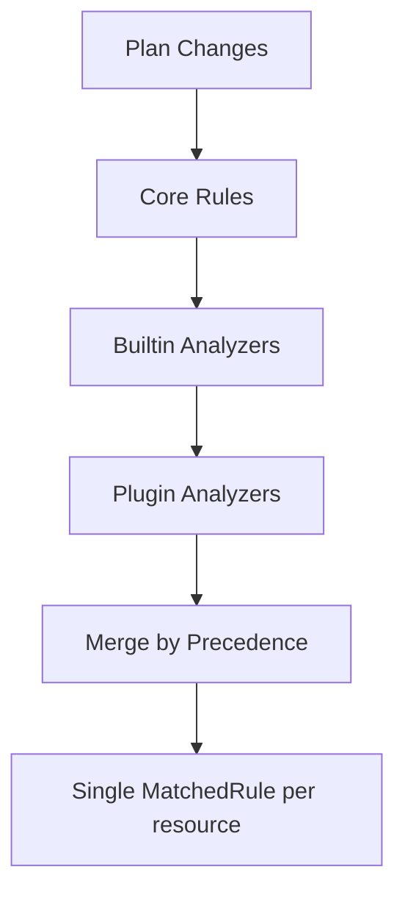
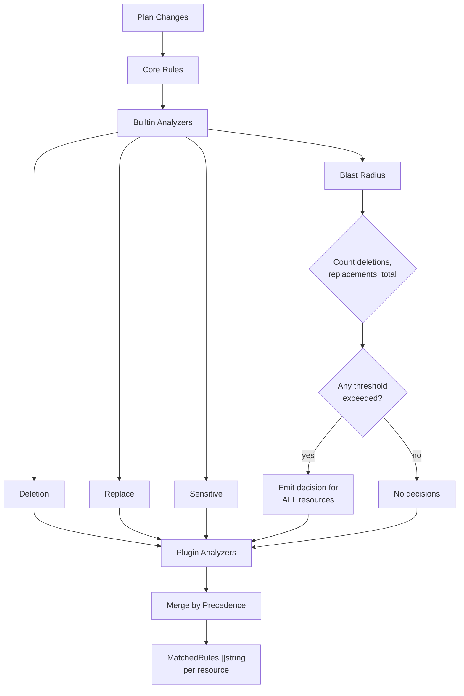
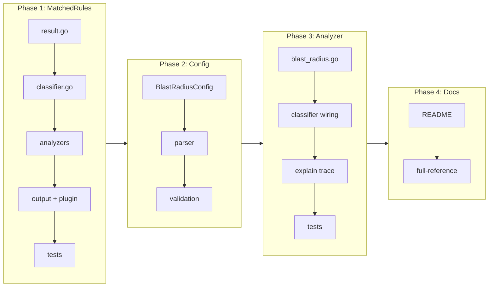

# Blast Radius Analyzer

## Change Summary

Add a new Layer 2 builtin analyzer that classifies based on the overall scale of a Terraform plan — total changes, deletions, and replacements — rather than individual resource characteristics. When a plan exceeds a configured threshold, all resources in the plan receive a decision at that classification level. Additionally, change `ResourceDecision.MatchedRule` from a single string to `MatchedRules []string` so that when multiple sources match the same classification (e.g., a core rule AND blast radius, or blast radius AND privilege escalation), all reasons are visible in a single decision.

## Motivation and Background

Today, tfclassify classifies each resource individually. A plan that deletes 40 resources is treated as 40 independent decisions. But mass changes are inherently dangerous regardless of individual resource types — a fat-finger `terraform destroy`, an accidental module removal, or a provider upgrade forcing replacement of every resource. These scenarios need to escalate the entire plan, not just individual resources.

Regulated environments treat large-scale infrastructure changes as high-risk operations that require additional scrutiny. The blast radius analyzer provides this guardrail without requiring provider-specific plugins.

Separately, the current `MatchedRule` (singular string) means that when blast radius matches alongside another analyzer for the same classification, only one reason is visible. This forces operators to re-run the pipeline to discover additional matching reasons — wasting time in environments where pipeline runs are expensive or slow.

## Change Drivers

* Mass changes (accidental destroys, module removals, provider upgrades) are not caught by per-resource rules
* Regulated environments require blast radius controls for infrastructure changes
* Single `MatchedRule` hides concurrent matches, forcing unnecessary re-runs

## Current State

### Builtin Analyzer Interface

Builtin analyzers implement `BuiltinAnalyzer` in `internal/classify/analyzer.go`:

```go
type BuiltinAnalyzer interface {
    Name() string
    Analyze(changes []plan.ResourceChange) []ResourceDecision
}
```

Three analyzers exist: `DeletionAnalyzer`, `ReplaceAnalyzer`, `SensitiveAnalyzer`. Each inspects individual resources and returns per-resource decisions. None operates on the plan as a whole.

### Decision Model

`ResourceDecision` has a single `MatchedRule string` field. During merging (`AddPluginDecisions`), when a higher-precedence decision overwrites a lower one, the old `MatchedRule` is replaced entirely. There is no accumulation of reasons.

### Classification Config

`ClassificationConfig` has `Rules []RuleConfig` for core rules and `PluginAnalyzerConfigs` for plugin analyzer blocks. There is no `blast_radius` block.



## Proposed Change

### 1. Blast Radius Config Block

Add a `blast_radius {}` block inside `classification {}`:

```hcl
classification "critical" {
  description = "Requires security team approval"

  rule {
    resource = ["*_role_*"]
    actions  = ["delete"]
  }

  blast_radius {
    max_deletions    = 5    # Standalone deletions (delete without create)
    max_replacements = 10   # Replacements (delete + create)
    max_changes      = 50   # All resources with non-no-op actions
  }
}

classification "review" {
  description = "Requires team lead review"

  blast_radius {
    max_deletions = 2
    max_changes   = 20
  }
}
```

**No defaults.** Each field is only active when explicitly configured. If `blast_radius {}` is not present or a field is omitted, that threshold is not evaluated. This avoids surprising behavior — thresholds are too context-dependent for sensible defaults.

### 2. Blast Radius Analyzer

A new `BlastRadiusAnalyzer` that implements `BuiltinAnalyzer`. Unlike existing analyzers that inspect individual resources, it counts actions across the entire plan:

- **Deletions**: resources with "delete" in actions but not "create" (standalone deletes)
- **Replacements**: resources with both "delete" and "create" in actions
- **Total changes**: all resources with at least one non-"no-op" action

When any threshold for a classification is exceeded, the analyzer emits a decision for **every resource** in the plan at that classification level. The reason includes the trigger, actual count, and threshold.

The analyzer receives the blast radius config from the classifier, which extracts it from each classification's config. It evaluates thresholds per classification in precedence order — if `critical` triggers, `review` thresholds are still evaluated (no short-circuit), because both reasons should be visible if both match.

### 3. MatchedRules (plural)

Change `ResourceDecision`:

```go
// Before
type ResourceDecision struct {
    ...
    MatchedRule string
}

// After
type ResourceDecision struct {
    ...
    MatchedRules []string
}
```

JSON output changes from:

```json
{"matched_rule": "critical rule 1 (resource: *_role_*)"}
```

to:

```json
{"matched_rules": ["critical rule 1 (resource: *_role_*)"]}
```

This is a forward-only change. No backward compatibility shims are provided.

All code that sets `MatchedRule` switches to appending to `MatchedRules`. During merging (`AddPluginDecisions`), when a decision at the same classification level arrives, its reasons are **appended** to the existing list rather than replacing. When a higher-precedence decision overwrites a lower one, the lower reasons are replaced entirely (different classification = different decision).

### Proposed State Diagram



## Requirements

### Functional Requirements

1. The system **MUST** support a `blast_radius {}` block inside `classification {}` blocks
2. The `blast_radius {}` block **MUST** support three optional integer fields: `max_deletions`, `max_replacements`, `max_changes`
3. Each field **MUST** only be active when explicitly configured — omitted fields are not evaluated
4. The system **MUST** count deletions as resources with "delete" in actions but not "create"
5. The system **MUST** count replacements as resources with both "delete" and "create" in actions
6. The system **MUST** count total changes as all resources with at least one non-"no-op" action
7. When any configured threshold is exceeded, the analyzer **MUST** emit a decision for every resource in the plan at that classification level
8. The decision reason **MUST** include which threshold was exceeded, the actual count, and the configured threshold (e.g., "builtin: blast_radius - 8 deletions exceeded max_deletions threshold of 5")
9. When multiple thresholds are exceeded for the same classification, all exceeded thresholds **MUST** appear as separate reasons in the decision
10. The `ResourceDecision` struct **MUST** change `MatchedRule string` to `MatchedRules []string`
11. The JSON output **MUST** change from `"matched_rule"` (string) to `"matched_rules"` (array of strings)
12. When merging decisions at the **same** classification level, the system **MUST** append reasons to the existing `MatchedRules` list
13. When a higher-precedence decision replaces a lower-precedence one, the system **MUST** replace `MatchedRules` entirely
14. The text output **MUST** display all matched rules, one per line, when verbose mode is enabled
15. The `validate` subcommand **MUST** validate that `blast_radius` threshold values are positive integers when configured
16. The `explain` command **MUST** include blast radius trace entries showing threshold evaluation per classification

### Non-Functional Requirements

1. The blast radius analyzer **MUST** run in Layer 2 alongside existing builtin analyzers — no external dependencies
2. The blast radius analyzer **MUST** compute counts in a single pass over the changes slice
3. The `MatchedRules` change **MUST** not affect the explain trace format (traces already use `TraceEntry` structs, not `MatchedRule`)

## Affected Components

* `internal/classify/result.go` — `MatchedRule` → `MatchedRules`
* `internal/classify/classifier.go` — all `MatchedRule` assignments, `AddPluginDecisions` merge logic
* `internal/classify/blast_radius.go` — new file: `BlastRadiusAnalyzer`
* `internal/classify/deletion.go`, `replace.go`, `sensitive.go` — `MatchedRule` → `MatchedRules`
* `internal/config/config.go` — new `BlastRadiusConfig` struct, add to `ClassificationConfig`
* `internal/config/loader.go` — parse `blast_radius {}` block
* `internal/config/validate.go` — validate threshold values
* `internal/output/formatter.go` — `JSONResource.MatchedRule` → `MatchedRules`, text output
* `internal/plugin/runner_server.go` — `MatchedRule` → `MatchedRules`
* `internal/plugin/loader.go` — `MatchedRule` → `MatchedRules`
* `cmd/tfclassify/main.go` — pass blast radius config to analyzer, register in `builtinAnalyzers()`

## Scope Boundaries

### In Scope

* `blast_radius {}` config block with `max_deletions`, `max_replacements`, `max_changes`
* `BlastRadiusAnalyzer` as a Layer 2 builtin
* `MatchedRule` → `MatchedRules` across the codebase
* JSON output change: `matched_rule` → `matched_rules` (forward-only, no fallback)
* Text output: multi-line rule display in verbose mode
* Explain trace entries for blast radius evaluation
* Validation of blast radius config
* Documentation updates (README, CLAUDE.md, full-reference example)

### Out of Scope ("Here, But Not Further")

* Per-resource-type thresholds (e.g., "max 3 deletions of `*_database*`") — too complex, use core rules instead
* Percentage-based thresholds (e.g., "more than 50% of resources deleted") — can be added later
* Blast radius in plugin SDK — this is a host-side builtin, not exposed to plugins
* Backward-compatible `matched_rule` field in JSON — forward-only, no fallback provided

## Alternative Approaches Considered

* **Percentage-based thresholds** — "more than 50% of resources deleted" is useful but requires knowing total resource count in state, not just in plan. Deferred.
* **Per-resource-type thresholds** — "max 3 database deletions" duplicates what core rules already do. Not worth the config complexity.
* **Separate `MatchedRule` + `AdditionalRules` fields** — awkward API that exists only for backward compatibility. We only move forward.
* **Blast radius as a separate pipeline phase** (not a builtin analyzer) — would require restructuring the pipeline. Fitting it into the existing `BuiltinAnalyzer` interface keeps the architecture clean.

## Impact Assessment

### User Impact

* **Forward-only change**: JSON output field `matched_rule` (string) becomes `matched_rules` (array). No fallback to the old field.
* **New feature**: `blast_radius {}` is opt-in. No impact on existing configs.
* **Text output**: verbose mode shows multiple rules per resource when applicable. Compact mode shows the first rule only (same as today for single-rule cases).

### Technical Impact

* `MatchedRules` change touches ~15 files but is mechanical (string → slice append).
* `BlastRadiusAnalyzer` is a new file following established patterns from `deletion.go`.
* The analyzer needs access to per-classification blast radius config, which means the `Classifier` must pass it through. This is a slight interface change — the analyzer needs config context that existing analyzers don't.

### Business Impact

Differentiates tfclassify for regulated environments. Mass-change detection is a common compliance requirement that Trivy/Checkov do not address.

## Implementation Approach

### Phase 1: MatchedRules refactor

1. Change `ResourceDecision.MatchedRule string` to `MatchedRules []string` in `result.go`
2. Update all assignments in `classifier.go`, `deletion.go`, `replace.go`, `sensitive.go`
3. Update `AddPluginDecisions` merge logic: append for same classification, replace for higher precedence
4. Update `internal/plugin/runner_server.go` and `internal/plugin/loader.go`
5. Update `internal/output/formatter.go`: JSON field, text formatting
6. Update all tests

### Phase 2: Blast radius config

1. Add `BlastRadiusConfig` struct to `internal/config/config.go`
2. Add `BlastRadius *BlastRadiusConfig` field to `ClassificationConfig`
3. Parse `blast_radius {}` block in loader (alongside existing `rule {}` blocks)
4. Add validation: values must be positive integers when set
5. Update `validate` command tests

### Phase 3: Blast radius analyzer

1. Create `internal/classify/blast_radius.go` implementing `BuiltinAnalyzer`
2. The analyzer receives a map of classification name → `BlastRadiusConfig` from the classifier
3. Count deletions, replacements, and total changes in a single pass
4. For each classification with thresholds, check if any are exceeded
5. When exceeded, emit a decision for every resource with all exceeded threshold reasons
6. Register in `builtinAnalyzers()` in `main.go`
7. Add explain trace integration

### Phase 4: Documentation and examples

1. Update README: blast radius in Three-Layer Model, config example
2. Update CLAUDE.md: mention blast radius in Layer 2 description
3. Update full-reference example with annotated `blast_radius {}` blocks

### Implementation Flow



## Test Strategy

### Tests to Add

| Test File | Test Name | Description | Inputs | Expected Output |
|-----------|-----------|-------------|--------|-----------------|
| `internal/classify/blast_radius_test.go` | `TestBlastRadius_DeletionThresholdExceeded` | Triggers when deletions exceed max | 6 deletes, max_deletions=5 | Decision for all resources with reason |
| `internal/classify/blast_radius_test.go` | `TestBlastRadius_DeletionThresholdNotExceeded` | No trigger when under threshold | 3 deletes, max_deletions=5 | No decisions |
| `internal/classify/blast_radius_test.go` | `TestBlastRadius_ReplacementThreshold` | Triggers on replacement count | 11 replacements, max_replacements=10 | Decision for all resources |
| `internal/classify/blast_radius_test.go` | `TestBlastRadius_TotalChangesThreshold` | Triggers on total non-no-op changes | 51 changes, max_changes=50 | Decision for all resources |
| `internal/classify/blast_radius_test.go` | `TestBlastRadius_MultipleThresholdsExceeded` | All exceeded thresholds in reasons | Exceeds both max_deletions and max_changes | MatchedRules contains both reasons |
| `internal/classify/blast_radius_test.go` | `TestBlastRadius_OmittedFieldsIgnored` | Only configured fields are checked | max_deletions=5 only, 100 creates | No decisions (creates don't count) |
| `internal/classify/blast_radius_test.go` | `TestBlastRadius_NoConfig` | No blast_radius block = no decisions | No config | No decisions |
| `internal/classify/blast_radius_test.go` | `TestBlastRadius_NoOpExcluded` | No-op actions don't count toward total | 60 no-ops, max_changes=50 | No decisions |
| `internal/classify/blast_radius_test.go` | `TestBlastRadius_EmitsForAllResources` | Every resource gets a decision | 6 deletes, max_deletions=5 | Decisions count = total resources |
| `internal/config/loader_test.go` | `TestLoadBlastRadiusConfig` | Parses blast_radius block | HCL with blast_radius | Correct config values |
| `internal/config/validate_test.go` | `TestValidateBlastRadius_NegativeValue` | Rejects negative thresholds | max_deletions=-1 | Validation error |
| `internal/output/formatter_test.go` | `TestFormatJSON_MatchedRules` | JSON outputs matched_rules array | Decision with 2 rules | `"matched_rules": ["...", "..."]` |
| `internal/output/formatter_test.go` | `TestFormatText_MultipleRules` | Verbose text shows all rules | Decision with 2 rules | Both rules displayed |

### Tests to Modify

| Test File | Test Name | Current Behavior | New Behavior | Reason for Change |
|-----------|-----------|------------------|--------------|-------------------|
| `internal/output/formatter_test.go` | All existing tests | Assert `MatchedRule` string | Assert `MatchedRules` slice | Field rename |
| `internal/classify/classifier_test.go` | All `MatchedRule` assertions | Check single string | Check first element of slice | Field rename |
| `internal/classify/deletion_test.go` | `TestDeletionAnalyzer` assertions | Check `MatchedRule` | Check `MatchedRules[0]` | Field rename |
| `internal/classify/replace_test.go` | `TestReplaceAnalyzer` assertions | Check `MatchedRule` | Check `MatchedRules[0]` | Field rename |
| `internal/classify/sensitive_test.go` | All `MatchedRule` assertions | Check `MatchedRule` | Check `MatchedRules[0]` | Field rename |
| `internal/plugin/runner_server_test.go` | `MatchedRule` check | Check `MatchedRule` | Check `MatchedRules` | Field rename |
| `integration_test.go` | Plugin integration tests | Set `MatchedRule` | Set `MatchedRules` | Field rename |

### Tests to Remove

Not applicable — no tests become redundant.

## Acceptance Criteria

### AC-1: Blast radius triggers on deletion count

```gherkin
Given a .tfclassify.hcl with classification "critical" containing blast_radius { max_deletions = 5 }
  And a Terraform plan with 8 standalone resource deletions
When the user runs tfclassify --plan tfplan
Then every resource in the plan is classified as "critical"
  And MatchedRules contains "builtin: blast_radius - 8 deletions exceeded max_deletions threshold of 5"
```

### AC-2: Blast radius does not trigger below threshold

```gherkin
Given a .tfclassify.hcl with classification "critical" containing blast_radius { max_deletions = 5 }
  And a Terraform plan with 3 standalone resource deletions
When the user runs tfclassify --plan tfplan
Then the blast radius analyzer does not emit any decisions
  And resources are classified by core rules only
```

### AC-3: Omitted fields are ignored

```gherkin
Given a .tfclassify.hcl with classification "critical" containing blast_radius { max_deletions = 5 }
  And the max_replacements and max_changes fields are not configured
  And a Terraform plan with 100 creates and 3 deletions
When the user runs tfclassify --plan tfplan
Then the blast radius analyzer does not trigger
  And only the deletion count is evaluated against the threshold
```

### AC-4: Multiple reasons visible in single decision

```gherkin
Given a .tfclassify.hcl where classification "critical" has both:
  - A core rule matching *_role_* with actions = ["delete"]
  - blast_radius { max_deletions = 5 }
  And a Terraform plan with 8 deletions including azurerm_role_assignment.admin
When the user runs tfclassify --plan tfplan -v
Then azurerm_role_assignment.admin has MatchedRules containing both:
  - The core rule reason
  - The blast radius reason
```

### AC-5: All resources receive blast radius decisions

```gherkin
Given a .tfclassify.hcl with classification "critical" containing blast_radius { max_changes = 10 }
  And a Terraform plan with 15 resources being created
When the user runs tfclassify --plan tfplan
Then all 15 resources receive a "critical" classification from blast radius
  And each decision includes the blast radius reason
```

### AC-6: JSON output uses matched_rules array

```gherkin
Given a classified Terraform plan
When the user runs tfclassify --plan tfplan --output json
Then each resource in the JSON output has a "matched_rules" field
  And the field is an array of strings
  And the old "matched_rule" field is not present
```

### AC-7: Blast radius in explain trace

```gherkin
Given a .tfclassify.hcl with blast_radius { max_deletions = 5 } on "critical"
  And a Terraform plan with 8 deletions
When the user runs tfclassify explain --plan tfplan
Then each resource's trace includes a blast radius entry
  And the entry shows source "builtin: blast_radius"
  And the entry shows the threshold evaluation result
```

### AC-8: No-op actions excluded from total count

```gherkin
Given a .tfclassify.hcl with classification "critical" containing blast_radius { max_changes = 10 }
  And a Terraform plan with 5 creates and 50 no-op resources
When the user runs tfclassify --plan tfplan
Then the blast radius analyzer counts 5 total changes (not 55)
  And the threshold is not exceeded
```

### AC-9: Validation rejects invalid thresholds

```gherkin
Given a .tfclassify.hcl with blast_radius { max_deletions = -1 }
When the user runs tfclassify validate
Then the command exits with code 1
  And the error message indicates the threshold must be a positive integer
```

## Quality Standards Compliance

### Build & Compilation

- [ ] Code compiles/builds without errors
- [ ] No new compiler warnings introduced

### Linting & Code Style

- [ ] All linter checks pass with zero warnings/errors
- [ ] Code follows project coding conventions and style guides

### Test Execution

- [ ] All existing tests pass after implementation (with MatchedRules updates)
- [ ] All new tests pass
- [ ] Test coverage meets project requirements for changed code

### Documentation

- [ ] README.md updated: blast radius in Layer 2 table, config example
- [ ] CLAUDE.md updated: Layer 2 description includes blast radius
- [ ] Full-reference example updated: blast_radius blocks with annotations

### Code Review

- [ ] Changes submitted via pull request
- [ ] PR title follows Conventional Commits format
- [ ] Code review completed and approved

### Verification Commands

```bash
# Build verification
make build

# Lint verification
make lint

# Test execution
make test

# Vulnerability check
govulncheck ./...
```

## Risks and Mitigation

### Risk 1: MatchedRules field change affects downstream consumers

**Likelihood:** low (project is pre-1.0 with limited adoption)
**Impact:** low (field rename + type change is straightforward to adapt to)
**Mitigation:** Forward-only — no fallback logic. Document in release notes.

### Risk 2: Blast radius emitting decisions for ALL resources inflates output

**Likelihood:** medium (large plans with many resources)
**Impact:** low (verbose output is already long for large plans)
**Mitigation:** Blast radius decisions only appear when thresholds are exceeded — an exceptional case. In normal operation, output size is unchanged.

### Risk 3: BlastRadiusAnalyzer interface mismatch

**Likelihood:** low
**Impact:** medium (may need interface extension)
**Mitigation:** The existing `BuiltinAnalyzer.Analyze(changes []plan.ResourceChange)` interface works — the analyzer receives all changes and can count them. Config access is handled by the classifier passing config at construction time, not through the interface.

## Dependencies

* No external dependencies
* No dependency on other CRs (but evidence artifact CR-0029 will benefit from MatchedRules)

## Decision Outcome

Chosen approach: "blast radius as a Layer 2 builtin with MatchedRules refactor", because it fits the existing analyzer pattern, is provider-agnostic, requires no plugins, and the MatchedRules change enables proper multi-reason visibility across the entire pipeline.

## Related Items

* CR-0029: Evidence artifact output (will include MatchedRules in evidence)
* CR-0018: Inline builtin analyzers (established the BuiltinAnalyzer pattern)
* Future CR: Required tags analyzer (will follow the same BuiltinAnalyzer pattern)
