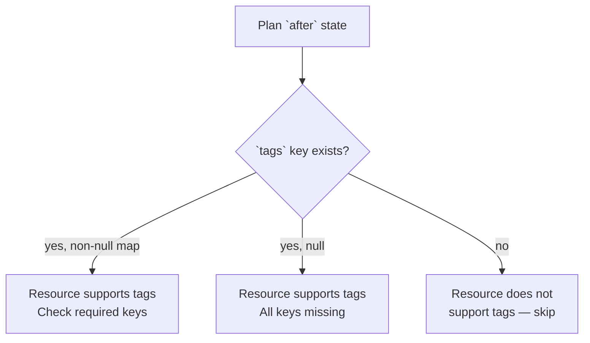
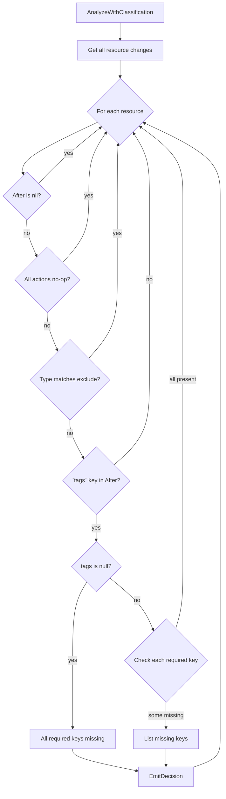
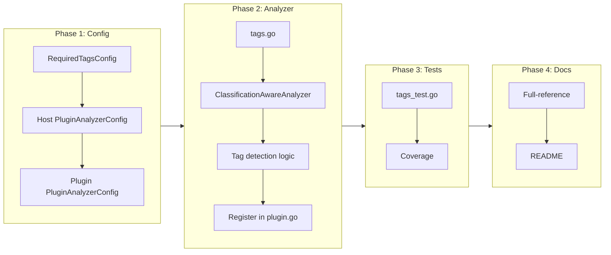

# Required Tags Analyzer

## Change Summary

Add a new `RequiredTagsAnalyzer` to the azurerm plugin that detects resources missing required tag keys on creates and updates. The analyzer checks the `tags` attribute in the Terraform plan's `after` state — if the key is present, the resource supports tags; if tags are null or missing required keys, it's a violation. Configurable per-classification via a `required_tags {}` block inside `azurerm {}`. All violations are surfaced at once via `MatchedRules` (CR-0030).

## Motivation and Background

Regulated environments mandate resource tagging for cost allocation, ownership tracking, data classification, and compliance reporting. Azure Policy can enforce tags at deploy time, but that feedback comes late — after `terraform apply` starts. tfclassify can catch missing tags at plan time, before any resources are created, giving teams faster feedback in the same pipeline stage as classification.

Tags are provider-specific (Azure uses `tags`, GCP uses `labels`) and structurally different across providers. This analyzer belongs in the azurerm plugin rather than the core engine.

## Change Drivers

* Regulated environments require mandatory tags for cost allocation, ownership, and compliance
* Late feedback from Azure Policy (at apply time) wastes pipeline time
* Plan-time tag validation catches violations earlier in the CI/CD cycle
* Tag requirements vary by classification level (production may require stricter tagging than dev)

## Current State

The azurerm plugin has three analyzers: `PrivilegeEscalationAnalyzer`, `NetworkExposureAnalyzer`, `KeyVaultAccessAnalyzer`. All implement `ClassificationAwareAnalyzer` for per-classification config. They follow a consistent pattern:

1. Receive `analyzerConfigJSON` from the host via `AnalyzeWithClassification()`
2. Unmarshal into `PluginAnalyzerConfig` struct
3. Extract the analyzer-specific sub-config
4. Query resources via `runner.GetResourceChanges()`
5. Inspect `change.After` attributes
6. Emit decisions via `runner.EmitDecision()`

The `PluginAnalyzerConfig` struct in `privilege.go` holds sub-configs for each analyzer. The host-side `PluginAnalyzerConfig` in `internal/config/config.go` mirrors this with HCL tags.

No analyzer currently inspects the `tags` attribute. The `tags` attribute exists on most top-level Azure resources as a `map[string]interface{}` in the plan's `after` state. Resources that don't support tags (e.g., `azurerm_role_assignment`, `azurerm_network_security_rule`) do not have a `tags` key in their `after` state at all.



## Proposed Change

### 1. Configuration

Add a `required_tags {}` block inside `azurerm {}` within classification blocks:

```hcl
classification "review" {
  description = "Requires team lead review"

  azurerm {
    required_tags {
      tags    = ["environment", "cost-center", "owner"]
      exclude = ["azurerm_network_security_rule"]
    }
  }
}

classification "critical" {
  description = "Requires security team approval"

  azurerm {
    required_tags {
      tags    = ["environment", "cost-center", "owner", "data-classification"]
      exclude = ["azurerm_network_security_rule"]
    }
  }
}
```

| Field | Type | Required | Description |
|-------|------|----------|-------------|
| `tags` | list of strings | yes | Tag key names that must be present |
| `exclude` | list of strings | no | Resource type glob patterns to skip (same syntax as core rules) |

The analyzer checks **every resource** in the plan that has a `tags` key in its `after` state, unless the resource type matches an `exclude` pattern. Different classifications can require different tag sets — production-bound changes might require `data-classification` while standard changes might not.

### 2. RequiredTagsAnalyzer

A new analyzer in `plugins/azurerm/` implementing `ClassificationAwareAnalyzer`:

1. Query all resources via `runner.GetResourceChanges(nil)` (all resource types)
2. For each resource:
   - Skip if `change.After` is nil (delete)
   - Skip if all actions are `no-op`
   - Skip if resource type matches an `exclude` pattern
   - Check if `change.After` has a `tags` key
   - If no `tags` key: skip (resource doesn't support tags)
   - If `tags` is `null`: all required keys are missing — violation
   - If `tags` is a map: check each required key — missing keys are a violation
3. Emit one decision per resource with violations, listing all missing keys in the reason

The analyzer uses `ResourcePatterns()` returning `nil` (all resources) since tag-supporting resources span many types.

### 3. Decision Format

Each violation produces a decision with:

```go
&sdk.Decision{
    Classification: classification,
    Reason:         "missing required tags: [environment, data-classification]",
    Severity:       70,
    Metadata: map[string]interface{}{
        "analyzer":     "required-tags",
        "missing_tags": []string{"environment", "data-classification"},
        "resource_type": change.Type,
    },
}
```

Via CR-0030's `MatchedRules`, if a resource also triggers privilege escalation and required tags in the same classification, both reasons are visible.

### Proposed State Diagram



## Requirements

### Functional Requirements

1. The system **MUST** support a `required_tags {}` block inside `azurerm {}` within classification blocks
2. The `required_tags {}` block **MUST** have a `tags` field (list of strings) specifying required tag key names
3. The `required_tags {}` block **MUST** support an optional `exclude` field (list of glob patterns) for resource types to skip
4. The analyzer **MUST** check the `tags` key in `change.After` to determine if a resource supports tags
5. The analyzer **MUST** skip resources where `change.After` is nil (deletes)
6. The analyzer **MUST** skip resources where all actions are `no-op`
7. The analyzer **MUST** skip resources whose type matches any `exclude` glob pattern
8. The analyzer **MUST** skip resources that do not have a `tags` key in `change.After` (resource type does not support tags)
9. When `tags` is null in `change.After`, the analyzer **MUST** report all required keys as missing
10. When `tags` is a map, the analyzer **MUST** report each required key that is absent from the map
11. The decision reason **MUST** list all missing tag keys for the resource (e.g., "missing required tags: [environment, cost-center]")
12. The analyzer **MUST** emit one decision per resource with violations (not one per missing tag)
13. The analyzer **MUST** implement `ClassificationAwareAnalyzer` to receive per-classification config
14. The analyzer **MUST** use `ResourcePatterns()` returning nil (inspect all resource types)
15. Tag key comparison **MUST** be case-sensitive (Azure tag keys are case-sensitive)
16. The `exclude` patterns **MUST** use the same glob syntax as core rule `resource` patterns

### Non-Functional Requirements

1. The analyzer **MUST** follow the established azurerm plugin patterns (`keyvault.go` as reference)
2. The analyzer **MUST** be registered in `NewAzurermPluginSetWithConfig()` alongside existing analyzers
3. The host-side config **MUST** add `RequiredTagsConfig` to both `internal/config/config.go` (`PluginAnalyzerConfig`) and the plugin-side `PluginAnalyzerConfig` in `privilege.go`

## Affected Components

* `plugins/azurerm/tags.go` — new file: `RequiredTagsAnalyzer`
* `plugins/azurerm/tags_test.go` — new file: tests
* `plugins/azurerm/plugin.go` — register analyzer in `NewAzurermPluginSetWithConfig()`
* `plugins/azurerm/privilege.go` — add `RequiredTags` field to `PluginAnalyzerConfig`
* `internal/config/config.go` — add `RequiredTagsConfig` struct, add to `PluginAnalyzerConfig`
* `internal/config/loader.go` — parse `required_tags {}` block

## Scope Boundaries

### In Scope

* `RequiredTagsAnalyzer` in the azurerm plugin
* `required_tags {}` config block with `tags` and `exclude` fields
* Tag key presence checking via plan `after` state
* Host-side and plugin-side config structs
* Unit tests with mock runner
* Documentation updates (full-reference example, plugin-authoring guide, README)

### Out of Scope ("Here, But Not Further")

* Tag value validation (e.g., `environment` must be one of `["prod", "staging", "dev"]`) — enforce via `variables.tf` or Azure Policy
* Tag inheritance from resource groups — tfclassify doesn't have state context
* Checking resources that already exist without tags (no-op resources are skipped)
* Tags for non-Azure providers (GCP `labels`, AWS `tags`) — future provider plugins
* Default required tags list — users must explicitly configure, no implicit defaults

## Alternative Approaches Considered

* **Core builtin analyzer** — would need to be provider-aware (attribute name differs across providers). Keeping it in the azurerm plugin is cleaner and follows the existing pattern.
* **Hardcoded list of tag-supporting resource types** — maintenance burden, incomplete. The plan data tells us reliably which resources support tags via the presence of the `tags` key in `after`.
* **Check `before` state for existing resources** — would catch no-op resources with missing tags, but those are out of scope (created before tfclassify).
* **One decision per missing tag** — too noisy. One decision per resource listing all missing keys is cleaner.

## Impact Assessment

### User Impact

New opt-in analyzer — zero impact on existing configs. Users enable it by adding `required_tags {}` blocks to their classification config. Violations appear alongside other analyzer decisions in the same output.

### Technical Impact

* New analyzer follows established patterns — low integration risk
* `ResourcePatterns()` returns nil, meaning the analyzer receives ALL resources. For large plans this is more data than other analyzers process, but tag checking is a simple map key lookup — negligible performance impact.
* Host-side config changes are additive (new struct, new field on existing struct).

### Business Impact

Addresses a common compliance requirement for Azure environments. Catches tag violations at plan time rather than apply time, reducing CI/CD cycle time.

## Implementation Approach

### Phase 1: Config

1. Add `RequiredTagsConfig` struct to `internal/config/config.go` with `Tags []string` and `Exclude []string`
2. Add `RequiredTags *RequiredTagsConfig` field to `PluginAnalyzerConfig`
3. Parse `required_tags {}` block in loader
4. Add `RequiredTags *RequiredTagsAnalyzerConfig` to plugin-side `PluginAnalyzerConfig` in `privilege.go`

### Phase 2: Analyzer

1. Create `plugins/azurerm/tags.go` with `RequiredTagsAnalyzer`
2. Implement `ClassificationAwareAnalyzer` interface
3. Implement tag presence detection: check `change.After["tags"]`
4. Implement glob matching for `exclude` patterns (reuse existing glob logic from `helpers.go`)
5. Register in `NewAzurermPluginSetWithConfig()`

### Phase 3: Tests

1. Create `plugins/azurerm/tags_test.go`
2. Test: resource with all required tags present — no decision
3. Test: resource with missing tags — decision with correct missing keys
4. Test: resource with null tags — all keys reported missing
5. Test: resource without `tags` key — skipped
6. Test: deleted resource — skipped
7. Test: no-op resource — skipped
8. Test: excluded resource type — skipped
9. Test: multiple resources, some with violations — correct decisions

### Phase 4: Documentation

1. Add `required_tags {}` block to full-reference example with annotations
2. Update README if needed
3. Update plugin-authoring guide with required_tags as an example of ClassificationAwareAnalyzer

### Implementation Flow



## Test Strategy

### Tests to Add

| Test File | Test Name | Description | Inputs | Expected Output |
|-----------|-----------|-------------|--------|-----------------|
| `plugins/azurerm/tags_test.go` | `TestRequiredTags_AllPresent` | No violation when all tags exist | Resource with all 3 required tags | No decision emitted |
| `plugins/azurerm/tags_test.go` | `TestRequiredTags_MissingKeys` | Detects missing tag keys | Resource with 1 of 3 required tags | Decision listing 2 missing keys |
| `plugins/azurerm/tags_test.go` | `TestRequiredTags_NullTags` | All keys missing when tags is null | Resource with `tags: null` in after | Decision listing all required keys |
| `plugins/azurerm/tags_test.go` | `TestRequiredTags_NoTagsKey` | Skips resources without tags attribute | Resource without `tags` in after | No decision emitted |
| `plugins/azurerm/tags_test.go` | `TestRequiredTags_DeleteSkipped` | Skips deleted resources | Resource with after=nil | No decision emitted |
| `plugins/azurerm/tags_test.go` | `TestRequiredTags_NoOpSkipped` | Skips no-op resources | Resource with actions=["no-op"] | No decision emitted |
| `plugins/azurerm/tags_test.go` | `TestRequiredTags_ExcludedType` | Skips excluded resource types | Excluded type missing tags | No decision emitted |
| `plugins/azurerm/tags_test.go` | `TestRequiredTags_ExcludeGlob` | Glob pattern matching in exclude | `*_security_rule` excludes NSG rules | No decision emitted |
| `plugins/azurerm/tags_test.go` | `TestRequiredTags_MultipleResources` | Correct per-resource violations | 3 resources: 1 ok, 1 missing, 1 no tags key | 1 decision for the missing resource |
| `plugins/azurerm/tags_test.go` | `TestRequiredTags_CaseSensitiveKeys` | Tag keys are case-sensitive | Resource with `Environment` but required `environment` | Decision: `environment` missing |
| `plugins/azurerm/tags_test.go` | `TestRequiredTags_EmptyTagsMap` | Empty map means all keys missing | Resource with `tags: {}` | Decision listing all required keys |
| `plugins/azurerm/tags_test.go` | `TestRequiredTags_UpdateAction` | Checks updates, not just creates | Resource with actions=["update"] | Tags checked |
| `internal/config/loader_test.go` | `TestLoadRequiredTagsConfig` | Parses required_tags block | HCL with required_tags | Correct config values |

### Tests to Modify

Not applicable — new functionality, existing tests unaffected.

### Tests to Remove

Not applicable.

## Acceptance Criteria

### AC-1: Missing tags detected on create

```gherkin
Given a .tfclassify.hcl with classification "review" containing azurerm { required_tags { tags = ["environment", "cost-center"] } }
  And a Terraform plan creating an azurerm_resource_group without any tags
When the user runs tfclassify --plan tfplan
Then the resource receives a decision with reason "missing required tags: [environment, cost-center]"
```

### AC-2: All tags present — no violation

```gherkin
Given a .tfclassify.hcl with classification "review" containing azurerm { required_tags { tags = ["environment"] } }
  And a Terraform plan creating an azurerm_resource_group with tags = { environment = "prod" }
When the user runs tfclassify --plan tfplan
Then the required tags analyzer does not emit a decision for that resource
```

### AC-3: Resources without tags support are skipped

```gherkin
Given a .tfclassify.hcl with classification "review" containing azurerm { required_tags { tags = ["environment"] } }
  And a Terraform plan creating an azurerm_role_assignment (no tags attribute in schema)
When the user runs tfclassify --plan tfplan
Then the required tags analyzer does not emit a decision for azurerm_role_assignment
```

### AC-4: Excluded resource types are skipped

```gherkin
Given a .tfclassify.hcl with classification "review" containing azurerm { required_tags { tags = ["environment"], exclude = ["azurerm_network_security_rule"] } }
  And a Terraform plan creating an azurerm_network_security_rule without tags
When the user runs tfclassify --plan tfplan
Then the required tags analyzer does not emit a decision for that resource
```

### AC-5: Deletes and no-ops are skipped

```gherkin
Given a .tfclassify.hcl with classification "review" containing azurerm { required_tags { tags = ["environment"] } }
  And a Terraform plan deleting an azurerm_resource_group
  And a Terraform plan with a no-op azurerm_virtual_network
When the user runs tfclassify --plan tfplan
Then the required tags analyzer does not emit decisions for either resource
```

### AC-6: Null tags treated as all missing

```gherkin
Given a .tfclassify.hcl with classification "review" containing azurerm { required_tags { tags = ["environment", "owner"] } }
  And a Terraform plan creating an azurerm_resource_group with tags = null in the after state
When the user runs tfclassify --plan tfplan
Then the resource receives a decision with reason "missing required tags: [environment, owner]"
```

### AC-7: Per-classification tag requirements

```gherkin
Given a .tfclassify.hcl where:
  - classification "critical" has required_tags { tags = ["environment", "data-classification"] }
  - classification "review" has required_tags { tags = ["environment"] }
  And a Terraform plan creating an azurerm_storage_account with tags = { environment = "prod" }
When the user runs tfclassify --plan tfplan
Then the resource does not trigger required_tags for "review" (environment is present)
  And the resource triggers required_tags for "critical" (data-classification is missing)
```

### AC-8: Multiple violations surfaced together

```gherkin
Given a .tfclassify.hcl with classification "review" containing:
  - A core rule matching azurerm_storage_account
  - azurerm { required_tags { tags = ["environment"] } }
  And a Terraform plan creating an azurerm_storage_account without tags
When the user runs tfclassify --plan tfplan -v
Then MatchedRules for the resource contains both:
  - The core rule reason
  - The required tags violation reason
```

## Quality Standards Compliance

### Build & Compilation

- [ ] Code compiles/builds without errors
- [ ] No new compiler warnings introduced

### Linting & Code Style

- [ ] All linter checks pass with zero warnings/errors
- [ ] Code follows project coding conventions and style guides

### Test Execution

- [ ] All existing tests pass after implementation
- [ ] All new tests pass
- [ ] Test coverage meets project requirements for changed code

### Documentation

- [ ] Full-reference example updated with `required_tags {}` block and annotations
- [ ] Plugin-authoring guide references required_tags as a ClassificationAwareAnalyzer example
- [ ] plugins/azurerm/README.md updated with required-tags analyzer documentation

### Code Review

- [ ] Changes submitted via pull request
- [ ] PR title follows Conventional Commits format
- [ ] Code review completed and approved

### Verification Commands

```bash
# Build verification
make build-all

# Lint verification
make lint

# Test execution
make test

# Vulnerability check
govulncheck ./...
```

## Risks and Mitigation

### Risk 1: False positives for resources that have tags key but don't meaningfully support tagging

**Likelihood:** low (Terraform plan schema is authoritative)
**Impact:** low (user adds resource type to `exclude` list)
**Mitigation:** The `exclude` field provides an escape hatch. Document that users should add false-positive resource types to `exclude`.

### Risk 2: Large plans with many resources processed by nil ResourcePatterns

**Likelihood:** medium (all resources are fetched)
**Impact:** low (tag checking is a map key lookup — O(1) per required key)
**Mitigation:** No mitigation needed — the operation is inherently fast.

## Dependencies

* CR-0030 (blast radius / MatchedRules): Required for multi-reason visibility when required_tags matches alongside other analyzers for the same classification
* No external dependencies

## Decision Outcome

Chosen approach: "azurerm plugin analyzer checking plan `after` state for tag keys", because it uses the plan data as the authoritative source for tag support (no hardcoded list), follows established plugin patterns, and provides per-classification graduated tag requirements via `ClassificationAwareAnalyzer`.

## Related Items

* CR-0030: Blast radius analyzer (provides `MatchedRules` for multi-reason visibility)
* CR-0029: Evidence artifact output (tag violations will appear in evidence)
* ADR-0003: Provider-agnostic core with deep inspection plugins (tags are provider-specific, belongs in plugin)
