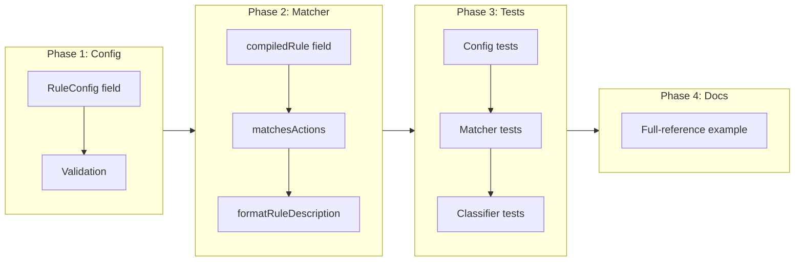

# not_actions Rule Field

## Change Summary

Add a `not_actions` field to classification rules that matches all Terraform actions EXCEPT those listed. This mirrors the existing `resource` / `not_resource` pattern. A rule with `not_actions = ["no-op"]` matches creates, updates, deletes, and reads — everything except no-ops. Cannot be combined with `actions` in the same rule.

## Motivation and Background

The `actions` field restricts a rule to specific Terraform actions. When users want to match "everything except no-ops" or "everything except reads," they must enumerate all other actions explicitly:

```hcl
# Current: verbose and fragile if new action types are added
rule {
  resource = ["*_key_vault*"]
  actions  = ["create", "update", "delete", "read"]
}
```

The `not_resource` field already solves this problem for resource type patterns. The `not_actions` field provides the same ergonomic inverse for actions:

```hcl
# Proposed: concise and forward-compatible
rule {
  resource    = ["*_key_vault*"]
  not_actions = ["no-op"]
}
```

## Change Drivers

* Symmetry with the existing `resource` / `not_resource` pattern
* Reduces config verbosity for common "match everything except no-op" rules
* Forward-compatible — if Terraform adds new action types in the future, `not_actions` rules don't need updating

## Current State

`RuleConfig` in `internal/config/config.go`:

```go
type RuleConfig struct {
    Description string   `hcl:"description,optional"`
    Resource    []string `hcl:"resource,optional"`
    NotResource []string `hcl:"not_resource,optional"`
    Actions     []string `hcl:"actions,optional"`
}
```

The `actions` field is optional. When omitted, the rule matches all actions. When present, the rule matches only the listed actions. Valid values: `"create"`, `"update"`, `"delete"`, `"read"`, `"no-op"`.

The `compiledRule` in `internal/classify/matcher.go` pre-computes actions as a `map[string]struct{}` for O(1) lookup. The `matchesActions()` method returns true if any change action is in the set, or true for all actions if the set is empty.

There is no inverse `not_actions` field.

## Proposed Change

### 1. Configuration

Add `not_actions` to the rule block:

```hcl
classification "standard" {
  description = "Standard change process"

  # Match all actions except no-ops
  rule {
    resource    = ["*"]
    not_actions = ["no-op"]
  }
}

classification "critical" {
  description = "Requires security approval"

  # Match all actions except reads and no-ops
  rule {
    resource    = ["*_key_vault"]
    not_actions = ["read", "no-op"]
  }
}
```

`actions` and `not_actions` are mutually exclusive in the same rule. Omitting both matches all actions (existing behavior unchanged).

### 2. Config Struct

```go
type RuleConfig struct {
    Description string   `hcl:"description,optional"`
    Resource    []string `hcl:"resource,optional"`
    NotResource []string `hcl:"not_resource,optional"`
    Actions     []string `hcl:"actions,optional"`
    NotActions  []string `hcl:"not_actions,optional"`
}
```

### 3. Compiled Rule

```go
type compiledRule struct {
    classification            string
    classificationDescription string
    resourceGlobs             []glob.Glob
    notResourceGlobs          []glob.Glob
    actions                   map[string]struct{}
    notActions                map[string]struct{}
    ruleDescription           string
}
```

### 4. matchesActions Update

```go
func (r *compiledRule) matchesActions(changeActions []string) bool {
    // actions specified: match if ANY change action is in the set
    if len(r.actions) > 0 {
        for _, a := range changeActions {
            if _, ok := r.actions[a]; ok {
                return true
            }
        }
        return false
    }

    // not_actions specified: match if NO change action is in the exclusion set
    if len(r.notActions) > 0 {
        for _, a := range changeActions {
            if _, ok := r.notActions[a]; ok {
                return false
            }
        }
        return true
    }

    // Neither specified: match all actions
    return true
}
```

This follows the exact same pattern as `matchesResource()`: positive set matches any, negative set rejects any, empty matches all.

### 5. Validation

Add to `validateRules()`:

```go
if len(rule.Actions) > 0 && len(rule.NotActions) > 0 {
    return fmt.Errorf("classification %q rule %d: cannot combine actions and not_actions",
        classification.Name, i+1)
}
```

Add `not_actions` values to the existing action validation that checks for valid action strings.

### 6. Auto-generated Description

Update `formatRuleDescription()` to include `not_actions` when present, following the same format as the existing fields.

## Requirements

### Functional Requirements

1. The system **MUST** support a `not_actions` field on rule blocks accepting a list of action strings
2. The system **MUST** match a resource when NONE of its change actions appear in the `not_actions` list
3. The system **MUST** reject rules that specify both `actions` and `not_actions`
4. The system **MUST** accept the same valid action values as `actions`: `"create"`, `"update"`, `"delete"`, `"read"`, `"no-op"`
5. When neither `actions` nor `not_actions` is specified, the rule **MUST** match all actions (existing behavior unchanged)
6. The `validate` command **MUST** report an error when `actions` and `not_actions` are combined in the same rule
7. The `validate` command **MUST** report an error when `not_actions` contains invalid action strings
8. The `explain` command **MUST** display `not_actions` in decision traces

### Non-Functional Requirements

1. The implementation **MUST** follow the established `resource` / `not_resource` pattern for code structure
2. The `not_actions` set **MUST** be pre-computed at compile time (same as `actions`) for O(1) runtime lookups

## Affected Components

* `internal/config/config.go` — add `NotActions` field to `RuleConfig`
* `internal/config/validation.go` — mutual exclusivity check, valid action validation for `not_actions`
* `internal/config/loader.go` — parse `not_actions` attribute (if manual parsing is needed beyond HCL tags)
* `internal/classify/matcher.go` — add `notActions` to `compiledRule`, update `matchesActions()`, update `compileRules()`, update `formatRuleDescription()`
* `docs/examples/full-reference/.tfclassify.hcl` — add annotated `not_actions` example

## Scope Boundaries

### In Scope

* `not_actions` field on rule blocks
* Validation (mutual exclusivity, valid action values)
* Matcher logic update
* Auto-generated rule descriptions
* Unit tests
* Full-reference example update

### Out of Scope ("Here, But Not Further")

* Glob patterns in `not_actions` — action values are a small, fixed set; globs add no value
* Combining `actions` and `not_actions` — mutually exclusive, same as `resource` / `not_resource`
* New action types — out of scope; if Terraform adds new actions, they are handled by existing action validation

## Alternative Approaches Considered

* **Wildcard actions with exclusion syntax** (e.g., `actions = ["*", "!no-op"]`) — more complex parsing, inconsistent with the `resource` / `not_resource` pattern already established.
* **Do nothing** — users can enumerate actions explicitly. Works, but verbose and fragile if action types change.

## Impact Assessment

### User Impact

New opt-in field. Zero impact on existing configs. Existing `actions` behavior unchanged.

### Technical Impact

Minimal — mirrors an established pattern. Adds one field to `RuleConfig`, one field to `compiledRule`, one branch to `matchesActions()`, one validation check.

### Business Impact

Reduces config verbosity for a common pattern ("match everything except no-ops"). Improves the full-reference example as a learning resource.

## Implementation Approach

### Phase 1: Config + Validation

1. Add `NotActions []string` to `RuleConfig`
2. Add mutual exclusivity validation
3. Add `not_actions` to valid action string validation
4. Add parser support if needed beyond HCL struct tags

### Phase 2: Matcher

1. Add `notActions map[string]struct{}` to `compiledRule`
2. Pre-compute `notActions` set in `compileRules()`
3. Update `matchesActions()` with `notActions` branch
4. Update `formatRuleDescription()` for auto-descriptions

### Phase 3: Tests

1. Config parsing tests
2. Validation tests (mutual exclusivity, invalid values)
3. Matcher tests (match, non-match, edge cases)
4. Classifier integration tests (end-to-end through classify pipeline)

### Phase 4: Documentation

1. Add `not_actions` example to full-reference config
2. Ensure `explain` output reflects `not_actions` correctly

### Implementation Flow



## Test Strategy

### Tests to Add

| Test File | Test Name | Description | Inputs | Expected Output |
|-----------|-----------|-------------|--------|-----------------|
| `internal/config/validation_test.go` | `TestValidateRules_ActionsAndNotActionsMutuallyExclusive` | Rejects rules with both fields | Rule with `actions` + `not_actions` | Validation error |
| `internal/config/validation_test.go` | `TestValidateRules_NotActionsInvalidValue` | Rejects invalid action strings | `not_actions = ["destroy"]` | Validation error |
| `internal/config/validation_test.go` | `TestValidateRules_NotActionsValid` | Accepts valid not_actions | `not_actions = ["no-op"]` | No error |
| `internal/classify/matcher_test.go` | `TestMatchesActions_NotActions` | Matches actions not in exclusion list | `not_actions = ["no-op"]`, change actions `["create"]` | true |
| `internal/classify/matcher_test.go` | `TestMatchesActions_NotActionsExcluded` | Rejects actions in exclusion list | `not_actions = ["no-op"]`, change actions `["no-op"]` | false |
| `internal/classify/matcher_test.go` | `TestMatchesActions_NotActionsMultiple` | Multiple exclusions | `not_actions = ["read", "no-op"]`, change actions `["read"]` | false |
| `internal/classify/matcher_test.go` | `TestMatchesActions_NeitherActionsNorNotActions` | Matches all when both empty | No actions, no not_actions | true |
| `internal/classify/classifier_test.go` | `TestClassify_NotActions` | End-to-end: resource classified correctly with not_actions | Rule with `not_actions = ["no-op"]`, resource with create action | Classified at rule's level |
| `internal/classify/classifier_edge_test.go` | `TestFormatRuleDescription_NotActions` | Auto-description includes not_actions | Rule with `not_actions = ["no-op"]` | Description contains "not_actions: no-op" |

### Tests to Modify

Not applicable — new functionality, existing behavior unchanged.

### Tests to Remove

Not applicable.

## Acceptance Criteria

### AC-1: not_actions matches non-excluded actions

```gherkin
Given a .tfclassify.hcl with a rule containing not_actions = ["no-op"]
  And a Terraform plan creating an azurerm_resource_group
When the user runs tfclassify --plan tfplan
Then the resource matches the rule (create is not excluded)
```

### AC-2: not_actions excludes listed actions

```gherkin
Given a .tfclassify.hcl with a rule containing not_actions = ["no-op"]
  And a Terraform plan with a no-op azurerm_resource_group
When the user runs tfclassify --plan tfplan
Then the resource does not match the rule (no-op is excluded)
```

### AC-3: Mutual exclusivity enforced

```gherkin
Given a .tfclassify.hcl with a rule containing both actions = ["create"] and not_actions = ["no-op"]
When the user runs tfclassify validate -c .tfclassify.hcl
Then the command exits with code 1
  And the error message indicates actions and not_actions cannot be combined
```

### AC-4: Invalid action values rejected

```gherkin
Given a .tfclassify.hcl with a rule containing not_actions = ["destroy"]
When the user runs tfclassify validate -c .tfclassify.hcl
Then the command exits with code 1
  And the error message indicates "destroy" is not a valid action
```

### AC-5: Omitting both matches all actions

```gherkin
Given a .tfclassify.hcl with a rule containing neither actions nor not_actions
  And a Terraform plan with resources having create, update, delete, and no-op actions
When the user runs tfclassify --plan tfplan
Then all resources match the rule regardless of action
```

### AC-6: explain command shows not_actions

```gherkin
Given a .tfclassify.hcl with a rule containing not_actions = ["no-op"]
  And a Terraform plan creating a resource
When the user runs tfclassify explain --plan tfplan
Then the decision trace shows the not_actions constraint
```

## Quality Standards Compliance

### Build & Compilation

- [ ] Code compiles/builds without errors
- [ ] No new compiler warnings introduced

### Linting & Code Style

- [ ] All linter checks pass with zero warnings/errors
- [ ] Code follows project coding conventions and style guides

### Test Execution

- [ ] All existing tests pass after implementation
- [ ] All new tests pass
- [ ] Test coverage meets project requirements for changed code

### Documentation

- [ ] Full-reference example updated with annotated `not_actions` example
- [ ] `not_actions` behavior documented alongside `actions` in config comments

### Code Review

- [ ] Changes submitted via pull request
- [ ] PR title follows Conventional Commits format
- [ ] Code review completed and approved

### Verification Commands

```bash
# Build verification
make build

# Lint verification
make lint

# Test execution
make test

# Vulnerability check
govulncheck ./...
```

## Dependencies

* None — standalone feature, no dependencies on other CRs

## Decision Outcome

Chosen approach: "mirror the resource / not_resource pattern for actions", because it provides a consistent, predictable user experience using an established convention already in the codebase. The implementation is minimal (one field, one branch, one validation check) and the mental model is immediately clear to anyone who has used `not_resource`.

## Related Items

* `internal/classify/matcher.go` — `matchesResource()` with `notResourceGlobs` is the exact pattern to follow
* `docs/examples/full-reference/.tfclassify.hcl` — annotated reference config to update
