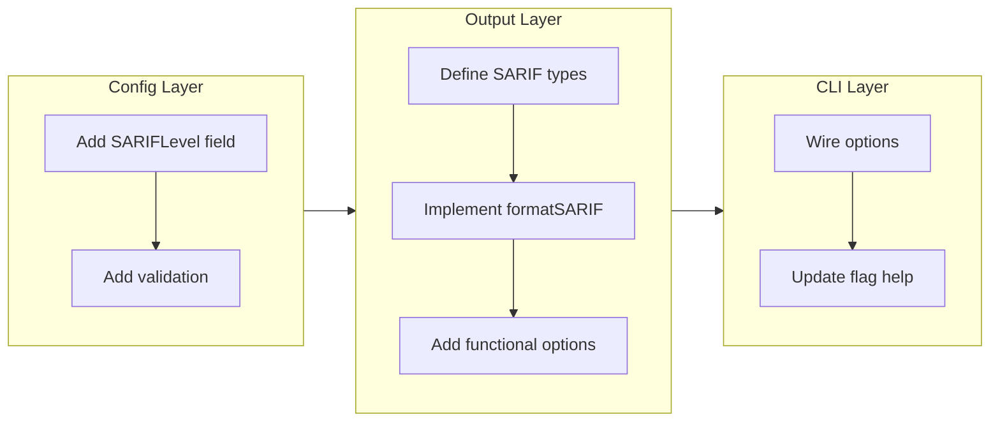

# SARIF Output Format

## Change Summary

tfclassify currently outputs classification results in JSON, text, and GitHub Actions formats. Enterprise security teams need SARIF (Static Analysis Results Interchange Format) 2.1.0 output to feed results into GitHub Code Scanning, DefectDojo, SonarQube, and Azure DevOps. This CR adds a new `-o sarif` output format that maps tfclassify classifications to SARIF structures with configurable severity levels.

## Motivation and Background

Security teams use centralized dashboards (GitHub Advanced Security, DefectDojo, SonarQube) to aggregate findings from multiple tools. These platforms consume SARIF as their interchange format. Without native SARIF support, teams must write custom transformers or forego integration entirely.

SARIF 2.1.0 is the OASIS standard adopted by GitHub Code Scanning, Microsoft DevSecOps, and most security aggregation platforms. Producing compliant SARIF directly eliminates the transformation step and enables tfclassify to appear alongside other security tools in unified dashboards.

## Change Drivers

* Enterprise security teams require SARIF for GitHub Code Scanning integration
* DevSecOps platforms (DefectDojo, SonarQube, Azure DevOps) consume SARIF natively
* Custom JSON-to-SARIF transformers are brittle and per-organization maintenance burden
* SARIF provides standardized deduplication via `partialFingerprints`, enabling result tracking across runs

## Current State

tfclassify supports three output formats via `--output` / `-o`:

| Format   | Flag value | Purpose |
|----------|-----------|---------|
| Text     | `text`    | Human-readable terminal output (default) |
| JSON     | `json`    | Machine-readable structured output |
| GitHub   | `github`  | GITHUB_OUTPUT key=value pairs for Actions workflows |

The `Formatter` struct dispatches to format-specific renderers based on the `Format` string constant. Classification results flow through `classify.Result` containing `ResourceDecision` entries with address, type, actions, classification name, description, and matched rules.

There is no mechanism to map classification severity to external severity scales. The precedence order implicitly defines severity (index 0 = highest), but this is not exposed to output formatters.

## Proposed Change

Add a fourth output format (`sarif`) that produces SARIF 2.1.0 compliant JSON. The mapping from tfclassify concepts to SARIF structures is:

| tfclassify concept | SARIF structure |
|-------------------|----------------|
| Classification definition | `reportingDescriptor` (rule) |
| Resource decision | `result` |
| Resource address | `logicalLocation` |
| Classification name | `ruleId` |
| Precedence order | default `level` (highest = error) |
| Matched rules | `message.text` |

### Severity Mapping

SARIF defines four severity levels: `error`, `warning`, `note`, `none`. The default mapping uses precedence position:

* **Index 0** (highest precedence): `error`
* **All other indices**: `warning`
* **`no_changes` default**: `none`

Users **MUST** be able to override this default via an optional `sarif_level` attribute on classification blocks:

```hcl
classification "critical" {
  description = "Requires security team approval"
  sarif_level = "error"

  rule {
    resource = ["*_role_*"]
  }
}

classification "standard" {
  description = "Standard change process"
  sarif_level = "note"

  rule {
    resource = ["*"]
  }
}
```

### Deduplication

Each result **MUST** include `partialFingerprints` with a `primaryLocationFingerprint` computed as `SHA-256(resource_address + "/" + classification_name)`. This enables GitHub Code Scanning and other consumers to track results across runs and avoid duplicate alerts.

### SARIF Document Structure

```json
{
  "$schema": "https://raw.githubusercontent.com/oasis-tcs/sarif-spec/main/sarif-2.1/schema/sarif-schema-2.1.0.json",
  "version": "2.1.0",
  "runs": [{
    "tool": {
      "driver": {
        "name": "tfclassify",
        "version": "<version>",
        "informationUri": "https://github.com/jokarl/tfclassify",
        "rules": [
          {
            "id": "<classification_name>",
            "shortDescription": { "text": "<classification_description>" },
            "defaultConfiguration": { "level": "<sarif_level>" }
          }
        ]
      }
    },
    "results": [
      {
        "ruleId": "<classification_name>",
        "ruleIndex": 0,
        "level": "<sarif_level>",
        "message": { "text": "<matched_rules joined>" },
        "locations": [{
          "logicalLocations": [{
            "name": "<resource_address>",
            "kind": "resource",
            "fullyQualifiedName": "<resource_address>"
          }]
        }],
        "partialFingerprints": {
          "primaryLocationFingerprint": "<sha256>"
        }
      }
    ]
  }]
}
```

### Functional Options Pattern

The SARIF formatter requires additional context not available to other formatters: version string, classification-to-level mapping, and precedence order. Rather than adding fields to the `Formatter` struct that only SARIF uses, the implementation uses functional options:

```go
formatter := output.NewFormatter(os.Stdout, output.FormatSARIF, verbose,
    output.WithVersion(Version),
    output.WithSARIFLevels(sarifLevels),
)
```

This keeps the `NewFormatter` signature backward-compatible for existing callers.

## Requirements

### Functional Requirements

1. The system **MUST** produce valid SARIF 2.1.0 JSON when `--output sarif` is specified
2. The system **MUST** include `$schema` and `version` fields in the SARIF envelope
3. The system **MUST** map each classification to a SARIF `reportingDescriptor` (rule) with `id`, `shortDescription`, and `defaultConfiguration.level`
4. The system **MUST** map each resource decision to a SARIF `result` with `ruleId`, `ruleIndex`, `level`, `message`, and `locations`
5. The system **MUST** use `logicalLocations` with `kind: "resource"` for resource addresses (Terraform resources have no physical file location in the plan)
6. The system **MUST** compute `partialFingerprints.primaryLocationFingerprint` as `hex(SHA-256(address + "/" + classification))` for each result
7. The system **MUST** accept an optional `sarif_level` attribute on classification blocks with values: `error`, `warning`, `note`, `none`
8. The system **MUST** default `sarif_level` to `error` for the highest-precedence classification and `warning` for all others when not explicitly configured
9. The system **MUST** set `sarif_level` to `none` for the `no_changes` default classification when not explicitly configured
10. The system **MUST** validate `sarif_level` values at configuration load time and reject invalid values
11. The system **MUST** produce an empty `results` array (not null) when there are no resource changes
12. The system **MUST** use the `tool.driver.version` field to report the tfclassify version

### Non-Functional Requirements

1. The system **MUST** produce SARIF output without any external SARIF library dependency (pure `encoding/json` marshaling)
2. The system **MUST** maintain backward compatibility — existing `-o json`, `-o text`, and `-o github` behavior **MUST** remain unchanged
3. The system **MUST** keep the `NewFormatter` constructor backward-compatible using functional options for SARIF-specific parameters

## Affected Components

* `internal/config/config.go` — `ClassificationConfig` struct gains `SARIFLevel` field
* `internal/config/validation.go` — new `validateSARIFLevels` function
* `internal/output/formatter.go` — `FormatSARIF` constant, functional options, switch case
* `internal/output/sarif.go` — new file: SARIF types and `formatSARIF` implementation
* `internal/output/sarif_test.go` — new file: unit tests
* `cmd/tfclassify/main.go` — wire SARIF level map and version, update `--output` flag help

## Scope Boundaries

### In Scope

* SARIF 2.1.0 output format for the root `tfclassify --plan` command
* Configurable `sarif_level` per classification block
* Default severity mapping based on precedence order
* `partialFingerprints` for result deduplication
* Validation of `sarif_level` values

### Out of Scope ("Here, But Not Further")

* SARIF output for `explain` subcommand — the explain trace model does not map cleanly to SARIF results
* SARIF `physicalLocation` with file/line references — Terraform plan JSON does not carry source file locations
* SARIF `codeFlows` or `threadFlows` — classification decisions are not sequential code paths
* SARIF `invocations` with environment capture — out of scope for initial implementation
* SARIF upload to GitHub Code Scanning API — users handle upload via `github/codeql-action/upload-sarif`
* Custom SARIF `taxonomies` or `translations` — not needed for classification results

## Alternative Approaches Considered

* **External SARIF library (e.g., `github.com/owenrumney/go-sarif`)**: Adds a dependency for what amounts to struct marshaling. The SARIF types needed are simple enough to define inline. Rejected to keep the dependency footprint minimal.
* **Post-processing with `jq`**: Users could transform JSON output to SARIF externally. Rejected because it pushes complexity onto every consumer and the transformation requires precedence context not available in the JSON output.
* **Generic template-based output**: A Go template engine for arbitrary output formats. Over-engineered for a single additional format and harder to validate for SARIF compliance.

## Impact Assessment

### User Impact

Users gain a new `--output sarif` flag. No existing behavior changes. Users who configure `sarif_level` in their `.tfclassify.hcl` can do so incrementally — the attribute is optional and defaults are sensible.

### Technical Impact

* One new field on `ClassificationConfig` (backward-compatible HCL, `optional` tag)
* One new file in `internal/output/` (~200 lines)
* Functional options pattern on `NewFormatter` (backward-compatible, zero-arg variadic)
* No new dependencies
* No breaking changes to existing output formats

### Business Impact

Enables enterprise adoption by meeting the table-stakes requirement for security tool integration. Teams using GitHub Advanced Security, DefectDojo, or Azure DevOps can adopt tfclassify without custom integration work.

## Implementation Approach

Single-phase implementation:

1. Add `SARIFLevel` field to `ClassificationConfig` and validation
2. Create `internal/output/sarif.go` with SARIF types and formatter
3. Add functional options to `Formatter` for version and SARIF levels
4. Wire into CLI (`--output` flag help, SARIF level map construction)
5. Write unit tests

### Implementation Flow



## Test Strategy

### Tests to Add

| Test File | Test Name | Description | Inputs | Expected Output |
|-----------|-----------|-------------|--------|-----------------|
| `internal/output/sarif_test.go` | `TestFormatSARIF_Basic` | Validates SARIF structure with multiple resources | Result with 2 resources, 2 classifications | Valid SARIF with schema, version, rules, results |
| `internal/output/sarif_test.go` | `TestFormatSARIF_NoChanges` | Validates empty results for no-change plans | Result with NoChanges=true | SARIF with empty results array |
| `internal/output/sarif_test.go` | `TestFormatSARIF_DefaultLevels` | Validates precedence-based default severity | Precedence [critical, standard, auto] without sarif_level | critical=error, standard=warning, auto=warning |
| `internal/output/sarif_test.go` | `TestFormatSARIF_CustomLevels` | Validates user-configured sarif_level overrides | Classifications with explicit sarif_level | Levels match configured values |
| `internal/output/sarif_test.go` | `TestFormatSARIF_Fingerprints` | Validates partialFingerprints computation | Known address + classification | Expected SHA-256 hex string |
| `internal/output/sarif_test.go` | `TestFormatSARIF_RuleIndex` | Validates ruleIndex references correct rule | Multiple classifications | Each result.ruleIndex maps to correct rules[] entry |
| `internal/config/validation_test.go` | `TestValidate_SARIFLevel_Valid` | Valid sarif_level values accepted | Config with sarif_level = "error" | No error |
| `internal/config/validation_test.go` | `TestValidate_SARIFLevel_Invalid` | Invalid sarif_level values rejected | Config with sarif_level = "critical" | Validation error |

### Tests to Modify

Not applicable. No existing tests need modification.

### Tests to Remove

Not applicable. No existing tests become redundant.

## Acceptance Criteria

### AC-1: SARIF output with default severity mapping

```gherkin
Given a configuration with precedence ["critical", "review", "standard", "auto"]
  And no sarif_level attributes are configured
When the user runs tfclassify --plan plan.json --output sarif
Then the output is valid SARIF 2.1.0 JSON
  And the "critical" rule has defaultConfiguration.level = "error"
  And the "review" rule has defaultConfiguration.level = "warning"
  And the "standard" rule has defaultConfiguration.level = "warning"
  And the "auto" rule has defaultConfiguration.level = "warning"
```

### AC-2: SARIF output with custom severity override

```gherkin
Given a configuration with sarif_level = "note" on the "standard" classification
When the user runs tfclassify --plan plan.json --output sarif
Then the "standard" rule has defaultConfiguration.level = "note"
  And results classified as "standard" have level = "note"
```

### AC-3: SARIF deduplication fingerprints

```gherkin
Given a plan with resource "azurerm_role_assignment.admin" classified as "critical"
When the user runs tfclassify --plan plan.json --output sarif
Then the result has partialFingerprints.primaryLocationFingerprint equal to
     hex(SHA-256("azurerm_role_assignment.admin/critical"))
```

### AC-4: SARIF output for no-change plans

```gherkin
Given a plan with no resource changes
When the user runs tfclassify --plan plan.json --output sarif
Then the output is valid SARIF 2.1.0 JSON
  And the results array is empty (not null)
```

### AC-5: Invalid sarif_level rejected at config load

```gherkin
Given a configuration with sarif_level = "critical" on a classification
When the configuration is loaded
Then the system returns a validation error mentioning "sarif_level"
  And the error lists the valid values: error, warning, note, none
```

### AC-6: Backward compatibility

```gherkin
Given a configuration without any sarif_level attributes
When the user runs tfclassify --plan plan.json --output json
Then the output is identical to the current JSON format
  And no SARIF-related fields appear
```

## Quality Standards Compliance

### Build & Compilation

- [ ] Code compiles/builds without errors
- [ ] No new compiler warnings introduced

### Linting & Code Style

- [ ] All linter checks pass with zero warnings/errors
- [ ] Code follows project coding conventions and style guides

### Test Execution

- [ ] All existing tests pass after implementation
- [ ] All new tests pass
- [ ] Test coverage meets project requirements for changed code

### Documentation

- [ ] CLI help text updated for `--output` flag

### Code Review

- [ ] Changes submitted via pull request
- [ ] PR title follows Conventional Commits format
- [ ] Code review completed and approved
- [ ] Changes squash-merged to maintain linear history

### Verification Commands

```bash
# Build verification
make build

# Lint verification
make lint

# Test execution
make test

# Static analysis
make vet
```

## Risks and Mitigation

### Risk 1: SARIF consumers reject output due to schema violations

**Likelihood:** low
**Impact:** high
**Mitigation:** Unit tests validate output structure against known SARIF field requirements. The SARIF schema is simple enough that struct-based JSON marshaling with `omitempty` produces compliant output. The `$schema` field enables consumer-side validation.

### Risk 2: Fingerprint collisions across different plan runs

**Likelihood:** low
**Impact:** low
**Mitigation:** SHA-256 of `address/classification` is deterministic and collision-resistant. Same resource + same classification across runs correctly deduplicates (desired behavior). Different resources or different classifications produce distinct fingerprints.

## Dependencies

* No external dependencies required
* Builds on existing `classify.Result` and `output.Formatter` infrastructure

## Decision Outcome

Chosen approach: "Native SARIF 2.1.0 formatter with functional options and configurable severity levels", because it keeps zero external dependencies, maintains backward compatibility via variadic options, and provides sensible defaults while allowing per-classification severity override through the existing HCL config model.
