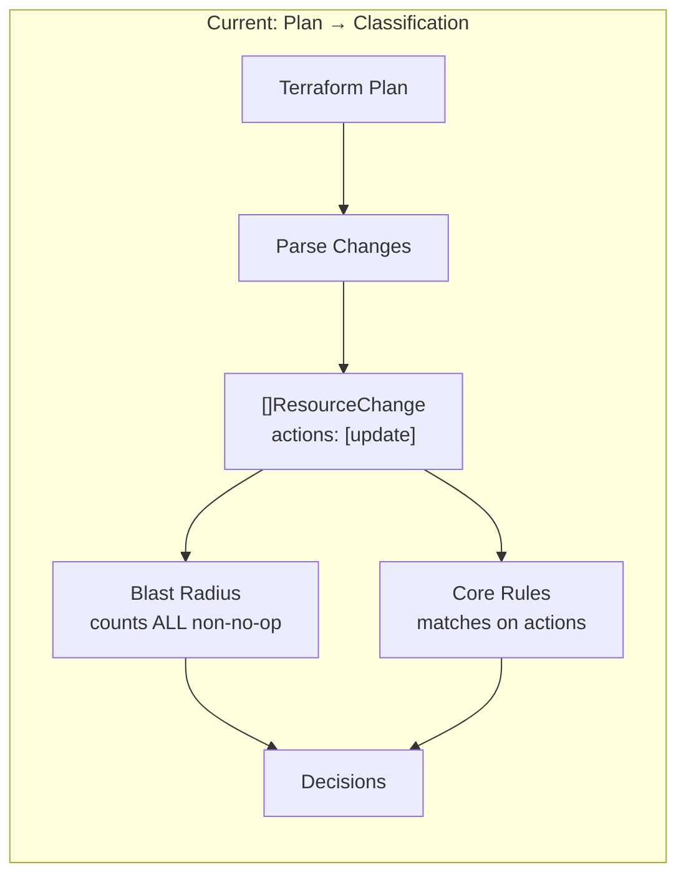
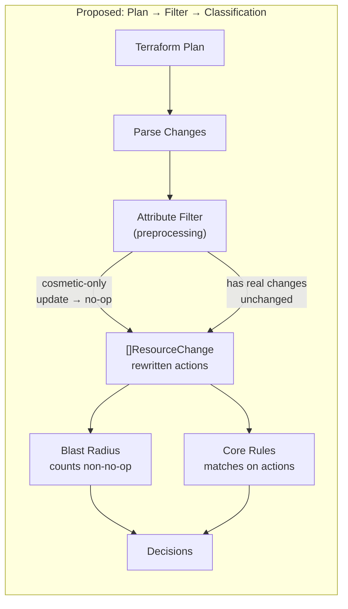
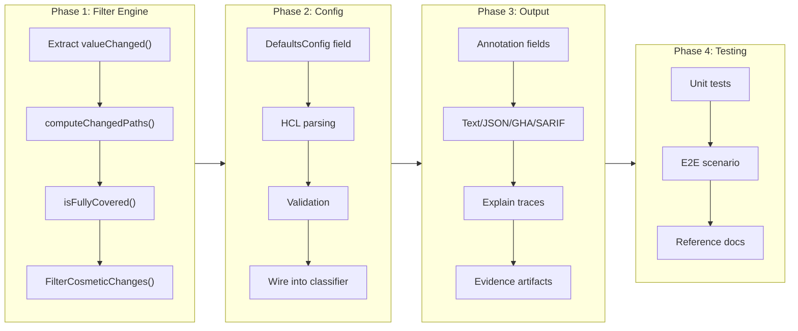

# Ignore Attributes: Exclude Cosmetic Changes from Classification

## Change Summary

Terraform plans frequently include resources whose only changes are to cosmetic attributes like provenance tags (e.g., `tf-module-l2` version bumps). These changes are semantically irrelevant but currently count as full "update" actions, inflating blast radius thresholds and triggering classification rules meant for meaningful infrastructure changes. This CR introduces a global `ignore_attributes` configuration that preprocesses the plan to downgrade cosmetic-only updates to `no-op`, making them invisible to blast radius counting and core rule matching while remaining visible in output with clear attribution.

## Motivation and Background

In environments with module-level tagging conventions, a single module version bump can touch 20+ resources — changing only a tag like `"tf-module-l2" = "L2:aiwz:3.0.6" -> "L2:aiwz:3.0.7"`. These tag-only changes:

1. **Break blast radius thresholds**: A `max_changes = 10` threshold is blown by 21 tag bumps, escalating the entire plan to `critical` even though zero infrastructure attributes changed.
2. **Pollute core rule matching**: Tag-only updates match `resource = ["*"]` with `actions = ["update"]`, classifying cosmetic changes alongside real infrastructure modifications.
3. **Erode trust**: When every module version bump triggers a critical classification, teams learn to ignore the signal — defeating the purpose of change classification.

The existing `exclude_drift` mechanism in `blast_radius {}` demonstrates the pattern: exclude known-benign changes from threshold counting. But drift exclusion is blast-radius-only and structurally identified (Terraform's `resource_drift` array). Attribute-based exclusion requires diffing `Before`/`After` state and must apply to both blast radius and core rule matching to be useful.

## Change Drivers

* Module tagging conventions (provenance tags like `tf-module-l1`, `tf-module-l2`) cause widespread cosmetic changes on every version bump
* Blast radius thresholds become unusable without attribute-level filtering — any module update exceeds `max_changes`
* Core rules cannot distinguish meaningful updates from tag-only updates, leading to over-classification
* Teams in regulated environments need blast radius to work correctly for approval routing — false positives undermine the compliance workflow

## Current State

The blast radius analyzer (`internal/classify/blast_radius.go`) counts every resource with a non-no-op action toward its thresholds. The only existing exclusion mechanism is `exclude_drift`, which skips resources identified as drift corrections by the plan's `resource_drift` section.

Core rules (`internal/classify/classifier.go`) match on resource type globs and action types. There is no mechanism to filter by which attributes changed — a tag-only update and a networking config change are both `["update"]`.

The plan parser (`internal/plan/`) produces `ResourceChange` structs with `Before` and `After` maps containing the full resource state, but no component currently diffs these maps to identify which attributes changed.

### Current State Diagram



## Proposed Change

Introduce a global `ignore_attributes` list in the `defaults {}` block. Before classification begins, a preprocessing step diffs the `Before` and `After` state of every `["update"]` resource. If all changed attributes are covered by the ignore list, the resource's actions are rewritten from `["update"]` to `["no-op"]` and an annotation is attached explaining why.

This action rewriting leverages the existing system design:
- **Blast radius**: Already skips no-op resources — no code changes needed in the analyzer
- **Core rules**: Existing `actions = ["no-op"]` and `not_actions = ["no-op"]` filters work transparently
- **Output**: The annotation surfaces in explain traces and evidence artifacts so users see exactly why a resource was downgraded

### Proposed State Diagram



### Attribute Matching: Prefix-Based Dot Paths

Attributes are specified as dot-delimited paths and matched using **prefix semantics** against the flattened diff of `Before` vs `After`:

| Config entry | Matches changed paths | Does NOT match |
|---|---|---|
| `"tags"` | `tags`, `tags.tf-module-l2`, `tags.environment` | `tags_all`, `name` |
| `"tags_all"` | `tags_all`, `tags_all.env` | `tags` |
| `"meta.tags"` | `meta.tags`, `meta.tags.env` | `meta.name`, `meta` |

The matching rule: a changed attribute path is "covered" if it equals an ignore entry or has an ignore entry as a dot-delimited prefix. `"tags"` covers `"tags.tf-module-l2"` but does NOT cover `"tags_all"` — these are separate top-level attributes.

### Configuration Example

```hcl
defaults {
  unclassified         = "standard"
  no_changes           = "auto"
  drift_classification = "standard"
  plugin_timeout       = "30s"

  # Attributes to ignore when determining if a resource meaningfully changed.
  # If ALL changed attributes on an "update" resource match these prefixes,
  # the resource is reclassified as no-op.
  ignore_attributes = ["tags", "tags_all"]
}
```

### Output Visibility

When a resource is downgraded, the annotation **MUST** appear in all output formats:

**Text output** (explain):
```
module.aiwz.module.search_service.azurerm_search_service.this
  Actions: [no-op] (originally [update], downgraded by ignore_attributes)
  Changed attributes covered by ignore_attributes: tags.tf-module-l2
  Classification: auto
  Matched: rule "No actual changes detected" in auto (resource=*, actions=[no-op])
```

**JSON output**:
```json
{
  "address": "module.aiwz.module.search_service.azurerm_search_service.this",
  "actions": ["no-op"],
  "original_actions": ["update"],
  "ignored_attributes": ["tags.tf-module-l2"],
  "classification": "auto"
}
```

## Requirements

### Functional Requirements

1. The system **MUST** support a `ignore_attributes` list in the `defaults {}` configuration block
2. The system **MUST** accept dot-delimited attribute paths (e.g., `"tags"`, `"meta.tags"`) as entries in the ignore list
3. The system **MUST** use prefix-based matching: an entry `"tags"` covers changed paths `tags`, `tags.x`, `tags.x.y` but not `tags_all`
4. The system **MUST** only evaluate `ignore_attributes` against resources with `["update"]` actions — creates, deletes, replacements, and no-ops are unaffected
5. The system **MUST** rewrite a resource's actions from `["update"]` to `["no-op"]` when ALL changed attributes between `Before` and `After` are covered by the ignore list
6. The system **MUST** preserve the original actions in an annotation field (e.g., `OriginalActions`) on the `ResourceChange` for output rendering
7. The system **MUST** record which specific attribute paths were ignored in an annotation field (e.g., `IgnoredAttributes`) for output rendering
8. The system **MUST** display the original actions, the downgrade reason, and the ignored attribute paths in text, JSON, GitHub Actions, and SARIF output formats
9. The system **MUST** include the ignore_attributes downgrade information in explain traces
10. The system **MUST** include the ignore_attributes downgrade information in evidence artifacts when `include_resources = true`
11. The system **MUST** not alter resources where at least one changed attribute is NOT covered by the ignore list — partial matches leave the resource unchanged
12. The system **MUST** validate that `ignore_attributes` entries are non-empty strings during config validation (`tfclassify validate`)

### Non-Functional Requirements

1. The system **MUST** perform the attribute diff as a single preprocessing pass before classification, not per-analyzer or per-rule
2. The system **MUST** short-circuit the diff comparison: bail immediately when a non-ignored attribute change is found, avoiding unnecessary work on resources with mixed changes
3. The system **MUST** not regress classification performance for plans where `ignore_attributes` is not configured (zero overhead when unused)

## Affected Components

* `internal/config/config.go` — Add `IgnoreAttributes` field to `DefaultsConfig`
* `internal/config/loader.go` — Parse `ignore_attributes` from HCL
* `internal/config/validation.go` — Validate entries are non-empty
* `internal/plan/types.go` — Add `OriginalActions` and `IgnoredAttributes` annotation fields to `ResourceChange`
* New file: `internal/classify/attribute_filter.go` — Preprocessing logic: diff Before/After, check prefix coverage, rewrite actions
* `internal/classify/classifier.go` — Call attribute filter before classification pipeline
* `internal/output/` — Render annotations in all output formats (text, JSON, GitHub Actions, SARIF)
* `internal/output/evidence.go` — Include annotations in evidence artifacts
* `cmd/explain.go` (or equivalent) — Include annotations in explain traces
* `docs/examples/full-reference/.tfclassify.hcl` — Add documented example

## Scope Boundaries

### In Scope

* Global `ignore_attributes` configuration in `defaults {}` block
* Preprocessing step that diffs `Before`/`After` and rewrites actions for cosmetic-only updates
* Prefix-based dot-path matching for attribute names
* Visibility in all output formats (text, JSON, GitHub Actions, SARIF, explain, evidence)
* Config validation for the new field
* Unit tests for the attribute filter, diff logic, and prefix matching
* E2E test scenario demonstrating tag-only changes with `ignore_attributes`

### Out of Scope ("Here, But Not Further")

* **Per-classification ignore_attributes** — only global (in `defaults {}`) is supported; per-classification overrides are deferred to a future CR if needed
* **Glob patterns in attribute paths** — only exact prefix matching, no wildcards like `*.tags` or `tags*`
* **Attribute filtering for non-update actions** — creates, deletes, and replacements are always counted; only `["update"]` resources are eligible for downgrade
* **Plugin awareness** — plugins receive the rewritten `ResourceChange` with `["no-op"]` actions; no new gRPC fields are added for `OriginalActions` or `IgnoredAttributes` in this CR
* **Topology analyzer integration** — topology operates on the dependency graph, not individual attribute changes; deferred if needed

## Alternative Approaches Considered

* **Option A: `exclude_attributes` scoped to `blast_radius {}` block** — Solves blast radius inflation but does not help core rule matching. Users would still need a separate mechanism to prevent tag-only updates from matching `actions = ["update"]` rules. Rejected because it solves only half the problem.

* **Option B: Classification-level `ignore_changes {}` block** — More flexible (different classifications could ignore different attributes) but adds complexity without a clear use case. The tag problem is global — provenance tags appear on all resources regardless of classification level. Rejected in favor of global config; can be revisited if per-classification needs emerge.

* **Separate "cosmetic" flag instead of action rewriting** — Adds a boolean `Cosmetic` field to `ResourceChange` and teaches each analyzer/rule to check it. More explicit but requires modifying blast radius, core rule matching, and every output format individually. Action rewriting achieves the same result by leveraging existing no-op handling throughout the codebase. Rejected for higher implementation cost with no functional benefit.

* **Custom action type `["update-cosmetic"]`** — Introduces a new action value alongside Terraform's standard set. Requires updating every action check in the codebase and could break plugins that switch on known action values. Rejected for high blast radius (ironic) and fragility.

## Impact Assessment

### User Impact

Users configure `ignore_attributes` once in `defaults {}` and immediately get correct blast radius counts and rule matching for tag-only changes. No workflow changes required. Output clearly shows when and why resources were downgraded, so there is no loss of visibility.

Users who do not configure `ignore_attributes` see zero behavioral change — the preprocessing step is skipped entirely.

### Technical Impact

* **Plan parsing**: `ResourceChange` gains two optional annotation fields (`OriginalActions`, `IgnoredAttributes`). These are nil when `ignore_attributes` is not configured.
* **Attribute diffing**: New code that walks `Before`/`After` maps. Uses the existing `valueChanged()` function from `sensitive.go` (may need to be extracted to a shared location).
* **Action rewriting**: Changes the `Actions` field on `ResourceChange` before it enters the classification pipeline. All downstream consumers (analyzers, rules, plugins, output) see the rewritten action.
* **Output formats**: All four formats (text, JSON, GitHub Actions, SARIF) need updates to render the annotation fields when present.
* **Backward compatibility**: No breaking changes. The `ignore_attributes` field is optional; existing configs work unchanged. Output JSON gains optional fields (`original_actions`, `ignored_attributes`) that are omitted when not applicable.

### Business Impact

Enables blast radius to function correctly in environments with module tagging conventions — a prerequisite for using tfclassify in approval routing workflows. Without this, teams with provenance tags cannot use blast radius thresholds, which is the primary defense against large-scale accidental changes.

## Implementation Approach

### Phase 1: Attribute Diff and Filter Engine

Build the core preprocessing logic:
1. Extract `valueChanged()` from `sensitive.go` into a shared utility (or `attribute_filter.go`)
2. Implement `computeChangedPaths(before, after map[string]interface{}) []string` — walks top-level keys, returns dot-delimited paths of all attributes that differ
3. Implement `isFullyCovered(changedPaths []string, ignorePrefixes []string) bool` — checks if every changed path has a matching ignore prefix
4. Implement `FilterCosmeticChanges(changes []ResourceChange, ignoreAttrs []string) []ResourceChange` — the preprocessing entry point that applies the above and rewrites actions

### Phase 2: Configuration and Validation

1. Add `IgnoreAttributes []string` to `DefaultsConfig`
2. Parse from HCL in loader
3. Validate non-empty entries in validator
4. Wire the filter call into the classification pipeline in `classifier.go`

### Phase 3: Output Visibility

1. Add `OriginalActions []string` and `IgnoredAttributes []string` to `plan.ResourceChange`
2. Update text output to show original actions and downgrade reason
3. Update JSON output to include `original_actions` and `ignored_attributes` fields
4. Update GitHub Actions output format
5. Update SARIF output to include annotation in message
6. Update explain trace to show attribute filter step
7. Update evidence artifact to include annotations

### Phase 4: Testing and Documentation

1. Unit tests for `computeChangedPaths` (various attribute structures)
2. Unit tests for `isFullyCovered` (prefix matching edge cases)
3. Unit tests for `FilterCosmeticChanges` (integration of diff + filter)
4. Update existing blast radius tests to verify cosmetic exclusion
5. E2E test scenario: tag-only changes with `ignore_attributes` configured
6. Update full-reference example config with documented `ignore_attributes`

### Implementation Flow



## Test Strategy

### Tests to Add

| Test File | Test Name | Description | Inputs | Expected Output |
|-----------|-----------|-------------|--------|-----------------|
| `internal/classify/attribute_filter_test.go` | `TestComputeChangedPaths_TopLevel` | Verifies diff detection for top-level attribute changes | Before/After maps with different `tags` and `name` values | `["name", "tags.tf-module-l2"]` |
| `internal/classify/attribute_filter_test.go` | `TestComputeChangedPaths_Nested` | Verifies diff detection for nested attribute changes | Before/After maps with nested `meta.tags` diff | `["meta.tags.env"]` |
| `internal/classify/attribute_filter_test.go` | `TestComputeChangedPaths_NoChanges` | Verifies empty result when Before equals After | Identical Before/After maps | `[]` (empty) |
| `internal/classify/attribute_filter_test.go` | `TestComputeChangedPaths_NilBefore` | Handles create scenario (Before is nil) | nil Before, populated After | All After keys as changed paths |
| `internal/classify/attribute_filter_test.go` | `TestComputeChangedPaths_NilAfter` | Handles delete scenario (After is nil) | Populated Before, nil After | All Before keys as changed paths |
| `internal/classify/attribute_filter_test.go` | `TestIsFullyCovered_ExactMatch` | Prefix `"tags"` covers path `"tags"` | paths=`["tags"]`, prefixes=`["tags"]` | `true` |
| `internal/classify/attribute_filter_test.go` | `TestIsFullyCovered_PrefixMatch` | Prefix `"tags"` covers path `"tags.env"` | paths=`["tags.env"]`, prefixes=`["tags"]` | `true` |
| `internal/classify/attribute_filter_test.go` | `TestIsFullyCovered_NoFalsePrefix` | Prefix `"tags"` does NOT cover `"tags_all"` | paths=`["tags_all"]`, prefixes=`["tags"]` | `false` |
| `internal/classify/attribute_filter_test.go` | `TestIsFullyCovered_NestedPrefix` | Prefix `"meta.tags"` covers `"meta.tags.env"` but not `"meta.name"` | paths=`["meta.tags.env", "meta.name"]`, prefixes=`["meta.tags"]` | `false` |
| `internal/classify/attribute_filter_test.go` | `TestIsFullyCovered_MultiplePrefixes` | Multiple prefixes cover all paths | paths=`["tags.env", "tags_all.env"]`, prefixes=`["tags", "tags_all"]` | `true` |
| `internal/classify/attribute_filter_test.go` | `TestFilterCosmeticChanges_TagOnly` | Tag-only update is rewritten to no-op | ResourceChange with only `tags` diff, ignore=`["tags"]` | Actions=`["no-op"]`, OriginalActions=`["update"]` |
| `internal/classify/attribute_filter_test.go` | `TestFilterCosmeticChanges_MixedChange` | Update with tag + real change is NOT rewritten | ResourceChange with `tags` + `sku` diff, ignore=`["tags"]` | Actions=`["update"]`, OriginalActions=nil |
| `internal/classify/attribute_filter_test.go` | `TestFilterCosmeticChanges_CreateIgnored` | Create actions are never rewritten | ResourceChange with actions=`["create"]`, ignore=`["tags"]` | Actions=`["create"]` unchanged |
| `internal/classify/attribute_filter_test.go` | `TestFilterCosmeticChanges_DeleteIgnored` | Delete actions are never rewritten | ResourceChange with actions=`["delete"]`, ignore=`["tags"]` | Actions=`["delete"]` unchanged |
| `internal/classify/attribute_filter_test.go` | `TestFilterCosmeticChanges_ReplaceIgnored` | Replace actions are never rewritten | ResourceChange with actions=`["delete","create"]`, ignore=`["tags"]` | Actions unchanged |
| `internal/classify/attribute_filter_test.go` | `TestFilterCosmeticChanges_EmptyIgnoreList` | No filtering when ignore list is empty | ResourceChange with `tags` diff, ignore=`[]` | Actions unchanged |
| `internal/classify/attribute_filter_test.go` | `TestFilterCosmeticChanges_AnnotationFields` | Annotations are populated on downgrade | Tag-only ResourceChange | `IgnoredAttributes` contains changed paths, `OriginalActions` contains `["update"]` |
| `internal/config/validation_test.go` | `TestValidate_IgnoreAttributesEmpty` | Rejects empty string in ignore list | Config with `ignore_attributes = [""]` | Validation error |
| `internal/classify/blast_radius_test.go` | `TestBlastRadius_WithIgnoreAttributes` | Tag-only resources don't count toward thresholds | 21 tag-only changes + max_changes=10 + ignore_attributes=`["tags"]` | No blast radius trigger |

### Tests to Modify

| Test File | Test Name | Current Behavior | New Behavior | Reason for Change |
|-----------|-----------|------------------|--------------|-------------------|
| `internal/classify/blast_radius_test.go` | Existing threshold tests | Test against raw ResourceChanges | Verify that pre-filtered (no-op rewritten) changes pass through correctly | Ensure blast radius works correctly with the preprocessing step upstream |

### Tests to Remove

Not applicable — no tests are removed by this change.

## Acceptance Criteria

### AC-1: Global ignore_attributes configuration

```gherkin
Given a .tfclassify.hcl with ignore_attributes = ["tags", "tags_all"] in the defaults block
When the configuration is loaded
Then the ignore_attributes list is parsed and available to the classification pipeline
```

### AC-2: Tag-only updates are downgraded to no-op

```gherkin
Given a Terraform plan with 21 resources where the only change is tags.tf-module-l2
  And the configuration has ignore_attributes = ["tags"]
When the plan is classified
Then all 21 resources have actions rewritten to ["no-op"]
  And each resource has original_actions set to ["update"]
  And each resource has ignored_attributes listing the specific changed tag paths
```

### AC-3: Mixed changes are not downgraded

```gherkin
Given a Terraform plan with a resource that changes both tags.tf-module-l2 and sku_name
  And the configuration has ignore_attributes = ["tags"]
When the plan is classified
Then the resource retains actions ["update"]
  And no original_actions or ignored_attributes annotations are set
```

### AC-4: Blast radius thresholds respect downgraded resources

```gherkin
Given a configuration with max_changes = 10 and ignore_attributes = ["tags"]
  And a Terraform plan with 21 tag-only updates and 3 real infrastructure changes
When the plan is classified
Then the blast radius analyzer counts 3 changes (not 24)
  And the max_changes threshold is not exceeded
```

### AC-5: Prefix matching prevents false positives

```gherkin
Given a configuration with ignore_attributes = ["tags"]
  And a resource whose only change is to the tags_all attribute (not tags)
When the plan is classified
Then the resource retains actions ["update"]
  And tags_all is NOT matched by the "tags" prefix
```

### AC-6: Nested attribute paths work correctly

```gherkin
Given a configuration with ignore_attributes = ["meta.tags"]
  And a resource whose only changes are meta.tags.env and meta.tags.version
When the plan is classified
Then the resource is downgraded to ["no-op"]
  And ignored_attributes lists ["meta.tags.env", "meta.tags.version"]
```

### AC-7: Output visibility in text format

```gherkin
Given a classified plan with resources downgraded by ignore_attributes
When the output is rendered in text format
Then each downgraded resource shows the original actions and downgrade reason
  And the specific ignored attribute paths are listed
```

### AC-8: Output visibility in JSON format

```gherkin
Given a classified plan with resources downgraded by ignore_attributes
When the output is rendered in JSON format
Then each downgraded resource includes original_actions and ignored_attributes fields
  And resources without downgrades omit these fields
```

### AC-9: Explain trace includes attribute filter step

```gherkin
Given a classified plan with ignore_attributes configured
When the explain command is run
Then the trace shows the attribute filter evaluation for each update resource
  And downgraded resources show which paths were checked and covered
```

### AC-10: Non-update actions are never affected

```gherkin
Given a configuration with ignore_attributes = ["tags"]
  And a Terraform plan with create, delete, and replace actions on resources with tag changes
When the plan is classified
Then only resources with ["update"] actions are evaluated for downgrade
  And create, delete, and replace actions are never rewritten
```

### AC-11: Zero overhead when unconfigured

```gherkin
Given a .tfclassify.hcl without ignore_attributes in the defaults block
When the plan is classified
Then the attribute filter preprocessing step is skipped entirely
  And no Before/After diffing occurs
```

### AC-12: Config validation rejects empty entries

```gherkin
Given a .tfclassify.hcl with ignore_attributes = ["tags", ""]
When tfclassify validate is run
Then the validator reports an error for the empty string entry
  And the exit code is 1
```

## Quality Standards Compliance

### Build & Compilation

- [ ] Code compiles/builds without errors
- [ ] No new compiler warnings introduced

### Linting & Code Style

- [ ] All linter checks pass with zero warnings/errors
- [ ] Code follows project coding conventions and style guides
- [ ] Any linter exceptions are documented with justification

### Test Execution

- [ ] All existing tests pass after implementation
- [ ] All new tests pass
- [ ] Test coverage meets project requirements for changed code

### Documentation

- [ ] Inline code documentation updated where applicable
- [ ] Full-reference example config updated with ignore_attributes
- [ ] User-facing documentation updated if behavior changes

### Code Review

- [ ] Changes submitted via pull request
- [ ] PR title follows Conventional Commits format
- [ ] Code review completed and approved
- [ ] Changes squash-merged to maintain linear history

### Verification Commands

```bash
# Build verification
make build-all

# Lint verification
make lint

# Test execution
make test

# Full CI check
make ci

# E2E verification (with new scenario)
bash testdata/e2e/run.sh --build --plan-only -t ignore-attributes
```

## Risks and Mitigation

### Risk 1: Attribute diff produces incorrect paths for complex nested structures

**Likelihood:** medium
**Impact:** medium
**Mitigation:** The diff walker handles the same JSON types as the existing `sensitive.go` walker (maps, slices, primitives). Extensive unit tests cover nested maps, lists, nil values, and type mismatches. The `valueChanged()` function is already battle-tested.

### Risk 2: Action rewriting causes unexpected downstream behavior in plugins

**Likelihood:** low
**Impact:** medium
**Mitigation:** Plugins receive the rewritten `ResourceChange` with `["no-op"]` actions. Since no-op resources typically aren't interesting to plugins (the azurerm plugin only inspects role assignments with create/update actions), this is benign. The `OriginalActions` field is available on the host side if future plugin protocol changes need it.

### Risk 3: Prefix matching creates ambiguity with similar attribute names

**Likelihood:** low
**Impact:** low
**Mitigation:** Prefix matching requires exact dot-boundary alignment: `"tags"` matches `"tags"` and `"tags.x"` but NOT `"tags_all"`. This is enforced by checking that the path equals the prefix OR has a `.` immediately after the prefix. Explicit unit tests cover the `tags` vs `tags_all` case.

### Risk 4: Performance regression on plans with many resources and large attribute maps

**Likelihood:** low
**Impact:** low
**Mitigation:** The diff short-circuits on the first non-ignored changed attribute. Most resources in mixed plans have real changes and bail immediately. Only cosmetic-only resources require a full attribute walk. The overhead is negligible compared to gRPC plugin communication or Terraform plan generation itself.

## Dependencies

* No external dependencies — uses existing standard library and `reflect.DeepEqual` (already imported in `sensitive.go`)
* No gRPC protocol changes required
* No plugin SDK changes required

## Estimated Effort

Phase 1 (Filter Engine): ~4 hours
Phase 2 (Config): ~2 hours
Phase 3 (Output): ~4 hours
Phase 4 (Testing + Docs): ~4 hours
**Total: ~14 hours**

## Decision Outcome

Chosen approach: "Global `ignore_attributes` with action rewriting preprocessing", because it solves both blast radius and core rule matching from a single configuration point, leverages the existing no-op handling throughout the codebase (zero changes to blast radius analyzer or rule engine), and provides clear output visibility through annotation fields. The preprocessing model keeps the classification pipeline clean — downstream consumers don't need to know about attribute filtering.

## Related Items

* CR-0030: Blast Radius Analyzer (introduced `blast_radius {}` block and `exclude_drift`)
* `internal/classify/sensitive.go` — Contains `valueChanged()` function to be shared
* `internal/classify/blast_radius.go` — Primary beneficiary; no code changes needed due to action rewriting
* `docs/examples/full-reference/.tfclassify.hcl` — Will be updated with `ignore_attributes` example

## More Information

### Real-World Motivating Example

A module version bump from `L2:aiwz:3.0.6` to `L2:aiwz:3.0.7` touches 21 resources across a workzone, changing only the `tf-module-l2` tag on each. The Terraform plan shows:

```
Plan: 0 to add, 21 to change, 0 to destroy.
```

With `max_changes = 10`, this triggers a critical blast radius classification for the entire plan. With `ignore_attributes = ["tags"]`, the 21 tag-only updates are downgraded to no-op, leaving 0 real changes and no blast radius trigger.

### Prefix Matching Implementation Detail

The prefix matching algorithm for `isFullyCovered`:

```
For each changed path P and each ignore prefix I:
  P is covered by I if:
    - P == I (exact match), OR
    - P starts with I + "." (prefix + dot boundary)
```

This prevents `"tags"` from matching `"tags_all"` (no dot after "tags" in "tags_all") while correctly matching `"tags.tf-module-l2"` (dot after "tags").
