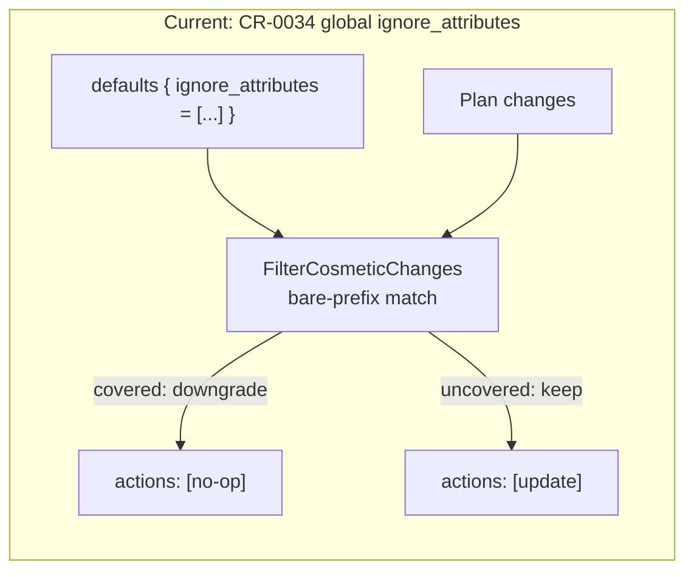
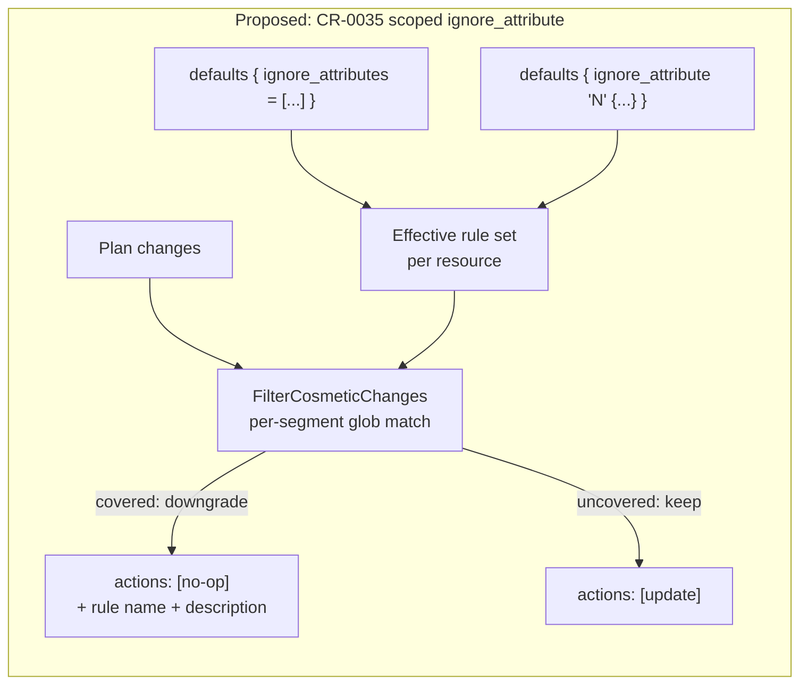
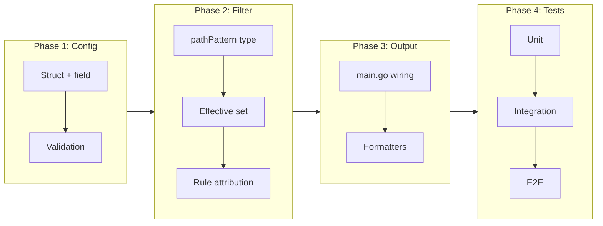

# Scoped Ignore Attributes: Per-Resource-Type Ignore Rules with Attribute-Path Globs

## Change Summary

CR-0034 introduced `ignore_attributes` as a flat global list attached to the `defaults {}` block. Real-world plans show that this scope is too coarse: providers such as `azapi` expose computed attributes (notably `output`) that change from a populated map to `(known after apply)` on every refresh, and the only way to neutralise them today is to add the attribute globally — which silently affects every resource type that happens to use the same name. This CR extends the mechanism with a new repeatable `ignore_attribute "name" { … }` block that scopes an ignore rule to specific `resource` / `module` globs, and upgrades attribute-path matching from bare prefixes to per-segment globs (e.g. `properties.*.createdAt`).

## Motivation and Background

Since CR-0034 shipped, an operational gap has emerged: users cannot express "ignore attribute X **only** on resource type Y." Two concrete cases drive this:

1. **`azapi_resource.output` refresh noise.** The `azapi` provider stores the full API response in the `output` attribute. Every plan shows this attribute diffing from the previously observed map to `(known after apply)`, producing hundreds of lines of `Before`/`After` churn that is not a user-authored change. Adding `output` to the global list solves the noise but silently hides `output` on every other resource type where it may carry real meaning.

2. **Wildcarded attribute paths.** Several providers store lists of objects under a single attribute (e.g. `properties.rules[*].createdAt`, `spec.*.tags`). Today's prefix matcher cannot target these — users would have to enumerate every known key or widen the ignore to the root of the attribute, which sacrifices precision.

The underlying CR-0034 design already records `OriginalActions` and `IgnoredAttributes` on the change, so the aggregation and output machinery does not need to change. What needs to change is (a) how ignore rules are declared, (b) how attribute paths are matched, and (c) how rule attribution (rule name + description) is surfaced when a downgrade happens.

## Change Drivers

* `azapi` (and other dynamic-provider) refresh noise blocks adoption of `ignore_attributes` for teams using provider-agnostic resource definitions
* Per-resource-type precision was explicitly deferred as "out of scope" in CR-0034; usage data now justifies building it
* Attribute-path wildcards are required to express nested/indexed ignores without sprawling enumerations
* Audit consumers need to attribute a downgrade to a *named, described* rule — today they see only the attribute paths

## Current State

`ignore_attributes` is a single flat `[]string` on `DefaultsConfig` (`internal/config/config.go:176`):

```hcl
defaults {
  ignore_attributes = ["tags", "tags_all"]
}
```

The preprocessing pass lives in `internal/classify/attribute_filter.go:17` (`FilterCosmeticChanges`):

* Iterates every `["update"]` resource.
* Diffs `Before` / `After` maps.
* Uses `isPathCovered` (line 123) — a **bare-prefix** matcher that accepts `"tags"` → `tags`, `tags.env`, `tags.env.team`, but cannot express `properties.*.createdAt`.
* Applies the same list to every resource — there is no `resource` / `module` filter.

When every changed attribute is covered, the pass rewrites `Actions` to `["no-op"]` and records `OriginalActions` + `IgnoredAttributes` on the change (`internal/plan/types.go:19-24`). Output formatters already print both.

### Current State Diagram



## Proposed Change

Add a new repeatable `ignore_attribute "name" { … }` block inside `defaults {}`. The block carries its own description, resource/module filter, and attribute list. The existing `ignore_attributes = [...]` list remains supported unchanged and is treated as the always-on "unscoped" rule set. Both forms are additive: the effective ignore set for a given resource is the union of the global list and every scoped rule whose resource/module globs match.

Attribute matching is upgraded from bare prefixes to **per-segment globs**. An entry is split on `.` and each segment is compiled with `github.com/gobwas/glob` (already a dependency via `internal/classify/matchers`). A concrete path matches when its segment count is ≥ the pattern's segment count and every corresponding segment matches the compiled glob. A pattern with fewer segments than the path implicitly covers any deeper path — this preserves CR-0034's prefix semantics: `"tags"` still covers `tags.env.team`.

When a downgrade is driven by a named scoped rule, the rule's `name` and `description` are recorded on the change so explain/SARIF/evidence output can attribute the downgrade without the reader cross-referencing the config.

### Proposed State Diagram



### Target Grammar

```hcl
defaults {
  # Unchanged: global, always-on list (CR-0034)
  ignore_attributes = ["tags", "tags_all"]

  # New: scoped rule with required description and resource filter
  ignore_attribute "azapi_output" {
    description = "azapi_resource.output is a computed read-back of the API response; not a user-authored change."
    resource    = "azapi_resource"
    attributes  = ["output"]
  }

  ignore_attribute "diag_setting_dedicated" {
    description = "Legacy -> Dedicated destination type toggle; treated as cosmetic per platform policy."
    resource    = "azurerm_monitor_diagnostic_setting"
    attributes  = ["log_analytics_destination_type"]
  }

  ignore_attribute "transient_timestamps" {
    description = "API-assigned timestamps nested inside properties on azapi resources."
    resource    = "azapi_*"
    attributes  = ["properties.*.createdAt", "properties.*.updatedAt"]
  }
}
```

## Requirements

### Functional Requirements

1. The system **MUST** accept a repeatable `ignore_attribute "name" { … }` block inside `defaults {}`.
2. The system **MUST** reject configuration where two `ignore_attribute` blocks share the same `name` label.
3. The system **MUST** require a non-empty `description` string on every `ignore_attribute` block.
4. The system **MUST** require a non-empty `attributes` list on every `ignore_attribute` block and reject any empty entry.
5. The system **MUST** accept `resource`, `not_resource`, `module`, and `not_module` lists on an `ignore_attribute` block, each using the same glob semantics as existing `rule {}` blocks (`internal/classify/matchers`).
6. The system **MUST** compile every `attributes` entry into per-segment globs using `github.com/gobwas/glob` and reject entries that fail to compile.
7. The system **MUST** preserve existing bare-prefix semantics: an attribute entry `"tags"` (one segment) **MUST** match `tags`, `tags.env`, and `tags.env.team`.
8. The system **MUST** match a multi-segment attribute pattern against a concrete path if and only if every pattern segment matches the corresponding path segment using the compiled glob, and the pattern does not have more segments than the path.
9. The system **MUST** compute, for each updated resource, the effective ignore set as the union of `defaults.ignore_attributes` and every scoped `ignore_attribute` whose `resource`/`not_resource`/`module`/`not_module` filter matches the resource.
10. The system **MUST** continue to evaluate only `["update"]` actions for cosmetic downgrade; `create`, `delete`, `replace`, and `read` **MUST** be left unmodified.
11. The system **MUST** record the set of matching scoped rule names and descriptions on the downgraded change, in addition to the existing `OriginalActions` and `IgnoredAttributes` fields.
12. The text, JSON, SARIF, GitHub Actions, explain, and evidence output **MUST** include the matched rule names and descriptions when a scoped rule contributed to the downgrade.
13. The system **MUST** keep the existing `defaults.ignore_attributes = [...]` flat list working unchanged when no scoped blocks are present.
14. The system **MUST** allow a resource to be downgraded when its changed attribute paths are collectively covered by the union of global and scoped entries — a scoped rule need not cover every path on its own.

### Non-Functional Requirements

1. The filter **MUST** compile globs once per config load, not per resource, to keep per-plan overhead at O(resources × changed-paths × matchers).
2. The filter **MUST** short-circuit on the first uncovered changed attribute (existing behaviour in `hasOnlyIgnoredChanges`).
3. Configuration parsing **MUST** fail fast with an actionable error message that names the offending block, field, and line number (via HCL diagnostics) when validation fails.

## Affected Components

* `internal/config/config.go` — schema additions (`IgnoreAttributeRule`, field on `DefaultsConfig`).
* `internal/config/validation.go` — extend `validateIgnoreAttributes` to cover the new block.
* `internal/classify/attribute_filter.go` — per-segment glob matcher, scoped-rule evaluation, rule-attribution recording.
* `internal/classify/matchers.go` — reuse the existing glob-compile helpers for `resource` / `module`.
* `internal/plan/types.go` — add a small `IgnoreRuleMatches` field recording matched scoped rules.
* `internal/output/formatter.go`, `explain.go`, `sarif.go`, `github_action.go`, `evidence.go` — render rule name + description next to ignored-attribute paths.
* `cmd/tfclassify/main.go` — pass the full defaults (or a precomputed matcher) into `FilterCosmeticChanges`.
* `docs/examples/full-reference/.tfclassify.hcl` — add a worked example of the new block.
* `internal/scaffold/generate.go` — extend the scaffold template comment.
* `testdata/e2e/` — extend the existing `ignore_attributes` fixture (or add a sibling scenario) covering the scoped + glob paths.

## Scope Boundaries

### In Scope

* Repeatable `ignore_attribute "name" { description, resource, not_resource, module, not_module, attributes }` block under `defaults {}`.
* Per-segment attribute-path globs via `gobwas/glob` (segment-level `*` and `?`).
* Backwards-compatible `ignore_attributes = [...]` (CR-0034) — kept unchanged.
* Attribution of matched scoped rules in all existing output formats.
* Validation errors for empty/duplicate/uncompilable input.

### Out of Scope ("Here, But Not Further")

* **Recursive `**` globs** that match across arbitrary depth. Segment-level wildcards are sufficient for the driving use cases and keep matching predictable and O(n·m).
* **Provider-aware auto-detection** of computed attributes (e.g. autodiscovering that `azapi_resource.output` is computed). Users name the attribute explicitly.
* **Per-classification scoping** (placing `ignore_attribute` inside a `classification {}` block). Keeping the block on `defaults {}` preserves the "preprocessing" semantics — downgrades happen before classification, so scoping by classification would create ordering ambiguity.
* **Regex matching** for attribute paths. Globs are sufficient; regex adds complexity and user error modes.
* **Wildcarding actions** (e.g. ignoring tags on deletions). CR-0034 deliberately limited this to `["update"]` and CR-0035 preserves that boundary.

## Alternative Approaches Considered

* **Widen the global list.** Add `"output"` to `ignore_attributes`. Rejected — silently hides `output` on every provider that uses the name, which violates the precision the CR is trying to deliver.
* **Per-classification `ignore_attribute`.** Move the block into `classification {}`. Rejected — preprocessing runs before classification, so scoping to a classification name requires duplicating the classifier's resource/module matcher at filter time, and creates ordering confusion.
* **Runtime detection of computed attributes.** Inspect provider schema to auto-skip computed fields. Rejected — requires shipping schema data for every provider and introduces provider-version coupling.
* **Full regex.** Use `regexp` for attribute paths. Rejected — globs match the existing resource-matching semantics in the codebase and are easier for users to write correctly.

## Impact Assessment

### User Impact

Users who are happy with today's `ignore_attributes = [...]` need no changes. Users hitting the `azapi.output` problem gain a precise tool: one block per provider quirk, with a description that explains *why* the attribute is being ignored. Audit consumers gain rule-level attribution in all output formats.

### Technical Impact

* No breaking changes. The new block is additive; existing configs keep working.
* Config schema gains one field on `DefaultsConfig` and one struct (`IgnoreAttributeRule`).
* The filter's matcher is rewritten from byte-prefix to segment-glob. Behaviour for single-segment entries is identical — verified by an explicit regression test.
* `plan.ResourceChange` gains one new field (`IgnoreRuleMatches`). Output formatters add one new row of metadata per downgraded resource.
* Config-load time grows by O(number of ignore_attribute blocks × number of attribute patterns × number of segments). Negligible in practice.

### Business Impact

Removes the primary blocker for adopting `ignore_attributes` on plans that include dynamic-provider resources (notably `azapi`). Enables correct `auto`/`standard` routing for module version bumps in environments where every module touches an `azapi_resource`.

## Implementation Approach

Phase 1 — Config & validation:

1. Add `IgnoreAttributeRule` struct with `Name`, `Description`, `Resource`, `NotResource`, `Module`, `NotModule`, `Attributes`.
2. Add `IgnoreAttributeRules []IgnoreAttributeRule` on `DefaultsConfig` with `hcl:"ignore_attribute,block"`.
3. Extend `validateIgnoreAttributes` to enforce non-empty description, non-empty attributes, unique names, and compilable globs.

Phase 2 — Matcher & filter:

4. Introduce a `pathPattern` type holding a compiled `[]glob.Glob` per segment and a `coverage(path string) bool` method.
5. Replace `isPathCovered` with a call that evaluates a slice of `pathPattern`. Keep bare-prefix semantics explicit in the implementation so regressions are obvious.
6. Rework `FilterCosmeticChanges` signature to accept the full defaults (or a precomputed `IgnoreMatcher`). For each update resource, build the effective pattern set.
7. Record `IgnoreRuleMatches` on the change.

Phase 3 — Output & wiring:

8. Update `cmd/tfclassify/main.go:167,329` to pass the new matcher.
9. Update every output formatter to render rule name + description alongside the existing ignored-attribute paths.
10. Update scaffold + full-reference docs.

Phase 4 — Tests:

11. Unit tests for `pathPattern` matcher covering all acceptance criteria.
12. Integration tests exercising `FilterCosmeticChanges` with combined global + scoped rules.
13. E2E fixture extension (or new scenario) covering the real-world plan shape: tag-only resources, azapi with computed output, diagnostic_setting with a genuine attribute add.

### Implementation Flow



## Test Strategy

### Tests to Add

| Test File | Test Name | Description | Inputs | Expected Output |
|-----------|-----------|-------------|--------|-----------------|
| `internal/classify/attribute_filter_test.go` | `TestFilter_ScopedRuleMatches` | Scoped rule on `azapi_resource` downgrades the matching resource only | Two updates: `azapi_resource` (tags + output), `azurerm_storage_account` (tags + output); config: global `ignore_attributes=["tags"]` + scoped `{resource="azapi_resource", attributes=["output"]}` | azapi actions → `["no-op"]`; storage actions unchanged |
| `internal/classify/attribute_filter_test.go` | `TestFilter_PathGlob_TailWildcard` | `tags.temp_*` covers `tags.temp_foo` but not `tags.keep` | Update with `Before.tags.temp_x != After.tags.temp_x` | downgrade; `IgnoredAttributes = ["tags.temp_x"]` |
| `internal/classify/attribute_filter_test.go` | `TestFilter_PathGlob_MidWildcard` | `properties.*.tags` covers `properties.rule1.tags` and `properties.rule2.tags` but not `properties.tags` | Nested changed maps | downgrade only when every change sits under a wildcard slot |
| `internal/classify/attribute_filter_test.go` | `TestFilter_PathGlob_LeadingWildcard` | `*.tags` covers `meta.tags` and `spec.tags` | Two changed leaf paths in separate top-level maps | both covered → downgrade |
| `internal/classify/attribute_filter_test.go` | `TestFilter_BarePrefixBackCompat` | `tags` still covers `tags.env.team` after the globber rewrite | Nested three-level path change | downgrade |
| `internal/classify/attribute_filter_test.go` | `TestFilter_RuleAttribution` | Matched rule name + description recorded on the change | Single scoped rule matches | `IgnoreRuleMatches[0].Name == "azapi_output"`, `.Description == "..."` |
| `internal/classify/attribute_filter_test.go` | `TestFilter_UnionGlobalAndScoped` | A resource whose changes span both global and scoped patterns is downgraded | Changed `tags.env` (global) + `output.x` (scoped) on an `azapi_resource` | downgrade; both paths recorded |
| `internal/config/validation_test.go` | `TestValidate_IgnoreAttributeRule_MissingDescription` | Reject empty description | `ignore_attribute "n" { attributes = ["x"] }` | error mentions `description` |
| `internal/config/validation_test.go` | `TestValidate_IgnoreAttributeRule_EmptyAttributes` | Reject empty attributes list / entry | `attributes = []` and `attributes = [""]` | error mentions `attributes` |
| `internal/config/validation_test.go` | `TestValidate_IgnoreAttributeRule_DuplicateName` | Reject duplicate block names | Two blocks labelled `"x"` | error mentions duplicate |
| `internal/config/validation_test.go` | `TestValidate_IgnoreAttributeRule_InvalidGlob` | Reject uncompilable attribute glob | `attributes = ["["]` | error mentions invalid glob |
| `testdata/e2e/ignore-attributes/` (existing) | fixture update | Extend the fixture with an azapi-like resource + scoped rule | Plan JSON + `.tfclassify.hcl` | `expected.json` shows scoped downgrade |

### Tests to Modify

| Test File | Test Name | Current Behavior | New Behavior | Reason for Change |
|-----------|-----------|------------------|--------------|-------------------|
| `internal/classify/attribute_filter_test.go` | existing `isPathCovered` tests | Prefix-only | Call through the new matcher with the same assertions | Ensure CR-0034 semantics preserved after rewrite |
| `internal/config/validation_test.go` | `TestValidate_IgnoreAttributesValid` | Only checks flat list | Extend fixture to also include one scoped block parsing cleanly | Prove the two forms coexist |

### Tests to Remove

| Test File | Test Name | Reason for Removal |
|-----------|-----------|-------------------|
| _(none)_ | _(none)_ | No functionality is being removed; CR-0034 tests remain valid |

## Acceptance Criteria

### AC-1: Scoped rule downgrades matching resource only

```gherkin
Given a config with global "ignore_attributes = [\"tags\"]"
  And an "ignore_attribute \"azapi_output\"" block with "resource = \"azapi_resource\"" and "attributes = [\"output\"]"
  And a plan containing an "azapi_resource" update that changes tags and output
  And a plan containing an "azurerm_storage_account" update that changes tags and output
When tfclassify preprocesses the plan
Then the azapi_resource actions are rewritten to ["no-op"]
  And the azurerm_storage_account actions remain ["update"]
```

### AC-2: Non-matching resource is unchanged

```gherkin
Given a scoped ignore_attribute block with "resource = \"azapi_resource\""
When a plan contains an azurerm_key_vault update covered only by the scoped rule's attributes
Then the azurerm_key_vault actions remain ["update"]
  And no IgnoredAttributes are recorded on the change
```

### AC-3: Mid-path glob matches nested keys but not the parent

```gherkin
Given an attribute entry "properties.*.createdAt"
When a resource has a changed path "properties.rule1.createdAt"
Then the pattern MUST cover the path
When a resource has a changed path "properties.createdAt"
Then the pattern MUST NOT cover the path
```

### AC-4: Bare prefix preserves CR-0034 semantics

```gherkin
Given an attribute entry "tags"
When a resource has a changed path "tags.env.team"
Then the pattern MUST cover the path
```

### AC-5: Global list continues to work

```gherkin
Given a config with only "ignore_attributes = [\"tags\"]" and no scoped blocks
When a plan contains a resource whose only change is "tags.env"
Then the resource actions are rewritten to ["no-op"]
  And IgnoreRuleMatches is empty
```

### AC-6: Validation rejects malformed blocks

```gherkin
Given an ignore_attribute block missing description
When tfclassify loads the config
Then loading MUST fail with an error naming "description"
Given an ignore_attribute block with an empty attributes list
When tfclassify loads the config
Then loading MUST fail with an error naming "attributes"
Given two ignore_attribute blocks with the same label
When tfclassify loads the config
Then loading MUST fail with an error naming the duplicate label
Given an ignore_attribute entry "["
When tfclassify loads the config
Then loading MUST fail with an error naming the invalid glob
```

### AC-7: Rule attribution surfaces in output

```gherkin
Given a scoped rule "azapi_output" with description "computed read-back"
When the rule contributes to a downgrade
Then the change's IgnoreRuleMatches MUST contain {name: "azapi_output", description: "computed read-back"}
  And the explain, SARIF, JSON, text, and evidence outputs MUST print both fields
```

### AC-8: Union of global and scoped rules covers a resource

```gherkin
Given a global list "ignore_attributes = [\"tags\"]"
  And a scoped rule on "azapi_resource" with "attributes = [\"output\"]"
  And an azapi_resource with changed paths "tags.env" and "output.id"
When tfclassify preprocesses the plan
Then the resource actions are rewritten to ["no-op"]
  And IgnoredAttributes contains both paths
  And IgnoreRuleMatches contains the azapi_output rule
```

## Quality Standards Compliance

### Build & Compilation

- [ ] `make build-all` succeeds
- [ ] No new compiler warnings introduced

### Linting & Code Style

- [ ] `make lint` passes
- [ ] `make vet` passes
- [ ] New code follows existing patterns in `internal/classify/matchers.go`

### Test Execution

- [ ] `make test` passes
- [ ] New unit tests cover every acceptance criterion
- [ ] E2E fixture extension passes under `bash testdata/e2e/run.sh --build --fixtures`

### Documentation

- [ ] `docs/examples/full-reference/.tfclassify.hcl` documents the scoped block
- [ ] `internal/scaffold/generate.go` template mentions the scoped block as an optional extension
- [ ] CR-0034 and README cross-references remain accurate

### Code Review

- [ ] PR title uses Conventional Commits (`feat(config): scope ignore_attributes to resource globs`)
- [ ] Squash merge to preserve linear history

### Verification Commands

```bash
make build-all
make ci
bash testdata/e2e/run.sh --build --fixtures
```

## Risks and Mitigation

### Risk 1: Breaking CR-0034 semantics during the matcher rewrite

**Likelihood:** medium
**Impact:** high
**Mitigation:** Keep single-segment prefix semantics explicit in a named branch of the matcher. Retain every CR-0034 test plus a dedicated `TestFilter_BarePrefixBackCompat` case (AC-4). Run the existing `ignore_attributes` e2e fixture unchanged as a regression guard.

### Risk 2: Glob compile-time errors surfacing at classify-time instead of load-time

**Likelihood:** low
**Impact:** medium
**Mitigation:** Compile every attribute entry during config validation. Any compile failure surfaces with an HCL diagnostic pointing at the file/line, before any plan is parsed.

### Risk 3: User confusion between the flat list and the scoped block

**Likelihood:** medium
**Impact:** low
**Mitigation:** Documentation clearly separates the two in `docs/examples/full-reference/.tfclassify.hcl`. Scaffolded config keeps the flat list as the default and mentions the scoped block as an advanced option.

### Risk 4: Silent "union of ignore rules covers everything" hiding a real change

**Likelihood:** low
**Impact:** medium
**Mitigation:** Downgrade reasons are always visible in output (text/JSON/SARIF/explain/evidence) with the rule name + description that caused the downgrade. Users reviewing a PR can see exactly which rule neutralised which attribute.

## Dependencies

* CR-0034 (`ignore_attributes`) — this CR extends the same mechanism and reuses `FilterCosmeticChanges`, `IgnoredAttributes`, and `OriginalActions`.
* `github.com/gobwas/glob` — already a repo dependency via `internal/classify/matchers`.

## Estimated Effort

* Config + validation: ~3 h
* Matcher + filter rewrite: ~5 h
* Output wiring (6 formatters): ~2 h
* Tests (unit + integration + e2e fixture): ~4 h
* Docs + scaffold: ~1 h

Total ≈ 15 h.

## Decision Outcome

Chosen approach: repeatable `ignore_attribute "name" { … }` blocks on `defaults {}`, per-segment globs via `gobwas/glob`, named-rule attribution surfaced in all output formats — because it extends CR-0034 without breaking it, reuses existing matcher infrastructure, and keeps preprocessing semantics (downgrade happens before classification) intact.

## Implementation Status

* **Started:** 2026-04-21
* **Completed:** 2026-04-21
* **Deployed to Production:** TBD
* **Notes:** Branch `feat/scoped-ignore-attributes` from `main` HEAD. All AC covered by unit + e2e tests. `make ci` green locally (build, test, vet, lint, govulncheck).

## Related Items

* CR-0034 (`ignore_attributes`) — parent feature
* `internal/classify/attribute_filter.go` — code being extended
* `internal/config/config.go` — schema additions

## More Information

The driving real-world plan touches 21 resources under module `module.aiwz`: 19 pure tag additions (`tf-module-l2`), 2 `azurerm_monitor_diagnostic_setting` updates adding `log_analytics_destination_type = "Dedicated"`, 2 `azapi_resource` updates where the provider-computed `output` attribute flips from a populated map to `(known after apply)`, and 1 `data.azapi_resource_action` read-during-apply. With CR-0035 in place the plan becomes: 19 tag-only resources downgraded to `no-op`, 2 azapi resources downgraded to `no-op` via the `azapi_output` scoped rule, and 2 genuine diagnostic_setting updates remaining as `update` — exactly the routing the user intends.
