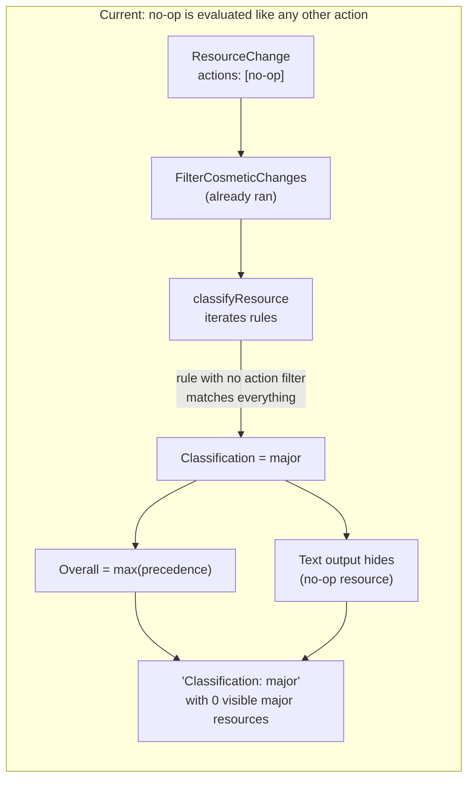
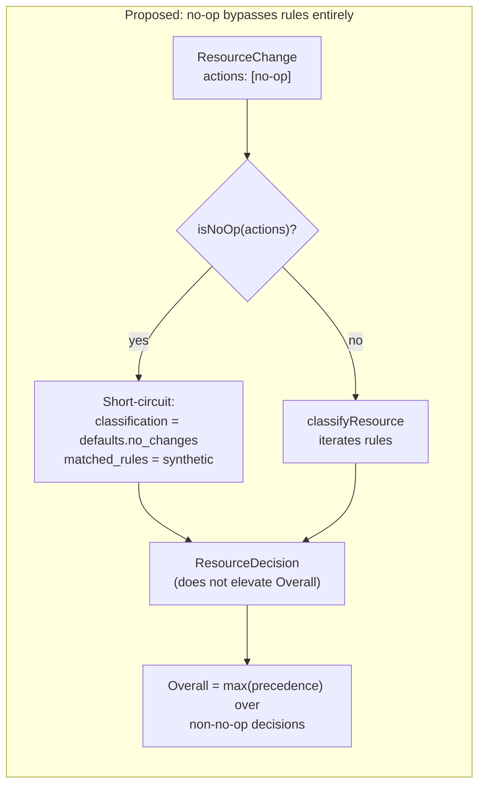
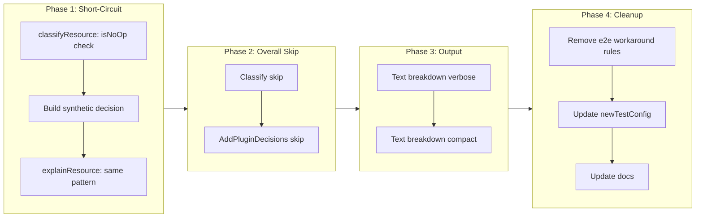

# Skip Classification Rule Evaluation for No-Op Resource Changes

## Change Summary

CR-0034 introduced `ignore_attributes`, which downgrades cosmetic-only updates to `actions = ["no-op"]`. The classifier still evaluates classification rules against those no-op resources, so any rule without an explicit `not_actions = ["no-op"]` guard matches them and elevates `Overall` to a higher classification. This CR removes rule evaluation entirely for resources whose action set is exactly `["no-op"]` — they bypass rule matching and receive the `defaults.no_changes` classification with a synthetic rule description that explains why.

## Motivation and Background

Since CR-0034 made no-op resources common (every tag-only update produces one), every new rule needs boilerplate to avoid matching cosmetic resources. Rule authors typically don't discover this until they see output like `Classification: major, Resources: 1, (95 no-op resources hidden)` and can't explain what drove `major`.

The current workaround has two forms, both present in the codebase:

1. Add `not_actions = ["no-op"]` to every rule that matches all actions. This is boilerplate with no information value — "no-op" means nothing happens; no rule should match it by default.
2. Add a catch-all `rule { resource = ["*"], actions = ["no-op"] }` at the lowest-precedence classification so no-op resources fall into it. **All 16 e2e scenarios in this repository use this exact pattern**, which strongly indicates it is not genuine configuration but a tax the mental model imposes on rule authors.

No-op means "nothing happens to this resource". Running classification rules over something that will not happen is semantically incoherent. The fact that it currently elevates `Overall` despite the resource being invisible in text output is actively misleading, as demonstrated by the original bug report ("the output lied").

## Change Drivers

* Rule authors must learn the `not_actions = ["no-op"]` pattern the hard way — failure mode is misleading output, not a config validation error
* 16 of 16 e2e scenarios carry the same workaround rule, proving it is boilerplate
* CR-0034's interaction with existing rules was incidental, not designed — no-op was rare before CR-0034 and common after
* Output integrity: `Overall` reports a level that the visible resources cannot explain, eroding trust in the tool

## Current State

`internal/classify/classifier.go:classifyResource` iterates precedence-ordered rules and returns the first match:

```go
for _, classificationName := range c.config.Precedence {
    rules := c.matchers[classificationName]
    for _, rule := range rules {
        if rule.matchesResource(change.Type) &&
           rule.matchesActions(change.Actions) &&
           rule.matchesModule(change.ModuleAddress) {
            decision.Classification = classificationName
            ...
            return decision
        }
    }
}
```

`matchesActions` returns `true` for any rule without an explicit `actions` or `not_actions` field:

```go
if len(r.actions) > 0 { ... }
if len(r.notActions) > 0 { ... }
return true  // matches all actions, including "no-op"
```

A tag-only update downgraded by `FilterCosmeticChanges` therefore still matches rules intended for meaningful changes. The resource's classification feeds into `Overall` precedence, while the text formatter hides the resource because `isNoOpDecision` is true — producing an output that names a classification with no visible matched resources.

### Current State Diagram



## Proposed Change

Short-circuit rule evaluation for no-op resources at the top of `classifyResource` and `explainResource`. A resource whose action set is exactly `["no-op"]`:

1. Bypasses all rule iteration
2. Receives `defaults.no_changes` as its classification (the semantic equivalent of "this resource does nothing")
3. Gets a synthetic `MatchedRules` entry describing why — either `"no-op (downgraded by ignore_attributes: <paths>)"` when `OriginalActions` is populated, or `"no-op (no change)"` for Terraform-native no-ops

`Overall` precedence tracking continues to skip no-op decisions (defense in depth; no-op resources never contribute to `Overall` even if a plugin assigns them a user-defined classification).

The universal `rule { resource = ["*"], actions = ["no-op"] }` workaround becomes dead code. It remains valid syntax — this CR does not remove the `actions` or `not_actions` rule fields — but it is redundant, and the e2e configs and test helper should be cleaned up to reflect the new baseline.

### Proposed State Diagram



## Requirements

### Functional Requirements

1. The system **MUST** skip all classification rule evaluation for any resource whose `Actions` field is exactly `["no-op"]`
2. The system **MUST** assign `defaults.no_changes` as the `Classification` for any resource whose `Actions` field is exactly `["no-op"]`
3. The system **MUST** populate `ClassificationDescription` with the description of `defaults.no_changes` for no-op resources
4. The system **MUST** record a synthetic `MatchedRules` entry describing why the resource was not evaluated against rules
5. The synthetic rule description **MUST** reference `ignore_attributes` and list the ignored paths when the resource's `OriginalActions` field is populated
6. The synthetic rule description **MUST** read `"no-op (no change)"` when the resource has no `OriginalActions` (native Terraform no-op)
7. The system **MUST** exclude no-op resources from the `Overall` precedence calculation in `Classify`
8. The system **MUST** exclude no-op resources from the `Overall` precedence recalculation in `AddPluginDecisions`
9. The `tfclassify explain` command **MUST** emit a single synthetic trace entry for no-op resources instead of evaluating each rule against them
10. The verbose text output (`--verbose`) **MUST** render a dedicated "Downgraded to no-op by ignore_attributes" section listing each downgraded resource with its address, original actions, ignored attribute paths, and the synthetic matched rule — users **MUST** be able to diagnose which rule matched and why without invoking `tfclassify explain`
11. The compact text output **MUST** split the hidden no-op count between `ignore_attributes` downgrades and Terraform-native no-ops so CI logs surface the downgrade footprint
12. The compact text output **MUST** include a hint directing users to `--verbose` when downgrades are present

### Non-Functional Requirements

1. The system **MUST NOT** require rule authors to add `not_actions = ["no-op"]` to any rule to prevent no-op matching
2. The system **MUST NOT** require a catch-all `actions = ["no-op"]` rule to classify no-op resources
3. The change **MUST** preserve backward compatibility with existing configs — configs containing the workaround rule continue to parse and validate without errors, but the workaround rule never matches (it is dead, not invalid)
4. The short-circuit **MUST** execute before any rule iteration to avoid wasted work on plans containing many no-op resources

## Affected Components

* `internal/classify/classifier.go` — Short-circuit logic in `classifyResource` and `explainResource`
* `internal/classify/classifier_test.go` — Update `newTestConfig` to remove the workaround `actions = ["no-op"]` rule; add tests for the short-circuit
* `internal/output/formatter.go` — No-op breakdown by classification (applied as interim fix; consolidated here)
* `internal/output/formatter_test.go` — Tests for the breakdown
* `testdata/e2e/*/.tfclassify.hcl` — Remove the universal `rule { resource = ["*"], actions = ["no-op"] }` workaround from all 16 scenarios
* `docs/cr/CR-0034-ignore-attributes.md` — Follow-up note that CR-0036 removes the need for explicit no-op rules
* `docs/examples/full-reference/.tfclassify.hcl` — Remove the workaround if present
* `README.md` — Document that no-op resources bypass rule evaluation

## Scope Boundaries

### In Scope

* Short-circuit of rule evaluation for resources with `actions = ["no-op"]` in both `classifyResource` and `explainResource`
* Synthetic matched-rule descriptions for downgraded and native no-op cases
* Defense-in-depth skip of no-op decisions in `Overall` precedence tracking (`Classify` and `AddPluginDecisions`)
* Text-output breakdown of the hidden no-op count by classification
* Cleanup of the workaround rule from all 16 e2e scenarios and the test-helper config
* Unit tests for the short-circuit behavior, synthetic rule descriptions, and Overall exclusion
* E2E fixture verification that all 16 scenarios still pass after workaround removal
* Reproduction test for the original bug report (`azurerm_key_vault_key` tag-only update + data-source read → `Overall = minor`)

### Out of Scope ("Here, But Not Further")

* Deprecation or removal of the `actions` or `not_actions` rule fields — both remain valid; they simply no longer need `"no-op"` as a value
* Plugin-side short-circuit — plugins continue to receive no-op resources via gRPC and may emit decisions for them; host-side `Overall` skip prevents plugin decisions on no-op resources from elevating `Overall`
* Changes to `FilterCosmeticChanges` or the `ignore_attributes` mechanism itself — orthogonal to this CR
* Blast radius analyzer — already correctly skips no-op resources (pre-existing behavior per CR-0034)
* Topology analyzer — already correctly skips no-op resources (`TestTopologyAnalyzer_SkipsNoOp`)
* Removal of existing workaround rules from user configs outside the repository — documented as optional cleanup, not enforced

## Alternative Approaches Considered

* **Require rule authors to add `not_actions = ["no-op"]` explicitly.** Rejected. Universal boilerplate with no information value. Failure mode is silent misclassification, not a validation error. Violates the principle that the common path should not need ceremony.

* **Emit a hard-coded `no-op` classification that users cannot configure.** Rejected. `defaults.no_changes` already expresses the semantic ("this contributes nothing to the plan") and is under user control. Introducing a parallel reserved classification fragments the model.

* **Add a lint warning when rules don't have `not_actions = ["no-op"]`.** Rejected. Treats the workaround as correct and pushes the burden onto authors. Leaves the misleading-output problem intact for anyone who ignores the warning.

* **Introduce a `pre_classify` hook pipeline that can filter resources before rule matching.** Rejected as over-engineering for a single well-defined case.

* **Move the short-circuit to `FilterCosmeticChanges` and have it omit no-ops from the change slice entirely.** Rejected. Downstream consumers (explain, text output, evidence) need to see the no-op resources for visibility. The short-circuit must happen at classification, not filtering.

## Impact Assessment

### User Impact

Rule authors no longer need to learn or apply the `not_actions = ["no-op"]` pattern. Output honesty improves: `Classification: minor` now means "the highest meaningful real change is minor" with no mental translation required. The breakdown line in text output (`(N no-op resources hidden — major: 3, minor: 92)`) gives rule authors enough information to sanity-check what the filter absorbed without re-running with `--verbose`.

Users with existing configs see zero breaking change. The workaround rule (`rule { resource = ["*"], actions = ["no-op"] }`) continues to parse and validate; it just never matches. Users can delete it at their leisure.

### Technical Impact

* **Classifier core**: Five lines of short-circuit at the top of `classifyResource`. Same in `explainResource`. No new types, no new config fields, no new SDK fields.
* **Plugins**: Plugins continue to receive no-op resources via gRPC `GetResourceChanges` and may call `EmitDecision` for them. Host-side `Overall` skip (interim fix, kept as defense in depth) prevents any such decisions from elevating `Overall`. This is an intentional conservative choice.
* **Output formats**: The text output has a new breakdown line when hidden no-ops span multiple classifications. JSON, GitHub Actions, SARIF, and evidence artifacts are unchanged — they already include the full per-resource decision list so consumers can derive their own breakdowns.
* **Backward compatibility**: No breaking changes. Existing configs parse and run identically. Existing no-op rules become dead code; no error, no warning required.

### Business Impact

Reduces adoption friction for tfclassify in environments where CR-0034 is configured (i.e., most real-world Azure deployments with module tagging). Restores `Overall` to an auditable signal, which is a prerequisite for using tfclassify for approval routing.

## Implementation Approach

### Phase 1: Classifier Short-Circuit

1. Add `isNoOp(change.Actions)` check at the top of `classifyResource`
2. Build the synthetic decision: `Classification = defaults.no_changes`, `MatchedRules = [<synthetic>]`, `ClassificationDescription` looked up from the description map
3. Return the decision without iterating rules
4. Mirror the short-circuit in `explainResource`: emit one `TraceEntry` with `Source = "core-rule"`, `Result = TraceMatch`, `Rule = <synthetic>`, and `Classification = defaults.no_changes`

### Phase 2: Defense-in-Depth Overall Skip

Already applied as interim fix. Consolidate and document:

1. `Classify` skips `isNoOp(change.Actions)` when tracking highest precedence
2. `AddPluginDecisions` skips `isNoOp(decision.Actions)` when recalculating `Overall`

### Phase 3: Output Transparency

Already applied as interim fix. Consolidate and document:

1. Verbose and compact text output produce `(N no-op resources hidden — <classification>: <count>, ...)` when there are no-ops across multiple classifications
2. Fall back to `(N no-op resources hidden)` when all hidden no-ops share a single classification

### Phase 4: Cleanup

1. Remove the `rule { resource = ["*"], actions = ["no-op"] }` block from all 16 e2e configs
2. Remove the corresponding rule from `newTestConfig` in `classifier_test.go`
3. Verify all e2e fixtures and unit tests still pass
4. Append a follow-up note to CR-0034 pointing to CR-0036
5. Update `README.md` section on ignore_attributes to state no-op resources bypass rule evaluation

### Implementation Flow



## Test Strategy

### Tests to Add

| Test File | Test Name | Description | Inputs | Expected Output |
|-----------|-----------|-------------|--------|-----------------|
| `internal/classify/classifier_test.go` | `TestClassifyResource_NoOpShortCircuit` | Tag-downgraded no-op short-circuits to no_changes default | ResourceChange with `Actions=["no-op"]`, `OriginalActions=["update"]`, `IgnoredAttributes=["tags.tf-module-l2"]`; type matches a major rule | `Classification=defaults.no_changes`, `MatchedRules` references `ignore_attributes` and `tags.tf-module-l2` |
| `internal/classify/classifier_test.go` | `TestClassifyResource_NativeNoOp` | Native Terraform no-op short-circuits to no_changes default | ResourceChange with `Actions=["no-op"]`, no `OriginalActions` | `Classification=defaults.no_changes`, `MatchedRules` equals `["no-op (no change)"]` |
| `internal/classify/classifier_test.go` | `TestClassifyResource_NoOpDoesNotMatchMajorRule` | Verify a type that would match a major rule does NOT get classified major when actions=["no-op"] | ResourceChange with type matching major rule, actions=["no-op"] | `Classification != "major"` |
| `internal/classify/classifier_test.go` | `TestClassify_NoOpDoesNotElevateOverall` (already added as interim) | Overall reflects real changes, not no-ops | Tag-only no-op (major by rules) + data read (minor) | `Overall == "minor"` |
| `internal/classify/classifier_test.go` | `TestExplainClassify_NoOpSingleTraceEntry` | Explain trace has one synthetic entry for no-op resources | Same inputs as `TestClassifyResource_NoOpShortCircuit` | `len(Trace) == 1`, `Trace[0].Rule` references `ignore_attributes` |
| `internal/output/formatter_test.go` | `TestFormatText_MixedNoOpBreakdownVerbose` (already added as interim) | Hidden no-op count is broken down by classification | Mixed real + no-op decisions across classifications | Output contains `(N no-op resources hidden — <c>: <n>, ...)` |

### Tests to Modify

| Test File | Test Name | Current Behavior | New Behavior | Reason for Change |
|-----------|-----------|------------------|--------------|-------------------|
| `internal/classify/classifier_test.go` | `newTestConfig` | Includes the `auto { actions=["no-op"] }` workaround rule | Workaround rule removed; auto classification has no rules | The workaround is no longer needed; keeping it would mask the real behavior under test |
| `internal/classify/classifier_test.go` | `TestClassify_AllNoOpReportsNoChanges` | Asserts that no-op resources match via the auto/no-op rule | Asserts they short-circuit to `defaults.no_changes` | Short-circuit replaces rule-based matching for no-op |

### Tests to Remove

Not applicable — no existing tests become obsolete; they either pass unchanged or are updated in the modify table above.

## Acceptance Criteria

### AC-1: No-op resources do not match classification rules

```gherkin
Given a classifier configured with a "major" rule matching resource "azurerm_key_vault_key"
  And a ResourceChange with type "azurerm_key_vault_key" and Actions = ["no-op"]
When the classifier processes the change
Then the resource's Classification equals defaults.no_changes
  And the resource's MatchedRules does not reference the "major" rule
```

### AC-2: Overall excludes no-op resources

```gherkin
Given a plan containing one "azurerm_key_vault_key" resource with Actions = ["no-op"] (cosmetic tag downgrade)
  And one "azapi_resource_action" with Actions = ["read"] classified as "minor"
  And a config where "azurerm_key_vault_key" would match a "major" rule for non-no-op actions
When the classifier processes the plan
Then Overall is "minor"
  And the exit code corresponds to the "minor" classification
```

### AC-3: Synthetic rule reflects ignore_attributes downgrade

```gherkin
Given a ResourceChange with Actions = ["no-op"], OriginalActions = ["update"], and IgnoredAttributes = ["tags.tf-module-l2"]
When the classifier processes the change
Then the resource decision's MatchedRules contains a synthetic string that includes "ignore_attributes"
  And the synthetic string includes "tags.tf-module-l2"
```

### AC-4: Native no-op resources are handled explicitly

```gherkin
Given a ResourceChange with Actions = ["no-op"] and no OriginalActions (Terraform-native no-op)
When the classifier processes the change
Then the resource decision's MatchedRules equals ["no-op (no change)"]
```

### AC-5: Workaround rule is no longer necessary

```gherkin
Given a .tfclassify.hcl config with no rule matching actions = ["no-op"]
  And a plan containing cosmetic no-op resources
When tfclassify runs
Then the no-op resources are classified as defaults.no_changes
  And Overall reflects only the real changes in the plan
```

### AC-6: Existing workaround configs remain valid

```gherkin
Given a .tfclassify.hcl config containing `rule { resource = ["*"], actions = ["no-op"] }`
When tfclassify runs
Then the config loads and validates without error
  And the workaround rule never matches (dead, not broken)
  And no warning is required
```

### AC-7: Explain shows a single trace entry for no-op resources

```gherkin
Given a ResourceChange with Actions = ["no-op"]
When tfclassify explain processes it
Then the resource's Trace contains exactly one entry
  And the entry's Result is "match"
  And the entry's Classification is defaults.no_changes
  And the entry's Rule contains a description of the short-circuit
```

### AC-8: Text output breaks down hidden no-op counts by classification

```gherkin
Given a plan with real changes across multiple classifications
  And hidden no-op resources whose pre-short-circuit classification spans multiple values
When tfclassify runs with default text output
Then the output contains a line of the form "(N no-op resources hidden — <classification>: <count>, ...)"
```

## Quality Standards Compliance

### Build & Compilation

- [ ] `go build ./...` exits 0
- [ ] No new compiler warnings

### Linting & Code Style

- [ ] `golangci-lint run ./...` reports 0 issues
- [ ] Code follows existing conventions in `internal/classify/`

### Test Execution

- [ ] `go test ./...` exits 0
- [ ] New tests pass on first run
- [ ] E2E fixture tests (`bash testdata/e2e/run.sh --build --fixtures`) report 16/16 pass

### Documentation

- [ ] CR-0034 updated with a follow-up note referencing CR-0036
- [ ] README section on `ignore_attributes` updated to mention the short-circuit
- [ ] Synthetic rule strings documented alongside the short-circuit code

### Code Review

- [ ] Changes submitted via pull request
- [ ] PR title follows Conventional Commits format (`feat: ...` or `refactor: ...`)
- [ ] Changes squash-merged to maintain linear history

### Verification Commands

```bash
# Build
make build-all

# Lint + vet
make lint
make vet

# Unit + integration tests
make test

# Full CI suite
make ci

# E2E fixtures
bash testdata/e2e/run.sh --build --fixtures
```

## Risks and Mitigation

### Risk 1: Users with explicit no-op rules see a behavior change

**Likelihood:** low — most such rules follow the universal workaround pattern and their removal does not change outcomes
**Impact:** low — dead rules are ignored silently; worst case is a config containing an unused rule
**Mitigation:** No hard removal of the `actions = ["no-op"]` syntax; existing configs continue to parse. Document the deprecation in the CHANGELOG.

### Risk 2: Plugin decisions on no-op resources become less meaningful

**Likelihood:** low — no known plugins emit decisions for no-op resources today
**Impact:** low — plugin decisions still merge into the per-resource decision list; only `Overall` elevation is blocked
**Mitigation:** Overall-skip is the conservative default; can be revisited in a future CR if a legitimate plugin use case emerges

### Risk 3: External tooling that parses `matched_rules` strings encounters new synthetic formats

**Likelihood:** low — `matched_rules` is intended for human consumption
**Impact:** low — synthetic strings follow a stable pattern and are additive, not replacing existing format
**Mitigation:** Consumers that need structured data should use `OriginalActions` and `IgnoredAttributes` fields, not parse `matched_rules`

### Risk 4: Short-circuit masks a misconfigured `defaults.no_changes` value

**Likelihood:** medium — users who leave `no_changes` unset may see empty classifications
**Impact:** low — resolves to the zero-value string `""` which fails precedence lookup gracefully
**Mitigation:** Config validation already warns when `no_changes` is unset; reuse existing validation

## Dependencies

* Builds directly on CR-0034 (ignore_attributes) — this CR is a refinement of CR-0034's interaction with the rule engine
* No external dependencies

## Estimated Effort

* Phase 1 (classifier short-circuit + explain): ~2 hours
* Phase 2 (Overall skip consolidation): ~0 hours (interim fix already in place)
* Phase 3 (text output breakdown): ~0 hours (interim fix already in place)
* Phase 4 (cleanup + docs): ~2 hours
* Testing + CI + e2e: ~1 hour

Total: ~5 hours.

## Decision Outcome

Chosen approach: **short-circuit rule evaluation for resources with `actions = ["no-op"]` and assign `defaults.no_changes` as their classification**, because no-op already has a clear semantic meaning in the config model ("nothing happens to this resource") that maps directly to the existing `no_changes` default. This removes boilerplate without introducing new concepts.

Alternative approaches either required rule authors to learn the workaround (status quo), introduced parallel reserved classifications (over-complicated), or added lint warnings (doesn't fix the misleading output). Only the short-circuit removes the root cause while preserving backward compatibility.

## Implementation Status

* **Started:** 2026-04-21
* **Completed:** 2026-04-21
* **Deployed to Production:** {to be filled in on release}
* **Notes:** All four implementation phases landed in a single worktree branch. Phase 1 (short-circuit in `classifyResource` and `explainResource`) is the load-bearing change. Phase 2 (Overall skip) was applied first as an interim fix during initial diagnosis; it remains as defense in depth for plugin decisions on no-op resources. Phase 3 (text output breakdown by classification) and Phase 4 (e2e config cleanup, CR-0034 follow-up note, README update, validator exemption for the `defaults.no_changes` classification) completed together. `make ci` passes; all 16 e2e fixture scenarios pass after removing the workaround rule from each.

## Related Items

* **CR-0034** — `ignore_attributes` (introduced `FilterCosmeticChanges`); this CR is its direct follow-up
* **CR-0035** — scoped `ignore_attribute` blocks; adds `plan.ResourceChange.IgnoreRuleMatches` which the Downgraded section surfaces alongside the flat `IgnoredAttributes` list
* **CR-0032** — `not_actions` rule field; the generic mechanism the current workaround relies on; unchanged by this CR
* **CR-0030** — blast radius analyzer; already correctly skips no-op resources and requires no change
* Original bug report: "the output lied" — the motivating scenario is a plan containing `azurerm_key_vault_key` tag-only updates plus a single data-source read, which produced `Classification: major` with one minor resource visible

## More Information

The universal workaround across the project's 16 e2e scenarios is identical boilerplate:

```hcl
classification "auto" {
  rule {
    resource = ["*"]
    actions  = ["no-op"]
  }
}
```

The fact that every e2e config needs it — in a codebase maintained by the tool's author — is strong evidence that this is not configuration but mental-model overhead imposed by an accidental semantics. CR-0036 fixes the semantics so the workaround becomes unnecessary across the codebase and for downstream users.
